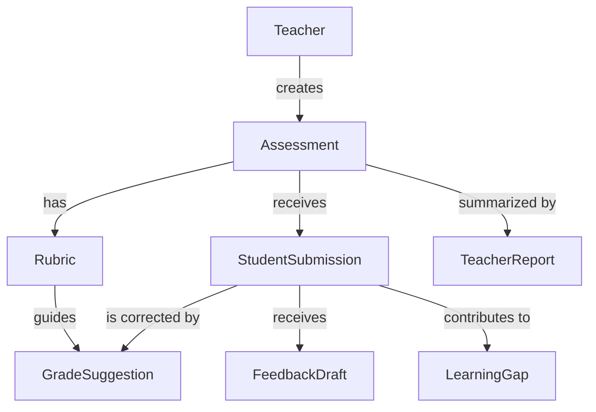

# Raw Conversation Notes Consolidated

> Generated for NotebookLM from `.raw`. This is a full-content consolidation, not a summary.

## Source Files

- `.raw/00-chat.md`
- `.raw/01-chat.md`
- `.raw/02-chat.md`
- `.raw/03-chat.md`
- `.raw/04-chat.md`
- `.raw/05-chat.md`
- `.raw/06-chat.md`
- `.raw/07-chat.md`
- `.raw/08-chat.md`
- `.raw/09-chat.md`
- `.raw/10-chat.md`
- `.raw/11-chat.md`
- `.raw/12-chat.md`
- `.raw/13-chat.md`
- `.raw/14-chat.md`
- `.raw/15-chat.md`
- `.raw/16-chat.md`
- `.raw/README.md`

## Consolidated Content


---

## Source: `.raw/00-chat.md`

# Lectura Estratégica De La Hackathon

> Nota raw formateada desde la primera conversación estratégica.

> Decisión posterior: este archivo conserva la exploración original. El nombre final de trabajo para el proyecto es **GradeOps AI**; **ClassOps AI** queda como alternativa histórica de naming, no como marca principal.

## Contexto Inicial

Voy a revisar las bases públicas de la hackathon, extraer criterios, restricciones, entregables y señales de evaluación. Con eso te propongo una idea vendible, no solo "interesante técnicamente", y la bajo a pitch, MVP y estrategia de demo.

Ya hay una señal crítica: no es una hackathon clásica de "demo bonita". La evaluación está diseñada como una mini startup: negocio real, usuarios reales, ingresos reales, operación con agentes y evidencia verificable.

## Tesis Principal

Esta hackathon no premia "la mejor app con IA". Premia el negocio real más convincente operado por IA.

La página lo deja bastante claro: el reto pide construir un negocio en 90 días, con clientes reales, ingresos reales, operación con IA y uso de al menos un producto de Google Cloud. Además, si el proyecto usa LLM, debe usar Gemini API en al menos una llamada del producto desplegado.

La fecha límite es **17 de agosto de 2026 a las 13:00 PDT**, y hoy, **8 de junio de 2026**, quedan aproximadamente **70 días**. La competencia ya muestra alrededor de **11.6k participantes**, por lo que no conviene competir con una idea genérica tipo "chatbot educativo", "copilot de finanzas" o "asistente para pymes".

Los criterios pesan igual, pero el desempate favorece primero **Business Viability**, luego **AI-Native Operations** y luego **Category Impact**. Eso significa que vender puede pesar más que tener la arquitectura más elegante.

## Recomendación Estratégica

Mi recomendación: no compitamos con una app. Compitamos con una operación.

La idea ganadora debería ser:

> Un negocio educativo operado por agentes de IA que ayuda a docentes, bootcamps, tutores e instituciones pequeñas a crear, vender, ejecutar y corregir evaluaciones prácticas con feedback automático.

### Nombre Tentativo

**ClassOps AI**

**Subtítulo en inglés:**

> AI agents that run assessment operations for real educators. From lesson goals to graded evidence, feedback, reports, and student recovery plans.

**Subtítulo en español:**

> Agentes de IA que operan el ciclo completo de evaluación para docentes reales: creación, publicación, corrección, feedback, reportes y reforzamiento.

## Por Qué Esta Idea Tiene Más Opciones

Tienes una ventaja injusta: eres docente, desarrollador senior, conoces Spring Boot, APIs, evaluación, PSeInt, programación inicial, testing, rúbricas, feedback académico y el dolor real del profesor.

Además, el problema es medible. En Chile, TALIS 2024 reporta que docentes de jornada completa dedican **4,9 horas semanales** a marcar/corregir trabajos y **4,9 horas semanales** a trabajo administrativo, este último por sobre el promedio OCDE de **3 horas**.

Ese dato es oro para el pitch:

> ClassOps AI devuelve horas docentes cada semana, sin reemplazar al profesor: automatiza la operación repetitiva de evaluación y deja al humano tomando decisiones pedagógicas.

## Producto

ClassOps AI es una plataforma SaaS para docentes y pequeños equipos educativos que permite:

- Cargar un objetivo de clase, temario o guía.
- Generar una evaluación práctica.
- Generar rúbrica y criterios.
- Publicar la actividad a estudiantes.
- Recibir respuestas o evidencias.
- Corregir automáticamente cuando sea posible.
- Sugerir feedback individual.
- Detectar errores comunes.
- Crear actividades de recuperación.
- Preparar reportes para el docente.
- Automatizar comunicación con estudiantes.
- Registrar logs de cada decisión de IA.

No es solo "crear pruebas con IA". Eso está saturado.

La diferencia es que el negocio opera con agentes.

## Categoría Principal

**Education & Human Potential**

También tiene borde con **Small Business Services**, porque ayuda a docentes independientes, tutores y academias pequeñas a operar como una microinstitución educativa. Pero yo entraría por **Education & Human Potential**, porque tu historia, el impacto y el acceso a usuarios reales calzan mejor.

## Narrativa Para Jueces

Los jueces no van a comprar "una app para hacer evaluaciones".

Van a comprar esta narrativa:

> Millones de docentes y tutores no necesitan otro LMS complejo. Necesitan una operación educativa automatizada que les permita enseñar, evaluar y acompañar sin ahogarse en corrección y administración. ClassOps AI convierte a un docente en una microacademia operada por agentes.

Ese ángulo vende mejor porque toca tres puntos de la hackathon:

- **Business Viability:** docentes, tutores y bootcamps pueden pagar rápido por ahorrar tiempo.
- **AI-Native Operations:** los agentes toman decisiones operativas reales: generar evaluación, clasificar evidencias, corregir, priorizar alumnos, enviar feedback, crear reportes.
- **Category Impact:** mejora acceso a feedback personalizado y reduce carga docente.

Los criterios oficiales piden negocio real, usuarios reales, revenue, agentes en producción y evidencia de logs, uso de API, dashboards y clientes.

## MVP Ganador

No hagamos un monstruo. El MVP debe ser vendible, demostrable y cobrable en menos de 70 días.

### MVP v1

**AI Assessment Ops for Programming Teachers**

### Nicho Inicial

Docentes de programación inicial, bootcamps, tutores de informática y profesores que trabajan con pseudocódigo, Python, JavaScript, Java o fundamentos de algoritmos.

### Por Qué Este Nicho

- Lo conoces.
- Puedes conseguir usuarios rápido.
- El dolor es real.
- Las evidencias son fáciles de evaluar.
- Permite demos visuales potentes.
- Tiene impacto claro en educación y empleabilidad.

## Flujo MVP

### 1. Docente Crea Una Actividad

El docente escribe:

> Quiero evaluar condicionales, ciclos y funciones en estudiantes de primer semestre. Duración 90 minutos. Nivel básico.

El agente genera:

- Enunciado.
- Objetivos de aprendizaje.
- Rúbrica.
- Criterios de evaluación.
- Casos de prueba.
- Pauta de corrección.
- Feedback esperado por tipo de error.

### 2. Estudiante Responde

Puede responder de tres formas en MVP:

- Texto/código pegado en plataforma.
- Archivo `.txt`, `.java`, `.py`, `.js`.
- Respuesta manual simple.

Evitaría OCR en la primera fase, salvo que sea muy necesario. OCR suma complejidad y riesgo.

### 3. Agentes Corrigen

| Agente | Responsabilidad |
| --- | --- |
| Assessment Designer Agent | Genera actividad y rúbrica. |
| Rubric Validator Agent | Revisa coherencia, dificultad y criterios. |
| Submission Analyzer Agent | Analiza respuesta/código del estudiante. |
| Feedback Agent | Genera feedback pedagógico accionable. |
| Risk Detector Agent | Detecta alumnos con bajo desempeño o patrones de error. |
| Teacher Copilot Agent | Resume resultados y recomienda siguiente clase. |
| Business Ops Agent | Registra uso, prepara reportes, genera evidencia para clientes y hackathon. |

Esto es clave: la hackathon quiere ver negocio operado por IA, no solo IA dentro de una funcionalidad.

### 4. Docente Revisa Y Aprueba

Para evitar problemas de confianza:

- La IA sugiere.
- El docente aprueba.
- Se registra que hizo la IA y que corrigió el humano.

Esto te permite decir:

> AI operates the assessment workflow, while teachers retain pedagogical authority.

### 5. Plataforma Genera Reporte

Reporte por actividad:

- Promedio.
- Distribución.
- Errores frecuentes.
- Objetivos menos logrados.
- Estudiantes en riesgo.
- Actividad de reforzamiento sugerida.
- Mensaje personalizado para cada estudiante.

## Arquitectura Recomendada Para Competir

Como la hackathon exige Google Cloud, no basta con "uso Gemini API desde cualquier hosting". Las reglas dicen que el proyecto debe usar al menos un producto de Google Cloud y que los proyectos con LLM deben usar Gemini API para al menos una llamada en la app desplegada.

Arquitectura simple y defendible:

| Capa | Tecnología |
| --- | --- |
| Frontend | Next.js o Angular |
| Backend | Spring Boot o Node/NestJS |
| Hosting backend | Google Cloud Run |
| IA | Gemini API / Vertex AI Gemini |
| Logs | Cloud Logging |
| Base de datos | Firestore, Cloud SQL PostgreSQL o Supabase si se justifica |
| Storage | Cloud Storage para archivos |
| Pagos | Stripe |
| Auth | Firebase Auth o KeyGo si quieres usar algo propio, pero con cuidado |
| Observabilidad | Cloud Logging + dashboard interno |
| Video demo | Mostrar agentes ejecutando decisiones reales |

Cloud Run calza bien porque Google lo define como una plataforma completamente administrada para ejecutar contenedores invocables por requests o eventos, sin gestionar infraestructura.

Para los agentes, Gemini permite function calling y salidas estructuradas, útil para que la IA no devuelva solo texto libre, sino JSON validable para rúbricas, feedback, notas, riesgos y acciones.

## Evidencia Necesaria Para Vender

La entrega pide varias evidencias:

- Repo.
- Video de menos de 3 minutos.
- Narrativa de 500 a 1000 palabras.
- Evidencia de ingresos.
- Gastos.
- Logs de ejecución de agentes.
- Uso de API.
- Dashboards.
- Evidencia de clientes reales.

Por eso el producto debe tener desde el día 1 evidencia interna obligatoria.

### Logs Por Ejecución De Agente

Cada ejecución de agente debe guardar:

- Fecha/hora.
- Usuario/docente.
- Actividad.
- Agente ejecutado.
- Input recibido.
- Decisión tomada.
- Output estructurado.
- Modelo usado.
- Tokens/costo aproximado.
- Estado: sugerido, aprobado, corregido, rechazado.
- Impacto: minutos estimados ahorrados.

Esto sirve para la app, pero también para ganar.

## Modelo De Negocio

Necesitamos revenue rápido, no una proyección bonita.

### Pricing Recomendado

| Plan | Precio | Incluye |
| --- | ---: | --- |
| Free | US$0 | 3 evaluaciones, 20 estudiantes, marca de agua, sin reportes avanzados. |
| Teacher Pro | US$9/mes | 20 evaluaciones, 150 estudiantes/mes, feedback automático, reportes básicos. |
| Cohort Pro | US$29/mes | 100 evaluaciones, 500 estudiantes/mes, reportes por curso, exportación PDF/CSV, soporte prioritario. |
| Pilot Pack | US$99 pago único | Setup, 3 evaluaciones reales y reporte ejecutivo para bootcamp, docente independiente o pequeña academia. |

Para la hackathon, el mejor producto no es necesariamente el más escalable todavía. Es el que puede generar evidencia de pago en 70 días.

Yo apuntaría a vender **10 a 20 Pilot Packs** o **30 suscripciones Teacher Pro**.

Con eso ya puedes mostrar:

- Ingresos reales.
- Clientes reales.
- Uso real.
- Testimonios.
- Costos controlados.
- CAC bajo o cero.
- Validación clara.

## Go-To-Market En 70 Dias

### Mercado Inicial

No iría primero por colegios grandes ni universidades completas. Ciclos de venta lentos.

Iría por:

- Docentes independientes.
- Profesores de programación.
- Tutores.
- Bootcamps pequeños.
- Academias online.
- Coordinadores académicos con poder de piloto pequeño.
- Comunidades de profesores de informática.

Tu ventaja está en la red docente y técnica. El pitch debe ser directo:

> Te ahorro horas corrigiendo y te entrego feedback personalizado para tus estudiantes sin cambiar tu forma de enseñar.

### Oferta Comercial Inicial

No vender "software".

Vender:

> Piloto de corrección y feedback automático para tu próxima evaluación.

Landing:

- Sube tu pauta.
- Creamos actividad + rúbrica.
- Tus estudiantes responden.
- Recibes corrección, feedback y reporte.
- Tú apruebas antes de entregar.

Call to action:

> Run my next assessment with AI

## Demo De 3 Minutos

La demo debe vender como startup, no como tutorial técnico.

### Guion

| Tiempo | Bloque | Mensaje / Acción |
| --- | --- | --- |
| 0:00-0:20 | Dolor | "Teachers spend hours every week grading, correcting and preparing feedback. In Chile, full-time teachers report 4.9 hours per week marking student work and 4.9 hours on administrative work." |
| 0:20-0:40 | Solución | "ClassOps AI is an AI-native assessment operations platform. It helps educators create, run, grade and improve learning activities with AI agents." |
| 0:40-1:30 | Demo producto | Mostrar: docente crea actividad, agente genera evaluación, agente genera rúbrica, estudiante entrega respuesta, agente corrige, docente aprueba, se genera feedback y dashboard muestra resultados. |
| 1:30-2:10 | AI-native operations | Mostrar pantalla de logs: Assessment Designer Agent, Rubric Validator Agent, Feedback Agent, Risk Detector Agent, Teacher Copilot Agent, cada uno con estado y decisión. |
| 2:10-2:40 | Business traction | Mostrar usuarios reales, pagos Stripe, testimonios, revenue, costos y uso de Gemini/Google Cloud. |
| 2:40-3:00 | Cierre | "ClassOps AI turns every educator into an AI-operated learning business. Teachers stay in control. Students get better feedback. Small education providers can scale." |

## Lo Que No Debemos Hacer

No hagamos esto:

- Un chatbot para estudiantes.
- Un generador genérico de quizzes.
- Un LMS completo.
- Una plataforma enorme tipo Moodle con IA.
- Una app que solo "usa Gemini".
- Un proyecto sin pagos.
- Un proyecto sin logs.
- Un proyecto donde el humano hace todo y la IA solo redacta texto.
- Un proyecto viejo reciclado sin aclarar.

Ojo con esto último: las reglas dicen que los proyectos deben ser creados después del inicio de la hackathon, el **19 de mayo de 2026**. Se pueden usar templates, frameworks o boilerplates preexistentes, pero se debe explicar cómo se usaron.

Por tanto, no conviene presentar un proyecto anterior como si fuera nuevo. Conviene construir ClassOps AI desde cero, aunque esté inspirado en tu experiencia docente y en dolores que ya conoces.

## Diferenciador Fuerte

La mayoría va a presentar:

> AI tutor for students.

Nosotros deberíamos presentar:

> AI operations layer for educators.

Eso es más fuerte porque:

- Tiene comprador claro.
- Tiene dolor económico.
- Tiene uso recurrente.
- Tiene evidencia de ahorro de tiempo.
- Puede generar revenue rápido.
- Puede expandirse a instituciones.
- Encaja con "AI agents operating a business".

## Roadmap De Ejecución

### Semana 1: Validación Y Preventa

**Objetivo:** conseguir 5-10 docentes interesados antes de construir demasiado.

**Entregables:**

- Landing simple.
- Formulario de waitlist.
- Oferta de piloto pagado.
- 10 entrevistas.
- 3 pagos o compromisos.
- Definición del nicho exacto.

### Semana 2-3: MVP Funcional

**Entregables:**

- Login docente.
- Crear actividad.
- Generar rúbrica con Gemini.
- Cargar respuestas.
- Corrección asistida.
- Feedback individual.
- Logs de agentes.
- Dashboard básico.

### Semana 4-5: Pilotos Reales

**Entregables:**

- 5 actividades reales.
- 100+ respuestas procesadas.
- Testimonios.
- Métrica de tiempo ahorrado.
- Ajuste de pricing.
- Export PDF/CSV.

### Semana 6-7: Producto Vendible

**Entregables:**

- Stripe.
- Planes.
- Onboarding automático.
- Mejor dashboard.
- Reportes por curso.
- Emails automáticos.
- Página pública con casos reales.

### Semana 8-10: Hackathon Packaging

**Entregables:**

- Video de 3 minutos.
- Narrativa 500-1000 palabras.
- Repo limpio.
- Testing instructions.
- Revenue evidence.
- Expense report.
- Agent logs.
- Customer evidence.

## Métricas Que Debemos Perseguir

Para vender la historia:

| Métrica | Meta razonable |
| --- | ---: |
| Docentes registrados | 30-50 |
| Clientes pagados | 10-20 |
| Estudiantes evaluados | 200-500 |
| Evaluaciones creadas | 30-80 |
| Feedbacks generados | 300-1000 |
| Revenue | US$300-US$2000 |
| Tiempo docente ahorrado | 100+ horas estimadas |
| Agentes ejecutados | 1000+ eventos logueados |

No necesitas millones de usuarios. Necesitas una señal real, verificable y creíble.

## Pitch Final

> ClassOps AI helps educators run assessment workflows with AI agents. Teachers describe what they want to evaluate, and our agents generate the activity, rubric, correction criteria, feedback, recovery plan and performance report. Students get faster, more personalized feedback. Teachers stay in control. Small education providers can operate like full academic teams. In 90 days, we are proving this with real teachers, real students, real usage and real revenue.

## Veredicto

La mejor apuesta para ti es **ClassOps AI**, no porque sea la idea "más grande", sino porque es la más ganable para tu perfil.

Tienes dominio del problema, acceso natural a usuarios, capacidad técnica para construirlo, historia personal creíble, categoría clara, impacto real y posibilidad de vender rápido.

La hackathon no se gana diciendo:

> Mira lo que construí.

Se gana diciendo:

> Mira el negocio que ya está operando con IA, mira quién pagó, mira los logs, mira el impacto y mira por qué esto puede crecer.


---

## Source: `.raw/01-chat.md`

# GradeOps AI: Posicionamiento Para Hackathon

> Nota raw formateada desde la segunda conversación estratégica.

> Decisión posterior: este archivo consolida el giro desde GRADE/ClassOps hacia **GradeOps AI** como marca principal para la hackathon.

## Tesis

Sí. Tu cabeza hizo la conexión correcta: esto es **GRADE**.

Pero para la hackathon no lo presentaría como "GRADE" en su versión académica amplia. Lo presentaría como una versión más filosa, vendible y operada por IA:

**GRADE Ops AI**

> AI-native assessment operations for educators, tutors and small academies.

O en español:

> Operación inteligente de evaluaciones para docentes, tutores y academias pequeñas.

La idea no cambia de fondo. Lo que cambia es el empaquetado comercial.

## Diferencia Estratégica

| GRADE original | Versión hackathon |
| --- | --- |
| Plataforma para generar, registrar y calificar evaluaciones. | Negocio operativo de evaluación asistido por agentes IA. |
| Foco en sistema académico. | Foco en clientes reales y revenue. |
| Puede sonar institucional/complejo. | SaaS liviano, vendible y demostrable. |
| Banco de preguntas, OCR, reportes, calificación. | "Te opero tu próxima evaluación completa con IA". |
| Producto educativo. | Microempresa AI-native para docentes. |

## La Frase Clave

No deberíamos decir:

> Creamos una plataforma para docentes.

Deberíamos decir:

> GRADE Ops AI permite que un docente opere como un equipo académico completo: diseña evaluaciones, corrige, entrega feedback, detecta brechas y genera acciones de reforzamiento usando agentes IA.

Eso vende mucho más.

## Cómo Encaja GRADE Con La Hackathon

GRADE ya tiene los componentes naturales:

- Generación de evaluaciones.
- Banco de preguntas.
- Rúbricas.
- Calificación automática.
- Feedback.
- Reportes.
- Trazabilidad.
- Mejora pedagógica.

Pero para ganar, necesitamos elevarlo a:

- Agentes IA ejecutando operaciones.
- Clientes reales.
- Pagos reales.
- Evidencia de uso.
- Impacto medible.
- Demo simple y poderosa.
- Narrativa de negocio.

## Decisión Estratégica

Yo no iría por todo GRADE.

Iría por este wedge:

> GRADE Ops AI para docentes de programación inicial.

Porque ahí tienes ventaja brutal.

Puedes decir:

> We started with programming educators because code-based assessments are frequent, time-consuming to grade, and require personalized feedback. Our agents help teachers generate, grade and improve practical programming assessments.

En español:

> Partimos con docentes de programación porque las evaluaciones prácticas consumen mucho tiempo, requieren revisión caso a caso y necesitan feedback personalizado.

Esto calza perfecto contigo.

## MVP Específico

### Nombre Interno

**GRADE Ops AI**

### Nombres Comerciales Posibles

- GradeOps AI.
- GRADE AI.
- ClassOps AI.
- EvalOps AI.
- AssessOps AI.

Mi favorito para la hackathon: **GradeOps AI**.

Suena startup, suena operación, suena vendible.

### Promesa Comercial

> Run your next assessment with AI agents.

O:

> From learning goal to graded feedback in minutes.

En español:

> De objetivo de aprendizaje a feedback corregido en minutos.

## Flujo MVP Ganador

### 1. El Docente Crea Una Evaluación

**Input:**

> Quiero evaluar condicionales, ciclos y funciones en Java para estudiantes de primer semestre.

**GRADE Ops genera:**

- Enunciado.
- Objetivos.
- Criterios.
- Rúbrica.
- Casos de prueba.
- Pauta.
- Nivel de dificultad.
- Tiempo estimado.

### 2. El Estudiante Responde

MVP simple:

- Pega código.
- Sube archivo.
- Responde formulario.
- Adjunta evidencia.

Nada de OCR al inicio, salvo que lo dejemos como "futuro inmediato".

### 3. Agentes IA Procesan

| Agente | Función |
| --- | --- |
| Assessment Agent | Diseña evaluación y rúbrica. |
| Rubric Agent | Valida criterios y consistencia. |
| Grading Agent | Evalúa respuesta contra rúbrica. |
| Feedback Agent | Genera feedback individual. |
| Learning Gap Agent | Detecta brechas comunes. |
| Recovery Agent | Propone actividades de reforzamiento. |
| Teacher Report Agent | Genera resumen ejecutivo para el docente. |
| Ops Agent | Registra logs, costos, métricas y evidencia de operación. |

### 4. El Docente Aprueba

Esto es importante:

- La IA no reemplaza al docente.
- La IA opera el flujo.
- El docente conserva autoridad pedagógica.

Eso reduce fricción comercial.

### 5. Dashboard Final

Mostrar:

- Promedio.
- Distribución.
- Estudiantes en riesgo.
- Errores frecuentes.
- Objetivos menos logrados.
- Tiempo estimado ahorrado.
- Feedback enviado.
- Actividad remedial sugerida.

## La Trampa Que Debemos Evitar

No presentar GRADE como:

> Sistema de gestión de evaluaciones académicas.

Eso suena grande, pesado, institucional y lento de vender.

Presentarlo como:

> AI agents that run assessment operations for real educators.

Eso suena directo, moderno, vendible y alineado con la hackathon.

## Pitch Refinado

**Versión en inglés:**

> GradeOps AI helps educators run practical assessments with AI agents. A teacher enters a learning goal, and our agents generate the assessment, rubric, grading criteria, personalized feedback, learning gap analysis and recovery activities. Teachers stay in control, students receive faster feedback, and small education providers can operate like full academic teams without hiring more staff.

**Versión en español:**

> GRADE Ops AI ayuda a docentes a operar evaluaciones prácticas con agentes de IA. El docente ingresa un objetivo de aprendizaje y los agentes generan la evaluación, rúbrica, criterios de corrección, feedback personalizado, análisis de brechas y actividades de reforzamiento. El docente mantiene el control, los estudiantes reciben mejor retroalimentación y pequeños equipos educativos pueden operar como una institución completa sin aumentar carga administrativa.

## Qué Parte De GRADE Usaría Para Competir

### Núcleo Ganador

- Crear evaluación.
- Crear rúbrica.
- Recibir respuestas.
- Corregir.
- Generar feedback.
- Generar reporte.
- Registrar trazabilidad de agentes.
- Cobrar por piloto.

### Fuera Del MVP

- OCR complejo.
- Banco de preguntas gigante.
- Integración institucional.
- LMS completo.
- Múltiples roles avanzados.
- Mobile app.
- Analítica excesiva.
- Administración curricular completa.

Eso puede ir en roadmap, pero no en el producto inicial.

## Conclusión Directa

Sí: esto es **GRADE**.

Pero para ganar, GRADE debe vestirse así:

> GRADE no es una plataforma de evaluación. Es una operación académica automatizada por agentes IA.

Ese giro es el que puede vender.

Mi recomendación: trabajemos desde ahora con este posicionamiento:

**GradeOps AI**

> AI-native assessment operations for programming educators.

Ese es el wedge más defendible, más rápido de construir, más fácil de vender y más coherente con tu experiencia.


---

## Source: `.raw/02-chat.md`

# Lectura Estratégica Del Artículo TodoDeIA

> Nota raw formateada desde la conversación sobre el artículo: <https://www.tododeia.com/community/gemini-xprize>

## Prompt Original

> Lee en profundidad este artículo: <https://www.tododeia.com/community/gemini-xprize>

## Enfoque De Lectura

Voy a leer el artículo como insumo estratégico para **GradeOps AI**:

- reglas y criterios;
- señales de oportunidad;
- riesgos;
- cambios respecto a lo que ya definimos.

Primer hallazgo fuerte: el artículo está bien orientado comercialmente, pero hay que leerlo junto a las reglas oficiales. La palabra clave no es "app"; es **negocio verificable operado por IA**.

## Lectura Estratégica

Ya lo leí en profundidad. Mi lectura estratégica: el artículo confirma exactamente el giro que necesitamos para **GradeOps AI**:

> No competir como "plataforma educativa", sino como negocio real de operación académica automatizada por agentes IA.

## Tesis Central Del Artículo

El artículo no está vendiendo una hackathon técnica. Está diciendo:

> Gana quien monte un negocio real, con clientes reales, ingresos reales y operación ejecutada por IA.

Esa lectura coincide con las reglas oficiales:

- el proyecto debe operar con IA;
- debe usar al menos un producto de Google Cloud;
- si usa LLM, debe hacer al menos una llamada a Gemini API en la aplicación desplegada.

La idea más importante del artículo es:

> No gana la idea más bonita; gana el que vende de verdad.

Devpost lo confirma con el enfoque:

> Real product. Real revenue. A real business.

Los criterios oficiales ponderan:

- **Business Viability**;
- **AI-Native Operations**;
- **Category Impact**.

## Lo Más Importante Para GradeOps AI

Para **GradeOps AI**, el artículo refuerza que no debemos partir vendiendo:

> Sistema de generación y corrección de evaluaciones.

Eso suena a software académico tradicional.

Debemos vender:

> AI-native assessment operations for programming educators.

O en español:

> Operación de evaluaciones prácticas con agentes IA para docentes de programación.

Esto calza con lo que ya habíamos detectado en la lectura previa:

- la competencia premia una mini startup operando;
- no premia solo una demo con IA;
- la versión hackathon debe ser enfocada, vendible y con revenue verificable.

## Reglas Críticas Que No Podemos Fallar

Estos puntos deben pasar a checklist obligatorio del repo de documentación:

| Regla | Implicancia Para GradeOps AI |
| --- | --- |
| Proyecto nuevo | Debe haber sido creado después del inicio del concurso: **19 de mayo de 2026**. Se pueden usar frameworks, templates o boilerplates, pero hay que explicar cómo se usaron. |
| Google Cloud obligatorio | No basta con usar Gemini desde cualquier hosting. Debe usarse al menos un producto de Google Cloud. Cloud Run, Firebase, Firestore, BigQuery o Vertex AI cuentan. |
| Gemini API obligatorio si usamos LLM | Podemos usar otros modelos además, pero al menos una llamada LLM en la app desplegada debe usar Gemini API. |
| Revenue real y desglosado | Piden revenue total en USD, revenue por mes —mayo, junio, julio y agosto 2026—, costos, gasto de marketing/adquisición y evidencia financiera. |
| Cuidado con ingresos de conocidos | El revenue de familiares, miembros del equipo, entidades relacionadas o relaciones comerciales preexistentes debe reportarse separado. Para vender fuerte necesitamos clientes *arms-length*: terceros reales sin relación directa. |
| Evidencia de producto operando | Logs de agentes, registros de uso de API, dashboards y capturas. Esto no es accesorio; es parte del caso de negocio. |
| Video menor a 3 minutos | Los jueces no están obligados a mirar más allá de tres minutos. Debe mostrar el producto funcionando en el dispositivo/plataforma real. |
| Material en inglés o traducido | Si enviamos material en español, hay que proveer traducción al inglés del video, descripción, testing instructions y demás materiales. |

## Lectura Crítica Del Artículo

El artículo está bien como playbook, pero tiene un sesgo sano:

> Empuja a vender antes de construir demasiado.

Para nosotros eso significa que el primer entregable no debe ser una arquitectura perfecta, sino una máquina de evidencia:

- landing;
- propuesta de piloto pagado;
- formulario de clientes;
- flujo mínimo de evaluación;
- Stripe o mecanismo equivalente de pago;
- logs de agentes desde el día 1;
- dashboard interno de uso, costos y tiempo ahorrado.

El artículo también insiste en que la IA debe operar el negocio, no solo asistir. Esto es consistente con el criterio oficial **AI-Native Operations**:

- IA en producción;
- decisiones clave ejecutadas por agentes;
- operación ampliamente gobernada por IA;
- evidencia observable de esa operación.

## Qué Cambia Para GradeOps AI

No cambia la idea. Cambia la prioridad.

### Antes Podíamos Pensar En

- banco de preguntas;
- OCR;
- mobile app;
- reportes avanzados;
- integración institucional;
- administración académica completa.

### Ahora La Prioridad Debe Ser

1. Crear evaluación desde objetivo de aprendizaje.
2. Generar rúbrica estructurada.
3. Recibir entrega del estudiante.
4. Corregir con agente IA.
5. Generar feedback individual.
6. Detectar brechas comunes.
7. Proponer recuperación.
8. Mostrar reporte docente.
9. Registrar trazabilidad completa de agentes.
10. Cobrar por piloto real.

OCR, mobile app, LMS, banco gigante y analítica avanzada deben quedar fuera del MVP de hackathon.

## Stack Recomendado Después De Leer El Artículo

Para maximizar cumplimiento y velocidad:

| Capa | Decisión recomendada |
| --- | --- |
| Frontend | Next.js o Angular |
| Backend | Spring Boot si quieres mantener ventaja técnica, o Node/NestJS si priorizamos velocidad con agentes JS |
| Deploy | Google Cloud Run |
| IA | Gemini API, modelo base `gemini-3.5-flash` |
| Agentes | ADK o una capa propia de orquestación con logs claros |
| Datos | Firestore o Cloud SQL PostgreSQL |
| Archivos | Cloud Storage |
| Auth | Firebase Auth o auth simple propia para MVP |
| Pagos | Stripe |
| Evidencia | Agent Execution Log + API Usage Log + Revenue Evidence |

Gemini soporta function calling y structured outputs, lo que sirve para que los agentes no devuelvan solo texto, sino JSON validable para:

- rúbricas;
- notas;
- feedback;
- brechas;
- acciones.

## Veredicto

El artículo confirma que **GradeOps AI** es una buena apuesta, pero solo si lo empaquetamos como negocio operativo, no como sistema académico.

La formulación ganadora debería ser:

> GradeOps AI helps programming educators run practical assessments with AI agents. Teachers enter a learning goal; our agents generate the assessment, rubric, grading criteria, feedback, learning gap analysis and recovery activities. Teachers stay in control, students receive faster feedback, and small education providers can operate like full academic teams.

La decisión táctica inmediata:

> No construir "todo GradeOps". Construir el flujo que pueda venderse esta semana como: "Te opero tu próxima evaluación práctica con IA: diseño, rúbrica, corrección, feedback y reporte."


---

## Source: `.raw/03-chat.md`

# Lectura Técnica Del Artículo TodoDeIA

> Nota raw formateada desde la conversación técnica sobre el artículo: <https://www.tododeia.com/community/gemini-xprize>

> Decisión posterior: este archivo conserva una exploración técnica. La política canónica actual está en `../solution.md` y `../cost-model.md`: usar model routing, no usar suscripciones personales como runtime productivo y verificar precios/modelos oficiales antes de desplegar o postular.

## Prompt Original

> Ok, genial eso. ¿Y la parte técnica de la que habla? Te dejo el enlace nuevamente: <https://www.tododeia.com/community/gemini-xprize>

## Tesis Técnica

La parte técnica del artículo básicamente dice:

> No basta con usar Gemini como "chatbot" dentro de la app; hay que montar una arquitectura donde Gemini + agentes + herramientas + logs + cloud formen el núcleo operativo del negocio.

Para **GradeOps AI**, esto significa que el producto debe demostrar operación, no solo generación de texto.

## 1. Gemini API: Requisito Mínimo, No Diferenciador

El artículo dice que la app desplegada debe:

- hacer al menos una llamada a Gemini API;
- usar al menos un producto de Google Cloud.

Eso es requisito de entrada, no ventaja competitiva.

Para nosotros, Gemini no debería usarse solo para:

> Genera una evaluación.

Debe usarse para varias operaciones reales:

| Operación | Uso De Gemini |
| --- | --- |
| Crear evaluación | Generar enunciado, objetivos e instrucciones. |
| Crear rúbrica | Devolver criterios estructurados. |
| Validar rúbrica | Detectar ambigüedad o dificultad mal calibrada. |
| Analizar entrega | Revisar código/respuesta del estudiante. |
| Corregir | Aplicar rúbrica y sugerir puntaje. |
| Generar feedback | Crear feedback individual accionable. |
| Detectar brechas | Agrupar errores frecuentes. |
| Recomendar recuperación | Sugerir actividad remedial. |
| Generar reporte | Preparar resumen ejecutivo para el docente. |

La diferencia clave:

> Cada operación debe quedar registrada como evento de agente.

## 2. Function Calling: Base Real De Los Agentes

El artículo menciona function calling como "la base de un agente".

Técnicamente, esto significa que Gemini no solo responde texto: puede decidir llamar funciones de negocio con parámetros estructurados. La documentación oficial de Gemini lo define como una forma de conectar el modelo con herramientas y APIs externas para ejecutar acciones reales.

Para **GradeOps AI**, las tools no deberían ser genéricas como `buscar()` o `guardar()`. Deberían representar acciones reales del dominio:

- `create_assessment()`;
- `create_rubric()`;
- `validate_rubric()`;
- `grade_submission()`;
- `generate_feedback()`;
- `detect_learning_gaps()`;
- `create_recovery_activity()`;
- `generate_teacher_report()`;
- `record_agent_execution()`.

Eso permite decir ante los jueces:

> Nuestros agentes no solo redactan contenido; ejecutan operaciones académicas completas.

## 3. Structured Output: Obligatorio Para Que Esto Sea Sistema

El artículo insiste en salida estructurada con JSON. Esto es crítico para nosotros.

### Mala Implementación

> Gemini responde un párrafo con la rúbrica.

### Buena Implementación

```json
{
  "rubric": [
    {
      "criterion": "Uso correcto de condicionales",
      "maxScore": 25,
      "levels": [
        {
          "label": "Logrado",
          "score": 25,
          "description": "Implementa condicionales correctamente..."
        }
      ]
    }
  ]
}
```

La documentación oficial de Gemini confirma soporte de structured outputs, incluyendo combinación con herramientas en modelos Gemini 3.

Para **GradeOps AI**, esto es fundamental porque necesitamos guardar:

- rúbricas;
- puntajes;
- feedback;
- brechas;
- riesgos;
- decisiones;
- costos;
- logs;
- reportes.

Sin JSON estructurado, después todo se vuelve frágil.

## 4. ADK: Útil, Pero No Obligatorio Para Todo

El artículo habla de Google ADK, el Agent Development Kit. ADK es el framework open-source de Google para construir, depurar y desplegar agentes IA; hoy soporta Python, TypeScript, Go, Java y Kotlin.

Mi lectura para **GradeOps AI**:

> Sí conviene usar ADK, pero con foco. No intentaría meter toda la plataforma dentro de ADK.

Separación recomendada:

| Pieza | Tecnología recomendada |
| --- | --- |
| Web app | Next.js |
| API principal | Spring Boot o Next.js API |
| Agentes IA | ADK, idealmente Python o TypeScript |
| Modelo | Gemini 3.5 Flash como base |
| Deploy | Cloud Run |
| Datos | Firestore o PostgreSQL |
| Archivos | Cloud Storage |
| Auth | Firebase Auth |
| Pagos | Stripe |
| Evidencia | Agent logs + dashboard interno |

ADK debería operar el flujo de agentes, no reemplazar toda la arquitectura.

## 5. Cloud Run: Opción Más Limpia Para Cumplir Google Cloud

El artículo propone Cloud Run o Firebase. Para nuestro caso, Cloud Run es la opción más defendible porque permite desplegar contenedores backend/agent sin administrar infraestructura.

La documentación oficial de ADK indica que los agentes pueden desplegarse en Cloud Run con `adk deploy cloud_run` o con `gcloud run deploy`.

### Arquitectura Mínima Defendible

```text
Usuario docente
   ↓
Next.js Web App
   ↓
GradeOps API
   ↓
Agent Orchestrator
   ↓
Gemini API + Tools
   ↓
Firestore / PostgreSQL / Cloud Storage
   ↓
Agent Execution Logs + Dashboard
```

Para la hackathon, esto cumple:

- llamada real a Gemini;
- uso real de Google Cloud;
- agentes operando flujo principal;
- datos persistidos;
- evidencia verificable.

## 6. Grounding Con Google Search: Usarlo Con Cuidado

El artículo menciona grounding con Google Search para datos frescos. La documentación oficial indica que conecta Gemini con contenido web en tiempo real y permite respuestas con fuentes verificables.

Para **GradeOps AI**, no lo usaría en la corrección de estudiantes. Ahí necesitamos consistencia, no búsqueda web.

Sí lo usaría para:

- sugerir ejemplos actualizados;
- generar contexto de una actividad;
- buscar referencias públicas;
- construir material complementario;
- enriquecer actividades de recuperación.

No debería usarse para decidir una nota.

## 7. Multimodal: Potente, Pero No Para El MVP Inicial

El artículo destaca que Gemini entiende texto, imagen, audio y video. Técnicamente es relevante, pero para **GradeOps AI** no metería OCR ni corrección desde foto en el MVP.

Por ahora:

> MVP = texto + código pegado + archivo subido.

Roadmap:

> V2 = imagen/foto/OCR de respuestas manuscritas.

Motivo: el MVP debe vender rápido y ser confiable. Meter OCR ahora aumenta riesgo técnico, validación y tiempo de QA.

## 8. Gemini CLI / Claude Code: Herramienta De Construcción, No Parte Del Producto

El artículo dice algo importante:

> El concurso no obliga a programar con Gemini CLI; obliga a que el producto desplegado llame a Gemini y use Google Cloud.

Eso para nosotros significa:

- podemos construir con Claude Code, Codex, IntelliJ, VSCode o lo que convenga;
- lo importante es que GradeOps AI en producción use Gemini;
- el repo debe dejar claro qué fue generado con IA y qué fue diseñado por el equipo.

Yo usaría agentes de código para acelerar, pero dejaría decisiones técnicas documentadas en `grade-ops-ai-docs`.

## 9. La Parte Técnica Que Más Conviene Copiar

La frase técnica más valiosa:

> La IA debe operar el negocio, no asistirlo.

Bajado a **GradeOps AI**:

### No

> El docente pide ayuda a una IA para crear una prueba.

### Sí

> El docente inicia una operación de evaluación. Los agentes diseñan, validan, corrigen, generan feedback, detectan brechas, preparan recuperación, registran evidencia y dejan todo listo para aprobación humana.

Ese enfoque debe reflejarse en la arquitectura.

## 10. Diseño Técnico Recomendado Para GradeOps AI

Mi recomendación concreta:

```text
grade-ops-ai-docs
grade-ops-ai-web
grade-ops-ai-api
grade-ops-ai-agents
grade-ops-ai-infra
```

### `grade-ops-ai-web`

**Tecnología:** Next.js.

**Responsabilidades:**

- landing;
- login docente;
- dashboard;
- crear evaluación;
- ver entregas;
- aprobar correcciones;
- ver reportes;
- ver logs de agentes en modo demo.

### `grade-ops-ai-api`

**Tecnología:** Spring Boot si queremos aprovechar ventaja técnica.

**Responsabilidades:**

- usuarios;
- cursos;
- evaluaciones;
- entregas;
- rúbricas;
- reportes;
- seguridad;
- persistencia;
- endpoints para la web;
- integración con agentes.

### `grade-ops-ai-agents`

**Tecnología:** ADK o implementación agentic propia.

**Responsabilidades:**

- Assessment Agent;
- Rubric Agent;
- Grading Agent;
- Feedback Agent;
- Learning Gap Agent;
- Recovery Agent;
- Teacher Report Agent;
- Ops Agent.

### `grade-ops-ai-infra`

**Tecnología:** Terraform o scripts simples.

**Responsabilidades:**

- Cloud Run;
- Cloud Storage;
- variables de entorno;
- deploy;
- secrets;
- observabilidad.

## Veredicto Técnico

La parte técnica del artículo no debe interpretarse como:

> Usa todas las features de Gemini.

Debe interpretarse como:

> Construye un flujo donde Gemini + agentes + tools + JSON + logs + Cloud Run ejecuten una operación de negocio medible.

Para **GradeOps AI**, eso significa que el MVP técnico no es "generador de pruebas".

El MVP técnico es:

> Un motor agentic de operación evaluativa: recibe objetivo, genera evaluación, genera rúbrica, recibe respuestas, corrige, entrega feedback, detecta brechas, propone recuperación, registra trazabilidad y muestra evidencia de uso real.

Esa es la arquitectura que sí calza con la hackathon.


---

## Source: `.raw/04-chat.md`

# Costos, Créditos Y Pricing Para GradeOps AI

> Nota raw formateada desde la conversación sobre costos de desarrollo, operación y pricing para la hackathon.

> Decisión posterior: este archivo conserva la estimación original. La fuente canónica de pricing, unit economics y reporting financiero es `../cost-model.md`.

## Prompt Original

> Me queda una duda importantísima, sobre cómo costear este desarrollo. Como hay que utilizar servicios de Google y Gemini, eso no es gratis. ¿Qué dice el artículo original de la hackathon (<https://xprize.devpost.com>) al respecto? Por otra parte, estima detalladamente los costos de desarrollo y de operación para poder saber bien cuánto cobrar por las suscripciones.

## Enfoque De Respuesta

Voy a separar la respuesta en dos partes:

1. Qué dicen las bases originales sobre costos, créditos e ingresos.
2. Una estimación práctica de desarrollo, operación y precios para **GradeOps AI**.

Hallazgo concreto desde las bases:

> Sí hablan de costos, pero no como "te damos todo gratis". Piden reportar **Total Costs** y marketing por separado, lo que obliga a diseñar unit economics desde ahora.

## Conclusión Ejecutiva

No podemos tratar Google/Gemini como "gratis", aunque existan créditos y free tiers.

Para ganar la hackathon necesitamos demostrar negocio real, y eso incluye:

- costos reales;
- margen bruto;
- pricing defendible;
- evidencia financiera;
- costos operativos trazables.

## 1. Qué Dice El Artículo Oficial Sobre Costos

Las reglas oficiales de Devpost dicen tres cosas importantes:

1. Hay créditos gratuitos disponibles, pero no dice que todo sea gratis ni ilimitado. La regla indica que hay *free credits* accesibles en sitios relevantes para Google AI Ultra y Google Cloud.
2. Es obligatorio usar al menos un producto de Google Cloud, y si el proyecto usa LLM, debe hacer al menos una llamada a Gemini API en la aplicación desplegada.
3. La postulación exige reportar costos, no solo ingresos. Devpost pide declarar:
   - revenue total;
   - revenue por mes;
   - **Total Costs** excluyendo marketing;
   - **Marketing and Customer Acquisition Spend** por separado, incluso si el gasto de marketing fue cero.

La lectura correcta:

> La hackathon no te pide gastar mucho. Te pide demostrar que sabes cuánto cuesta operar tu negocio y que el modelo puede sostenerse.

Además, las reglas piden evidencia del producto corriendo:

- logs de agentes;
- registros de uso de API;
- screenshots de dashboards;
- evidencia que fortalezca el caso de que la operación está en producción.

## 2. Cuidado Con Los Créditos

No todos los créditos cubren Gemini API.

Google Cloud tiene una prueba gratuita de **US$300 por 90 días**, pero hay una advertencia crítica: la documentación oficial dice que ese crédito no puede usarse para pagar costos de Gemini API en AI Studio. Para Gemini API en AI Studio se debe considerar el free tier de Gemini o un plan de facturación/prepago propio de Gemini API.

Por otro lado, Google anunció créditos mensuales para suscriptores de Google AI Pro y Ultra:

- **US$10/mes** para AI Pro;
- **US$100/mes** para AI Ultra;
- integrados como beneficios de Google Developer Program.

Google indica que esos créditos pueden usarse para desplegar y escalar en:

- Cloud Run;
- Vertex AI;
- Gemini API vía AI Studio o Vertex AI, según disponibilidad y condiciones del beneficio.

### Recomendación Operativa

> No diseñar el negocio dependiendo de créditos.

Usarlos para reducir caja durante la hackathon, pero calcular precios como si tuviéramos que pagar todo.

## 3. Costos Base De Gemini Para GradeOps AI

Para el MVP, usaría **model routing**:

| Uso | Modelo recomendado | Motivo |
| --- | --- | --- |
| Generar evaluación | Gemini 3 Flash o 3.5 Flash | Mejor calidad pedagógica. |
| Generar rúbrica | Gemini 3 Flash o 3.5 Flash | Requiere consistencia. |
| Corregir entregas masivas | Gemini 3.1 Flash-Lite | Bajo costo por volumen. |
| Feedback individual | Gemini 3.1 Flash-Lite / Gemini 3 Flash | Mucho volumen. |
| Reporte docente | Gemini 3 Flash | Buena relación calidad/costo. |
| Casos complejos | Gemini 3.5 Flash | Solo fallback. |

Precios oficiales usados para estimar:

| Modelo | Input / 1M tokens | Output / 1M tokens |
| --- | ---: | ---: |
| Gemini 3.1 Flash-Lite | US$0.25 | US$1.50 |
| Gemini 3 Flash Preview | US$0.50 | US$3.00 |
| Gemini 3.5 Flash | US$1.50 | US$9.00 |

## 4. Estimación Por Evaluación Real

Unidad de negocio:

> 1 evaluación = creación de actividad + rúbrica + corrección de 30 estudiantes + feedback + reporte docente.

Supuesto técnico razonable por evaluación:

| Operación | Input tokens estimados | Output tokens estimados |
| --- | ---: | ---: |
| Crear actividad + rúbrica | 15.000 | 8.000 |
| Validar rúbrica | 10.000 | 2.000 |
| Corregir 30 entregas | 480.000 | 150.000 |
| Reporte final docente | 40.000 | 8.000 |
| **Total** | **545.000** | **168.000** |

Costo estimado por evaluación de 30 estudiantes:

| Modelo usado | Costo IA estimado | Con 25% de margen por retries/logs |
| --- | ---: | ---: |
| Gemini 3.1 Flash-Lite | US$0.39 | US$0.49 |
| Gemini 3 Flash Preview | US$0.78 | US$0.97 |
| Gemini 3.5 Flash | US$2.33 | US$2.91 |

Traducción directa:

- Con buen routing, una evaluación completa de 30 estudiantes debería costar entre **US$0.50 y US$1.20** en IA.
- Si usamos Gemini 3.5 Flash para todo, sube a cerca de **US$3** por evaluación.

El riesgo no está en una evaluación. El riesgo está en permitir uso ilimitado.

## 5. Costo Por Estudiante Corregido

Supuesto por estudiante:

> análisis + corrección + feedback.

| Modelo | Costo estimado por estudiante |
| --- | ---: |
| Gemini 3.1 Flash-Lite | US$0.014 |
| Gemini 3 Flash Preview | US$0.029 |
| Gemini 3.5 Flash | US$0.086 |

Esto nos dice algo importante:

> La suscripción debe limitar cantidad de entregas corregidas, no solo cantidad de evaluaciones.

Un plan que diga "evaluaciones ilimitadas" es peligroso.

Lo correcto es vender créditos:

- evaluaciones;
- estudiantes;
- correcciones incluidas;
- sobreuso por entrega adicional.

## 6. Costos De Google Cloud Para El MVP

Para un MVP liviano, Google Cloud puede salir barato si usamos:

- Cloud Run;
- Firestore;
- Cloud Storage;
- Cloud Logging;
- límites controlados.

### Cloud Run

Cloud Run cobra por recursos usados y tiene free tier mensual. En la tabla oficial, el free tier considera los primeros **240.000 vCPU-seconds** y **450.000 GiB-seconds** mensuales, dependiendo de región y configuración.

Para la hackathon, con tráfico bajo/medio:

| Concepto | Estimación mensual |
| --- | ---: |
| Cloud Run API backend | US$0-15 |
| Cloud Run agent worker | US$0-20 |
| Egress bajo | US$0-5 |
| **Subtotal Cloud Run** | **US$0-40/mes** |

### Firestore

Firestore tiene free quota:

- 1 GiB almacenado;
- 50.000 lecturas/día;
- 20.000 escrituras/día;
- 20.000 deletes/día;
- 10 GiB/mes de salida.

Después, por ejemplo, cobra US$0.03 por 100.000 reads y US$0.09 por 100.000 writes en la tabla mostrada para regiones listadas.

Para MVP:

| Concepto | Estimación mensual |
| --- | ---: |
| Firestore lecturas/escrituras | US$0-10 |
| Firestore storage | US$0-5 |
| **Subtotal Firestore** | **US$0-15/mes** |

### Cloud Storage

Cloud Storage tiene uso gratuito hasta ciertos límites, por ejemplo **5 GB-months** en Always Free. Para operaciones, Google lista costos como **US$0.005 por 1.000 operaciones Class A** en Standard Storage regional.

Para MVP sin OCR pesado:

| Concepto | Estimación mensual |
| --- | ---: |
| Archivos subidos por estudiantes | US$0-5 |
| Descargas/reportes | US$0-5 |
| **Subtotal Storage** | **US$0-10/mes** |

### Cloud Logging

Cloud Logging permite los primeros **50 GiB/proyecto/mes** sin cobro para logging storage; luego cobra **US$0.50/GiB**.

Para MVP:

| Concepto | Estimación mensual |
| --- | ---: |
| Logs técnicos | US$0 |
| Logs de agentes estructurados | Mejor guardarlos también en Firestore/DB |
| **Subtotal Logging** | **US$0-5/mes** |

### Artifact Registry Y Builds

Artifact Registry ofrece hasta **0.5 GB gratis** y luego **US$0.10/GB/mes**. Firebase también muestra Cloud Build con no-cost hasta **120 min/día** y luego **US$0.003/min**.

Para MVP:

| Concepto | Estimación mensual |
| --- | ---: |
| Artifact Registry | US$0-2 |
| Cloud Build | US$0-5 |
| **Subtotal DevOps** | **US$0-7/mes** |

## 7. Costo Mensual Total De Operación

### Escenario A: MVP Hackathon Controlado

Supuesto:

- 20 docentes registrados;
- 10 docentes activos;
- 50 evaluaciones reales/mes;
- 1.500 estudiantes corregidos/mes;
- model routing barato: Flash-Lite + Flash;
- sin OCR;
- sin búsqueda web en cada corrección.

| Categoría | Estimación mensual |
| --- | ---: |
| Gemini API | US$25-80 |
| Cloud Run | US$0-40 |
| Firestore | US$0-15 |
| Cloud Storage | US$0-10 |
| Cloud Logging | US$0-5 |
| Build/Artifact Registry | US$0-7 |
| Email/transaccional | US$0-15 |
| Dominio amortizado | US$1-3 |
| **Total operación mensual** | **US$26-175** |

Para la hackathon, presupuestaría **US$150-250/mes** aunque esperemos gastar menos. Eso evita sorpresas.

### Escenario B: Piloto Más Serio

Supuesto:

- 50 docentes;
- 25 docentes activos;
- 200 evaluaciones/mes;
- 6.000 estudiantes corregidos/mes;
- algunos casos usan Gemini 3.5 Flash como fallback.

| Categoría | Estimación mensual |
| --- | ---: |
| Gemini API | US$120-450 |
| Cloud Run | US$20-100 |
| Firestore | US$10-40 |
| Storage | US$5-30 |
| Logging/Monitoring | US$0-25 |
| Email | US$10-50 |
| **Total operación mensual** | **US$165-695** |

### Escenario C: SaaS Inicial Real

Supuesto:

- 200 docentes;
- 100 docentes activos;
- 1.000 evaluaciones/mes;
- 30.000 estudiantes corregidos/mes.

| Categoría | Estimación mensual |
| --- | ---: |
| Gemini API | US$600-2.500 |
| Cloud Run | US$100-400 |
| Firestore/DB | US$40-200 |
| Storage | US$20-100 |
| Logging/Monitoring | US$25-100 |
| Email | US$50-200 |
| Soporte operativo | US$300-1.500 |
| **Total operación mensual** | **US$1.135-5.000** |

En ese punto ya no basta un precio barato. Ahí necesitas planes por volumen.

## 8. Costos De Desarrollo

Hay dos formas de mirarlo.

### Caja Real Durante Hackathon

Si tú desarrollas gran parte y usas herramientas gratuitas/créditos:

| Concepto | Bajo | Realista | Alto |
| --- | ---: | ---: | ---: |
| Dominio | US$10 | US$20 | US$60 |
| Google Cloud/Gemini testing | US$30 | US$150 | US$500 |
| Hosting/observabilidad | US$0 | US$50 | US$150 |
| Email transaccional | US$0 | US$20 | US$80 |
| Diseño/assets | US$0 | US$50 | US$200 |
| Marketing mínimo | US$0 | US$150 | US$500 |
| Payment fees | Variable | Variable | Variable |
| **Total caja 70 días** | **US$40** | **US$440** | **US$1.490** |

Presupuesto recomendado para no sufrir:

> US$500-1.000 de caja para toda la hackathon, sin contar horas propias.

### Costo Real Si Valorizamos Horas De Desarrollo

Supuesto para MVP serio:

| Rol / actividad | Horas estimadas |
| --- | ---: |
| Product discovery + negocio | 30-60 |
| UX/UI + landing | 40-80 |
| Frontend app | 100-180 |
| Backend/API | 120-220 |
| Agentes Gemini | 100-180 |
| Logs/dashboard/evidencia | 40-80 |
| Deploy/DevOps | 30-60 |
| QA/pilotos/ajustes | 60-120 |
| Video/demo/submission | 30-50 |
| **Total** | **550-1.030 h** |

| Valor hora | Costo equivalente |
| --- | ---: |
| US$20/h | US$11.000-20.600 |
| US$40/h | US$22.000-41.200 |

Esto no significa que tengas que cobrar eso de inmediato. Significa que el pricing debe construir un negocio capaz de recuperar desarrollo en el tiempo.

## 9. Modelo De Precios Recomendado

No partiría con planes demasiado baratos. Para ganar la hackathon necesitamos revenue real, pero también demostrar margen.

| Plan | Precio | Incluye | Costo variable estimado | Margen bruto aprox. |
| --- | ---: | --- | ---: | ---: |
| Free | US$0 | 1 evaluación, 30 entregas, marca de agua | US$0.50-1.50 | Negativo/controlado |
| Teacher Lite | US$12/mes | 3 evaluaciones, 90 entregas | US$2-5 | 55-75% |
| Teacher Pro | US$29/mes | 10 evaluaciones, 300 entregas | US$8-18 | 60-75% |
| Cohort Pro | US$79/mes | 30 evaluaciones, 1.000 entregas | US$25-60 | 55-70% |
| Pilot Pack | US$99 único | 3 evaluaciones reales, hasta 150 entregas, onboarding | US$5-15 + soporte | 50-85% |

El **Pilot Pack de US$99** es el más importante para la hackathon. Es fácil de entender, vendible y genera evidencia rápida:

> Te operamos tus próximas 3 evaluaciones prácticas con IA: diseño, rúbrica, corrección, feedback y reporte.

Para suscripciones, la unidad comercial debe ser:

> entregas corregidas por mes, no "uso ilimitado".

## 10. Costos De Pago

Si usamos Stripe, la tarifa online estándar publicada es **2.9% + US$0.30** por transacción para tarjetas domésticas en EE. UU.; pueden aplicarse recargos por tarjetas internacionales o conversión de moneda.

| Venta | Fee aproximado Stripe | Neto aproximado |
| --- | ---: | ---: |
| US$12 | US$0.65 | US$11.35 |
| US$29 | US$1.14 | US$27.86 |
| US$79 | US$2.59 | US$76.41 |
| US$99 | US$3.17 | US$95.83 |

Para Chile, habría que decidir si usar Stripe con cuenta habilitada, PayPal, MercadoPago, Flow o Transbank.

Para la hackathon, lo más importante es que la evidencia financiera sea clara y exportable en USD.

## 11. Regla De Oro Para No Perder Plata

No vender:

> Correcciones ilimitadas con IA.

Vender:

> Incluye hasta X entregas corregidas por mes. Entregas adicionales: US$0.05-0.15 cada una.

Precio recomendado por sobreuso:

| Tipo de uso extra | Precio sugerido |
| --- | ---: |
| Entrega adicional corregida | US$0.08 |
| Evaluación adicional sin correcciones | US$0.50 |
| Evaluación adicional con hasta 30 entregas | US$3.00 |
| Reporte avanzado adicional | US$1.00 |
| Revisión premium con modelo avanzado | US$0.20-0.50 por entrega |

Esto deja margen incluso si algunos casos escalan a Gemini 3.5 Flash.

## 12. Qué Deberíamos Mostrar En La Postulación

En la app necesitamos un dashboard interno de costos desde el día 1:

| Métrica | Por qué importa |
| --- | --- |
| Tokens input por agente | Control de costo. |
| Tokens output por agente | Control de costo. |
| Modelo usado | Justifica routing. |
| Costo estimado por ejecución | Unit economics. |
| Costo por evaluación | Pricing. |
| Costo por docente | Rentabilidad. |
| Costo por estudiante corregido | Margen. |
| Revenue por cliente | Business viability. |
| Marketing spend | Requisito Devpost. |
| Costos cubiertos por créditos | Transparencia. |
| Costos efectivamente pagados | Evidencia financiera. |

Devpost puede pedir documentación financiera adicional, revenue records, expense statements o prueba de relación con usuarios/clientes, así que esto no debería quedar para el final.

## Recomendación Final

Pricing inicial:

| Oferta | Precio |
| --- | ---: |
| Free | US$0 |
| Teacher Lite | US$12/mes |
| Teacher Pro | US$29/mes |
| Cohort Pro | US$79/mes |
| Pilot Pack hackathon | US$99 pago único |

Política técnica:

> Gemini 3.1 Flash-Lite para volumen, Gemini 3 Flash para generación/reportes, Gemini 3.5 Flash solo para fallback o tareas premium.

Con eso, el negocio puede tener buen margen, el costo de operación es defendible y la historia para la hackathon queda sólida:

> No solo generamos revenue. Sabemos cuánto cuesta cada evaluación, cada corrección y cada agente. GradeOps AI es un negocio medible, no una demo.


---

## Source: `.raw/05-chat.md`

# Herramientas Personales De IA Y Costos Productivos

> Nota raw formateada desde la conversación sobre cómo considerar las suscripciones personales de IA en el costo de GradeOps AI.

> Decisión posterior: este archivo conserva el razonamiento original. La fuente canónica separa `Development tooling` de `Production runtime` en `../cost-model.md`.

## Prompt Original

> Yo pago Google One con plan "Google AI Pro"; además cuento con suscripciones de Claude Code Pro, ChatGPT Plus con Codex y GitHub Copilot Pro porque soy docente. Además trabajo con OpenCode con modelos gratuitos. Todo esto como parte para desarrollo utilizando AI.

## Tesis Principal

Esto cambia el costo de desarrollo, pero no cambia el costo operativo del producto.

Tu stack de IA personal te da una ventaja enorme para construir **GradeOps AI** con bajo gasto inicial, pero para la hackathon hay que separar cuatro bolsas:

| Bolsa | Qué incluye | Afecta pricing SaaS |
| --- | --- | --- |
| Desarrollo asistido por IA | Claude Code, ChatGPT Plus/Codex, Copilot, OpenCode, Gemini/Antigravity. | Parcialmente. |
| Operación del producto | Gemini API, Cloud Run, DB, Storage, logs, emails. | Sí, directo. |
| Marketing/adquisición | Ads, landing, dominios comerciales, campañas, outreach pagado. | Sí, pero separado. |
| Costo hundido/personal | Herramientas que ya pagabas antes y usas para varias cosas. | No debería definir precio. |

Punto clave:

> Tus suscripciones ayudan a construir más rápido, pero no reemplazan la facturación real del producto.

Para producción, **GradeOps AI** debe usar API/Cloud facturable y trazable, no sesiones personales de herramientas de desarrollo.

## 1. Suscripciones Personales: Construcción, No Operación SaaS

Tu stack actual:

| Herramienta | Uso correcto en GradeOps AI | Clasificación |
| --- | --- | --- |
| Google AI Pro | Ideación, prototipos, Gemini en herramientas Google, Antigravity, AI Studio. | Desarrollo/R&D. |
| Claude Code Pro | Implementación, refactor, arquitectura, debugging. | Desarrollo/R&D. |
| ChatGPT Plus + Codex | Diseño funcional, revisión, generación de código, documentación. | Desarrollo/R&D. |
| GitHub Copilot Pro | Autocompletado, generación local, productividad IDE. | Desarrollo/R&D. |
| OpenCode + modelos gratuitos | Tareas de código de bajo costo, asistencia local/CLI. | Desarrollo/R&D. |

Lo importante:

> Ninguna de esas suscripciones debería ser usada como motor productivo de GradeOps AI.

El producto desplegado debe usar APIs/billing trazable:

- Gemini API o Vertex AI para cumplir la hackathon;
- opcionalmente otros proveedores vía API si más adelante conviene.

Notas de referencia:

- OpenAI declara que ChatGPT Plus cuesta US$20/mes y que el uso de API se factura por separado.
- Codex está incluido en planes elegibles de ChatGPT, con límites según plan.
- Anthropic separa sus planes de suscripción de la API/Console.
- Claude Pro cuesta US$20/mes.
- Claude Code puede usarse con planes Pro/Max, pero los usos intensivos o por API tienen otra lógica de consumo.
- GitHub permite Copilot Pro gratis para profesores verificados, con reevaluación mensual de elegibilidad.

## 2. Google AI Pro Ayuda, Pero No Elimina El Costo Productivo

Google AI Pro sirve mucho porque incluye:

- límites ampliados en AI Studio;
- Google Antigravity;
- Jules;
- beneficios del Google Developer Program.

Google One muestra que Google AI Pro incluye **US$10 mensuales en créditos de Google Cloud**, mientras planes superiores muestran montos mayores.

Además, la ayuda oficial de Google indica que Google AI Pro da acceso a:

- Google AI Studio;
- Antigravity con cuotas más altas;
- créditos/beneficios de Google Developer Program.

Las cuotas dependen del producto y disponibilidad.

### Lectura Práctica

Tu Google AI Pro puede bajar el gasto de prototipado y despliegue inicial, pero **GradeOps AI** debe tener su propio:

- proyecto Google Cloud;
- billing;
- logs;
- presupuestos;
- costos medidos.

No debemos decir:

> No tenemos costos porque usamos mi plan Google AI Pro.

Debemos decir:

> Usamos créditos y herramientas personales para acelerar desarrollo, pero el producto mide costos reales por ejecución de agente, tokens, hosting y operación.

Eso suena mucho más serio ante jueces.

## 3. Cómo Reportarlo Para La Hackathon

Criterio contable simple:

### A. Costos Operativos Del Producto

Estos sí van directo a **Total Costs**:

| Concepto | Reportar como |
| --- | --- |
| Gemini API / Vertex AI | AI API usage. |
| Cloud Run | Hosting/backend execution. |
| Firestore/Cloud SQL | Database. |
| Cloud Storage | File storage. |
| Cloud Logging/Monitoring | Observability/logging. |
| Dominio | Product/domain cost. |
| Email transaccional | Product communication. |
| Stripe/PayPal/MercadoPago fees | Payment processing. |
| Contractors, si existen | Contractor fees. |

### B. Suscripciones Personales De IA

Estas no son COGS puro, pero pueden reportarse como **allocated development tooling cost** si se facturaron durante el período y fueron usadas directamente para construir el proyecto.

| Suscripción | Cómo reportarla |
| --- | --- |
| Claude Code Pro | Allocated AI development tooling. |
| ChatGPT Plus/Codex | Allocated AI development tooling. |
| Google AI Pro | Pre-existing AI development tooling + Google Cloud credits. |
| GitHub Copilot Pro docente | Free verified teacher benefit, US$0 cash cost. |
| OpenCode modelos gratuitos | Free/open tooling, US$0 cash cost. |

### Estrategia Transparente

Reportar dos números:

- cash cost;
- allocated cost.

Ejemplo conservador:

> Total Costs: US$244.32. Includes US$184.32 product operating costs and US$60.00 allocated AI development tooling during the hackathon period. Marketing and customer acquisition spend: US$0.

Ejemplo separando tooling preexistente:

> Total Costs: US$184.32 cash cost. Includes Google Cloud/Gemini API usage, Cloud Run hosting, Firestore, domain, and payment fees.

> Additional pre-existing AI development tooling used: Claude Code Pro, ChatGPT Plus/Codex, Google AI Pro, GitHub Copilot Pro teacher benefit and OpenCode. These were used for development acceleration and are not included in product COGS.

Preferencia:

> Usar el enfoque conservador si queremos mostrar máxima rigurosidad. Los jueces valoran que entendamos los costos.

## 4. Efecto En El Costo De Desarrollo

Antes estimé el costo de desarrollo valorizando horas. Con tus suscripciones, la caja real baja mucho.

### Desarrollo Con Tus Herramientas Actuales

| Concepto | Costo incremental mensual probable |
| --- | ---: |
| Claude Code Pro | US$20 si lo asignamos completo |
| ChatGPT Plus/Codex | US$20 si lo asignamos completo |
| GitHub Copilot Pro | US$0 si estás con beneficio docente |
| OpenCode + modelos gratuitos | US$0 |
| Google AI Pro | Usar valor real de tu factura; además considera créditos incluidos |
| Google Cloud/Gemini testing | US$0-100 inicial |
| Dominio | US$10-30 anual aprox. |
| Email/landing/tools | US$0-30 mensual |
| Caja incremental fuerte | Baja |

Tu ventaja real no es solo pagar herramientas. Es que puedes operar como "mini equipo":

| Tarea | Herramienta principal |
| --- | --- |
| Arquitectura, decisiones, documentación | ChatGPT / Claude |
| Implementación fuerte | Claude Code / Codex |
| Autocompletado IDE | GitHub Copilot |
| Experimentación con Gemini | Google AI Pro / AI Studio / Antigravity |
| Bajo costo / alternativas | OpenCode |
| Revisión final y estrategia | ChatGPT + documentación propia |

Esto reduce el costo caja, pero no elimina el costo de horas.

Para la hackathon, lo podemos narrar como:

> The team used AI development tools to compress product development time, while the deployed product runs on Google Cloud and Gemini API with full operational cost tracking.

## 5. Esto No Debe Bajar Demasiado El Precio De Venta

No conviene razonar así:

> Como desarrollo barato con mis suscripciones, puedo cobrar barato.

El precio no debe salir del costo de construir. Debe salir de:

- valor ahorrado al docente;
- costo operativo por evaluación;
- soporte;
- margen;
- recuperación futura del desarrollo;
- percepción profesional del producto.

Tus suscripciones bajan el R&D cash burn, no el costo unitario de cada cliente.

El costo unitario sigue siendo:

```text
Costo por evaluación =
Gemini/API + hosting + storage + logs + emails + soporte + retries + margen de error
```

## 6. Pricing Ajustado Considerando La Ventaja

Mantendría precios en USD para la hackathon, aunque localmente puedas cobrar en CLP.

| Plan | Precio recomendado | Uso incluido | Motivo |
| --- | ---: | --- | --- |
| Free | US$0 | 1 evaluación / 30 entregas | Demo controlada. |
| Teacher Starter | US$12/mes | 3 evaluaciones / 90 entregas | Entrada fácil. |
| Teacher Pro | US$29/mes | 10 evaluaciones / 300 entregas | Plan principal. |
| Cohort Pro | US$79/mes | 30 evaluaciones / 1.000 entregas | Bootcamps/tutores. |
| Pilot Pack | US$49-99 único | 3 evaluaciones reales + reporte | Mejor para hackathon. |

Para Chile/LatAm:

| Plan | Precio CLP sugerido |
| --- | ---: |
| Teacher Starter | $9.990 CLP/mes |
| Teacher Pro | $19.990-$24.990 CLP/mes |
| Cohort Pro | $59.990-$79.990 CLP/mes |
| Pilot Pack | $39.990-$79.990 CLP único |

Para la hackathon, el **Pilot Pack** es el más importante. Necesitamos pagos reales más que MRR perfecto.

## 7. Archivo Recomendado Para El Repo

En `grade-ops-ai-docs`, agregaría:

```text
/business/cost-model.md
```

Estructura recomendada:

```markdown
# GradeOps AI — Cost Model

## 1. Product Operating Costs
- Gemini API / Vertex AI
- Google Cloud Run
- Firestore / Cloud SQL
- Cloud Storage
- Cloud Logging
- Email provider
- Payment processing fees

## 2. AI Development Tooling
The team used pre-existing AI subscriptions and free tools to accelerate development:
- Google AI Pro
- Claude Code Pro
- ChatGPT Plus with Codex
- GitHub Copilot Pro teacher benefit
- OpenCode with free models

These tools were used for software development, documentation, architecture and testing support. They are not part of the runtime product COGS.

## 3. Cost Reporting Method
We separate:
- Cash operating costs
- Allocated development tooling
- Marketing and customer acquisition spend
- Credits and free-tier benefits

## 4. Unit Economics
Primary cost unit:
- Cost per assessment
- Cost per graded submission
- Cost per active teacher
```

## 8. Riesgo Que Debemos Evitar

No mezclar herramientas personales con producción.

### Mala Práctica

> GradeOps AI usa mi sesión de ChatGPT/Claude/Gemini web para corregir entregas.

### Buena Práctica

> GradeOps AI usa Gemini API en backend desplegado, registra cada ejecución de agente, calcula tokens/costo estimado, guarda output estructurado y permite auditoría.

La segunda opción cumple mucho mejor con la hackathon y con un futuro SaaS real.

## 9. Decisión Estratégica

Tu stack actual permite:

| Sin tus herramientas | Con tus herramientas |
| --- | --- |
| Desarrollar lento. | Iterar rápido. |
| Contratar más apoyo. | Automatizar parte del trabajo. |
| Gastar más en prototipado. | Gastar poco en R&D. |
| Depender de una sola IA. | Comparar salidas entre modelos. |
| Menos documentación. | Generar documentación viva. |
| Más riesgo de bloqueo. | Más alternativas. |

Pero para pricing, la regla sigue siendo:

> Cobrar por valor y volumen de uso, no por lo barato que nos salió construir.

## Recomendación Final

Usa tus suscripciones como palanca de desarrollo, no como subsidio del negocio.

Para **GradeOps AI**, dejaría el modelo así:

| Área | Decisión |
| --- | --- |
| Development tooling | Mostly covered by pre-existing personal AI subscriptions. |
| Production runtime | Measured separately using Google Cloud + Gemini API billing. |
| Pricing | Based on assessments, graded submissions, reports and teacher value. |
| Hackathon reporting | Disclose operating costs, marketing spend, revenue, and optionally allocated AI development tooling. |

Principio interno:

> Las suscripciones personales aceleran la construcción; la API productiva demuestra el negocio.


---

## Source: `.raw/06-chat.md`

# Revisión Profunda De Documentación Canónica

> Nota raw formateada desde la conversación sobre revisión integral de `00-project` y generación de documentos modificados.

## Prompt Original

> Le hice una extensión y repaso a la documentación en el repo de acuerdo a las últimas conversaciones. Hazle un repaso tú, revisión profunda y dime qué debería modificar en cada documento y por qué. Haz esa modificación de acuerdo a los archivos que se encuentran en `00-project` en el repo. Te dejo la imagen de la lista completa de los documentos. Aparte de entregarme las modificaciones por el chat, entrégamelas también en un ZIP con los documentos que hayan sido modificados.

## Contexto

Se revisaron los documentos canónicos de `00-project`, contrastándolos con:

- la lectura estratégica previa de la hackathon;
- las reglas actuales de Devpost;
- la decisión canónica de posicionar el proyecto como **GradeOps AI**;
- la separación entre documentos canónicos y `raw/`.

## Diagnóstico General

El repo ya estaba bien alineado:

- `00-project-review.md` declara correctamente que el proyecto canónico es **GradeOps AI**.
- El foco es docentes de programación.
- El MVP debe tener aprobación docente, logs de agentes y costos separados de tooling personal.
- La separación entre archivos canónicos y `raw/` ya estaba clara.
- `raw/` debe conservarse como historial, no como especificación vigente.

La mejora principal fue pasar de:

> Documentos estratégicos correctos.

A:

> Documentos accionables para construir, vender y postular.

Devpost confirma que el reto exige:

- negocio real;
- clientes/revenue reales;
- operación con IA;
- uso de Google Cloud;
- Gemini API en proyectos con LLM;
- evidencia de logs/API/dashboards;
- evidencia de clientes;
- video menor a 3 minutos.

## Cambios Aplicados Por Documento

| Documento | Qué se modificó | Por qué |
| --- | --- | --- |
| `00-project-review.md` | Se convirtió en índice ejecutivo/canónico del proyecto, con decisiones, roles documentales, riesgos críticos, coherencia, validaciones pendientes y próximos documentos sugeridos. | El archivo ya resumía bien el estado del proyecto, pero faltaba que funcionara como puerta de entrada para cualquiera que llegue al repo. |
| `vision.md` | Se agregó North Star, ICP, segmentos iniciales, moat estratégico, resultados por docente/estudiante/negocio y límites explícitos. | La visión estaba correcta, pero muy sintética. Faltaba diferenciar visión de producto de ventaja competitiva. |
| `pitch.md` | Se agregó pitch de 60 segundos, variantes por comprador, objeciones/respuestas, oferta inicial y líneas de apertura/cierre para demo. | El pitch ya decía bien qué es GradeOps AI, pero necesitaba material comercial directo para vender pilotos y grabar video. |
| `problem.md` | Se agregaron Jobs To Be Done, hipótesis de validación, problema económico, límites del problema y riesgos de interpretación. | El problema estaba claro, pero faltaba formularlo como algo testeable con usuarios reales. |
| `solution.md` | Se agregó matriz de alcance MVP, coreografía de agentes, estados de aprobación, modelo mínimo de datos, seguridad/privacidad, NFR y política de confianza. | Era el documento más importante técnicamente. Ya tenía flujo y agentes, pero faltaban contratos mínimos para implementación y demo. |
| `roadmap.md` | Se agregó critical path, weekly execution plan desde el 8 de junio al 17 de agosto, criterios de kill/pivot y Definition of Done para la postulación. | El roadmap estaba bien por fases, pero necesitaba calendario operativo y criterios de salida duros. |
| `hackathon-strategy.md` | Se agregó matriz de criterios de evaluación, inventario de evidencia, guion de demo de 3 minutos y checklist de cumplimiento. | El archivo ya recogía las restricciones principales, pero faltaba mapearlas contra evidencia concreta que se debe capturar durante el desarrollo. |
| `cost-model.md` | Se actualizó el enfoque de costos, se agregaron supuestos actuales de modelos, margen bruto, esquema de ledger de ingresos/costos y separación más fuerte entre runtime y tooling personal. | El documento ya tenía buenos principios de costos y pricing. Se reforzó porque Devpost exige reportar revenue, costos, marketing spend, related-party revenue y evidencia financiera. |

## Documentos No Modificados

No se modificaron:

- `raw/00-chat.md`;
- `raw/01-chat.md`;
- `raw/02-chat.md`;
- `raw/03-chat.md`;
- `raw/04-chat.md`;
- `raw/05-chat.md`.

Motivo:

> Mantenerlos intactos es correcto porque son historial de razonamiento, no la fuente canónica del producto.

El propio repo ya declara esa intención.

## Ajuste Importante En Costos

Se actualizó `cost-model.md` para que no dependa de nombres/precios obsoletos o demasiado específicos.

La política quedó basada en clases de modelo:

- Flash-Lite;
- Flash;
- premium fallback.

La página oficial de Gemini muestra precios actuales para:

- Gemini 3.1 Flash-Lite;
- Gemini 3 Flash Preview;
- Grounding con Google Search;
- límites/costos asociados.

También se dejó recordatorio de verificar Cloud Run y Firestore antes de la postulación final:

- Cloud Run mantiene free tier por vCPU/RAM/requests según modalidad.
- Firestore mantiene free tier diario de lecturas/escrituras/deletes y 1 GiB almacenado para una base gratuita por proyecto.

## Estado De Entrega

No se hizo commit directo sobre `master`.

Los archivos quedaron listos para:

- reemplazar;
- revisar;
- commitear;
- usar como base documental del proyecto.

## Entregable ZIP

Se generó un ZIP con los 8 documentos modificados:

```text
gradeops-ai-00-project-modified-docs.zip
```


---

## Source: `.raw/07-chat.md`

# Alineación De `01-business` Con `00-project`

> Nota raw formateada desde la conversación sobre revisión y actualización de la documentación de negocio.

## Prompt Original

> Ok, listo, lo actualicé en el repo. Ahora deberíamos seguir con la documentación de `01-business` considerando lo ya definido en `00-project`. Hay que revisar lo que hizo Copilot inicialmente cuando se creó el repo y alinear con lo ya visto hasta ahora en las revisiones anteriores.

## Diagnóstico Inicial

Sí: `01-business` estaba demasiado inicial.

Copilot dejó una base correcta, pero muy genérica:

- `business-model.md` solo definía cliente, oferta y revenue en pocas líneas.
- `customer-discovery.md` solo dejaba preguntas base.
- `pricing.md` todavía tenía precios amplios no alineados con el modelo canónico actual.

## Criterios De Alineación

La actualización se alineó con `00-project`, especialmente con estas decisiones:

- proyecto canónico: **GradeOps AI**;
- foco en docentes de programación;
- MVP de evaluaciones prácticas;
- pricing por evaluaciones + entregas corregidas;
- control docente;
- evidencia como output obligatorio;
- separación entre tooling personal y runtime productivo;
- costos, revenue y logs como parte del negocio.

También se cruzó con la lógica oficial de la hackathon:

- negocio real;
- usuarios reales;
- revenue;
- AI agents en producción;
- Google Cloud;
- evidencia de producto;
- gastos;
- logs/API/dashboards;
- evidencia de clientes.

## Cambios Aplicados En `01-business`

| Documento | Problema detectado | Modificación aplicada |
| --- | --- | --- |
| `business-model.md` | Muy genérico; no convertía la idea en modelo vendible. | Se rehízo como modelo de negocio completo: ICP, segmentos, JTBD, propuesta de valor, oferta, revenue streams, unit economics, adquisición, retención, riesgos y gates de validación. |
| `customer-discovery.md` | Tenía preguntas útiles, pero no suficientes para validar venta real. | Se agregaron hipótesis, targets priorizados, screener, entrevista completa, scoring de dolor/intención de compra, evidencia por entrevista, síntesis por batch y reglas de privacidad/consentimiento. |
| `go-to-market.md` | Correcto pero muy superficial; faltaba ejecución concreta. | Se agregó GTM founder-led, Pilot Pack, canales, flujo de venta, mensajes de outreach, landing copy, métricas de funnel, plan semanal, objeciones y referral motion. |
| `hackathon-strategy.md` | Duplicaba de forma débil lo de `00-project`. | Se convirtió en estrategia de evidencia business: revenue, customers, agent evidence, dashboard, demo business arc, narrativa, checklist y riesgos de submission. |
| `pricing.md` | No estaba alineado con `cost-model.md`. | Se alineó con los planes canónicos: Free, Teacher Lite, Teacher Pro, Cohort Pro y Pilot Pack; se agregó CLP, overuse, margen, experimentos de precio, descuentos y reporting. |

## Decisión Importante

El foco de `01-business` debe ser distinto al de `00-project`:

| Carpeta | Pregunta Que Responde |
| --- | --- |
| `00-project` | Qué estamos construyendo y por qué. |
| `01-business` | A quién se vende, cómo se valida, cuánto se cobra, cómo se consigue evidencia y cómo se prueba negocio real. |

## Idioma

Los documentos quedaron en inglés porque sirven directamente para preparar:

- submission;
- narrativa;
- testing evidence;
- demo;
- materiales de evaluación ante la hackathon.

## Entregable ZIP

Se generó un ZIP con los 5 documentos modificados:

```text
gradeops-ai-01-business-modified-docs.zip
```

## Nota Operativa

Durante la revisión se generó por error un archivo vacío `dummy` en el repo y se eliminó inmediatamente.

No quedó archivo residual en el árbol del repo; solo quedarían esos commits mínimos en el historial si la operación fue commiteada.


---

## Source: `.raw/08-chat.md`

# Alineación De `02-product`

> Nota raw formateada desde la conversación sobre revisión y actualización de la documentación de producto.

## Prompt Original

> Ahora toca `02-product`.

## Resultado General

Se revisó `02-product` y se dejó alineado con lo ya consolidado en:

- `00-project`;
- `01-business`.

## Diagnóstico Inicial

Copilot dejó buenos encabezados, pero los documentos todavía estaban en modo "nota inicial".

Ejemplos:

- `mvp-scope.md` definía solo in/out scope en pocas líneas.
- `personas.md` tenía 3 perfiles muy resumidos.
- `user-stories.md` traía 6 historias sin prioridad ni criterios de aceptación.

Para esta etapa, el producto necesitaba quedar mucho más ejecutable.

## Cambios Aplicados En `02-product`

| Documento | Modificación principal |
| --- | --- |
| `mvp-scope.md` | Se convirtió en una especificación de alcance MVP: objetivo, experiencia, matriz Must/Should/Could/Do Not Build, estados del producto, roles, NFR, criterios de aceptación y cut line. |
| `personas.md` | Se ampliaron las personas: Lead Instructor, Tutor, Bootcamp Instructor, Academy Operator, Program Manager, Student, Reviewer y anti-personas. |
| `user-stories.md` | Se estructuró por épicas, prioridades P0/P1/P2/Out y criterios de aceptación. Quedó como backlog base para implementación. |
| `workflows.md` | Pasó de un flujo general a workflows detallados: onboarding, creación de evaluación, rúbrica, submissions, grading, feedback, learning gaps, reportes, logs y evidencia. |
| `metrics.md` | Se rehízo como sistema de métricas de producto, negocio, AI-native operations, confianza docente, unit economics y evidencia de hackathon. |

## Decisión De Enfoque

`02-product` ahora responde a:

> ¿Qué debe hacer exactamente el producto MVP para probar el negocio?

No intenta resolver arquitectura interna todavía. Eso debe quedar en una carpeta técnica posterior.

El foco de esta carpeta queda en:

- producto;
- alcance;
- usuarios;
- historias;
- flujos;
- estados;
- métricas;
- criterios de aceptación.

## Estado De Entrega

No se modificó GitHub directamente.

Los archivos quedaron listos para:

- reemplazar;
- revisar;
- commitear;
- usar como base de implementación del MVP.

## Entregable ZIP

Se generó un ZIP con los documentos modificados:

```text
gradeops-ai-02-product-modified-docs.zip
```


---

## Source: `.raw/09-chat.md`

ahora toca 03-ai-agents
Received app response
Thought for 4m 52s

Listo. Revisé 03-ai-agents y lo dejé alineado con 00-project, 01-business y 02-product.

El diagnóstico: Copilot dejó una base correcta, pero demasiado mínima. agents-overview.md solo definía principios y lista de agentes en 21 líneas , y cada agente tenía apenas rol, inputs, outputs y control humano, por ejemplo Assessment Agent y Grading Agent . Para este nivel del repo, faltaban contratos, límites, handoffs, logs, flags de incertidumbre y criterios de aceptación.

Qué modifiqué en 03-ai-agents
Documento	Modificación principal
agents-overview.md	Lo convertí en la arquitectura funcional de agentes: flujo completo, principios, checkpoints de control humano, input envelope común, agent log schema, uncertainty flags, model routing y cut line MVP.
assessment-agent.md	Agregué contrato de input/output, reglas de comportamiento, quality checks, flags, handoff al Rubric Agent, logging y criterios de aceptación.
rubric-agent.md	Agregué generación + validación de rúbrica, estructura JSON, criterios de calidad, validaciones, flags y versionado implícito para grading.
grading-agent.md	Reforcé que solo produce sugerencias, no notas finales. Agregué output por criterio, evidencia, uncertainty flags, manejo prudente de integridad académica y control docente.
feedback-agent.md	Agregué contrato de feedback, modos de tono, restricciones de lenguaje student-facing, flags y handoff al Learning Gap Agent.
learning-gap-agent.md	Agregué agregación de brechas, severidad, referencias por criterio/submission, límites contra profiling y handoff al Recovery Agent.
recovery-agent.md	Agregué actividades remediales acotadas, formatos, success criteria, flags y aprobación docente obligatoria.
teacher-report-agent.md	Agregué report modes, estructura de reporte, resumen de evidencia/costo, validación docente y handoff al Ops Agent.
ops-agent.md	Lo reforcé como pieza clave de evidencia: agent logs, workflow evidence, business evidence, cost evidence, missing evidence detection, privacidad y readiness para demo/submission.
Decisión de enfoque

03-ai-agents ahora responde a:

¿Qué hace cada agente, qué recibe, qué devuelve, qué no puede hacer, cómo se audita y dónde vuelve el control al docente?

Esto evita que los agentes queden como “prompts sueltos”. Ahora son contratos operativos para implementación y demo.

No modifiqué GitHub directamente; dejé los archivos listos para reemplazar.

Descarga el ZIP aquí:

Descargar gradeops-ai-03-ai-agents-modified-docs.zip


---

## Source: `.raw/10-chat.md`

# Alineación De `04-architecture`

> Nota raw formateada desde la conversación sobre revisión y actualización de la documentación de arquitectura.

## Prompt Original

> Continuemos con `04-architecture`.

## Resultado General

Se revisó `04-architecture` y se dejó alineado con las decisiones consolidadas en:

- `00-project`;
- `01-business`;
- `02-product`;
- `03-ai-agents`.

## Diagnóstico Inicial

La carpeta estaba correctamente orientada, pero todavía muy inicial.

`README.md` ya definía bien:

- el propósito de la carpeta;
- el principio de trazabilidad de operaciones IA.

Pero los documentos técnicos principales estaban demasiado resumidos:

- `system-architecture.md` tenía solo componentes lógicos básicos.
- `api-design.md` solo listaba recursos representativos.
- `data-model.md` aún no definía campos, estados ni relaciones.

## Cambios Aplicados En `04-architecture`

| Documento | Modificación principal |
| --- | --- |
| `README.md` | Se convirtió en índice arquitectónico completo: inputs canónicos, principios, stack MVP recomendado, límites y cut line. |
| `system-architecture.md` | Se agregó arquitectura lógica, módulos, diagramas Mermaid, flujo de datos, patrón de ejecución de agentes, decisión modular monolith + agent runtime, evidencia y criterios de aceptación. |
| `data-model.md` | Se agregó modelo de entidades completo: Organization, UserAccount, Assessment, Rubric, Submission, Artifact, GradeSuggestion, FeedbackDraft, LearningGap, RecoveryActivity, TeacherReport, AgentExecutionLog, ApprovalEvent, UsageEvent, RevenueEvent y CostEvent. |
| `api-design.md` | Se agregó diseño REST por recursos, endpoints, comandos de workflow, errores, estados requeridos, agent-runs, evidence, usage y reglas de mutación auditable. |
| `security.md` | Se agregó clasificación de datos, auth, autorización, tenant isolation, seguridad de prompts, validación de outputs, logging redacted, privacidad, secretos, archivos y controles de abuso de costo. |
| `deployment.md` | Se agregó topología Cloud Run, ambientes, servicios Google Cloud recomendados, CI/CD, configuración, migraciones, storage, observabilidad, checklist, release strategy y rollback. |

## Decisión Técnica Clave

Recomendación MVP:

> Modular monolith + agent runtime, no microservicios completos al inicio.

## Razonamiento

Esa decisión calza mejor con el objetivo de hackathon:

- construir rápido;
- auditar bien;
- desplegar en Google Cloud;
- demostrar Gemini en producción;
- evitar complejidad distribuida prematura.

## Estado De Entrega

No se modificó GitHub directamente.

Los archivos quedaron listos para:

- reemplazar;
- revisar;
- commitear;
- usar como base técnica del MVP.

## Entregable ZIP

Se generó un ZIP con los documentos modificados:

```text
gradeops-ai-04-architecture-modified-docs.zip
```


---

## Source: `.raw/11-chat.md`

# Corrección Conceptual: Respuestas De Alumnos En El Modelo

> Nota raw formateada desde la conversación sobre el alcance del modelo de datos y la entidad de respuestas de estudiantes.

## Prompt Original

> Consulta: ¿el alcance del modelo está solo considerando al profesor? Es decir, ¿la generación de evaluaciones? Como los planes permiten 30 respuestas de alumnos, no veo en los modelos las respuestas de los alumnos.

## Respuesta Corta

No. El alcance no debe considerar solo al profesor.

El usuario principal del MVP sí es el profesor, pero el objeto central del negocio incluye obligatoriamente las respuestas/entregas de los alumnos.

## Distinción Correcta

| Concepto | En MVP |
| --- | --- |
| Usuario principal | Profesor / tutor / instructor |
| Usuario secundario | Operador interno / demo / evidencia |
| Alumno como usuario con login | No obligatorio en MVP |
| Respuesta del alumno | Sí, obligatoria |
| Corrección de respuesta | Sí, obligatoria |
| Feedback al alumno | Sí, pero aprobado por profesor |
| Portal del alumno | Fuera del MVP inicial |

Los planes que dicen "30 submissions" o "30 respuestas" no significan 30 alumnos registrados.

Significan:

> 30 entregas/respuestas de estudiantes procesadas por el flujo de corrección asistida.

## Ejemplo De Unidad Operativa

```text
1 evaluación creada por el profesor
+ 1 rúbrica aprobada
+ 30 respuestas de alumnos cargadas
+ 30 sugerencias de corrección
+ 30 feedbacks individuales
+ 1 reporte docente
```

## Observación Correcta

La observación era válida:

> Si en el modelo no se ve fuerte la respuesta del alumno, hay que corregirlo.

En la versión inicial del repo, `data-model.md` sí nombraba `Submission`, pero de forma demasiado general.

Debe quedar mucho más explícito que:

> `Submission` = respuesta / entrega del alumno.

## Corrección Conceptual Del Modelo

El flujo correcto:



Interpretación:

- `Teacher` crea `Assessment`.
- `Assessment` tiene `Rubric`.
- `Assessment` recibe `StudentSubmissions`.
- `StudentSubmission` representa la respuesta del alumno.
- `StudentSubmission` puede ser texto, código pegado o archivo.
- `GradeSuggestion` corrige una `StudentSubmission` contra una `Rubric`.
- `FeedbackDraft` genera feedback para esa `StudentSubmission`.
- `LearningGap` agrupa patrones detectados desde varias `StudentSubmissions`.
- `TeacherReport` resume evaluación, submissions, resultados y brechas.

## Entidad Que Debe Reforzarse

Entidad recomendada:

> `StudentSubmission`

Es mejor que solo `Submission`, porque evita la duda detectada.

## Campos Mínimos

### `StudentSubmission`

Representa una respuesta o entrega de un alumno dentro de una evaluación.

| Campo | Descripción |
| --- | --- |
| `id` | Identificador único. |
| `assessment_id` | Evaluación asociada. |
| `student_identifier` | Código, nombre corto o identificador del alumno. |
| `content_text` | Respuesta pegada, código o texto. |
| `file_artifact_id` | Archivo subido, si aplica. |
| `language` | Java, Python, JS, pseudocódigo, etc. |
| `attempt_number` | Número de intento, por defecto 1. |
| `status` | `received`, `analyzed`, `needs_review`, `approved`, `rejected`. |
| `submitted_at` | Fecha/hora de entrega. |
| `created_at` | Fecha de registro. |

## ¿Necesitamos Entidad `Student`?

Para el MVP:

> No como cuenta/login, pero sí como identificador operacional.

No construir todavía:

- `StudentAccount` con login;
- password;
- dashboard;
- historial;
- portal de alumno.

Sí permitir:

```text
student_identifier = "A001"
student_display_name = "Carlos M." // opcional
```

En MVP, el profesor puede cargar las respuestas así:

| Alumno | Respuesta |
| --- | --- |
| A001 | Código Java pegado. |
| A002 | Archivo `.java`. |
| A003 | Respuesta textual. |

## Futuro Fuera Del MVP

Más adelante, si existe portal de alumnos, podrían aparecer:

- `LearnerAccount`;
- `AssessmentAttempt`;
- `Submission`;
- `FeedbackDelivery`;
- student portal;
- learner history.

Para la hackathon, eso sería sobrealcance.

## Interpretación Del Límite Del Plan

El plan no debería decir "30 alumnos" de forma ambigua.

Debe decir:

> 30 graded submissions.

En español:

> 30 respuestas/entregas procesadas por IA para corrección y feedback.

## Regla Práctica De Consumo

| Caso | Consumo |
| --- | ---: |
| 1 alumno entrega 1 respuesta | 1 graded submission |
| 1 alumno entrega 2 intentos corregidos | 2 graded submissions |
| 30 alumnos x 1 respuesta | 30 graded submissions |
| 10 alumnos x 3 ejercicios corregidos | 30 graded submissions |

Esto es importante para costos:

> Lo que consume tokens no es "el alumno" como entidad, sino la respuesta que se analiza.

## Modificaciones Recomendadas Por Documento

| Documento | Ajuste necesario |
| --- | --- |
| `02-product/mvp-scope.md` | Aclarar que el alumno no necesita login, pero sus respuestas son núcleo del MVP. |
| `02-product/user-stories.md` | Agregar historias de carga, análisis y revisión de respuestas de alumnos. |
| `02-product/workflows.md` | Reforzar el flujo `student submissions intake`. |
| `04-architecture/data-model.md` | Renombrar o detallar `StudentSubmission`. |
| `04-architecture/api-design.md` | Aclarar endpoints `/submissions` como respuestas de alumnos. |
| `01-business/pricing.md` | Aclarar que `submission` = respuesta corregida, no alumno registrado. |

## Conclusión Directa

La lectura era correcta:

> Si el modelo parece centrado solo en generación para el profesor, está incompleto.

El producto no es solo:

> Profesor genera evaluación.

Es:

> Profesor genera evaluación → alumnos entregan respuestas → agentes corrigen esas respuestas contra rúbrica → agentes generan feedback individual → profesor aprueba → sistema genera reporte y evidencia.

El profesor es el usuario principal, pero la unidad económica y técnica real es:

> `StudentSubmission`


---

## Source: `.raw/12-chat.md`

# Análisis UX/Product — Absorción de capacidades de GRADE para GradeOps AI

**Rol de análisis:** Product Designer Senior / Product Strategist  
**Foco:** experiencia funcional, arquitectura de información y flujos de usuario  
**Alcance funcional estricto:** evaluaciones basadas en preguntas con alternativas  
**Fuentes revisadas:**  
- `Wanku-CL/wiki-wanku`, carpeta `products/grade/`
- `cmartinezs/grade-ops-ai-docs`
- Antecedente estratégico de GradeOps AI / hackathon

---

## 1. Resumen ejecutivo

GRADE y GradeOps AI no están documentando exactamente el mismo producto.

**GRADE** está planteado como una plataforma de evaluación objetiva y cerrada: banco de preguntas, alternativas, pauta, versiones, generación de entregables, aplicación, ingesta de respuestas, calificación automática, publicación de resultados, reportes pedagógicos y trazabilidad.

**GradeOps AI**, en su estado actual, está planteado como una consola operativa para evaluaciones prácticas de programación: el docente define un objetivo, agentes generan evaluación y rúbrica, se cargan respuestas/código, se sugieren notas, feedback, brechas, reforzamiento y evidencia operacional.

Para el alcance solicitado —**preguntas con alternativas**— GradeOps AI debe absorber de GRADE tres cosas centrales:

1. **El modelo de Banco de Preguntas como fuente de verdad.**
2. **El ciclo de vida formal de una evaluación objetiva.**
3. **La trazabilidad histórica entre pregunta, alternativa, versión, evaluación, respuesta y resultado.**

La principal brecha actual es que GradeOps AI tiene muy bien resuelto el discurso de operación, revisión docente, evidencias y logs, pero no tiene documentado con suficiente fuerza el flujo específico de evaluación objetiva: ítems, alternativas, clave, snapshots, escala, aplicación, respuestas cerradas, revisión de excepciones y reportes por ítem.

La oportunidad no es copiar GRADE tal cual. La oportunidad es convertir su estructura funcional en un **modo “Objective Assessment Ops”** dentro de GradeOps AI: un flujo simple, vendible y demostrable para que un docente genere, aplique y revise pruebas de alternativas con control, velocidad y evidencia.

---

## 2. Lectura comparada de producto

### 2.1 Qué representa GRADE

GRADE es un sistema centrado en el ciclo completo de evaluación objetiva.

Su flujo natural es:

```text
Banco de preguntas
  -> Composición de evaluación
  -> Generación de entregable
  -> Aplicación
  -> Ingesta de respuestas
  -> Calificación automática
  -> Revisión/publicación
  -> Reportes y trazabilidad
```

Los elementos más valiosos desde UX/Product son:

- Banco centralizado de preguntas.
- Preguntas versionadas.
- Tipos objetivos: verdadero/falso, selección única, selección múltiple.
- Alternativas como objetos propios.
- Metadatos pedagógicos: asignatura, unidad, tema, dificultad, resultado de aprendizaje.
- Ítems activos, retirados o reactivables.
- Composición de evaluación desde preguntas vigentes.
- PDF o formato digital con ID/QR.
- Estado de evaluación: borrador, publicada/lista, aplicada, calificada, archivada.
- Asociación a curso/sección y alumnos.
- Ingesta por CSV, web, foto u OCR.
- Validación de integridad antes de calificar.
- Calificación automática contra clave.
- Conversión de puntaje a nota.
- Reportes por evaluación y por ítem.
- Auditoría de acciones críticas.

### 2.2 Qué representa GradeOps AI actual

GradeOps AI está posicionado como operación de evaluación con agentes.

Su flujo natural es:

```text
Objetivo de aprendizaje
  -> Evaluación generada
  -> Rúbrica generada
  -> Aprobación docente
  -> Carga de submissions
  -> Sugerencia de calificación
  -> Feedback
  -> Brechas
  -> Reforzamiento
  -> Reporte docente
  -> Evidencia operacional
```

Los elementos más valiosos desde UX/Product son:

- Teacher workspace.
- Flujo guiado y no administrativo.
- Aprobación docente obligatoria.
- Estados claros de outputs generados por IA.
- Logs de agentes.
- Costos por ejecución.
- Evidencia para negocio/hackathon.
- Métrica de uso basada en submissions procesadas.
- Revisión, edición, rechazo y aprobación.
- Reporte docente con valor narrativo.
- Foco en no construir LMS completo.

### 2.3 Diagnóstico central

GRADE tiene la **estructura evaluativa objetiva**.  
GradeOps AI tiene la **estructura operativa, de revisión y evidencia**.

El nuevo producto debe unir ambas:

```text
GRADE aporta:
  dominio evaluativo cerrado, banco, pauta, alternativas, estados, reportabilidad

GradeOps AI aporta:
  operación guiada, teacher control, evidencia, logs, UX de consola, negocio
```

---

## 3. Principales gaps detectados

| Gap | Qué tiene GRADE | Qué falta o está débil en GradeOps AI | Impacto UX/Product | Recomendación |
|---|---|---|---|---|
| Banco de preguntas | Banco centralizado, versionado, reutilizable | El MVP actual desprioriza banco grande y se centra en evaluación generada | Sin banco no hay reutilización, trazabilidad ni consistencia | Crear banco liviano P0 para alternativas, aunque no sea institucional |
| Modelo de alternativas | Opciones con `is_correct`, posición y score parcial | No está modelado el ítem objetivo como entidad principal | No se puede hacer flujo cerrado confiable | Agregar `Question`, `QuestionOption`, `AnswerKey` y reglas por tipo |
| Tipos objetivos | TF, SC, MC con reglas de cardinalidad | GradeOps se centra en rúbricas y submissions de programación | La evaluación con alternativas queda fuera del lenguaje del producto | Crear modo “Alternatives Assessment” |
| Snapshot al publicar | GRADE congela opciones para preservar historia | No aparece equivalente para evaluación objetiva | Editar una pregunta podría alterar pruebas pasadas | Incorporar snapshot de preguntas/opciones al publicar |
| Ciclo formal de evaluación | Draft → Published/Applied/Graded/Archived | GradeOps tiene estados, pero orientados a rubrica/submission | Los estados no cubren bien aplicación de prueba objetiva | Definir lifecycle específico para alternativas |
| Entregable aplicable | PDF/digital con ID/QR | GradeOps no prioriza PDF/QR | Pierde capacidad de evaluación física/simple | Mantener PDF/QR como P1 o P0 según demo |
| Ingesta de respuestas cerradas | CSV, web, foto/OCR | GradeOps solo contempla submissions de texto/código | Falta flujo natural de alternativas | P0: web/CSV. P1: hoja física/OCR |
| Manejo de errores de ingesta | Reporte de errores por fila, alumno, columnas, OCR | GradeOps tiene errores genéricos de upload | Docente necesita resolver rápido sin perder confianza | Crear “intake validation queue” |
| Calificación automática objetiva | Comparación contra clave, puntaje, escala | GradeOps usa sugerencias por rúbrica | Alternativas no requieren IA para corregir; requieren exactitud | Motor determinístico + revisión de excepciones |
| Resultados por ítem | Dificultad, tasa de acierto, distribución | GradeOps reporta brechas y feedback, no necesariamente ítem | Se pierde análisis pedagógico de prueba objetiva | Reporte por pregunta obligatorio |
| Cursos/alumnos | Modelo explícito de curso y estudiantes | GradeOps minimiza identidad estudiantil con `student_identifier` | Bien para MVP, pero falta “roster ligero” | Adoptar lista liviana de participantes por evaluación |
| Roles y gobernanza | Admin, Coordinador, Docente | GradeOps simplifica Teacher/Operator/Admin | Correcto para MVP, pero falta vista agregada de coordinador | Mantener simple; agregar `Reviewer/Coordinator` como futuro cercano |
| Auditoría académica | Quién/cuándo/qué en acciones críticas | GradeOps audita agentes, costos y aprobaciones | Faltan eventos académicos no-IA | Unificar auditoría académica + agent logs |
| Publicación de resultados | Confirmación antes de publicar | GradeOps tiene aprobación de outputs | Falta evento “publicar resultados” | Separar “aprobado por docente” de “publicado/exportado” |
| Notificaciones | Hitos de calificación/errores/publicación | GradeOps no lo usa como flujo central | Aumenta carga del docente si debe revisar manualmente | P1: notificación de carga inválida/calificación lista |

---

## 4. Oportunidades de mejora para preguntas con alternativas

### 4.1 Convertir el banco en un asset de producto, no solo una tabla

El banco debe ser presentado como una herramienta de trabajo docente:

- “Mis preguntas”.
- “Preguntas sugeridas”.
- “Preguntas reutilizadas”.
- “Preguntas retiradas”.
- “Preguntas con bajo desempeño”.
- “Preguntas con posible ambigüedad”.
- “Preguntas usadas recientemente”.

Esto permite que el docente no vea el banco como una base de datos, sino como un **repositorio pedagógico vivo**.

### 4.2 Crear un flujo de generación de evaluación por dos caminos

El docente debe poder partir de:

```text
Camino A: desde objetivo
  "Quiero evaluar X contenido con Y dificultad"
  -> AI sugiere preguntas
  -> docente aprueba/edit

Camino B: desde banco
  "Quiero armar prueba con preguntas existentes"
  -> búsqueda/filtros
  -> selección manual
  -> generación de evaluación
```

Ambos caminos deben converger en la misma pantalla de revisión.

### 4.3 Usar AI para diseño, no para corrección objetiva

En preguntas con alternativas, la corrección debe ser determinística.

La IA puede ayudar en:

- Generar preguntas.
- Detectar ambigüedad.
- Sugerir distractores.
- Clasificar por dificultad.
- Asociar resultado de aprendizaje.
- Explicar resultados.
- Generar reporte narrativo.
- Proponer reforzamiento.

Pero la nota objetiva debe salir de:

```text
respuestas del estudiante + clave congelada + política de puntaje + escala
```

### 4.4 Agregar revisión de excepciones

La revisión docente no debe obligar a mirar todo cuando la prueba es objetiva.

Debe concentrarse en excepciones:

- Respuestas incompletas.
- Preguntas anuladas.
- Preguntas con más de una alternativa marcada en selección única.
- Estudiante duplicado.
- Respuesta sin estudiante asociado.
- CSV inválido.
- OCR con baja confianza.
- Cambio de clave después de aplicar.
- Ítem detectado como ambiguo.
- Reclamo o recorrección.

### 4.5 Diferenciar estados académicos de estados operativos

Para alternativas, el estado del ciclo debe separar:

- estado de la evaluación;
- estado del entregable;
- estado de ingesta;
- estado de calificación;
- estado de publicación.

Esto evita pantallas confusas y mejora la trazabilidad.

---

## 5. Arquitectura de información sugerida

### 5.1 Navegación principal propuesta

```text
GradeOps AI
├── Inicio / Workspace
│   ├── Evaluaciones recientes
│   ├── Pendientes de revisión
│   ├── Cargas con errores
│   ├── Reportes listos
│   └── Crear evaluación
│
├── Banco de preguntas
│   ├── Todas las preguntas
│   ├── Crear pregunta
│   ├── Generar con AI
│   ├── Preguntas retiradas
│   ├── Taxonomías
│   └── Desempeño de ítems
│
├── Evaluaciones
│   ├── Borradores
│   ├── Listas para aplicar
│   ├── Aplicadas
│   ├── Calificadas
│   ├── Publicadas
│   └── Archivadas
│
├── Aplicación / Ingesta
│   ├── Respuestas web
│   ├── Importar CSV
│   ├── Subir capturas / OCR
│   ├── Validaciones
│   └── Errores por resolver
│
├── Revisión y resultados
│   ├── Calificaciones
│   ├── Excepciones
│   ├── Ajustes / anulaciones
│   ├── Publicación
│   └── Exportación
│
├── Reportes
│   ├── Reporte por evaluación
│   ├── Dificultad por ítem
│   ├── Cobertura por resultado
│   ├── Distribución de notas
│   └── Reforzamiento sugerido
│
└── Evidencia / Auditoría
    ├── Eventos académicos
    ├── Aprobaciones docentes
    ├── AI/Agent logs
    ├── Costos estimados
    └── Export de evidencia
```

### 5.2 Pantallas críticas

#### Pantalla 1 — Workspace docente

Objetivo: mostrar al docente qué requiere acción.

Debe incluir:

- botón “Crear evaluación”;
- evaluaciones en curso;
- estados visibles;
- errores pendientes;
- resultados listos para publicar;
- evidencias/logs accesibles sin protagonismo excesivo.

#### Pantalla 2 — Banco de preguntas

Objetivo: administrar preguntas reutilizables sin sentirse como sistema institucional pesado.

Debe incluir:

- buscador;
- filtros por asignatura, unidad, tema, dificultad, resultado;
- tipo de pregunta;
- estado: activa, retirada, borrador;
- uso histórico;
- tasa de acierto;
- acciones rápidas: usar, editar, versionar, clonar, retirar.

#### Pantalla 3 — Crear pregunta

Campos mínimos:

- enunciado;
- tipo: verdadero/falso, selección única, selección múltiple;
- alternativas;
- correcta(s);
- puntaje o score parcial;
- explicación opcional;
- dificultad;
- taxonomía;
- resultado de aprendizaje;
- estado inicial.

#### Pantalla 4 — Crear evaluación

Debe ser wizard o stepper:

```text
1. Datos básicos
2. Selección/generación de preguntas
3. Pauta y puntajes
4. Revisión docente
5. Publicar/generar entregable
```

#### Pantalla 5 — Aplicación

Debe permitir:

- generar PDF;
- compartir link/formulario;
- descargar plantilla CSV;
- ver ID/QR;
- marcar evaluación como aplicada;
- habilitar recepción de respuestas.

#### Pantalla 6 — Ingesta y validación

Debe mostrar:

- respuestas recibidas;
- cantidad esperada vs recibida;
- estudiantes no asociados;
- respuestas incompletas;
- errores de formato;
- duplicados;
- OCR baja confianza;
- acciones para corregir.

#### Pantalla 7 — Calificación y revisión

Debe mostrar:

- nota sugerida/determinada;
- respuestas correctas/incorrectas;
- puntaje por estudiante;
- excepciones;
- overrides docentes;
- opción de recalcular;
- publicar resultados.

#### Pantalla 8 — Reporte pedagógico

Debe mostrar:

- promedio;
- mediana;
- distribución;
- tasa de aprobación;
- dificultad por ítem;
- preguntas problemáticas;
- cobertura de resultados;
- sugerencia de reforzamiento;
- exportación PDF/CSV.

#### Pantalla 9 — Auditoría/evidencia

Debe mostrar:

- creación de preguntas;
- versionado;
- publicación de evaluación;
- carga de respuestas;
- calificación;
- cambios de pauta;
- anulaciones;
- publicación de resultados;
- logs AI si hubo generación/reporte asistido.

---

## 6. Flujo recomendado: generación, aplicación y revisión

### 6.1 Flujo de generación

```text
Docente inicia evaluación
  -> define propósito, curso/sección, fecha, duración
  -> elige camino:
      A. generar preguntas con AI
      B. seleccionar desde banco
      C. combinar ambos
  -> revisa preguntas y alternativas
  -> valida que cada pregunta tenga respuesta correcta
  -> define puntajes
  -> define escala/umbral
  -> sistema ejecuta validaciones
  -> docente aprueba pauta
  -> sistema genera snapshot
  -> evaluación queda lista para aplicar
```

#### Reglas UX

- La evaluación no puede publicarse si hay preguntas sin alternativa correcta.
- La evaluación no puede publicarse si la suma de puntajes no es válida.
- La evaluación no puede publicarse si existen ítems retirados, salvo confirmación explícita y justificada.
- Toda pregunta generada por AI debe entrar como borrador y requerir aprobación.
- La clave debe quedar congelada al publicar.

### 6.2 Flujo de aplicación

```text
Evaluación lista
  -> docente elige modo de aplicación:
      - formulario web
      - PDF imprimible
      - CSV de respuestas
      - captura/OCR
  -> sistema genera ID/QR/link
  -> docente aplica evaluación
  -> sistema marca estado "Aplicada"
  -> recepción de respuestas queda habilitada
```

#### Reglas UX

- El ID/QR debe identificar evaluación, versión y eventualmente estudiante/copia.
- Si es PDF, debe tener pauta/hoja de respuestas separada o estructura clara para OCR.
- Si es digital, debe bloquear cambios en estructura después de iniciar aplicación.
- El docente debe poder descargar plantilla CSV antes o después de aplicar.

### 6.3 Flujo de revisión

```text
Respuestas recibidas
  -> sistema valida integridad
  -> si hay errores: cola de corrección
  -> si pasa validación: calificación automática
  -> sistema calcula puntajes y notas
  -> docente revisa resumen y excepciones
  -> docente puede anular pregunta / ajustar clave / excluir intento
  -> sistema recalcula con trazabilidad
  -> docente confirma resultados
  -> sistema genera reporte
  -> docente publica/exporta
```

#### Reglas UX

- Calificación objetiva no debe depender de IA.
- El sistema debe distinguir “calificado” de “publicado”.
- Los cambios posteriores a la calificación deben crear evento de auditoría.
- Si se modifica la pauta después de aplicar, debe existir recalculo versionado.
- El reporte debe separar datos calculados, ajustes docentes y recomendaciones generadas.

---

## 7. Matriz comparativa funcional

| Área | GRADE | GradeOps AI actual | Recomendación para nuevo producto |
|---|---|---|---|
| Posicionamiento | Plataforma de gestión de evaluaciones | Operación AI-native de evaluaciones | Posicionar como operación de evaluación, pero con modo objetivo cerrado |
| Usuario primario | Docente independiente / docente institucional | Docente de programación / bootcamp | Mantener docente como usuario primario |
| Banco de preguntas | Central y estratégico | Fuera o débil en MVP | Absorber como P0 liviano para alternativas |
| Tipos de pregunta | TF, selección única, selección múltiple | Evaluaciones prácticas/rúbricas | Agregar `ObjectiveQuestion` como entidad clave |
| Metadatos pedagógicos | Unidad, dificultad, resultado, tema | Topic/level/language para programación | Adaptar a taxonomía simple: área → tema → outcome |
| Versionado de preguntas | Sí | Versionado de rúbrica, no banco | Absorber versionado de ítems |
| Vigencia de ítems | Activo/retirado | No documentado | Absorber estado activo/retirado/borrador |
| Composición de evaluación | Desde banco | Desde objetivo generado por AI | Permitir ambos caminos |
| Generación AI | Fuera del MVP GRADE | Núcleo del MVP | Usar AI para generar preguntas, no para cerrar notas |
| Pauta/clave | Clave por alternativas | Rúbrica aprobada | Agregar answer key aprobada |
| Snapshot | Opciones congeladas al publicar | No documentado para alternativas | Debe ser obligatorio |
| Entregable | PDF/digital con ID/QR | No prioritario | P0 si demo necesita impresión; P1 si demo web |
| Aplicación | Curso/sección/alumnos | StudentSubmission sin cuenta | Adoptar lista liviana por evaluación |
| Ingesta | CSV, web, foto/OCR | paste/upload code/text | P0 web/CSV; P1 OCR |
| Calificación | Automática determinística | Sugerencia AI contra rúbrica | Motor objetivo determinístico |
| Revisión docente | Incongruencia detectada: falta ajuste manual | Muy fuerte: approve/edit/reject | Absorber teacher control de GradeOps |
| Reportes | Promedio, distribución, dificultad ítem, cobertura | Reporte, gaps, time saved, evidence | Fusionar: métricas objetivas + narrativa AI opcional |
| Auditoría | Académica/sistema | Agent logs/evidence/costos | Unificar ambos eventos |
| Roles | Admin, Coordinador, Docente | Teacher, Operator/Admin | Mantener simple; coordinador como futuro |
| Notificaciones | Hitos y errores | No central | P1 para calificación lista y errores |
| Business evidence | No es foco | Muy fuerte | Mantener como diferenciador |

---

## 8. Casos de borde detectados y mitigaciones

### 8.1 Banco de preguntas

| Edge case | Riesgo | Mitigación UX/Product |
|---|---|---|
| Pregunta sin alternativa correcta | Evaluación inválida | Bloquear publicación |
| Selección única con dos correctas | Calificación incorrecta | Validación por tipo |
| Verdadero/falso con más de dos opciones | Confusión y error de pauta | Regla fuerte de cardinalidad |
| Selección múltiple con todas correctas | Ítem de baja calidad | Advertencia de calidad |
| Alternativas duplicadas | Ambigüedad | Validación de textos duplicados |
| Pregunta editada después de ser usada | Se altera historia | Crear nueva versión, no editar aplicada |
| Pregunta retirada ya usada | Pérdida de trazabilidad | Retirada solo bloquea uso futuro |
| Pregunta clonada sin cambios | Duplicidad de banco | Detección de similitud |
| Taxonomía eliminada con preguntas asociadas | Inconsistencia curricular | No eliminar; desactivar |
| Dificultad mal clasificada | Evaluación desbalanceada | Permitir revisión y métricas post-aplicación |

### 8.2 Composición de evaluación

| Edge case | Riesgo | Mitigación UX/Product |
|---|---|---|
| Evaluación sin preguntas | Entregable inválido | Bloquear avance |
| Puntaje total cero | Nota imposible | Bloquear publicación |
| Puntaje parcial mayor al puntaje de la pregunta | Nota inflada | Validación |
| Ítem retirado seleccionado | Uso de contenido obsoleto | Advertencia o bloqueo |
| Mismo ítem repetido | Sobreexposición | Advertencia |
| Evaluación publicada editada | Descalce con respuestas | Requiere nueva versión |
| Docente cambia escala después de aplicar | Reclamos | Recalculo auditado |
| AI genera distractores ambiguos | Mala evaluación | Validación + revisión humana |
| Evaluación sin resultado de aprendizaje | Reporte pobre | Permitir, pero advertir |
| Fecha/duración inconsistentes | Mala aplicación | Validaciones blandas |

### 8.3 Aplicación e ingesta

| Edge case | Riesgo | Mitigación UX/Product |
|---|---|---|
| CSV con columnas incorrectas | Error de carga | Reporte por columna |
| CSV con estudiante duplicado | Doble calificación | Cola de resolución |
| Estudiante no asociado | Nota huérfana | Requiere asignación o exclusión |
| Respuestas incompletas | Nota incorrecta | Marcar como incompleta |
| Respuesta con alternativa inexistente | Error de pauta/plantilla | Rechazo de fila |
| QR no coincide con evaluación | Asociación incorrecta | Bloquear lote |
| Lote contiene respuestas de varias evaluaciones | Mezcla de datos | Separar por ID o rechazar |
| OCR baja confianza | Error silencioso | Cola de revisión |
| Foto borrosa | Respuesta inválida | Solicitar recaptura |
| Alumno ausente | Cálculo de promedio incorrecto | Estado ausente/excluido |
| Intento repetido | Doble nota | Política: reemplaza, conserva o bloquea |
| Entrega tardía | Decisión docente | Flag de tardanza |

### 8.4 Calificación y revisión

| Edge case | Riesgo | Mitigación UX/Product |
|---|---|---|
| Clave mal configurada | Notas masivamente erróneas | Prevalidación + recalculo auditado |
| Pregunta anulada después de aplicada | Reclamos | Acción “anular ítem” con recalculo |
| Más de una respuesta en selección única | Criterio incierto | Política visible: 0, parcial o revisión |
| Selección múltiple con crédito parcial | Inconsistencia | Configuración explícita de scoring |
| Nota publicada prematuramente | Daño de confianza | Confirmación antes de publicar |
| Cambio de nota manual | Falta de evidencia | Override con motivo obligatorio |
| Recalificación | Versionamiento de resultado | Guardar cálculo anterior y nuevo |
| Exportación expone datos sensibles | Riesgo privacidad | Export según rol y minimización |
| Coordinador ve datos individuales | Riesgo privacidad | Vista agregada por defecto |
| Reporte interpreta mal dificultad | Mala decisión pedagógica | Definir tooltip/documentación de métricas |

---

## 9. Requerimientos funcionales clave para backlog de diseño

### Epic A — Banco de preguntas objetivo

#### RF-A01 — Crear pregunta de alternativas
Como docente, quiero crear una pregunta con alternativas para reutilizarla en evaluaciones.

**Criterios:**
- Permite tipos: verdadero/falso, selección única, selección múltiple.
- Permite ingresar enunciado y alternativas.
- Permite marcar correcta(s).
- Valida cardinalidad por tipo.
- Guarda estado inicial: borrador o activa.

#### RF-A02 — Metadatos pedagógicos
Como docente, quiero clasificar preguntas por tema, dificultad y resultado para encontrarlas y reportarlas.

**Criterios:**
- Pregunta contiene dificultad.
- Pregunta contiene taxonomía mínima.
- Pregunta puede asociarse a resultado de aprendizaje.
- Los filtros usan estos metadatos.

#### RF-A03 — Versionar, clonar y retirar pregunta
Como docente/coordinador, quiero modificar preguntas sin perder historia.

**Criterios:**
- Editar pregunta usada genera nueva versión o advertencia fuerte.
- Clonar crea nueva pregunta editable.
- Retirar oculta de nuevas evaluaciones.
- Reactivar vuelve a habilitar.

#### RF-A04 — Generar pregunta con AI y aprobar
Como docente, quiero generar preguntas sugeridas desde un objetivo, pero aprobarlas antes de usarlas.

**Criterios:**
- AI genera pregunta en estado borrador.
- AI sugiere alternativas y correcta.
- Docente puede editar/aprobar/rechazar.
- Acción queda registrada.

---

### Epic B — Creación de evaluación

#### RF-B01 — Crear evaluación desde objetivo o banco
Como docente, quiero crear una evaluación partiendo de un objetivo, banco o combinación.

**Criterios:**
- Permite datos básicos: título, fecha, duración, curso/lista, escala.
- Permite agregar preguntas existentes.
- Permite agregar preguntas generadas.
- Evaluación inicia como borrador.

#### RF-B02 — Configurar puntajes y pauta
Como docente, quiero definir puntajes y revisar la clave antes de aplicar.

**Criterios:**
- Cada pregunta tiene puntaje.
- Se calcula total.
- Se valida que todas tengan clave.
- Se visualiza pauta completa antes de publicar.

#### RF-B03 — Definir escala de calificación
Como docente, quiero convertir puntaje a nota según mi criterio.

**Criterios:**
- Permite escala 1–7, 0–100 u otra.
- Permite umbral de aprobación.
- Muestra preview de conversión.
- Cambios quedan auditados.

#### RF-B04 — Publicar evaluación y congelar snapshot
Como docente, quiero publicar una evaluación sin riesgo de que cambios futuros alteren la prueba.

**Criterios:**
- Publicar crea snapshot de preguntas y alternativas.
- Bloquea edición estructural.
- Genera versión de evaluación.
- Permite crear nueva versión si se requieren cambios.

---

### Epic C — Aplicación

#### RF-C01 — Generar entregable aplicable
Como docente, quiero obtener un entregable para aplicar la evaluación.

**Criterios:**
- Genera formato digital o PDF.
- Incluye ID/QR.
- Permite descargar o compartir.
- El entregable referencia evaluación y versión.

#### RF-C02 — Gestionar participantes simples
Como docente, quiero asociar una lista de estudiantes/identificadores a la evaluación.

**Criterios:**
- Permite ingresar manualmente o importar lista.
- Cada participante tiene identificador único en la evaluación.
- No requiere cuenta de estudiante en MVP.
- Permite marcar ausente/excluido.

#### RF-C03 — Marcar evaluación como aplicada
Como docente, quiero marcar que la prueba fue aplicada para iniciar recepción de respuestas.

**Criterios:**
- Cambia estado a aplicada.
- Habilita ingesta.
- Registra fecha/hora.
- Bloquea cambios de estructura.

---

### Epic D — Ingesta y validación

#### RF-D01 — Recibir respuestas por formulario o CSV
Como docente, quiero cargar respuestas cerradas para calificación automática.

**Criterios:**
- Permite respuesta web o CSV.
- Valida formato.
- Valida cantidad de preguntas.
- Valida estudiante/identificador.
- Muestra errores claros.

#### RF-D02 — Cola de errores de ingesta
Como docente, quiero resolver errores antes de calificar.

**Criterios:**
- Lista errores por fila, estudiante, pregunta o archivo.
- Permite corregir, excluir o reintentar.
- Bloquea calificación si hay errores críticos.
- Guarda historial de intentos.

#### RF-D03 — Ingesta por captura/OCR
Como docente, quiero subir capturas de respuestas físicas cuando el flujo lo requiera.

**Prioridad sugerida:** P1, no P0, salvo que la demo dependa de papel.

**Criterios:**
- Captura/subida de imagen.
- Detección de baja calidad.
- OCR con confianza.
- Cola de revisión para baja confianza.

---

### Epic E — Calificación objetiva

#### RF-E01 — Calificar automáticamente respuestas cerradas
Como docente, quiero que el sistema calcule puntajes y notas.

**Criterios:**
- Compara respuestas con snapshot de clave.
- Calcula puntos por pregunta.
- Calcula total.
- Convierte a nota.
- Genera estado calificada.

#### RF-E02 — Revisión de excepciones
Como docente, quiero revisar solo casos problemáticos.

**Criterios:**
- Lista respuestas incompletas, duplicadas o inválidas.
- Lista preguntas anuladas o con conflicto.
- Permite resolver antes de publicar.
- Registra acciones.

#### RF-E03 — Ajustes y recálculo auditado
Como docente, quiero corregir errores de pauta sin perder trazabilidad.

**Criterios:**
- Permite anular pregunta.
- Permite corregir clave con motivo.
- Recalcula resultados.
- Conserva cálculo anterior.

---

### Epic F — Resultados y reportes

#### RF-F01 — Publicar resultados
Como docente, quiero publicar resultados cuando estén revisados.

**Criterios:**
- Separar estado calificada de publicada.
- Confirmación obligatoria.
- Publicación registra auditoría.
- Resultados quedan exportables.

#### RF-F02 — Reporte pedagógico objetivo
Como docente, quiero entender cómo resultó la evaluación.

**Criterios:**
- Promedio.
- Mediana.
- Distribución.
- Tasa de aprobación.
- Tasa de acierto por pregunta.
- Índice de dificultad.
- Cobertura por resultado.
- Preguntas críticas.

#### RF-F03 — Reforzamiento sugerido
Como docente, quiero recibir sugerencias de reforzamiento a partir de los resultados.

**Criterios:**
- Detecta temas con bajo desempeño.
- Sugiere acción de reforzamiento.
- Puede usar AI, pero queda como sugerencia.
- Docente puede editar.

---

### Epic G — Auditoría y evidencia

#### RF-G01 — Auditoría académica
Como administrador/docente, quiero saber quién hizo qué y cuándo.

**Criterios:**
- Registra creación, edición, publicación, ingesta, calificación, ajuste y exportación.
- Permite filtro por usuario, evaluación, fecha y acción.
- Exporta CSV/JSON.
- No editable por usuarios comunes.

#### RF-G02 — Logs AI y evidencia operacional
Como operador, quiero registrar ejecuciones AI cuando correspondan.

**Criterios:**
- Registra generación de preguntas, reportes o reforzamientos.
- Registra input/output resumido.
- Registra costo/modelo si aplica.
- Vincula aprobación docente.

---

## 10. Modelo conceptual recomendado para alternativas

```text
Organization
  └── UserAccount

QuestionBank
  ├── Question
  │   ├── QuestionVersion
  │   ├── QuestionOption
  │   ├── Difficulty
  │   ├── Topic
  │   └── LearningOutcome

Assessment
  ├── AssessmentQuestionSnapshot
  ├── AssessmentOptionSnapshot
  ├── ScoringPolicy
  ├── Deliverable
  ├── Participant
  └── AssessmentRun

AssessmentRun
  ├── ResponseBatch
  ├── StudentAttempt
  ├── StudentAnswer
  ├── SelectedOption
  ├── GradeResult
  ├── ReviewException
  └── PublicationEvent

Report
  ├── AssessmentReport
  ├── ItemAnalysis
  ├── OutcomeCoverage
  └── RecoverySuggestion

Audit
  ├── AcademicAuditEvent
  ├── ApprovalEvent
  └── AgentExecutionLog
```

### Entidades nuevas o adaptadas necesarias en GradeOps AI

| Entidad | Motivo |
|---|---|
| `Question` | Ítem objetivo reutilizable |
| `QuestionOption` | Alternativas y correctas |
| `QuestionVersion` | Control histórico |
| `QuestionTaxonomy` | Búsqueda y reportes |
| `AssessmentQuestionSnapshot` | Congelar evaluación publicada |
| `AssessmentOptionSnapshot` | Congelar alternativas y clave |
| `ScoringPolicy` | Escala, umbral, crédito parcial |
| `Participant` | Identidad mínima por evaluación |
| `StudentAttempt` | Rendición del participante |
| `StudentAnswer` | Respuesta por pregunta |
| `SelectedOption` | Alternativas elegidas |
| `ReviewException` | Cola de casos problemáticos |
| `ItemAnalysis` | Reporte de dificultad/aciertos |
| `AcademicAuditEvent` | Auditoría no ligada a AI |

---

## 11. Priorización sugerida

### P0 — Debe estar para el flujo de alternativas

- Crear pregunta con alternativas.
- Validar tipos TF/SC/MC.
- Banco simple con búsqueda/filtros.
- Crear evaluación desde banco o generación AI aprobada.
- Configurar puntajes y escala.
- Publicar evaluación con snapshot.
- Responder por formulario web o importar CSV.
- Calificación automática determinística.
- Revisión de excepciones.
- Publicar/exportar resultados.
- Reporte básico por evaluación e ítem.
- Auditoría académica mínima.

### P1 — Importante para producto vendible

- PDF con ID/QR.
- Plantilla CSV descargable.
- Lista liviana de participantes.
- Anulación de pregunta y recálculo.
- Reforzamiento sugerido por AI.
- Notificaciones de calificación lista/errores.
- Desempeño histórico del ítem.
- Clonar/versionar con UX más completa.

### P2 — Futuro

- OCR móvil robusto.
- Banco institucional compartido.
- Coordinador con vistas agregadas.
- Integraciones LMS/SIS.
- Múltiples versiones A/B.
- Analítica longitudinal.
- Proctoring.
- Marketplace de bancos.

---

## 12. Decisiones de diseño recomendadas

### Decisión 1 — Crear un modo explícito: “Evaluación con alternativas”

No mezclarlo con el flujo de programación/rúbrica. Debe ser un modo propio:

```text
Crear evaluación
  -> Con alternativas
  -> Práctica / código
```

Esto evita que el usuario se enfrente a conceptos innecesarios.

### Decisión 2 — Separar “pauta” de “rúbrica”

Para alternativas no corresponde usar rúbrica como concepto principal.

Usar:

- `Pauta` o `Clave de respuestas`.
- `Política de puntaje`.
- `Escala de nota`.

La rúbrica puede quedar para evaluaciones abiertas/prácticas.

### Decisión 3 — Usar AI como copiloto de construcción, no como juez final

En el flujo de alternativas:

- AI sugiere preguntas.
- AI revisa ambigüedad.
- AI sugiere distractores.
- AI explica resultados.
- AI sugiere reforzamiento.

Pero el cálculo objetivo debe ser determinístico.

### Decisión 4 — Mantener estudiantes sin cuenta en MVP

Adoptar la lógica de GradeOps AI actual:

```text
student_identifier dentro de la evaluación
```

No crear portal estudiante ni cuenta obligatoria en el MVP.

### Decisión 5 — Incorporar snapshot obligatorio

Es una de las mejores decisiones de GRADE.

Una evaluación aplicada nunca debe depender de la pregunta viva del banco.

### Decisión 6 — Diseñar la revisión desde excepciones

El docente no quiere revisar 40 pruebas una por una si son alternativas.

Quiere revisar:

- errores;
- ambigüedades;
- anulaciones;
- duplicados;
- cambios de pauta;
- estudiantes no asociados.

### Decisión 7 — Reporte objetivo + narrativa AI

El reporte debe tener datos duros primero y narrativa después.

Orden recomendado:

1. resultados numéricos;
2. desempeño por ítem;
3. cobertura;
4. hallazgos;
5. sugerencia de reforzamiento.

---

## 13. Backlog mínimo recomendado para diseño de pantallas

| ID | Pantalla / flujo | Prioridad |
|---|---|---|
| UX-01 | Workspace docente con estados de evaluación | P0 |
| UX-02 | Banco de preguntas: lista, filtros, acciones | P0 |
| UX-03 | Crear/editar pregunta con alternativas | P0 |
| UX-04 | Generar preguntas con AI y aprobar | P0 |
| UX-05 | Wizard crear evaluación | P0 |
| UX-06 | Seleccionar preguntas desde banco | P0 |
| UX-07 | Configurar pauta/puntaje/escala | P0 |
| UX-08 | Revisión previa a publicación | P0 |
| UX-09 | Generar aplicación web/CSV/PDF | P0/P1 |
| UX-10 | Cargar respuestas | P0 |
| UX-11 | Validación y errores de ingesta | P0 |
| UX-12 | Calificación automática y resumen | P0 |
| UX-13 | Cola de excepciones | P0 |
| UX-14 | Publicar/exportar resultados | P0 |
| UX-15 | Reporte por evaluación | P0 |
| UX-16 | Reporte por ítem | P0 |
| UX-17 | Auditoría académica | P1 |
| UX-18 | Evidencia AI/operación | P1 |
| UX-19 | Anular pregunta y recalcular | P1 |
| UX-20 | OCR/captura móvil | P2 |

---

## 14. Conclusión estratégica

Para evaluaciones con alternativas, GradeOps AI debe absorber el corazón funcional de GRADE: banco de preguntas, alternativas, pauta, snapshots, aplicación, ingesta, calificación objetiva y reportes por ítem.

Pero debe evitar absorber el peso institucional completo de GRADE: demasiados roles, integraciones complejas, administración profunda y OCR como dependencia inicial.

La dirección recomendada es:

```text
GradeOps AI — Objective Assessment Ops

Un flujo simple para que docentes creen, apliquen y revisen evaluaciones de alternativas,
con banco reutilizable, calificación automática confiable, revisión de excepciones,
reportes pedagógicos y evidencia operacional.
```

La propuesta más fuerte no es “hacer un generador de quizzes”.  
Es convertir la evaluación objetiva en una operación controlada:

```text
Generar
  -> Validar
  -> Aplicar
  -> Calificar
  -> Revisar excepciones
  -> Publicar
  -> Aprender del resultado
```

Ese es el puente correcto entre GRADE y GradeOps AI.


---

## Source: `.raw/13-chat.md`

# Ajuste estratégico — Banco de preguntas generado por AI en GradeOps AI

## Contexto del ajuste

En GRADE, el banco de preguntas estaba concebido principalmente como un repositorio construido manualmente por el docente o por roles académicos autorizados.

En GradeOps AI, ese supuesto cambia:

> El banco de preguntas y las evaluaciones construidas a partir de ese banco pueden ser generados por AI, siempre con revisión, curaduría y aprobación final del docente.

Este ajuste cambia el centro del producto. El banco ya no debe verse solo como una base de datos de preguntas reutilizables, sino como un **sistema de producción, curaduría, versionado y operación de ítems evaluativos asistido por AI**.

---

## Nueva tesis de producto

La tesis corregida debería ser:

```text
GradeOps AI permite que un docente genere un banco de preguntas con AI,
revise y apruebe los ítems, construya evaluaciones automáticamente desde ese banco,
aplique la evaluación, califique respuestas objetivas y obtenga reportes pedagógicos
con evidencia operacional.
```

Esto conserva lo mejor de GRADE:

- banco versionado;
- alternativas;
- pauta;
- snapshot;
- aplicación;
- ingesta;
- calificación automática;
- reportes;
- auditoría.

Pero agrega el diferencial de GradeOps AI:

- generación AI de preguntas;
- generación AI de alternativas;
- generación AI de distractores;
- validación AI de ambigüedad;
- sugerencia AI de dificultad;
- sugerencia AI de resultado de aprendizaje;
- armado AI de evaluaciones;
- reporte AI narrativo;
- reforzamiento AI posterior.

---

## Cambio conceptual principal

### Antes

```text
Docente crea manualmente preguntas
  -> banco guarda preguntas
  -> docente arma evaluación
  -> sistema aplica/califica
```

### Ahora

```text
Docente define intención evaluativa
  -> AI genera preguntas y alternativas
  -> AI propone metadatos y dificultad
  -> sistema valida estructura objetiva
  -> docente revisa/aprueba/edita/rechaza
  -> preguntas aprobadas entran al banco
  -> AI o docente arma evaluación desde banco
  -> docente aprueba pauta
  -> sistema aplica/califica/reporta
```

---

## Nuevo rol del banco de preguntas

El banco debe tener cuatro zonas funcionales:

```text
Banco de preguntas
├── Preguntas aprobadas
├── Preguntas generadas por AI pendientes de revisión
├── Preguntas rechazadas / descartadas
└── Preguntas retiradas / históricas
```

Esto es clave porque una pregunta generada por AI **no debe entrar automáticamente como ítem válido**.

Debe pasar por un flujo de curaduría.

---

## Estados sugeridos para una pregunta

```text
ai_generated
  -> pending_teacher_review
  -> approved
  -> active
  -> used_in_assessment
  -> retired
```

Estados alternativos:

```text
ai_generated
  -> rejected

approved
  -> needs_revision
  -> new_version_created
```

Tabla recomendada:

| Estado | Significado | Puede usarse en evaluación |
|---|---|---|
| `ai_generated` | La AI creó el ítem, pero aún no fue revisado | No |
| `pending_review` | Está esperando revisión docente | No |
| `approved` | El docente validó contenido, alternativas y clave | Sí |
| `active` | Está disponible en el banco | Sí |
| `needs_revision` | Tiene advertencias o fue reportada como ambigua | No, salvo confirmación |
| `retired` | Fue retirada para uso futuro | No |
| `rejected` | Fue descartada | No |
| `versioned` | Tiene una versión posterior | No como versión vigente |

---

## Nuevo flujo UX para generar banco con AI

```text
1. Docente define contexto
   - Asignatura / área
   - Unidad / tema
   - Resultado de aprendizaje
   - Nivel
   - Dificultad
   - Cantidad de preguntas
   - Tipo de preguntas
   - Restricciones pedagógicas

2. AI genera lote de preguntas
   - Enunciado
   - Alternativas
   - Respuesta correcta
   - Explicación de la respuesta
   - Dificultad sugerida
   - Resultado de aprendizaje sugerido
   - Tags
   - Riesgos de ambigüedad

3. Sistema valida estructura objetiva
   - TF: exactamente 2 opciones y 1 correcta
   - Selección única: 2+ opciones y 1 correcta
   - Selección múltiple: 2+ opciones y 1+ correctas
   - Sin alternativas duplicadas
   - Sin pregunta sin clave
   - Sin puntaje inválido

4. Docente revisa
   - Aprueba
   - Edita
   - Regenera
   - Rechaza
   - Marca como dudosa

5. Preguntas aprobadas pasan al banco activo

6. Preguntas rechazadas quedan como evidencia/descartadas
```

---

## Flujo UX para generar evaluación desde banco AI-generated

```text
1. Docente define evaluación
   - Objetivo
   - Duración
   - Cantidad de preguntas
   - Distribución de dificultad
   - Temas/resultados a cubrir
   - Tipo de preguntas
   - Puntaje total
   - Escala

2. AI propone composición
   - Selecciona preguntas aprobadas del banco
   - Balancea dificultad
   - Evita repetición excesiva
   - Cubre resultados de aprendizaje
   - Propone orden
   - Propone puntajes

3. Docente revisa matriz de evaluación
   - Preguntas seleccionadas
   - Dificultad
   - Resultado cubierto
   - Puntaje
   - Clave
   - Alertas

4. Sistema valida
   - Todas las preguntas están aprobadas
   - Todas tienen alternativas válidas
   - Todas tienen clave
   - Total de puntaje consistente
   - No hay ítems retirados
   - No hay ítems duplicados

5. Docente aprueba evaluación

6. Sistema crea snapshot
   - Preguntas congeladas
   - Alternativas congeladas
   - Clave congelada
   - Puntajes congelados
   - Escala congelada
```

---

## Nuevos agentes o capacidades AI necesarias

### 1. Question Generation Agent

Genera preguntas objetivas desde un objetivo docente.

Debe producir:

- enunciado;
- tipo de pregunta;
- alternativas;
- respuesta(s) correcta(s);
- explicación;
- dificultad;
- resultado de aprendizaje sugerido;
- tags;
- justificación pedagógica.

### 2. Distractor Quality Agent

Evalúa si las alternativas incorrectas son plausibles.

Debe detectar:

- distractores obvios;
- alternativas absurdas;
- alternativas duplicadas;
- alternativas parcialmente correctas;
- pistas involuntarias;
- longitud desbalanceada;
- sesgos de redacción.

### 3. Ambiguity Review Agent

Detecta problemas de interpretación.

Debe marcar:

- enunciado ambiguo;
- más de una respuesta potencialmente válida;
- falta de contexto;
- términos no enseñados;
- pregunta con doble negación;
- alternativa dependiente de opinión;
- inconsistencia con nivel declarado.

### 4. Assessment Assembly Agent

Arma evaluaciones desde el banco aprobado.

Debe considerar:

- cantidad de preguntas;
- dificultad;
- temas;
- resultados de aprendizaje;
- historial de uso;
- tiempo estimado;
- balance de tipos;
- puntaje total;
- cobertura.

### 5. Item Analytics Agent

Después de aplicar evaluaciones, interpreta desempeño de ítems.

Debe detectar:

- pregunta demasiado fácil;
- pregunta demasiado difícil;
- posible ambigüedad por baja tasa de acierto;
- distractores que nadie eligió;
- distractor demasiado atractivo;
- contenido que requiere reforzamiento.

---

## Regla de oro

La AI puede **crear, sugerir, clasificar, balancear y explicar**.

Pero no debe:

- activar automáticamente preguntas sin aprobación;
- publicar una evaluación sin aprobación docente;
- modificar una clave ya aplicada sin trazabilidad;
- corregir objetivamente usando juicio probabilístico cuando existe clave determinística.

La calificación de alternativas debe seguir siendo:

```text
respuesta del estudiante
+ snapshot de clave aprobada
+ política de puntaje
+ escala de nota
= resultado calculado
```

---

## Cambios requeridos en el análisis anterior

### Donde decía

> “El banco de preguntas debe ser presentado como repositorio pedagógico vivo.”

Debe cambiar a:

> “El banco de preguntas debe ser presentado como una fábrica curada de ítems evaluativos: AI genera, el docente valida, el sistema versiona y las evaluaciones consumen solo preguntas aprobadas.”

### Donde decía

> “Camino A: desde objetivo -> AI sugiere preguntas -> docente aprueba/edit”

Debe quedar como flujo principal, no secundario.

Nuevo orden:

```text
Camino principal:
  Desde objetivo -> AI genera banco/lote -> docente cura -> evaluación se arma desde aprobadas

Camino secundario:
  Desde banco existente -> docente selecciona -> evaluación se arma manualmente

Camino híbrido:
  Banco existente + generación AI para cubrir gaps
```

### Donde decía

> “Banco simple con búsqueda/filtros”

Debe ampliarse a:

> “Banco AI-assisted con cola de revisión, aprobación docente, validaciones automáticas y trazabilidad de generación.”

---

## Cambios en priorización

### P0 corregido

- Generar preguntas con AI desde objetivo.
- Generar alternativas y clave sugerida.
- Validar cardinalidad y estructura de pregunta.
- Cola de revisión docente de preguntas AI-generated.
- Aprobar/editar/rechazar pregunta.
- Guardar pregunta aprobada en banco.
- Crear evaluación desde preguntas aprobadas.
- Permitir que AI arme evaluación desde banco.
- Revisar y aprobar pauta.
- Crear snapshot al publicar.
- Calificar respuestas de forma determinística.
- Generar reporte por evaluación e ítem.
- Registrar logs AI y aprobación docente.

### P1 corregido

- Regenerar lote completo o preguntas individuales.
- Mejorar distractores con AI.
- Detectar preguntas similares/duplicadas.
- Sugerir cobertura por outcome.
- Rebalancear evaluación por dificultad.
- Analítica histórica por ítem.
- Anulación y recálculo auditado.
- PDF/QR si el demo necesita prueba física.

### P2 corregido

- OCR móvil robusto.
- Banco compartido entre docentes.
- Marketplace de bancos.
- Integraciones LMS.
- Proctoring.
- Analítica longitudinal.

---

## Modelo de datos ajustado

Además del modelo objetivo base, se requieren campos para procedencia AI.

### `Question`

Campos recomendados adicionales:

| Campo | Propósito |
|---|---|
| `source_type` | `manual`, `ai_generated`, `imported` |
| `source_agent_execution_id` | vínculo al log AI que generó la pregunta |
| `generation_prompt_summary` | resumen del input usado |
| `ai_confidence` | confianza o calidad estimada |
| `review_status` | estado de revisión docente |
| `reviewed_by` | docente que aprobó/editó/rechazó |
| `reviewed_at` | fecha de revisión |
| `rejection_reason` | motivo si se rechaza |
| `quality_flags_json` | ambigüedad, distractores débiles, duplicidad |
| `approved_version_id` | versión aprobada actual |

### `QuestionOption`

Campos recomendados adicionales:

| Campo | Propósito |
|---|---|
| `is_ai_generated` | identifica alternativa generada por AI |
| `distractor_rationale` | por qué la alternativa es plausible |
| `quality_flags_json` | problemas detectados |
| `edited_by_teacher` | indica intervención humana |

### `QuestionReviewEvent`

Entidad nueva sugerida:

| Campo | Propósito |
|---|---|
| `id` | identificador |
| `question_id` | pregunta revisada |
| `actor_user_id` | docente |
| `action` | approve/edit/reject/regenerate/request_changes |
| `notes` | comentario docente |
| `previous_status` | estado previo |
| `new_status` | estado nuevo |
| `created_at` | auditoría |

---

## UX específica para la cola de revisión

La pantalla clave del nuevo banco no es solo “lista de preguntas”.

Debe existir una pantalla:

# Revisión de preguntas generadas por AI

Cada card de pregunta debe mostrar:

- enunciado;
- tipo;
- alternativas;
- alternativa(s) correcta(s);
- explicación de la respuesta;
- dificultad sugerida;
- outcome sugerido;
- alertas de calidad;
- acciones:
  - aprobar;
  - editar;
  - regenerar alternativas;
  - regenerar pregunta;
  - rechazar;
  - guardar como borrador.

### Indicadores visuales recomendados

| Indicador | Uso |
|---|---|
| `Lista para aprobar` | Sin errores estructurales |
| `Requiere revisión` | Hay advertencias |
| `Inválida` | Falta clave, alternativas o regla |
| `Posible ambigüedad` | AI detectó más de una interpretación |
| `Distractores débiles` | Alternativas incorrectas muy obvias |
| `Duplicada probable` | Similar a otra del banco |

---

## Nuevo pitch funcional del módulo

> GradeOps AI no solo genera evaluaciones. Construye un banco de preguntas curado por el docente: la AI propone ítems, alternativas y claves; el sistema valida estructura y trazabilidad; el docente aprueba; y las evaluaciones se arman automáticamente desde preguntas confiables.

---

## Conclusión corregida

La recomendación ya no debe ser simplemente “absorber el banco de GRADE”.

La recomendación correcta es:

```text
Tomar el modelo robusto de banco de GRADE,
pero convertirlo en un banco AI-native:
AI genera preguntas y evaluaciones,
el sistema valida,
el docente cura,
y solo lo aprobado se aplica/califica.
```

Esto hace que GradeOps AI sea más potente que GRADE en su versión original, porque no solo administra preguntas: **produce, mejora, valida, organiza y opera evaluaciones completas asistidas por AI**.


---

## Source: `.raw/14-chat.md`

# GradeOps AI — Modelo unificado de evaluaciones abiertas, cerradas y acceso de estudiantes sin cuenta

## 1. Decisión de producto

GradeOps AI debe soportar dos tipos principales de evaluación:

1. **Evaluaciones abiertas**
   - El estudiante entrega desarrollo, código, archivo, texto libre o respuesta extensa.
   - La creación de la evaluación es asistida por AI.
   - La pauta/rúbrica de corrección es asistida por AI.
   - La calificación es asistida por AI, pero requiere revisión/aprobación docente.
   - El resultado final es una nota ponderada asociada a un alumno y una asignatura.

2. **Evaluaciones cerradas**
   - El estudiante responde seleccionando alternativas dentro de un universo definido por pregunta.
   - La AI puede generar preguntas, alternativas, metadatos, dificultad, resultados de aprendizaje y pauta.
   - La evaluación se vuelve determinística una vez aprobada y publicada.
   - La calificación se calcula por clave, puntaje y escala.
   - El resultado final es una nota ponderada asociada a un alumno y una asignatura.

Además, el sistema debe permitir que el alumno:

- realice una entrega abierta mediante un link único y seguro;
- responda una evaluación cerrada mediante un link único y seguro;
- vea sus resultados mediante un portal sin cuenta;
- valide acceso mediante link enviado a su email;
- no necesite registro ni contraseña dentro de la solución en la primera versión.

---

## 2. Tesis corregida del producto

```text
GradeOps AI permite a docentes crear, aplicar, revisar y calificar evaluaciones abiertas y cerradas con asistencia AI, manteniendo autoridad docente, trazabilidad, evidencia operacional y acceso seguro para estudiantes sin cuenta mediante links enviados por correo.
```

---

## 3. Diferencia entre evaluación abierta y cerrada

| Dimensión | Evaluación abierta | Evaluación cerrada |
|---|---|---|
| Tipo de respuesta | Desarrollo, código, archivo, texto libre, respuesta extensa | Selección de alternativa(s) |
| Creación | AI genera contexto, caso, instrucciones, entregables y rúbrica | AI genera preguntas, alternativas, clave, metadatos y configuración |
| Corrección | AI sugiere evaluación contra rúbrica | Motor determinístico compara contra clave |
| Control docente | Revisa, edita y aprueba rúbrica, sugerencias y nota | Revisa, edita y aprueba preguntas, pauta y resultados excepcionales |
| Resultado | Nota ponderada con feedback cualitativo | Nota ponderada con análisis objetivo |
| Riesgo principal | Subjetividad / inconsistencia de criterio | Error en clave, alternativas ambiguas o mala configuración |
| Mejor uso de AI | Generación, rúbrica, feedback, brechas, recuperación | Generación de ítems, distractores, balance, explicación, reportes |
| Cálculo de nota | Asistido por AI + aprobación docente | Determinístico |

---

## 4. Ciclo común de toda evaluación

Ambos tipos deben terminar en el mismo objetivo operacional:

```text
Alumno
  -> realiza evaluación
  -> sistema procesa respuesta
  -> docente revisa/controla según tipo
  -> sistema calcula o consolida nota
  -> nota queda asociada a alumno + asignatura + evaluación
  -> alumno puede consultar resultado mediante portal seguro sin cuenta
```

### Estado común de una evaluación

```text
draft
  -> pending_teacher_review
  -> approved
  -> published
  -> accepting_responses
  -> responses_received
  -> grading_in_progress
  -> pending_teacher_review
  -> graded
  -> results_published
  -> archived
```

### Estado común de un alumno frente a una evaluación

```text
invited
  -> link_sent
  -> access_validated
  -> started
  -> submitted
  -> processing
  -> graded
  -> result_available
  -> viewed_result
```

---

## 5. Evaluación abierta

### 5.1 Flujo de creación

```text
Docente define intención evaluativa
  -> AI genera borrador de evaluación
      - contexto
      - caso
      - instrucciones
      - entregables esperados
      - restricciones
      - criterios de evaluación
  -> AI genera rúbrica
      - criterios
      - ponderaciones
      - niveles de desempeño
      - errores frecuentes
      - condiciones de aprobación
  -> docente revisa/edita/aprueba
  -> evaluación se publica
  -> sistema genera links únicos para estudiantes
```

### 5.2 Flujo de entrega del alumno

```text
Alumno recibe email
  -> abre link único
  -> sistema valida token
  -> alumno ve evaluación
  -> alumno responde o sube entrega
  -> alumno confirma envío
  -> sistema registra entrega
  -> link queda cerrado o limitado según política
```

### 5.3 Flujo de corrección

```text
Entrega recibida
  -> AI analiza contra rúbrica aprobada
  -> AI sugiere puntaje por criterio
  -> AI genera feedback
  -> AI marca incertidumbres
  -> docente revisa
      - aprueba
      - edita
      - rechaza
      - pide regeneración
  -> sistema consolida nota final
  -> resultado queda listo para publicar
```

### 5.4 Elementos clave

- La rúbrica aprobada es el contrato de corrección.
- La AI no debe publicar nota sin revisión docente.
- El estudiante no necesita cuenta.
- La entrega debe quedar trazable.
- El docente debe poder comparar sugerencia AI vs nota final.
- El feedback debe ser editable antes de estar disponible para el alumno.

---

## 6. Evaluación cerrada

### 6.1 Flujo de creación

```text
Docente define intención evaluativa
  -> AI genera lote de preguntas
      - enunciado
      - alternativas
      - respuesta correcta
      - explicación
      - dificultad
      - resultado de aprendizaje
      - tags
  -> sistema valida estructura
      - alternativas completas
      - clave definida
      - cardinalidad según tipo
      - sin duplicados
      - sin errores críticos
  -> docente revisa/edita/aprueba preguntas
  -> preguntas aprobadas entran al banco
  -> AI o docente arma evaluación
  -> docente revisa pauta y ponderación
  -> sistema congela snapshot
  -> evaluación se publica
  -> sistema genera links únicos para estudiantes
```

### 6.2 Flujo de respuesta del alumno

```text
Alumno recibe email
  -> abre link único
  -> sistema valida token
  -> alumno ve evaluación cerrada
  -> responde seleccionando alternativas
  -> sistema guarda progreso si aplica
  -> alumno envía intento
  -> sistema bloquea o marca intento como enviado
```

### 6.3 Flujo de calificación

```text
Intento recibido
  -> sistema compara respuestas contra snapshot de clave
  -> calcula puntaje por pregunta
  -> calcula puntaje total
  -> convierte a nota según escala
  -> identifica excepciones
  -> docente revisa resumen/excepciones
  -> docente publica resultados
```

### 6.4 Elementos clave

- La calificación no depende de AI.
- La AI ayuda a crear, mejorar y explicar.
- La clave queda congelada al publicar.
- Cambios posteriores requieren nueva versión o recálculo auditado.
- El docente no debe revisar cada respuesta si no hay excepciones.
- El reporte debe mostrar desempeño por pregunta y resultado de aprendizaje.

---

## 7. Acceso del alumno sin cuenta

### 7.1 Principio

El estudiante no tendrá cuenta en la primera versión.  
El acceso se realiza mediante **links únicos, seguros, enviados al correo del estudiante**.

Esto aplica para:

- realizar una evaluación abierta;
- responder una evaluación cerrada;
- revisar resultados publicados;
- descargar feedback o reporte individual si corresponde.

### 7.2 Flujo de invitación

```text
Docente publica evaluación
  -> sistema genera lista de destinatarios
  -> sistema crea token único por alumno/evaluación
  -> sistema envía email
  -> alumno abre link
  -> sistema valida token
  -> alumno accede solo a su evaluación
```

### 7.3 Tipos de link

| Link | Uso |
|---|---|
| `assessment_access_link` | Permite rendir/responder la evaluación |
| `submission_resume_link` | Permite continuar si se permite guardado parcial |
| `result_access_link` | Permite ver resultado publicado |
| `feedback_access_link` | Permite ver feedback individual |
| `magic_reauth_link` | Permite revalidar acceso desde correo |

### 7.4 Reglas de seguridad mínimas

- Token único por alumno + evaluación.
- Token firmado o aleatorio de alta entropía.
- Expiración configurable.
- Uso único o uso limitado según tipo.
- Validación de estado de evaluación.
- No revelar si un correo existe.
- No permitir listar evaluaciones ajenas.
- Revocación manual por docente.
- Registro de accesos.
- Rate limiting.
- Reenvío de link con invalidación opcional del anterior.
- Vista estrictamente individual.

### 7.5 Portal libre de resultados

El portal libre no es una cuenta de estudiante. Es una zona de acceso validada por link.

Debe permitir:

```text
Alumno abre portal de resultados
  -> ingresa email o abre magic link
  -> recibe link de acceso
  -> ve sus evaluaciones publicadas
  -> entra al detalle de una evaluación
  -> ve nota, puntaje, feedback y estado
```

### 7.6 Qué puede ver el alumno

| Información | Evaluación abierta | Evaluación cerrada |
|---|---|---|
| Nota final | Sí | Sí |
| Puntaje total | Sí | Sí |
| Feedback docente/AI aprobado | Sí | Opcional |
| Rúbrica / criterios | Sí, si el docente lo publica | No aplica o resumen |
| Respuestas correctas | No siempre | Configurable |
| Preguntas erradas | No aplica | Configurable |
| Reforzamiento sugerido | Sí, si se publica | Sí, si se publica |
| Historial completo de auditoría | No | No |
| Logs AI internos | No | No |
| Costos/modelos | No | No |

---

## 8. Modelo de actores corregido

| Actor | Descripción |
|---|---|
| Docente | Crea, configura, aprueba, aplica, revisa y publica resultados |
| Alumno sin cuenta | Accede mediante link seguro para responder o ver resultados |
| Sistema AI | Genera, sugiere, analiza, redacta y resume |
| Motor determinístico | Corrige evaluaciones cerradas |
| Operador/Admin | Ve métricas, evidencia, costos, logs y soporte |
| Coordinador | Futuro: vista agregada por asignatura/cohorte |

---

## 9. Modelo de entidades sugerido

```text
Organization
  └── UserAccount

Subject
  └── CourseSection
      └── Enrollment / LearnerRef

LearnerRef
  ├── id
  ├── email
  ├── display_name
  └── external_identifier

Assessment
  ├── assessment_type: open | closed
  ├── subject_id
  ├── course_section_id
  ├── weighting
  ├── grading_scale
  ├── status
  └── published_at

OpenAssessment
  ├── context
  ├── case_statement
  ├── instructions
  ├── expected_deliverables
  └── rubric

ClosedAssessment
  ├── question_snapshots
  ├── option_snapshots
  ├── answer_key_snapshot
  └── scoring_policy

AssessmentInvitation
  ├── assessment_id
  ├── learner_ref_id
  ├── email
  ├── token_hash
  ├── expires_at
  ├── used_at
  ├── revoked_at
  └── status

AssessmentAttempt
  ├── assessment_id
  ├── learner_ref_id
  ├── started_at
  ├── submitted_at
  ├── status
  └── attempt_no

OpenSubmission
  ├── attempt_id
  ├── text_response
  ├── file_artifacts
  └── submitted_at

ClosedResponse
  ├── attempt_id
  ├── answer_items
  └── submitted_at

GradeResult
  ├── attempt_id
  ├── raw_score
  ├── weighted_score
  ├── final_grade
  ├── grading_status
  ├── teacher_approved_by
  └── published_at

StudentResultAccess
  ├── learner_ref_id
  ├── result_token_hash
  ├── expires_at
  ├── accessed_at
  └── revoked_at
```

---

## 10. Ponderación y nota final

Toda evaluación debe terminar generando una nota para un alumno en una asignatura.

### 10.1 Nota de evaluación

```text
resultado evaluación = puntaje obtenido convertido a escala
```

Ejemplo:

```text
Evaluación cerrada:
  17/20 puntos
  escala 1.0 a 7.0
  exigencia 60%
  nota = 6.1

Evaluación abierta:
  rúbrica 100 puntos
  AI sugiere 82
  docente ajusta a 86
  nota = 6.3
```

### 10.2 Ponderación en asignatura

Una evaluación puede tener ponderación dentro de una asignatura:

```text
nota ponderada = nota evaluación * porcentaje ponderación
```

Ejemplo:

```text
Evaluación 1: nota 6.0, ponderación 30%
Evaluación 2: nota 5.5, ponderación 40%
Evaluación 3: nota 6.4, ponderación 30%

nota asignatura = 6.0*0.3 + 5.5*0.4 + 6.4*0.3
```

### 10.3 Estados de nota

```text
calculated
  -> pending_teacher_approval
  -> teacher_approved
  -> published_to_student
  -> viewed_by_student
  -> locked
```

---

## 11. Implicancias sobre el MVP

La documentación previa que decía que el estudiante no necesitaba cuenta sigue siendo válida, pero debe corregirse la interpretación:

### Antes

```text
El alumno no necesita cuenta y no tiene portal.
```

### Ahora

```text
El alumno no necesita cuenta, pero sí necesita experiencia de acceso seguro mediante links para:
  - responder evaluaciones;
  - entregar desarrollos;
  - ver resultados publicados.
```

Esto evita construir un LMS completo, pero sí reconoce que la operación real de evaluación requiere una superficie mínima para el alumno.

---

## 12. Backlog P0 corregido

### Evaluaciones abiertas

- Crear evaluación abierta con AI.
- Generar contexto/caso/instrucciones.
- Generar rúbrica.
- Aprobar rúbrica.
- Enviar links únicos a estudiantes.
- Recibir entregas.
- Analizar entrega con AI.
- Generar sugerencia de puntaje y feedback.
- Revisar/aprobar por docente.
- Publicar resultado.

### Evaluaciones cerradas

- Generar preguntas con AI.
- Generar alternativas y clave.
- Validar estructura.
- Aprobar preguntas.
- Crear banco de preguntas.
- Armar evaluación desde banco.
- Aprobar pauta.
- Publicar evaluación.
- Enviar links únicos a estudiantes.
- Recibir respuestas.
- Calificar determinísticamente.
- Revisar excepciones.
- Publicar resultado.

### Alumno sin cuenta

- Generar link único seguro.
- Enviar email.
- Validar token.
- Acceder a evaluación.
- Enviar respuesta/entrega.
- Acceder a resultados publicados.
- Reenviar link si corresponde.
- Revocar link.
- Auditar accesos.

### Resultados

- Asociar nota a alumno.
- Asociar nota a evaluación.
- Asociar evaluación a asignatura.
- Aplicar ponderación.
- Publicar resultado individual.
- Portal libre de resultados por link/email.

---

## 13. Decisiones pendientes

1. **¿El link de evaluación será de uso único o permitirá reingreso antes de enviar?**
   - Recomendación: permitir reingreso antes de enviar, bloquear después del envío.

2. **¿El alumno podrá guardar avance?**
   - Recomendación: P1. En P0, envío único con advertencia.

3. **¿El alumno verá respuestas correctas en evaluaciones cerradas?**
   - Recomendación: configurable por docente.

4. **¿El alumno podrá apelar o pedir revisión?**
   - Recomendación: P2. Para MVP, solo vista de resultado.

5. **¿El portal libre requiere ingreso de email o solo magic link?**
   - Recomendación: ambos:
     - magic link directo desde email;
     - opción “reenviar acceso” ingresando email.

6. **¿Se permitirán múltiples intentos?**
   - Recomendación: configurable, pero P0 con intento único.

7. **¿La nota ponderada impacta promedio de asignatura dentro de GradeOps AI?**
   - Recomendación: sí como cálculo básico, no como LMS completo.

---

## 14. Principio final de producto

GradeOps AI debe evitar ser un LMS, pero ya no puede ser solo una consola docente.

Debe ser una **operación completa de evaluación**:

```text
Docente diseña con AI
  -> estudiante responde/entrega sin cuenta
  -> sistema corrige o asiste corrección
  -> docente conserva control
  -> alumno ve resultado seguro
  -> la asignatura recibe una nota ponderada
  -> la operación queda trazada
```

Esa es la versión más coherente del producto.


---

## Source: `.raw/15-chat.md`

# GradeOps AI — Ingesta de respuestas digitales y físicas

## 1. Decisión de producto

GradeOps AI debe soportar dos canales principales de ingesta de respuestas:

1. **Ingesta digital directa**
   - El alumno responde en una interfaz web/portal.
   - Accede mediante link único y seguro enviado a su correo.
   - No requiere cuenta.
   - El sistema valida identidad operacional mediante token.
   - La respuesta queda asociada automáticamente a alumno, evaluación, asignatura e intento.

2. **Ingesta física digitalizada**
   - El alumno responde en una hoja física.
   - La evaluación puede ser entregada impresa.
   - El alumno marca o escribe sus respuestas en una hoja de respuesta.
   - El profesor escanea o fotografía la hoja.
   - El sistema procesa la imagen mediante OCR/OMR o técnica equivalente.
   - El sistema detecta respuestas y las ingresa como intento del alumno.
   - El docente revisa y confirma casos dudosos.

---

## 2. Principio central

```text
Toda respuesta, independiente del canal de ingreso,
debe terminar convertida en un intento normalizado.
```

Es decir:

```text
Portal digital
  -> respuesta estructurada
  -> intento normalizado

Hoja física escaneada/fotografiada
  -> extracción OCR/OMR
  -> validación
  -> intento normalizado
```

Luego de eso, el flujo de calificación debe ser común:

```text
intento normalizado
  -> evaluación abierta o cerrada
  -> corrección asistida o determinística
  -> nota
  -> publicación de resultado
```

---

## 3. Distinción OCR vs OMR

Para el producto conviene separar los conceptos:

| Técnica | Uso principal | Aplica mejor a |
|---|---|---|
| OCR | Reconocer texto escrito o impreso | nombre, código, respuestas abiertas breves, identificadores |
| OMR | Reconocer marcas, burbujas o alternativas seleccionadas | evaluaciones cerradas de alternativas |
| QR / código único | Identificar evaluación, alumno o intento | vinculación segura de hoja física |
| Computer Vision | Detectar orientación, calidad, bordes, zonas de respuesta | captura fotográfica móvil |

Para evaluaciones cerradas impresas, la técnica más apropiada no es OCR puro, sino **OMR + QR/ID + validación visual**.

---

## 4. Canales de ingesta

## 4.1 Canal A — Respuesta digital directa

### Flujo

```text
Docente publica evaluación
  -> sistema genera link único por alumno
  -> sistema envía email
  -> alumno abre link
  -> sistema valida token
  -> alumno responde en portal
  -> alumno confirma envío
  -> sistema registra intento
  -> intento pasa a calificación
```

### Aplica a

| Tipo de evaluación | Uso |
|---|---|
| Abierta | Respuesta escrita, desarrollo, código, archivo |
| Cerrada | Selección de alternativas en interfaz |
| Mixta futura | Preguntas abiertas + cerradas |

### Ventajas

- Menos fricción operativa.
- Identificación automática.
- Menos errores de lectura.
- Registro inmediato.
- Permite guardado parcial si se implementa.
- Permite calificación inmediata para cerradas.

### Riesgos

- Requiere acceso a dispositivo e internet.
- Requiere control de expiración y uso del link.
- Riesgo de reenvío del link.
- Necesita bloqueo de edición post-envío.

---

## 4.2 Canal B — Hoja física con digitalización docente

### Flujo

```text
Docente publica evaluación cerrada
  -> sistema genera versión imprimible
  -> sistema genera hoja de respuesta
  -> hoja incluye ID/QR de evaluación y alumno
  -> alumno responde en papel
  -> alumno entrega hoja al profesor
  -> profesor escanea o fotografía
  -> sistema detecta hoja y respuestas
  -> sistema valida calidad y consistencia
  -> docente revisa casos dudosos
  -> sistema registra intento
  -> intento pasa a calificación
```

### Aplica principalmente a

| Tipo de evaluación | Uso recomendado |
|---|---|
| Cerrada | Muy recomendado |
| Abierta | Solo si hay OCR/transcripción posterior, no como P0 |
| Mixta | Futuro, con separación de zonas |

### Ventajas

- Funciona en contextos con baja conectividad.
- Compatible con sala de clases tradicional.
- Permite evaluación impresa.
- Reduce barrera de adopción docente.
- No obliga al alumno a usar dispositivo.

### Riesgos

- Calidad variable de foto/escaneo.
- Respuestas ambiguas.
- Marcas dobles.
- Hojas dañadas.
- Error de vinculación alumno/evaluación.
- Necesidad de revisión manual.

---

## 5. Hoja de respuesta física

## 5.1 Elementos obligatorios

Toda hoja de respuesta física debe incluir:

- ID único de evaluación.
- ID único de intento o invitación.
- Identificador del alumno.
- QR o código visual seguro.
- Versión de evaluación.
- Instrucciones de marcado.
- Área de respuestas.
- Marcas de alineación.
- Espacio para validación humana si corresponde.

### Ejemplo conceptual

```text
┌───────────────────────────────────────────────┐
│ GradeOps AI                                   │
│ Evaluación: EVA-2026-00045                    │
│ Alumno: Ana Pérez                             │
│ Curso: Programación I                         │
│ QR: [assessment_invitation_token]             │
├───────────────────────────────────────────────┤
│ Instrucciones: marque una alternativa por ítem │
├───────────────────────────────────────────────┤
│ 1.  A ○   B ○   C ○   D ○                     │
│ 2.  A ○   B ○   C ○   D ○                     │
│ 3.  A ○   B ○   C ○   D ○                     │
│ ...                                           │
└───────────────────────────────────────────────┘
```

---

## 5.2 Reglas de diseño de hoja

- Una hoja debe corresponder a una evaluación y alumno específicos.
- La hoja debe tener un QR/ID que evite asociación manual cuando sea posible.
- La hoja debe incluir versión de evaluación.
- El orden de preguntas y alternativas debe coincidir con el snapshot publicado.
- Si se permite aleatorización, la hoja debe conocer su forma/variante.
- Las marcas deben ser claras y separadas.
- Las zonas de respuesta deben ser detectables.
- Debe existir tolerancia a rotación, sombras y perspectiva.
- Debe haber estados de confianza por respuesta.

---

## 6. Procesamiento de hoja física

## 6.1 Flujo de captura

```text
Profesor abre módulo de ingesta
  -> selecciona evaluación o escanea QR
  -> toma foto/sube escaneo
  -> sistema valida imagen
      - nitidez
      - iluminación
      - orientación
      - hoja completa
      - QR legible
  -> sistema acepta o pide recaptura
```

## 6.2 Flujo de extracción

```text
Imagen aceptada
  -> detectar QR/ID
  -> identificar evaluación
  -> identificar alumno/invitación
  -> identificar versión/forma
  -> detectar zonas de respuesta
  -> leer marcas seleccionadas
  -> calcular confianza por ítem
  -> generar pre-ingesta
```

## 6.3 Flujo de validación docente

```text
Sistema muestra pre-ingesta
  -> respuestas detectadas
  -> nivel de confianza
  -> advertencias
  -> imagen original
  -> docente confirma/corrige
  -> sistema registra intento normalizado
```

---

## 7. Estados de ingesta

## 7.1 Estado de una captura

```text
uploaded
  -> image_quality_check
  -> accepted_for_processing
  -> rejected_quality
  -> processing
  -> extraction_completed
  -> needs_human_review
  -> confirmed
  -> failed
```

## 7.2 Estado de una respuesta detectada

```text
detected
  -> high_confidence
  -> low_confidence
  -> ambiguous
  -> manually_corrected
  -> confirmed
```

## 7.3 Estado de un intento físico

```text
paper_received
  -> scanned
  -> extracted
  -> pending_teacher_confirmation
  -> normalized_attempt_created
  -> graded
```

---

## 8. Casos ambiguos que el sistema debe manejar

| Caso | Acción recomendada |
|---|---|
| QR ilegible | Permitir selección manual de evaluación/alumno con auditoría |
| Hoja sin alumno | Marcar como pendiente de identificación |
| Dos alternativas marcadas en selección única | Marcar ítem como ambiguo |
| Marca débil | Mostrar baja confianza |
| Respuesta borrada | Requiere revisión docente |
| Hoja incompleta | Rechazar o procesar parcialmente con alerta |
| Foto borrosa | Solicitar recaptura |
| Foto con sombra fuerte | Solicitar recaptura |
| Evaluación no coincide con hoja | Bloquear ingesta |
| Versión incorrecta | Bloquear o pedir confirmación controlada |
| Duplicado de hoja ya procesada | Alertar y requerir decisión |
| Alumno ya respondió digitalmente | Marcar conflicto de intento |
| Alumno no pertenece a la sección | Bloquear o permitir excepción auditada |

---

## 9. Conflictos de canal

GradeOps AI debe evitar que un mismo alumno tenga dos respuestas válidas para la misma evaluación, salvo que el docente lo permita.

### Escenarios

| Escenario | Regla recomendada |
|---|---|
| Alumno respondió online y también entregó hoja | Bloquear segundo intento o pedir decisión docente |
| Hoja física procesada dos veces | Detectar duplicado |
| Link digital usado después de ingesta física | Bloquear si ya existe intento confirmado |
| Profesor sube hoja antes de publicar evaluación | No permitir |
| Alumno inició online, pero entrega en papel | Permitir reemplazo solo con aprobación docente |
| Evaluación permite múltiples intentos | Registrar intento N con política explícita |

---

## 10. Relación con evaluaciones abiertas y cerradas

## 10.1 Cerradas

Las evaluaciones cerradas son el caso ideal para doble canal:

```text
cerrada online
  -> selección directa
  -> calificación determinística

cerrada en papel
  -> OMR/QR
  -> validación docente
  -> calificación determinística
```

## 10.2 Abiertas

Las evaluaciones abiertas pueden tener ingesta digital directa como P0:

```text
abierta online
  -> texto / archivo / código
  -> análisis AI
  -> revisión docente
```

La ingesta física de respuestas abiertas debería quedar como P1/P2, porque requiere transcripción OCR y revisión más intensa:

```text
abierta papel
  -> foto/escaneo
  -> OCR
  -> transcripción
  -> revisión docente
  -> análisis AI
```

Recomendación:

```text
P0:
  - abierta digital
  - cerrada digital
  - cerrada papel con OMR/QR básico

P1:
  - abierta papel mediante OCR asistido

P2:
  - corrección avanzada de manuscritos extensos
```

---

## 11. Modelo de datos sugerido

```text
Assessment
  ├── assessment_type: open | closed
  ├── delivery_modes_allowed: online | paper | both
  └── status

AssessmentInvitation
  ├── assessment_id
  ├── learner_ref_id
  ├── secure_token_hash
  ├── email
  ├── status
  └── expires_at

AssessmentAttempt
  ├── assessment_id
  ├── learner_ref_id
  ├── channel: online | paper_scan
  ├── status
  ├── started_at
  ├── submitted_at
  └── confirmed_by_teacher_id

PaperAnswerSheet
  ├── assessment_id
  ├── learner_ref_id
  ├── invitation_id
  ├── form_version
  ├── qr_payload_hash
  ├── generated_at
  └── status

PaperCapture
  ├── paper_answer_sheet_id
  ├── uploaded_by_teacher_id
  ├── file_url
  ├── image_quality_status
  ├── processing_status
  ├── created_at
  └── processed_at

ExtractedAnswer
  ├── paper_capture_id
  ├── question_snapshot_id
  ├── selected_option_snapshot_id
  ├── confidence
  ├── detection_status
  ├── manually_corrected
  └── confirmed_value

IngestionReviewEvent
  ├── paper_capture_id
  ├── actor_user_id
  ├── action
  ├── previous_value
  ├── new_value
  ├── reason
  └── created_at
```

---

## 12. UX del docente para ingesta física

La pantalla de ingesta no debe ser una simple carga de archivo. Debe funcionar como una estación de control.

### Pantalla: Ingesta de hojas

Debe mostrar:

- evaluación seleccionada;
- curso/sección;
- cantidad de alumnos esperados;
- hojas procesadas;
- hojas pendientes;
- hojas con error;
- hojas duplicadas;
- hojas con baja confianza;
- botón para subir archivo o tomar foto;
- estado del lote.

### Pantalla: Revisión de captura

Debe mostrar:

- imagen original;
- datos detectados:
  - alumno;
  - evaluación;
  - versión;
  - fecha;
- respuestas detectadas;
- confianza por pregunta;
- alertas;
- acciones:
  - confirmar;
  - corregir respuesta;
  - rechazar captura;
  - pedir nueva captura;
  - marcar como duplicada;
  - asociar manualmente.

---

## 13. UX del alumno para ingesta digital

### Evaluación cerrada online

```text
Alumno abre link
  -> ve instrucciones
  -> responde preguntas
  -> revisa resumen
  -> confirma envío
  -> recibe confirmación
```

### Evaluación abierta online

```text
Alumno abre link
  -> ve contexto/caso/instrucciones
  -> escribe respuesta o sube archivo
  -> revisa entrega
  -> confirma envío
  -> recibe confirmación
```

### Reglas UX

- Mostrar claramente fecha límite.
- Mostrar si el envío es único.
- Bloquear edición después del envío.
- Confirmar recepción.
- No mostrar resultados hasta publicación docente.
- Permitir reenvío de link al correo si corresponde.
- No pedir contraseña.

---

## 14. Reglas de seguridad

- El link digital no debe exponer IDs internos.
- La hoja física no debe contener datos sensibles innecesarios.
- El QR debe apuntar a un identificador firmado o tokenizado.
- El sistema debe guardar hash del token, no token plano.
- El acceso debe expirar.
- El docente debe poder revocar links.
- El sistema debe auditar:
  - apertura de evaluación;
  - envío de respuesta;
  - subida de hoja;
  - procesamiento;
  - corrección manual;
  - confirmación docente.
- Las imágenes de hojas deben tratarse como evidencia sensible.
- No permitir acceso cruzado entre alumnos.

---

## 15. Relación con calificación

Después de la ingesta, el sistema debe crear un intento normalizado.

### Cerrada online

```text
ClosedResponse
  -> GradeEngine
  -> GradeResult
```

### Cerrada papel

```text
PaperCapture
  -> ExtractedAnswer
  -> TeacherConfirmation
  -> ClosedResponse normalizada
  -> GradeEngine
  -> GradeResult
```

### Abierta online

```text
OpenSubmission
  -> AI Grading Suggestion
  -> TeacherReview
  -> GradeResult
```

### Abierta papel futura

```text
PaperCapture
  -> OCR transcription
  -> TeacherConfirmation
  -> OpenSubmission normalizada
  -> AI Grading Suggestion
  -> TeacherReview
  -> GradeResult
```

---

## 16. Backlog P0 recomendado

### Ingesta digital

- Link seguro por alumno/evaluación.
- Portal de respuesta sin cuenta.
- Respuesta cerrada online.
- Entrega abierta online.
- Confirmación de envío.
- Bloqueo post-envío.
- Registro de intento.

### Ingesta física cerrada

- Generar hoja de respuesta imprimible.
- Incluir QR/ID de evaluación, alumno, intento y versión.
- Subir foto/escaneo.
- Validar calidad básica.
- Leer QR/ID.
- Detectar alternativas marcadas.
- Calcular confianza por respuesta.
- Mostrar pre-ingesta al docente.
- Permitir corrección manual.
- Confirmar ingesta.
- Crear intento normalizado.

### Auditoría y conflictos

- Detectar duplicados.
- Detectar conflicto online vs papel.
- Registrar correcciones manuales.
- Mantener evidencia de captura.
- Asociar canal de respuesta al intento.

---

## 17. Backlog P1 recomendado

- Procesamiento por lote de varias hojas.
- Recorte automático de hoja.
- Corrección de perspectiva.
- Comparación visual de original vs detección.
- Reintentos de captura.
- OCR para respuestas abiertas breves.
- Modo móvil docente para captura en sala.
- Estado de avance por curso/sección.
- Reenvío de links a alumnos pendientes.
- Exportación de reporte de ingesta.

---

## 18. Backlog P2 recomendado

- OCR avanzado de manuscritos extensos.
- Evaluaciones mixtas papel/digital.
- App móvil nativa para captura.
- Reconocimiento offline.
- Corrección automática de hojas sin QR.
- Banco de plantillas físicas.
- Firma o comprobante del alumno.
- Revisión colaborativa por ayudante/co-docente.

---

## 19. Principio final de ingesta

GradeOps AI debe permitir que el docente elija el canal más realista para su contexto:

```text
Si hay dispositivos e internet:
  alumno responde online por link seguro.

Si la evaluación es presencial/impresa:
  alumno responde en hoja física,
  docente escanea/fotografía,
  sistema extrae respuestas,
  docente valida excepciones.
```

En ambos casos, el producto debe llegar al mismo resultado:

```text
respuesta válida
  -> intento normalizado
  -> calificación
  -> nota ponderada
  -> resultado publicable para el alumno
```


---

## Source: `.raw/16-chat.md`

# GradeOps AI — Esquema estructurado de materias, currículo y vinculación evaluativa

## 1. Decisión de producto

GradeOps AI necesita un esquema estructurado de **materias/contenidos curriculares** para vincular preguntas cerradas, bancos de preguntas, evaluaciones cerradas, evaluaciones abiertas, rúbricas, resultados de aprendizaje, reportes de desempeño y generación AI de evaluaciones.

Este esquema no debe limitarse a una jerarquía simple `Asignatura > Unidad > Tema`, aunque esa estructura debe seguir existiendo como vista básica.

La recomendación es evolucionar a un modelo de **taxonomía curricular versionada**, capaz de representar:

```text
País / sistema educativo
  -> marco curricular
  -> nivel educativo / curso
  -> asignatura
  -> eje / unidad / módulo
  -> tema
  -> subtema
  -> objetivo de aprendizaje / resultado de aprendizaje
  -> habilidad / competencia
```

---

## 2. Problema que resuelve

Para crear evaluaciones cerradas con AI desde un banco de preguntas, el sistema no puede seleccionar preguntas arbitrarias.

Debe garantizar que las preguntas pertenezcan a un espacio curricular compatible.

Ejemplo incorrecto:

```text
Evaluación: Matemática / Aritmética / Suma
Banco contiene:
  - Suma
  - Fotosíntesis
  - Revolución Francesa
  - Verbos irregulares en inglés
```

Ejemplo correcto:

```text
Evaluación: Matemática / Aritmética / Suma

Banco elegible:
  - Preguntas vinculadas a Matemática
  - Nivel compatible
  - Unidad o eje compatible
  - Tema compatible
  - Objetivo de aprendizaje compatible
```

---

## 3. Principio de diseño

```text
Toda pregunta, rúbrica o evaluación debe saber qué materia evalúa.
```

Más específicamente:

```text
Toda pregunta o evaluación debe quedar vinculada a:
  - una asignatura;
  - uno o más temas;
  - uno o más objetivos de aprendizaje;
  - un nivel/curso cuando aplique;
  - un marco curricular cuando exista.
```

---

## 4. Modelo base inspirado en GRADE

GRADE planteaba una estructura base:

```text
Asignatura
  -> Unidad
  -> Tema
```

Ejemplo:

```text
Matemática
  -> Aritmética
  -> La suma
```

Este modelo es útil, simple y entendible para docentes. Debe mantenerse como **modo simple/manual**.

Sin embargo, para GradeOps AI se necesita una estructura más extensible.

---

## 5. Modelo recomendado para GradeOps AI

### 5.1 Vista simple

Para la UX inicial del docente:

```text
Asignatura
  -> Unidad
  -> Tema
```

Ejemplo:

```text
Matemática
  -> Aritmética
  -> Suma de números naturales
```

Esta vista sirve para docentes independientes, educación superior, cursos libres, bootcamps, capacitaciones e instituciones sin currículo formal cargado.

### 5.2 Vista curricular completa

Para contextos escolares o institucionales:

```text
Sistema educativo
  -> Marco curricular
  -> Nivel / Curso
  -> Asignatura
  -> Eje / Unidad / Módulo
  -> Tema
  -> Objetivo de aprendizaje
  -> Habilidad / competencia
```

Ejemplo Chile:

```text
Chile
  -> Currículum Nacional
  -> 1° Básico
  -> Matemática
  -> Números y operaciones
  -> Adición y sustracción hasta 20
  -> MA01 OA 09
  -> Resolver problemas / Representar / Modelar
```

---

## 6. Por qué esto es necesario

### 6.1 Para generar preguntas cerradas

Cuando la AI genera preguntas, debe recibir contexto curricular:

```text
Genera 10 preguntas de selección única para:
  - país: Chile
  - nivel: 1° básico
  - asignatura: Matemática
  - eje: Números y operaciones
  - objetivo: MA01 OA 09
  - tema: adición y sustracción hasta 20
  - dificultad: básica/intermedia
```

Sin esa estructura, la AI puede generar preguntas fuera de nivel, fuera de tema o con dificultad incorrecta.

### 6.2 Para construir evaluaciones cerradas desde banco

La evaluación debe tener una **blueprint curricular**:

```text
Evaluación:
  - Matemática
  - 1° básico
  - Números y operaciones
  - OA 07, OA 09, OA 10
  - 20 preguntas
  - 60% suma/resta
  - 20% cálculo mental
  - 20% relación inversa suma-resta
```

El sistema solo puede seleccionar preguntas que cumplan el scope:

```text
question.subject = Matemática
question.level = 1° Básico
question.curricular_nodes contiene OA definido
question.status = approved
question.type = closed
```

### 6.3 Para evaluaciones abiertas

Las evaluaciones abiertas también deben vincularse a materias, pero de otra forma:

```text
Evaluación abierta:
  - asignatura
  - unidad/tema
  - objetivo de aprendizaje
  - habilidad evaluada
  - rúbrica alineada al objetivo
```

Ejemplo:

```text
Asignatura: Programación
Unidad: Programación orientada a objetos
Tema: Herencia y polimorfismo
Resultado de aprendizaje: Diseñar clases reutilizables aplicando herencia
Evaluación: caso práctico de modelamiento
Rúbrica:
  - diseño de clases
  - uso correcto de herencia
  - encapsulamiento
  - ejecución funcional
  - claridad del código
```

---

## 7. Fuentes de creación de materias

GradeOps AI debe permitir tres fuentes:

| Fuente | Descripción | Uso |
|---|---|---|
| Manual | El docente crea asignatura, unidad y tema | Cursos propios, educación superior, bootcamps |
| AI-assisted | La AI propone estructura curricular desde un programa o descripción | Acelerar configuración inicial |
| Oficial/importada | Se carga un currículo oficial por país/nivel/asignatura | Escolar, colegios, alineación normativa |

---

## 8. Currículo oficial por país

### 8.1 Concepto

GradeOps AI puede incorporar currículos oficiales como **paquetes curriculares**.

Ejemplo:

```text
Curriculum Pack: Chile — Currículum Nacional
  -> Educación Básica
  -> 1° Básico
  -> Matemática
  -> Ejes
  -> Objetivos de Aprendizaje
  -> Habilidades
  -> Actitudes
```

Otro país podría tener su propio pack:

```text
Curriculum Pack: Colombia
Curriculum Pack: México
Curriculum Pack: España
Curriculum Pack: Argentina
Curriculum Pack: Perú
```

El producto no debe asumir que todos los países tienen la misma estructura. Por eso el modelo debe ser flexible.

### 8.2 Enfoque recomendado

No hardcodear el currículo chileno en el núcleo.

Crear una arquitectura por capas:

```text
Core GradeOps AI
  -> modelo genérico de taxonomía curricular

Country Curriculum Packs
  -> Chile
  -> otros países

Institution Custom Curriculum
  -> adaptaciones internas
  -> programas propios
```

---

## 9. Modelo conceptual recomendado

```text
CurriculumProvider
  └── CurriculumFramework
      └── CurriculumVersion
          └── EducationLevel
              └── Subject
                  └── CurriculumNode
                      └── LearningObjective
                          └── Skill / Competency
```

### 9.1 CurriculumProvider

Representa la fuente.

Ejemplos:

```text
Ministerio de Educación de Chile
Institución educativa
Docente independiente
GradeOps AI generated
```

Campos sugeridos:

| Campo | Descripción |
|---|---|
| `id` | identificador |
| `country_code` | CL, MX, CO, PE, etc. |
| `name` | nombre del proveedor |
| `provider_type` | official, institution, teacher, ai_generated |
| `source_url` | fuente si existe |
| `active` | vigente |

### 9.2 CurriculumFramework

Representa un marco curricular.

Ejemplos:

```text
Currículum Nacional Chile
Programa interno Bootcamp Java
Plan de estudios Ingeniería Informática
```

Campos:

| Campo | Descripción |
|---|---|
| `id` | identificador |
| `provider_id` | fuente |
| `name` | nombre |
| `education_system` | escolar, superior, bootcamp, corporate |
| `description` | descripción |
| `status` | draft, active, archived |

### 9.3 CurriculumVersion

El currículo cambia con el tiempo. Debe versionarse.

Campos:

| Campo | Descripción |
|---|---|
| `id` | identificador |
| `framework_id` | marco asociado |
| `version_label` | ej. 2024, 2026, Decreto X |
| `valid_from` | inicio vigencia |
| `valid_to` | fin vigencia |
| `source_document_ref` | documento o fuente |
| `status` | draft, active, deprecated |

### 9.4 EducationLevel

Representa curso/nivel.

Ejemplos:

```text
1° Básico
8° Básico
2° Medio
Primer año de carrera
Módulo inicial
Nivel introductorio
```

Campos:

| Campo | Descripción |
|---|---|
| `id` | identificador |
| `curriculum_version_id` | versión curricular |
| `name` | nombre |
| `level_code` | código normalizado |
| `sequence_order` | orden |
| `education_stage` | básica, media, superior, etc. |

### 9.5 Subject

Representa asignatura/área.

Ejemplos:

```text
Matemática
Lenguaje y Comunicación
Programación I
Bases de Datos
Arquitectura de Software
```

Campos:

| Campo | Descripción |
|---|---|
| `id` | identificador |
| `education_level_id` | nivel |
| `name` | nombre |
| `subject_code` | código opcional |
| `description` | descripción |
| `source_type` | official, manual, ai_generated |

### 9.6 CurriculumNode

Nodo flexible para eje, unidad, módulo, tema o subtema.

Campos:

| Campo | Descripción |
|---|---|
| `id` | identificador |
| `subject_id` | asignatura |
| `parent_node_id` | permite jerarquía |
| `node_type` | eje, unidad, módulo, tema, subtema |
| `name` | nombre |
| `description` | descripción |
| `sequence_order` | orden |
| `source_type` | official, manual, ai_generated |
| `review_status` | pending_review, approved, rejected |

Ejemplo:

```text
Subject: Matemática 1° Básico
  CurriculumNode: Números y operaciones
    CurriculumNode: Adición y sustracción
      CurriculumNode: Suma hasta 20
```

### 9.7 LearningObjective

Representa OA, RA, competencia o resultado de aprendizaje.

Campos:

| Campo | Descripción |
|---|---|
| `id` | identificador |
| `curriculum_node_id` | nodo asociado |
| `external_code` | ej. MA01 OA 09 |
| `description` | texto del objetivo |
| `objective_type` | knowledge, skill, attitude, competency |
| `cognitive_level` | recordar, comprender, aplicar, analizar, etc. |
| `source_type` | official, manual, ai_generated |
| `review_status` | pending_review, approved, rejected |

---

## 10. Vinculación con preguntas cerradas

Cada pregunta cerrada debe tener metadata curricular obligatoria.

```text
Question
  ├── subject_id
  ├── curriculum_node_ids
  ├── learning_objective_ids
  ├── difficulty
  ├── cognitive_level
  ├── question_type
  ├── source_type
  ├── review_status
  └── approved_by
```

### Reglas

- Una pregunta no puede ser `active` si no tiene materia.
- Una pregunta AI-generated no puede pasar al banco activo sin aprobación.
- Una pregunta debe tener al menos un vínculo curricular.
- Una pregunta puede vincularse a más de un OA, pero debe tener uno principal.
- Una evaluación cerrada solo puede consumir preguntas aprobadas y compatibles.
- El snapshot de evaluación debe congelar también la metadata curricular.

---

## 11. Vinculación con evaluaciones cerradas

La evaluación cerrada debe tener una blueprint.

```text
ClosedAssessmentBlueprint
  ├── subject_id
  ├── curriculum_node_ids
  ├── learning_objective_ids
  ├── number_of_questions
  ├── distribution_by_topic
  ├── distribution_by_difficulty
  ├── distribution_by_question_type
  ├── scoring_policy
  └── selection_strategy
```

### Estrategias de selección

| Estrategia | Descripción |
|---|---|
| Manual | El docente selecciona preguntas |
| AI-assisted | AI propone preguntas desde banco aprobado |
| Hybrid | Docente fija algunas, AI completa faltantes |
| Gap-fill | AI genera nuevas preguntas para cubrir temas sin banco suficiente |

---

## 12. Vinculación con evaluaciones abiertas

La evaluación abierta debe vincular:

```text
OpenAssessment
  ├── subject_id
  ├── curriculum_node_ids
  ├── learning_objective_ids
  ├── skill_ids
  ├── case_context
  ├── rubric
  └── expected_evidence
```

La rúbrica debe mapear criterios a objetivos:

```text
RubricCriterion
  ├── learning_objective_id
  ├── criterion_name
  ├── description
  ├── weight
  └── performance_levels
```

Esto permite reportar:

```text
El estudiante logró bien el OA X,
pero presenta brecha en el OA Y.
```

---

## 13. Generación AI de materias

La AI puede asistir la creación de materias cuando no se cargue un currículo oficial.

### Input posible

```text
Curso: Programación Orientada a Objetos para primer año de informática.
Duración: 12 semanas.
Contenidos: clases, objetos, encapsulamiento, herencia, polimorfismo, interfaces, excepciones.
```

### Output esperado

```text
Asignatura: Programación Orientada a Objetos
Unidades:
  1. Fundamentos de clases y objetos
  2. Encapsulamiento
  3. Relaciones entre clases
  4. Herencia
  5. Polimorfismo
  6. Manejo de excepciones

Temas:
  - definición de clase
  - atributos y métodos
  - constructores
  - modificadores de acceso
  - sobreescritura
  - clases abstractas

Resultados de aprendizaje:
  - Modelar entidades usando clases y objetos.
  - Aplicar encapsulamiento en diseños simples.
  - Implementar herencia para reutilización de código.
```

### Regla

Las materias generadas por AI deben quedar en estado:

```text
ai_generated
  -> pending_teacher_review
  -> approved
```

No deben usarse automáticamente para generar evaluaciones hasta ser aprobadas.

---

## 14. Incorporación del currículo chileno

Para Chile, GradeOps AI debería permitir un pack curricular basado en el Currículum Nacional.

La estructura visible en el portal oficial permite acceder por curso/nivel y asignatura a objetivos de aprendizaje, programas, planes y orientaciones. Además, organiza el currículo por asignaturas y cursos, y en una página concreta como Matemática 1° Básico expone ejes, habilidades, objetivos de aprendizaje, actitudes y documentos curriculares.

### Ejemplo de mapeo Chile

```text
CurriculumProvider
  name: Ministerio de Educación de Chile
  country_code: CL
  provider_type: official

CurriculumFramework
  name: Currículum Nacional

CurriculumVersion
  version_label: vigente

EducationLevel
  name: 1° Básico

Subject
  name: Matemática

CurriculumNode
  node_type: eje
  name: Números y operaciones

LearningObjective
  external_code: MA01 OA 09
  description: Demostrar que comprenden la adición y la sustracción de números del 0 al 20...
```

---

## 15. UX recomendada

### 15.1 Selector de materia

En creación de evaluación:

```text
¿Desde dónde quieres generar la evaluación?

[ ] Materia creada por mí
[ ] Currículo oficial
[ ] Programa institucional
[ ] Crear materia con AI
```

Luego:

```text
País: Chile
Marco curricular: Currículum Nacional
Nivel: 1° Básico
Asignatura: Matemática
Eje/Unidad: Números y operaciones
Objetivo(s): MA01 OA 07, MA01 OA 09
Tipo: cerrada
Cantidad: 20 preguntas
```

### 15.2 Banco de preguntas con filtro curricular

Filtros mínimos:

- asignatura;
- nivel/curso;
- unidad/eje;
- tema;
- objetivo de aprendizaje;
- dificultad;
- tipo de pregunta;
- estado;
- origen: manual / AI / importada;
- uso histórico.

### 15.3 Generador AI de evaluación cerrada

El docente define:

```text
Generar evaluación cerrada para:
  - Matemática
  - 1° Básico
  - Números y operaciones
  - OA 09
  - 15 preguntas
  - dificultad progresiva
  - selección única
```

El sistema responde:

```text
Encontré 23 preguntas aprobadas compatibles.
Propongo usar 15:
  - 5 fáciles
  - 7 intermedias
  - 3 desafiantes

Faltan preguntas para cubrir OA 10.
¿Deseas generar nuevas preguntas con AI?
```

---

## 16. Validadores obligatorios

### 16.1 Validador de materia común

Antes de armar evaluación cerrada:

```text
Todas las preguntas seleccionadas deben compartir:
  - asignatura compatible;
  - nivel compatible;
  - nodo curricular compatible;
  - objetivo de aprendizaje declarado o aceptado.
```

### 16.2 Validador de cobertura

El sistema debe advertir:

```text
La evaluación declara cubrir OA 07, OA 09 y OA 10,
pero no contiene preguntas para OA 10.
```

### 16.3 Validador de mezcla indebida

El sistema debe bloquear o alertar:

```text
Esta evaluación es de Matemática 1° Básico,
pero contiene una pregunta de Matemática 3° Básico.
```

### 16.4 Validador de banco insuficiente

El sistema debe avisar:

```text
No hay suficientes preguntas aprobadas para este objetivo.
Opciones:
  - reducir cantidad;
  - ampliar alcance;
  - generar nuevas preguntas con AI;
  - seleccionar manualmente;
  - crear evaluación abierta.
```

---

## 17. Reportes habilitados por esta estructura

Con metadata curricular, GradeOps AI puede reportar:

- desempeño por asignatura;
- desempeño por unidad;
- desempeño por tema;
- desempeño por objetivo de aprendizaje;
- preguntas más difíciles por OA;
- brechas por curso/sección;
- objetivos con baja cobertura;
- temas sobreevaluados;
- temas subevaluados;
- recomendaciones de reforzamiento.

Ejemplo:

```text
En Matemática / Números y operaciones / MA01 OA 09:
  - promedio del curso: 58%
  - pregunta con mayor error: ítem 7
  - distractor más elegido: B
  - recomendación: reforzar representación simbólica de la sustracción
```

---

## 18. Priorización

### P0

- Modelo simple Asignatura > Unidad > Tema.
- Vincular pregunta cerrada a materia.
- Vincular evaluación abierta/cerrada a materia.
- Generar materias con AI y aprobación docente.
- Filtrar banco por materia.
- Armar evaluación cerrada solo desde preguntas compatibles.
- Registrar objetivo/resultado de aprendizaje como metadata.
- Reporte básico por materia/tema.

### P1

- Curriculum packs por país.
- Pack Chile inicial.
- Importación/asistencia desde Currículum Nacional.
- Mapeo a OA oficiales.
- Blueprint curricular de evaluación.
- Cobertura por objetivo de aprendizaje.
- Generación AI de preguntas desde OA.
- Reporte por OA.

### P2

- Multi-país robusto.
- Versionado curricular oficial.
- Adaptaciones institucionales.
- Comparación entre currículos.
- Marketplace de paquetes curriculares.
- Sincronización con fuentes oficiales.
- Recomendaciones de progresión longitudinal.

---

## 19. Decisión estratégica

La estructura `Asignatura > Unidad > Tema` debe mantenerse como base UX porque es simple y conocida.

Pero internamente GradeOps AI debe modelar una taxonomía curricular más fuerte:

```text
Materia simple para empezar.
Currículo versionado para escalar.
Objetivos de aprendizaje para generar y medir.
AI para crear, mapear y cubrir.
Docente para aprobar.
```

Esta estructura permite que GradeOps AI funcione tanto para docentes independientes, colegios chilenos, educación superior, bootcamps, capacitación corporativa y futuros mercados internacionales.

---

## 20. Conclusión

El módulo de materias no debe tratarse como configuración secundaria.

Debe ser uno de los pilares de GradeOps AI, porque habilita:

- generación AI más precisa;
- bancos de preguntas reutilizables;
- evaluaciones cerradas coherentes;
- evaluaciones abiertas alineadas;
- reportes pedagógicos útiles;
- trazabilidad curricular;
- adaptación a currículos oficiales como el chileno.

La definición final debería ser:

```text
GradeOps AI organiza todo contenido evaluativo en una taxonomía curricular.
Las preguntas, rúbricas y evaluaciones se vinculan a materias, temas y objetivos.
La AI puede crear o mapear esta estructura, pero el docente o institución la aprueba.
Las evaluaciones cerradas solo se arman desde preguntas curricularmente compatibles.
Las evaluaciones abiertas usan la misma estructura para alinear caso, rúbrica y feedback.
```


---

## Source: `.raw/README.md`

# Raw Conversation Notes

This folder stores formatted source conversations and reasoning history for GradeOps AI.

It answers:

> Where did the current project decisions come from, and what reasoning led to the canonical docs?

## Essence

`.raw` is historical context, not the canonical product specification.

The files in this folder preserve:

- early strategic exploration;
- naming decisions;
- hackathon interpretation;
- technical reasoning;
- cost and pricing analysis;
- documentation review summaries;
- folder-by-folder alignment notes.

Use these notes to understand how decisions evolved. Do not treat them as the current source of truth when they conflict with the thematic folders.

## Canonical Sources

Prefer the thematic folders for current decisions:

| Topic | Canonical Folder |
| --- | --- |
| Project strategy | `../00-project/` |
| Business model and GTM | `../01-business/` |
| Product scope and workflows | `../02-product/` |
| Agent contracts | `../03-ai-agents/` |
| Architecture | `../04-architecture/` |
| Evidence | `../05-evidence/` |
| Durable decisions | `../99-decisions/` |

## File Index

| File | Essence |
| --- | --- |
| `00-chat.md` | First strategic reading of the hackathon and the initial ClassOps/assessment-ops framing. |
| `01-chat.md` | Pivot from broad GRADE framing to GradeOps AI as the hackathon positioning. |
| `02-chat.md` | Strategic reading of the TodoDeIA Gemini/XPRIZE article. |
| `03-chat.md` | Technical reading of Gemini, agents, tools, structured outputs, ADK, and Cloud Run. |
| `04-chat.md` | Cost, credits, pricing, unit economics, and operating-budget exploration. |
| `05-chat.md` | Personal AI development tooling versus production runtime costs. |
| `06-chat.md` | Review summary for canonical `00-project` documentation. |
| `07-chat.md` | Review summary for aligning `01-business` with `00-project`. |
| `08-chat.md` | Review summary for aligning `02-product` with project and business docs. |
| `09-chat.md` | Review summary for aligning `03-ai-agents` with project/product docs. |
| `10-chat.md` | Review summary for aligning `04-architecture` with prior canonical docs. |
| `11-chat.md` | Conceptual correction around student responses, `StudentSubmission`, and plan limits. |
| `12-chat.md` | UX/Product gap analysis: absorption of GRADE capabilities for objective/alternatives assessments into GradeOps AI. Information architecture, flows, functional requirements, edge cases, and conceptual data model. |
| `13-chat.md` | Strategic correction: the Question Bank is AI-native in GradeOps AI, not manually authored. AI generates questions; teacher curates. New agents: Question Generation, Distractor Quality, Ambiguity Review, Assessment Assembly, Item Analytics. |
| `14-chat.md` | Unified product model: open assessments (practical/rubric) + closed assessments (alternatives/deterministic), student access via secure links without account, grade result associated to subject, weighted scoring model. |
| `15-chat.md` | Response ingestion: digital channel (student portal via link) and physical channel (paper answer sheet, OMR/QR, docente validation). Canonical for PaperAnswerSheet, PaperCapture, ExtractedAnswer, and related UX flows. |

## How To Use This Folder

Use `.raw` when you need to:

- trace why a decision was made;
- recover earlier alternatives;
- compare old naming or pricing assumptions;
- understand the reasoning behind canonical docs;
- audit whether later docs drifted from the original strategy.

## What Does Not Belong Here

- Current product specifications.
- Final business strategy.
- Implementation contracts.
- Architecture decisions that should be durable.
- Evidence records.
- Customer data.

Move durable decisions to `../99-decisions/`. Move canonical specs to the matching thematic folder.

## Conflict Rule

If `.raw` conflicts with a thematic document, prefer the thematic document.

If `.raw` reveals a stronger or newer decision, promote that decision into the correct thematic folder or a decision record in `../99-decisions/`.

## Formatting Rule

Raw notes should still be readable:

- use professional Markdown;
- keep the original prompt when useful;
- separate diagnosis, decisions, changes, and outcomes;
- use Mermaid for diagrams by default, PlantUML only when needed, and ASCII only as a last fallback.


