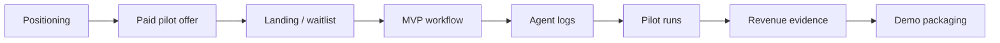
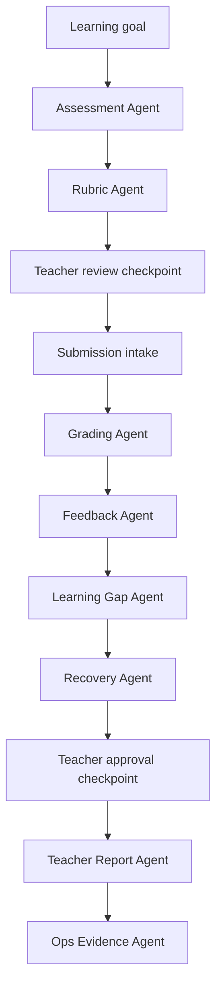

# 00 Project Foundation Consolidated

> Generated for NotebookLM from `00-project`. This is a full-content consolidation, not a summary.

## Source Files

- `00-project/README.md`
- `00-project/cost-model.md`
- `00-project/hackathon-strategy.md`
- `00-project/pitch.md`
- `00-project/problem.md`
- `00-project/project-review.md`
- `00-project/roadmap.md`
- `00-project/solution.md`
- `00-project/vision.md`

## Consolidated Content


---

## Source: `00-project/README.md`

# 00 Project

This folder defines the canonical foundation for GradeOps AI.

It answers:

> What are we building, why does it matter, and what must remain true across the project?

## Essence

`00-project` is the source of truth for the strategic shape of GradeOps AI:

- project positioning;
- vision;
- problem definition;
- solution definition;
- hackathon strategy;
- roadmap;
- cost model;
- canonical review.

Everything in later folders should align with the decisions captured here.

## How To Use This Folder

Start here when you need to understand the project.

Recommended reading order:

1. `project-review.md` — executive index and canonical decisions.
2. `pitch.md` — concise positioning and commercial language.
3. `problem.md` — the pain and misinterpretation guardrails.
4. `solution.md` — workflow, agents, control model, and evidence model.
5. `cost-model.md` — pricing, unit economics, runtime costs, and reporting.
6. `roadmap.md` — phases, exit criteria, and demo path.
7. `hackathon-strategy.md` — hackathon constraints, evidence, and submission strategy.
8. `vision.md` — long-term direction and strategic boundaries.

## What Belongs Here

- Canonical project decisions.
- High-level strategy.
- Scope boundaries.
- Hackathon positioning.
- Cross-folder alignment rules.
- Cost and pricing principles that affect the whole project.

## What Does Not Belong Here

- Detailed user stories.
- Agent implementation contracts.
- API schemas.
- Database tables.
- Customer interview notes.
- Raw conversation history.

Those belong in `02-product`, `03-ai-agents`, `04-architecture`, `05-evidence`, or `.raw`.

## Rule Of Interpretation

If a later document conflicts with this folder, prefer `00-project` unless a newer decision record in `99-decisions` explicitly supersedes it.


---

## Source: `00-project/cost-model.md`

# Cost Model

GradeOps AI must be priced and operated as a measurable business, not as a free AI demo.

The hackathon rewards real revenue, real users, AI-native operations, and business viability. That means the product must track unit economics from the first MVP: token usage, model routing, cloud runtime, payment fees, revenue, marketing spend, and related-party revenue.

## Canonical Cost Principles

- Do not assume Google Cloud or Gemini usage is free.
- Use credits and free tiers to reduce short-term cash burn, not to define pricing.
- Price by usage volume, especially graded submissions.
- Never sell unlimited AI corrections.
- Separate product operating costs from personal AI development tooling.
- Track cost per agent run, assessment, graded submission, active teacher, and customer.
- Report marketing and customer acquisition spend separately, even if it is zero.
- Keep cash cost, allocated tooling cost, credits, and related-party revenue separated.

## Required Hackathon Reporting

Devpost requires evidence around both revenue and costs. GradeOps AI should be ready to report:

| Reporting Item | GradeOps AI Interpretation |
| --- | --- |
| Total Revenue | Arms-length third-party revenue earned during the hackathon period, in USD. |
| Revenue by Month | Revenue broken out for May, June, July, and August 2026. |
| Total Costs | Product and development costs incurred during the hackathon period, excluding marketing and customer acquisition spend. |
| Marketing and Customer Acquisition Spend | Paid acquisition, ads, outreach tools, campaign spend, or `US$0` if no paid spend was used. |
| Related-Party Revenue | Revenue from team members, family, related entities, or pre-existing customer relationships, reported separately. |
| Product Evidence | Agent execution logs, API usage records, dashboards, screenshots, and production evidence. |

Sources to recheck:

- Devpost rules: <https://xprize.devpost.com/rules>
- Devpost challenge page: <https://xprize.devpost.com/>
- Gemini API pricing: <https://ai.google.dev/gemini-api/docs/pricing>
- Cloud Run pricing: <https://cloud.google.com/run/pricing>
- Firestore pricing: <https://cloud.google.com/firestore/pricing>
- Cloud Storage pricing: <https://cloud.google.com/storage/pricing>

## Product Operating Costs

These costs affect unit economics and should be tracked as product runtime or product operations.

| Cost Area | Track As | Notes |
| --- | --- | --- |
| Gemini API / Vertex AI | AI API usage | Track model, input tokens, output tokens, retries, and estimated cost. |
| Cloud Run | Hosting/backend execution | Good default for API and agent workers. |
| Firestore or Cloud SQL | Database | Store users, assessments, submissions, rubrics, reports, and logs. |
| Cloud Storage | File storage | Store uploaded code files, exports, and artifacts. |
| Cloud Logging / Monitoring | Observability | Keep technical logs; store agent business logs in DB too. |
| Email provider | Product communication | Transactional notifications and pilot communication. |
| Payment processor | Payment fees | Stripe, PayPal, MercadoPago, Flow, Transbank, or equivalent. |
| Domain | Product/domain cost | Small but should be reported. |
| Contractors | Contractor fees | Only if used. |

## AI Development Tooling

Personal subscriptions can accelerate development but should not be used as runtime infrastructure.

| Tool | Correct Use | Reporting Treatment |
| --- | --- | --- |
| Google AI Pro | Ideation, prototyping, AI Studio, Antigravity, development support. | Pre-existing AI development tooling; note any credits used. |
| Claude Code Pro | Implementation, refactor, debugging, architecture. | Allocated AI development tooling if counted. |
| ChatGPT Plus / Codex | Product design, code review, docs, coding support. | Allocated AI development tooling if counted. |
| GitHub Copilot Pro teacher benefit | IDE productivity. | Free verified teacher benefit, `US$0` cash cost if applicable. |
| OpenCode + free models | Low-cost local/CLI coding support. | Free/open tooling, `US$0` cash cost. |

Runtime rule:

> Personal AI subscriptions accelerate construction; the deployed product must use traceable API/cloud billing.

Do not run production grading through personal ChatGPT, Claude, Gemini web, or AI Studio sessions. The production path must use Gemini API or Vertex AI from the deployed backend and log each agent execution.

## Unit Of Business

Primary unit:

> 1 assessment = activity + rubric + grading assistance for 30 submissions + personalized feedback + teacher report.

Estimated token budget per 30-student assessment:

| Operation | Estimated Input Tokens | Estimated Output Tokens |
| --- | ---: | ---: |
| Create activity + rubric | 15,000 | 8,000 |
| Validate rubric | 10,000 | 2,000 |
| Grade 30 submissions | 480,000 | 150,000 |
| Final teacher report | 40,000 | 8,000 |
| **Total** | **545,000** | **168,000** |

## Current Model Cost Assumptions

Model names and prices change. Verify against official pricing before deployment and final submission.

Working assumptions as of this revision:

| Model Policy | Example Model | Input / 1M Tokens | Output / 1M Tokens | Use |
| --- | --- | ---: | ---: | --- |
| Low-cost bulk | Gemini 3.1 Flash-Lite | US$0.25 | US$1.50 | bulk grading, simple feedback, high-volume tasks |
| Balanced | Gemini 3 Flash Preview | US$0.50 | US$3.00 | assessment generation, rubric, reports |
| Premium fallback | Gemini 3.1 Pro Preview | US$2.00 | US$12.00 | rare complex review only |

Estimated AI cost for one 30-submission assessment:

| Routing Scenario | Base AI Cost | With 25% Retry/Overhead Buffer | Interpretation |
| --- | ---: | ---: | --- |
| All Flash-Lite-class | US$0.39 | US$0.49 | Cheapest acceptable path for high volume. |
| All Flash-class | US$0.78 | US$0.97 | Good planning baseline. |
| All premium fallback | US$3.11 | US$3.88 | Should never be the default path. |

Working planning range:

- with efficient routing, a 30-student assessment should usually cost about **US$0.50-US$1.20** in AI usage;
- premium fallbacks should be rare and explicitly logged;
- budget extra for retries, long submissions, logs, failed calls, and manual review support.

## Model Routing Policy

Use cheaper models for high-volume tasks and stronger models where quality matters most.

| Workload | Default Model Policy | Rationale |
| --- | --- | --- |
| Assessment generation | Flash-class model | Quality matters; moderate volume. |
| Rubric generation | Flash-class model | Needs consistent structure and pedagogy. |
| Rubric validation | Flash-class model | Needs reasoning and calibration. |
| Bulk grading | Flash-Lite-class model | Highest volume; cost control matters. |
| Individual feedback | Flash-Lite by default; Flash fallback | High volume with occasional quality escalation. |
| Teacher report | Flash-class model | Lower volume; quality matters. |
| Complex cases | Premium fallback only | Avoid premium models for default volume. |

## Initial Pricing

Pricing should reflect teacher value and usage volume, not only API cost.

| Plan | Price | Included Usage | Purpose |
| --- | ---: | --- | --- |
| Free | US$0 | 1 assessment / 30 submissions | Controlled demo and lead capture. |
| Teacher Lite | US$12/month | 3 assessments / 90 submissions | Entry-level paid plan. |
| Teacher Pro | US$29/month | 10 assessments / 300 submissions | Main individual teacher plan. |
| Cohort Pro | US$79/month | 30 assessments / 1,000 submissions | Bootcamps, tutors, and small academies. |
| Pilot Pack | US$99 one-time | 3 real assessments / up to 150 submissions / onboarding | Best hackathon revenue offer. |

For Chile/LatAm testing:

| Plan | Suggested CLP Price |
| --- | ---: |
| Teacher Lite | $9.990 CLP/month |
| Teacher Pro | $19.990-$24.990 CLP/month |
| Cohort Pro | $59.990-$79.990 CLP/month |
| Pilot Pack | $39.990-$79.990 CLP one-time |

## Margin Logic

Gross margin should be evaluated per plan using this formula:

```text
Gross margin = (Revenue - AI runtime - cloud runtime - storage/logging - payment fees - support allocation) / Revenue
```

Minimum planning targets:

| Offer | Target Gross Margin |
| --- | ---: |
| Free | Negative or break-even, but capped hard |
| Teacher Lite | 70%+ |
| Teacher Pro | 75%+ |
| Cohort Pro | 70%+ |
| Pilot Pack | 60%+ after onboarding/support time |

The Pilot Pack can have lower margin because it generates customer evidence, testimonials, and revenue proof during the hackathon.

## Overuse Policy

Do not sell unlimited AI corrections.

Recommended overuse pricing:

| Extra Usage | Suggested Price |
| --- | ---: |
| Additional graded submission | US$0.08 |
| Additional assessment without submissions | US$0.50 |
| Additional assessment with up to 30 submissions | US$3.00 |
| Additional advanced report | US$1.00 |
| Premium model review | US$0.20-US$0.50 per submission |

## Cost Dashboard Requirements

The MVP should include an internal dashboard that tracks:

- input tokens by agent;
- output tokens by agent;
- model used by agent;
- estimated cost per agent execution;
- retries and failed calls;
- cost per assessment;
- cost per graded submission;
- cost per teacher;
- revenue by customer;
- revenue by month;
- marketing spend;
- payment fees;
- costs covered by credits;
- cash costs actually paid;
- related-party revenue separated from arms-length revenue.

## Revenue And Cost Ledger Schema

Minimum fields for business evidence:

### `RevenueEvent`

| Field | Purpose |
| --- | --- |
| `event_id` | Unique event identifier. |
| `customer_id` | Customer or pilot account. |
| `date` | Revenue date. |
| `month` | May, June, July, or August 2026. |
| `amount_usd` | Amount converted to USD. |
| `amount_original` | Amount in original currency. |
| `currency` | CLP, USD, etc. |
| `source` | Stripe, bank transfer, manual invoice, commitment. |
| `offer` | Pilot Pack, Teacher Lite, Teacher Pro, Cohort Pro. |
| `related_party` | `true` or `false`. |
| `evidence_link` | Screenshot/export/invoice reference. |

### `CostEvent`

| Field | Purpose |
| --- | --- |
| `event_id` | Unique event identifier. |
| `date` | Cost date. |
| `category` | Gemini API, Cloud Run, storage, payment fee, tooling, marketing. |
| `amount_usd` | Amount in USD. |
| `cash_cost` | Whether cash was actually paid. |
| `covered_by_credit` | Whether free tier/credit covered it. |
| `customer_id` | Optional attribution. |
| `assessment_id` | Optional attribution. |
| `evidence_link` | Billing screenshot/export/reference. |

## Initial Operating Budget

For the hackathon period, budget conservatively:

| Scenario | Expected Monthly Runtime Cost |
| --- | ---: |
| Controlled MVP | US$26-US$175 |
| Recommended planning buffer | US$150-US$250 |
| Serious pilot | US$165-US$695 |

Recommended cash reserve for the hackathon:

> US$500-US$1,000, excluding the value of founder time.

## Final Rule

Charge for value and usage volume, not for how cheaply the MVP was built.

GradeOps AI should be able to say:

> We know what every assessment, correction, agent run, and customer costs. This is a measurable AI-operated business, not a demo.


---

## Source: `00-project/hackathon-strategy.md`

# Hackathon Strategy

GradeOps AI is being built for the **Build with Gemini XPRIZE** hackathon as an AI-native assessment operations business, not only as a software demo.

## Verified Hackathon Constraints

As of June 8, 2026, the public Devpost rules and challenge page indicate:

- submission period: May 19, 2026 to August 17, 2026;
- deadline: August 17, 2026 at 1:00 PM PDT;
- projects must be newly created after the submission period starts;
- pre-existing templates, frameworks, boilerplates, or code can be used only if their use is explained;
- the business must operate with AI;
- the project must use at least one Google Cloud product;
- LLM-powered projects must include Gemini API usage in the deployed product;
- submissions must disclose revenue, costs, marketing/customer acquisition spend, related-party revenue, users, product evidence, and agent/API logs;
- demo video should be under 3 minutes and show the product functioning on the target platform;
- material must be in English or include English translation;
- evaluation favors real business evidence, not only technical novelty.

These constraints should be rechecked before final submission.

Sources to recheck:

- Devpost challenge page: <https://xprize.devpost.com/>
- Devpost rules: <https://xprize.devpost.com/rules>
- Gemini API pricing: <https://ai.google.dev/gemini-api/docs/pricing>
- Cloud Run pricing: <https://cloud.google.com/run/pricing>
- Firestore pricing: <https://cloud.google.com/firestore/pricing>

## Strategic Thesis

Most teams will build AI tools. GradeOps AI will compete as an operational business: real educators, real assessment workflows, real usage, real payments, and auditable AI agent activity.

The product is intentionally focused on programming educators because this segment has frequent assessment cycles, high grading workload, strong need for personalized feedback, and clear adoption potential for practical workflow tools.

## Winning Position

GradeOps AI is not a generic quiz generator, chatbot, LMS, or grading toy.

It is an AI-operated assessment workflow where agents help educators:

- create assessments;
- generate rubrics;
- process submissions;
- assist grading;
- produce feedback;
- detect learning gaps;
- suggest recovery activities;
- prepare teacher reports;
- log operational evidence.

Teachers remain in control. Agents operate the repetitive workflow.

## Category Fit

Primary category:

> Education & Human Potential

Secondary narrative:

> Small education providers can operate with the assessment capacity of a larger academic team.

This framing avoids making the project sound like a generic teacher tool. It positions GradeOps AI as operational infrastructure for educators and small learning businesses.

## Judging Criteria Mapping

| Criterion | What Judges Need To See | GradeOps AI Evidence |
| --- | --- | --- |
| Business Viability | Real business, real users, real revenue, sustainable model | Paid pilots, pricing table, revenue ledger, cost model, user evidence, testimonials |
| AI-Native Operations | AI live in production executing key decisions/workflows | Agent workflow, agent execution logs, API usage, dashboard, approval states |
| Category Impact | Meaningful improvement in chosen category | Teacher time saved, faster feedback, learning gaps detected, small provider capacity |

## Business Viability Strategy

GradeOps AI targets educators, tutors, bootcamps, and small academies that need to reduce assessment workload without hiring additional academic operations staff.

The initial commercial offer should be simple:

> Run your next programming assessment with AI agents.

Evidence to collect:

- educator interviews;
- pilot commitments;
- paid pilots;
- arms-length revenue separated from related-party revenue;
- usage metrics;
- repeat-use intent;
- testimonials;
- time saved;
- payment evidence;
- product operating costs;
- marketing and customer acquisition spend, even if zero.

Initial commercial offer:

| Offer | Price | Purpose |
| --- | ---: | --- |
| Pilot Pack | US$99 one-time | Fastest path to real revenue and testimonials. |
| Teacher Lite | US$12/month | Entry paid plan. |
| Teacher Pro | US$29/month | Main individual teacher plan. |
| Cohort Pro | US$79/month | Small academies, bootcamps, and tutors. |

No plan should include unlimited AI grading. Usage must be bounded by assessments and graded submissions.

## AI-Native Operations Strategy

GradeOps AI must show agents executing meaningful operational steps, not only generating text.

Core agents:

- Assessment Agent;
- Rubric Agent;
- Grading Agent;
- Feedback Agent;
- Learning Gap Agent;
- Recovery Agent;
- Teacher Report Agent;
- Ops Evidence Agent.

Each agent execution should produce structured logs:

- timestamp;
- user;
- assessment;
- submission when applicable;
- agent name;
- input summary;
- output summary;
- model used;
- token estimate;
- status;
- uncertainty flags;
- teacher approval state;
- estimated time saved;
- estimated cost;
- operational evidence generated.

The business dashboard should also show cost per assessment, cost per graded submission, revenue by customer, payment fees, credits used, cash costs paid, marketing spend, and related-party revenue.

## Submission Evidence Inventory

| Evidence | Where To Capture | Owner |
| --- | --- | --- |
| GitHub repository | Code/docs repo | Team lead |
| Testing instructions | `04-submission/testing-instructions.md` | Product/tech |
| Demo video | 3-minute script and recording | Team lead |
| Written narrative | 500-1000 words in English | Team lead |
| Revenue evidence | Stripe export, bank record, invoice, receipt, or signed commitment | Business |
| Revenue by month | Revenue ledger | Business |
| Related-party revenue | Revenue ledger with flag | Business |
| Total costs | Cost ledger | Tech/business |
| Marketing spend | Marketing ledger, even if zero | Business |
| Agent logs | Product DB/dashboard export | Tech |
| API usage records | Google Cloud/Gemini console screenshots/export | Tech |
| Dashboard screenshots | Internal evidence dashboard | Tech |
| Customer evidence | Consent-aware customer list, testimonials, feedback | Business |
| English translation | Submission folder | Team lead |

## Category Impact Strategy

GradeOps AI improves education workflows by helping teachers provide faster, more consistent, and more actionable feedback.

Expected impact:

- less repetitive work for teachers;
- faster feedback for students;
- earlier detection of learning gaps;
- better support for small education providers;
- stronger assessment consistency across cohorts.

## What The Demo Must Prove

The demo must prove the business and the operation, not just the interface.

The 3-minute video should show:

1. A teacher creates a programming assessment from a learning goal.
2. Agents generate the activity and rubric.
3. A student submission is processed.
4. Agents assist grading and feedback.
5. The teacher reviews and approves.
6. The dashboard shows learning gaps and report output.
7. Agent logs prove AI-native operation.
8. Business evidence proves real validation.

## Demo Script Outline

| Time | Scene | Message |
| --- | --- | --- |
| 0:00-0:20 | Problem | Programming teachers lose hours creating, grading, and writing feedback. |
| 0:20-0:40 | Product | GradeOps AI runs assessment operations with agents while teachers approve. |
| 0:40-1:30 | Workflow | Create assessment, generate rubric, process submission, draft feedback. |
| 1:30-2:05 | AI operations | Show agent logs, model used, cost, approval state, output evidence. |
| 2:05-2:35 | Business evidence | Show pilots, users, payment evidence, cost dashboard, testimonials. |
| 2:35-3:00 | Close | Small education providers gain academic operations capacity without hiring. |

## What Not To Build

Avoid expanding into a full academic platform during the hackathon.

Do not prioritize:

- full LMS functionality;
- complex institutional workflows;
- mobile app;
- OCR-heavy flows;
- advanced curriculum administration;
- too many assessment formats;
- broad multi-subject support.

The winning version should be narrow, useful, demonstrable, and sellable.

## Primary Success Metrics

For the hackathon, success should be measured by evidence.

Target metrics:

- 10+ educator discovery conversations;
- 5+ pilot users;
- 3+ paid pilots or payment commitments;
- 5+ real or semi-real assessments processed;
- 100+ submissions processed;
- 300+ feedback outputs generated;
- 500+ agent log events;
- measurable teacher time saved;
- at least 1 strong testimonial.

## Final Positioning

GradeOps AI helps programming educators operate assessments with AI agents.

It gives small education teams the operational capacity of a larger academic team while keeping teachers in control of judgment, feedback, and student outcomes.


---

## Source: `00-project/pitch.md`

# Pitch

## One-Line Pitch

AI-native assessment operations for programming educators.

## Core Promise

Run your next programming assessment with AI agents.

## Short Pitch

GradeOps AI helps programming educators run practical assessments with AI agents. A teacher enters a learning goal, and specialized agents generate the assessment, rubric, grading criteria, personalized feedback, learning-gap analysis, recovery activities, and teacher report.

Teachers stay in control. Students receive faster feedback. Small education providers operate with more academic capacity without adding staff.

## 30-Second Pitch

Programming teachers spend too much time creating assessments, grading code, writing feedback, and deciding what to reinforce next. GradeOps AI turns that workflow into an AI-operated assessment process.

A teacher defines a learning goal. Agents create the activity, validate the rubric, analyze submissions, draft feedback, detect learning gaps, suggest recovery activities, and prepare a report. The teacher reviews and approves the outputs. Every agent action is logged so the business can prove usage, impact, cost, and value.

## 60-Second Pitch

GradeOps AI is an AI-native assessment operations platform for programming educators, tutors, bootcamps, and small academies.

Instead of giving teachers another chatbot or quiz generator, GradeOps AI operates the assessment workflow: it creates the activity, structures the rubric, processes student submissions, assists grading, drafts personalized feedback, detects common learning gaps, suggests recovery work, and prepares the teacher report.

The teacher remains the final pedagogical authority. Agents do the repetitive operational work, while every important decision is logged with model, cost, status, approval state, and output evidence.

The first sellable offer is simple: **we operate your next programming assessment with AI agents**. That makes the product easy to pilot, easy to demonstrate, and easy to connect to real revenue during the hackathon.

## What GradeOps AI Is

GradeOps AI is an AI-native assessment operations platform for programming educators, tutors, bootcamps, and small academies.

It helps educators operate the full assessment workflow:

- create assessments;
- generate rubrics;
- process submissions;
- assist grading;
- produce personalized feedback;
- detect learning gaps;
- suggest recovery activities;
- prepare teacher reports;
- capture evidence of usage, value, and AI operations.

## What GradeOps AI Is Not

GradeOps AI is not:

- a generic quiz generator;
- a chatbot for students;
- a heavy LMS;
- a replacement for teachers;
- a grading black box;
- a broad academic management platform;
- an OCR-first product;
- a promise of unlimited AI grading.

## Buyer Promise

For independent teachers, tutors, bootcamps, and small academies:

> GradeOps AI gives you the assessment operations capacity of a larger academic team without hiring one.

## Pitch By Buyer Type

| Buyer | Message |
| --- | --- |
| Independent teacher | Save hours on grading and feedback while keeping full control of your evaluation decisions. |
| Tutor | Turn your next programming evaluation into a professional assessment with rubric, feedback, and report. |
| Bootcamp instructor | Process many similar code submissions faster and detect common cohort gaps before the next class. |
| Small academy | Standardize assessment quality without hiring additional academic operations staff. |
| Corporate trainer | Produce evidence-backed reports on participant performance and recovery needs. |

## Initial Offer

The first sellable offer is a paid pilot, not a broad subscription platform:

> We operate your next 3 programming assessments with AI agents: assessment design, rubric, grading assistance, personalized feedback, learning-gap report, and teacher approval.

Recommended hackathon offer:

| Offer | Price | Includes |
| --- | ---: | --- |
| Pilot Pack | US$99 one-time | 3 real assessments, up to 150 graded submissions, onboarding, feedback, and teacher report. |
| Teacher Lite | US$12/month | 3 assessments and 90 graded submissions. |
| Teacher Pro | US$29/month | 10 assessments and 300 graded submissions. |
| Cohort Pro | US$79/month | 30 assessments and 1,000 graded submissions. |

The product should never be sold as unlimited AI grading. The commercial unit is graded submissions plus assessment operations.

## Objections And Responses

| Objection | Response |
| --- | --- |
| “I do not want AI deciding grades.” | GradeOps AI does not replace teacher judgment. Agents suggest; teachers approve. |
| “Generic AI can already make tests.” | Generic AI drafts content. GradeOps AI operates the full assessment workflow with rubrics, submissions, feedback, reports, logs, and cost tracking. |
| “My students submit different kinds of answers.” | The MVP starts with text/code submissions and rubric-based review. Other formats can come later. |
| “I need evidence, not just generated text.” | Every agent execution is logged with model, cost, input/output summary, status, and approval state. |
| “I cannot adopt a full LMS.” | GradeOps AI is not a full LMS. It is a focused assessment operation that can start with one evaluation. |

## Spanish Version

GradeOps AI ayuda a docentes de programación a operar evaluaciones prácticas con agentes de IA. El docente ingresa un objetivo de aprendizaje y los agentes generan la evaluación, rúbrica, criterios de corrección, feedback personalizado, análisis de brechas, actividades de reforzamiento y reporte docente.

El docente mantiene el control. Los estudiantes reciben feedback más rápido. Los pequeños equipos educativos pueden operar como equipos académicos más grandes sin aumentar carga administrativa.

## Demo Opening Line

> Teachers do not need another AI chatbot. They need their next assessment operated end to end: activity, rubric, grading assistance, feedback, learning gaps, report, and evidence.

## Demo Closing Line

> GradeOps AI is not just an app that uses AI. It is a real assessment operation run by AI agents, with teachers in control and evidence that the workflow creates value.


---

## Source: `00-project/problem.md`

# Problem

Programming assessment workflows are operationally heavy.

Programming educators do not only create tests. They operate a full assessment cycle: design activities, define rubrics, collect submissions, grade consistently, write feedback, detect learning gaps, and decide what to reinforce next.

For small academies, tutors, bootcamps, and independent educators, this work is usually manual, fragmented, and difficult to scale.

## Strategic Problem Statement

Programming educators need an AI-native operating layer for practical assessments: one that reduces repetitive work, preserves teacher control, improves feedback speed, and creates evidence of learning and business value.

## Current Pain Points

- Assessment design is repeated from scratch.
- Rubrics are inconsistent across instructors or cohorts.
- Submission handling is fragmented across tools.
- Grading takes too much instructor time.
- Feedback quality varies with workload.
- Learning gaps are spotted too late.
- Recovery actions are often improvised.
- Small schools lack dedicated assessment operations staff.
- Evidence of grading, feedback, and learning progress is hard to consolidate.
- Business evidence around value, usage, and willingness to pay is usually absent.

## Jobs To Be Done

| Actor | Job |
| --- | --- |
| Teacher | “Help me run my next assessment faster without losing control of grading quality.” |
| Student | “Help me understand what I did wrong and what to practice next.” |
| Bootcamp instructor | “Help me process many similar submissions and identify cohort-wide gaps.” |
| Small academy owner | “Help me standardize assessment quality without hiring more academic staff.” |
| Hackathon judge | “Show me a real AI-operated business with customers, revenue, costs, logs, and impact.” |

## Why Programming Assessment Is Different

Programming education is not well served by simple multiple-choice tooling.

Practical programming assessment often requires:

- code analysis;
- reasoning review;
- partial credit;
- rubric-based judgment;
- feedback by type of mistake;
- detection of repeated misconceptions;
- recovery activities tied to specific learning gaps.

This is why the initial wedge matters. Programming creates a clear, repeated, high-friction assessment workflow where AI agents can provide visible operational leverage.

## Why Existing Tools Fall Short

### LMS Platforms

LMS tools organize content, classes, and submissions, but they do not operate the assessment workflow end to end.

They usually leave the hardest work to the teacher:

- designing the assessment;
- defining grading criteria;
- reviewing individual answers;
- writing useful feedback;
- identifying patterns;
- preparing recovery actions.

### Quiz Generators

Quiz generators are useful for simple objective questions, but they are too narrow for authentic programming assessment.

They typically produce questions, not operations. They do not reliably manage rubric validation, grading assistance, feedback quality, learning-gap detection, teacher approval, and evidence capture.

### Generic AI Tools

Generic AI tools can help draft content, but they are not structured around assessment operations.

They usually lack:

- teacher approval workflows;
- traceability;
- consistent rubric enforcement;
- agent-level logs;
- evidence capture;
- usage metrics;
- business evidence;
- operational dashboards;
- bounded usage and cost controls.

## Business Problem

Small education providers need to deliver better feedback without hiring more academic operations staff.

The buyer does not only need an AI writing assistant. The buyer needs a way to run assessments faster, with more consistency, better visibility, and measurable value.

The economic problem is not only the API cost. It is the manual time spent on repetitive grading, feedback, reporting, and recovery planning.

## Validation Hypotheses

These assumptions must be tested quickly:

| Hypothesis | Validation Signal |
| --- | --- |
| Teachers feel acute pain around programming grading and feedback | 10+ interviews with repeated pain patterns |
| Teachers will trust AI if they approve final outputs | Positive reaction to human-in-the-loop demo |
| A paid pilot is easier to sell than a subscription at the start | 3+ paid pilots or signed commitments |
| The assessment workflow is more valuable than isolated test generation | Customers ask for grading, feedback, and report, not only questions |
| Usage limits are acceptable | Buyers understand limits by assessment and submission volume |
| Programming is a strong enough initial wedge | First pilots come from programming educators without broad-subject expansion |

## Risk Of Misinterpretation

GradeOps AI should not be interpreted as:

- a fully automated grading authority;
- a student-facing tutoring chatbot;
- a full school administration system;
- a generic question generator;
- a compliance-heavy institutional LMS;
- a promise that AI output is always correct;
- a substitute for teacher review.

The correct interpretation is narrower and stronger:

> GradeOps AI is an AI-native operating layer for practical programming assessments, where agents run repetitive workflow steps and teachers approve the educational decisions.

## Problem Boundaries

GradeOps AI solves the assessment-operation problem first. It does not initially solve:

- full curriculum planning;
- institutional accreditation;
- attendance tracking;
- student enrollment management;
- full LMS content delivery;
- live classroom management;
- OCR-heavy paper correction;
- plagiarism investigation as a primary product.

Academic integrity can be supported through logs, rubric evidence, and uncertainty flags, but it should not become the MVP’s central promise.


---

## Source: `00-project/project-review.md`

# Review: 00-project

## Verdict

The `00-project` folder is coherent and strategically useful. It already points to one project:

> **GradeOps AI: AI-native assessment operations for programming educators.**

The strongest decision is the framing shift from an academic evaluation platform to an operational business: GradeOps AI should prove that AI agents can run a real assessment workflow with real educators, real usage, real payments, and auditable evidence.

This folder should be treated as the canonical strategic foundation for the hackathon. The `raw/` folder preserves reasoning history and naming exploration; it is not the current product specification.

## Canonical Decisions

| Decision | Current Position |
| --- | --- |
| Project name | **GradeOps AI** |
| Initial market | Programming educators, tutors, bootcamps, and small academies |
| Initial wedge | Practical programming assessments |
| Primary promise | Run the next programming assessment with AI agents |
| Category | Education & Human Potential |
| Business framing | Assessment operations capacity for small education providers |
| MVP boundary | Assessment creation, rubric, submission intake, grading assistance, feedback, learning gaps, teacher report, agent logs |
| Human role | Teachers retain pedagogical authority and final approval |
| AI role | Agents execute repetitive workflow steps and produce structured evidence |
| Pricing model | Bounded by assessments and graded submissions; no unlimited AI grading |
| Runtime policy | Production grading must use traceable API/cloud billing, not personal AI subscriptions |
| Evidence policy | Usage, agent logs, cost, revenue, testimonials, and customer evidence are first-class product outputs |

## Document Roles

| File | Role | Required Strengthening |
| --- | --- | --- |
| `vision.md` | North Star, wedge, expansion direction, non-negotiables | Add ICP, strategic moat, success metrics, and explicit boundaries |
| `pitch.md` | Messaging, buyer promise, offer, English/Spanish pitch | Add buyer-specific pitch variants, objections, and sharper demo language |
| `problem.md` | Pain definition and why existing tools fall short | Add jobs-to-be-done, buyer economics, validation hypotheses, and anti-scope guardrails |
| `solution.md` | Workflow, agents, evidence model, technical direction | Add MVP scope table, data model, approval states, privacy/security, and non-functional requirements |
| `roadmap.md` | Execution phases and success evidence | Add critical path, weekly plan, kill criteria, and hackathon submission readiness |
| `hackathon-strategy.md` | Rules alignment, evidence strategy, demo logic | Add compliance matrix, evidence inventory, demo script, and final submission checklist |
| `cost-model.md` | Pricing, costs, unit economics, reporting policy | Update model assumptions, add margin formula, add revenue/cost ledger schema, and make pricing defensible |
| `raw/` | Conversation history and source reasoning | Keep unchanged except for metadata notes if needed |

## What Changed In This Revision

- Converted the folder from a set of strategic notes into a decision-ready project foundation.
- Added explicit validation hypotheses so the team can test whether the wedge is sellable before overbuilding.
- Added an MVP scope matrix separating **must build**, **demo support**, **later**, and **do not build now**.
- Added a stricter human-in-the-loop control model for grading, feedback, and student-facing outputs.
- Added privacy, data-retention, IP, and academic-integrity considerations that were underdeveloped.
- Added a weekly execution path from June 8 to the August 17 submission deadline.
- Updated the cost model around current Gemini/Google Cloud assumptions and a stronger unit-economics ledger.
- Added a hackathon evidence inventory so every required submission artifact is collected while building, not at the end.

## Coherence Checks

- **Naming:** canonical name is **GradeOps AI**. `ClassOps AI` remains only in historical notes.
- **Category:** primary category is **Education & Human Potential**; secondary business narrative is support for small education providers.
- **Scope:** the project is not a full LMS, student chatbot, broad academic platform, or OCR-first product.
- **Authority:** the product must not claim autonomous grading authority. Agents suggest; teachers approve.
- **Evidence:** agent logs, API usage, costs, revenue, testimonials, and user evidence are mandatory from the first usable MVP.
- **Costing:** personal AI subscriptions accelerate development but are not production runtime and should not define SaaS pricing.
- **Pricing:** plans must be bounded by assessment and graded-submission volume.
- **Submission:** all hackathon material should be ready in English, even if the working documentation remains bilingual or Spanish-first.

## Remaining Validation Work

Before final submission, validate and cite:

- current Devpost rules;
- final judging criteria;
- required submission artifacts;
- Google Cloud and Gemini usage requirements;
- current Gemini API and Google Cloud pricing;
- education workload statistics used in the pitch;
- customer testimonials and payment evidence;
- whether each paid customer is arms-length or related-party;
- whether any pre-existing code/template/boilerplate requires disclosure.

## Critical Risks

| Risk | Why It Matters | Mitigation |
| --- | --- | --- |
| Overbuilding | A broad LMS will dilute the hackathon story and slow delivery | Build one end-to-end programming assessment workflow first |
| Weak revenue evidence | The hackathon emphasizes real business viability | Sell paid pilots immediately, even before full self-serve subscription |
| Black-box grading perception | Teachers may distrust AI-scored submissions | Keep teacher approval mandatory and log uncertainty flags |
| Unsupported statistics | Uncited workload claims weaken credibility | Use only cited statistics in public pitch/deck/video |
| Runtime cost ambiguity | Unlimited grading can destroy margins | Track cost per agent run, assessment, submission, and customer |
| Rules mismatch | Requirements may change or be interpreted strictly | Recheck Devpost and Google requirements before submission |
| Spanish-only evidence | Submission materials may require English | Prepare English pitch, video script, testing instructions, and narrative early |

## Next Documents To Create Outside `00-project`

These are not replacements for the current files, but implementation artifacts that should come next:

```text
01-product/
  mvp-spec.md
  user-stories.md
  data-model.md
  agent-contracts.md
  approval-workflow.md

02-business/
  landing-copy.md
  sales-script.md
  pilot-offer.md
  customer-interview-script.md
  evidence-ledger-template.md

03-technical/
  architecture.md
  api-contracts.md
  agent-log-schema.md
  deployment-plan.md
  security-privacy.md

04-submission/
  demo-script.md
  narrative-500-1000.md
  testing-instructions.md
  evidence-checklist.md
```

## Final Interpretation

GradeOps AI is not a general academic evaluation platform. It is a focused, AI-operated assessment workflow for programming educators. The hackathon version must prove a business: real educators, real usage, real payments, auditable AI operations, controlled runtime costs, and measurable value.


---

## Source: `00-project/roadmap.md`

# Roadmap

GradeOps AI is being built as a focused hackathon MVP and a real business experiment. The roadmap prioritizes evidence over feature volume.

Current planning date: **June 8, 2026**. Hackathon deadline: **August 17, 2026 at 1:00 PM PDT**.

## Roadmap Principles

- Build the smallest workflow that can process a real programming assessment.
- Collect business evidence from the first usable version.
- Keep the MVP narrow: programming assessments, teacher approval, agent logs, and reports.
- Avoid becoming a full LMS during the hackathon.
- Prioritize demo clarity over feature breadth.
- Treat evidence as product output, not as final paperwork.

## Critical Path



The project loses strategic strength if the app works but cannot prove:

- real users;
- real or semi-real assessment runs;
- agent execution evidence;
- cost tracking;
- customer feedback;
- payment, payment intent, or signed pilot commitment.

## Phase 1: Strategic Foundation

Goal: define the smallest sellable assessment operation for programming educators.

### Deliverables

- Market wedge: programming educators.
- Core workflow: from learning goal to graded feedback.
- Commercial offer: paid pilot for the next real assessment.
- Landing page copy.
- Discovery interview script.
- Evidence plan for users, payments, usage, costs, and agent logs.
- Initial cost model and pricing policy.

### Success Evidence

- 10+ educator conversations.
- 3+ strong pilot candidates.
- Clear pain validation.
- Clear workflow validation.
- Initial willingness-to-pay signal.

### Exit Criteria

- One clear buyer persona.
- One clear assessment workflow.
- One paid-pilot offer.
- One pricing table with usage limits and no unlimited AI grading.
- One demo scenario based on a realistic programming class.

## Phase 2: Hackathon MVP

Goal: build a demonstrable workflow that can process real programming assessments.

### Core Workflow

1. Teacher creates an assessment from a learning goal.
2. Assessment Agent drafts the activity.
3. Rubric Agent drafts and validates criteria.
4. Students submit answers or code.
5. Grading Agent analyzes submissions.
6. Feedback Agent drafts personalized feedback.
7. Learning Gap Agent detects common issues.
8. Teacher reviews and approves.
9. Teacher Report Agent prepares the teacher report.
10. Ops Evidence Agent logs usage, cost, decisions, and evidence.

### Deliverables

- Teacher workspace.
- Assessment creation flow.
- Rubric generation.
- Submission intake.
- Grading assistance.
- Feedback drafts.
- Teacher approval step.
- Cohort report.
- Agent execution logs.
- Usage events.
- Cost dashboard events.
- Basic Google Cloud deployment.
- Gemini API integration.

### Success Evidence

- 5+ real or semi-real assessment runs.
- 100+ submissions processed.
- 300+ feedback outputs generated.
- 500+ agent log events.
- Measurable teacher time saved.

### Exit Criteria

- A teacher can complete the full workflow without manual setup by the team.
- Every agent run creates structured evidence.
- Every assessment run estimates token usage and cost.
- The demo can show the product and logs in under 3 minutes.

## Phase 3: Pilot Operations

Goal: operate GradeOps AI with real educators and collect business evidence.

### Deliverables

- Paid pilot flow.
- Stripe or manual payment evidence.
- Customer testimonials.
- Before/after workflow comparison.
- Exportable teacher reports.
- Cost tracking.
- Revenue and related-party revenue tracking.
- Marketing spend tracking, even if zero.
- Product feedback loop.

### Success Evidence

- 5-10 educators onboarded.
- 3+ paying customers or paid pilot commitments.
- Clear usage metrics.
- Clear repeat-use signal.
- At least one strong testimonial.

### Exit Criteria

- There is evidence that someone outside the builder team used the workflow.
- There is evidence of payment, payment intent, or signed pilot commitment.
- Costs, payment fees, and runtime usage are tracked separately.
- There is a credible time-saved estimate.

## Phase 4: Hackathon Packaging

Goal: prepare a submission that sells the business, not just the app.

### Deliverables

- 3-minute demo video.
- 500-1000 word narrative.
- Public repository documentation or private repository shared with required judges/testers.
- Testing instructions.
- Revenue evidence.
- Expense evidence.
- Cost model and unit economics summary.
- Agent logs.
- Customer evidence.
- Google Cloud / Gemini usage evidence.
- Business viability summary.
- English version of all required materials.

### Success Evidence

- Judges understand the business in under 60 seconds.
- Demo proves AI-native operation.
- Evidence proves real demand.
- Product looks focused, useful, sellable, and operational.

### Demo Must Show

1. Teacher creates a programming assessment.
2. Agents generate activity and rubric.
3. A student submission is analyzed.
4. Feedback and learning gaps are produced.
5. Teacher approves outputs.
6. Report and dashboard summarize the run.
7. Agent logs prove AI-native operations.
8. Business evidence proves real validation.

## Weekly Execution Plan

| Week | Dates | Primary Outcome | Must Have Evidence |
| --- | --- | --- | --- |
| 1 | Jun 8-14 | Positioning, pilot offer, landing copy, outreach list | 10 target contacts, interview script, pilot offer |
| 2 | Jun 15-21 | Discovery and sales conversations | 5+ conversations, 1+ pilot commitment |
| 3 | Jun 22-28 | MVP skeleton: teacher flow + assessment/rubric generation | Deployed app shell, first Gemini call, first agent log |
| 4 | Jun 29-Jul 5 | Submission intake + grading assistance | End-to-end sample assessment processed |
| 5 | Jul 6-12 | Feedback, learning gaps, teacher report | Report output, approval states, cost estimates |
| 6 | Jul 13-19 | First pilot operations | Real/semi-real educator run, testimonial draft |
| 7 | Jul 20-26 | Payments and business dashboard | Revenue or payment-intent evidence, cost dashboard |
| 8 | Jul 27-Aug 2 | Hardening and second pilot wave | 3+ pilot runs, 100+ submissions target path |
| 9 | Aug 3-9 | Submission package draft | Demo script, narrative draft, testing instructions |
| 10 | Aug 10-17 | Final evidence, video, repo cleanup | Final video, evidence folder, cost/revenue summary |

## Kill Or Pivot Criteria

If these are not true by mid-July, adjust aggressively:

- No teacher understands the offer after a 30-second explanation.
- No educator agrees to test a real or semi-real assessment.
- The workflow requires too much manual intervention to demo clearly.
- Agent logs are not being captured reliably.
- The product cannot estimate cost per assessment.
- The team is building LMS features instead of assessment operations.

Pivot options:

- reduce to one assessment type;
- reduce to one programming language;
- use manual payments instead of full Stripe flow;
- use sample submissions for demo while still collecting customer interviews;
- sell “done-with-you assessment operation” before self-serve SaaS.

## Phase 5: Expansion

Goal: expand beyond the initial programming education wedge after validating the core operation.

### Possible Expansion Paths

- More assessment formats.
- More programming languages.
- Cohort and assignment management.
- Analytics across instructors.
- Institution-level pilots.
- LMS integrations.
- Advanced recovery plans.

### Deferred Until After MVP

- OCR-heavy workflows.
- Mobile app.
- Full LMS features.
- Institution-wide administration.
- Broad multi-subject support.
- Complex curriculum mapping.

## Definition Of Done For Hackathon Submission

GradeOps AI is submission-ready when it can prove:

- a deployed product uses Google Cloud and Gemini API;
- AI agents operate meaningful workflow steps;
- teachers remain in control through approval states;
- logs exist for agent executions and API usage;
- revenue, costs, marketing spend, and related-party revenue are documented;
- real users or pilot customers are evidenced;
- demo video shows the product functioning on the target platform;
- the written narrative explains what AI does, what humans do, and why the business matters.


---

## Source: `00-project/solution.md`

# Solution

GradeOps AI is an AI-operated assessment workflow for programming education.

It helps educators move from a learning goal to reviewed feedback and teacher reports through a controlled agent workflow.

## Core Approach

- One workflow from assessment setup to reporting.
- Specialized agents for repetitive assessment operations.
- Teacher approval on important outputs.
- Structured evidence capture from day one.
- Auditable logs for AI actions, cost, usage, and decisions.
- A narrow MVP focused on practical programming assessments.

## MVP Workflow

1. Teacher defines what they want to evaluate.
2. Assessment Agent generates the activity.
3. Rubric Agent creates and validates criteria.
4. Students submit answers or code.
5. Grading Agent analyzes submissions against the rubric.
6. Feedback Agent drafts personalized feedback.
7. Learning Gap Agent identifies recurring issues.
8. Recovery Agent suggests reinforcement activities.
9. Teacher reviews and approves.
10. Teacher Report Agent prepares the final report.
11. Ops Evidence Agent records usage, costs, outcomes, and agent logs.

## MVP Scope Matrix

| Area | Must Build For MVP | Demo Support | Later | Do Not Build Now |
| --- | --- | --- | --- | --- |
| Assessment creation | Learning goal input, generated activity | Example templates | Question bank versioning | Full curriculum design |
| Rubric | Structured rubric with weights | Rubric validation notes | Rubric library | Institutional rubric governance |
| Submissions | Text/code paste and file upload | Seed sample submissions | Git repo integration | OCR-first workflow |
| Grading assistance | Suggested score and evidence per criterion | Uncertainty flags | Automated tests/sandboxes | Fully autonomous final grades |
| Feedback | Individual feedback draft | Teacher edit/approve | Student portal history | Chat tutor |
| Learning gaps | Cohort summary | Common mistake clustering | Longitudinal analytics | Predictive student profiling |
| Recovery | Suggested activity | Exportable recommendation | Recovery plan library | Adaptive course engine |
| Reporting | Teacher report | Dashboard screenshots | Multi-cohort analytics | Executive BI suite |
| Evidence | Agent logs, API usage, cost estimate | Hackathon dashboard | Audit export | Complex compliance workflows |
| Payments | Manual or Stripe evidence | Pilot Pack checkout | Full billing portal | Marketplace |

## Agent Responsibilities

| Agent | Responsibility | Output |
| --- | --- | --- |
| Assessment Agent | Generate assessment activities from a learning goal. | Activity brief, instructions, expected evidence. |
| Rubric Agent | Create and validate grading criteria. | Rubric, criteria weights, consistency notes. |
| Grading Agent | Analyze submissions against the rubric. | Suggested score, rubric evidence, uncertainty flags. |
| Feedback Agent | Draft student-facing feedback. | Personalized feedback and improvement advice. |
| Learning Gap Agent | Detect repeated misconceptions. | Gap summary and affected students/cohorts. |
| Recovery Agent | Suggest reinforcement work. | Recovery activities tied to specific gaps. |
| Teacher Report Agent | Summarize the assessment run. | Teacher-facing report and next-step recommendations. |
| Ops Evidence Agent | Capture operational proof. | Logs, cost estimates, usage events, time-saved evidence. |

## Agent Choreography



The product should show this choreography visually in the demo. The judges should understand that AI is operating the workflow, not only answering prompts.

## Human Control Model

The product must be explicit about authority:

- agents suggest;
- teachers review;
- teachers approve;
- approved outputs can be delivered to students;
- rejected or edited outputs remain part of the audit trail;
- uncertain agent outputs are flagged instead of hidden;
- final grades and final feedback are attributed to teacher approval, not autonomous AI authority.

This avoids the most dangerous misinterpretation: that GradeOps AI replaces teacher judgment.

## Approval States

| State | Meaning |
| --- | --- |
| `drafted_by_agent` | Agent generated an output but no teacher has reviewed it yet. |
| `needs_review` | Output is ready for teacher validation. |
| `approved` | Teacher accepted the output. |
| `edited_by_teacher` | Teacher changed the output before approval. |
| `rejected` | Teacher rejected the output. |
| `blocked_uncertain` | Output is too uncertain or incomplete to recommend. |
| `published` | Approved output has been delivered or exported. |

## Evidence Model

Each agent execution should record:

- timestamp;
- teacher or account;
- assessment;
- submission when applicable;
- agent name;
- model used;
- input token estimate;
- output token estimate;
- input summary;
- structured output summary;
- status;
- uncertainty score or flags;
- teacher approval state;
- estimated cost;
- estimated time saved;
- final action taken;
- whether the output was edited, approved, rejected, or published.

This evidence is not only observability. It is part of the business narrative for the hackathon.

## Minimal Data Model

| Entity | Purpose |
| --- | --- |
| `TeacherAccount` | Owner of assessments and billing/customer evidence. |
| `Customer` | Person or organization paying or piloting. |
| `Assessment` | Learning goal, generated activity, state, due date, and metadata. |
| `Rubric` | Criteria, weights, levels, validation notes, and version. |
| `Submission` | Student answer/code/file reference and processing state. |
| `GradingSuggestion` | Suggested score, criterion evidence, uncertainty, and rationale. |
| `FeedbackDraft` | Student-facing feedback with approval state. |
| `LearningGapReport` | Cohort-level gaps and affected submissions. |
| `RecoveryActivity` | Suggested reinforcement activity tied to gaps. |
| `TeacherReport` | Summary report for teacher/customer. |
| `AgentExecutionLog` | Operational evidence for agent decisions, tokens, costs, and status. |
| `RevenueEvent` | Payment, commitment, related-party flag, customer source. |
| `CostEvent` | AI/API/cloud/payment/marketing cost event. |

## Cost Evidence Model

Each assessment run should calculate:

- input tokens by agent;
- output tokens by agent;
- model used by agent;
- estimated cost per agent execution;
- retries and failed calls;
- cost per assessment;
- cost per graded submission;
- cost per active teacher;
- revenue attached to the customer or pilot;
- whether the revenue is arms-length or related-party.

This prevents a weak interpretation of the product as a demo. GradeOps AI should prove it understands its unit economics.

## Technical Direction

The MVP should use a simple, defensible architecture:

- frontend for teacher workflow and dashboard;
- backend API for orchestration and persistence;
- Gemini API for at least one deployed LLM call;
- at least one Google Cloud product in production;
- structured storage for assessments, submissions, rubrics, feedback, and logs;
- operational dashboard for usage, agent runs, cost, and evidence.

Valid implementation candidates:

| Layer | Preferred Direction | Notes |
| --- | --- | --- |
| Frontend | Next.js or Angular | Choose speed and confidence over novelty. |
| Backend | Spring Boot or Node/NestJS | Spring Boot fits existing strength; Node may speed agent orchestration. |
| Runtime | Cloud Run | Clean fit for containerized backend/agent workers. |
| AI | Gemini API / Vertex AI Gemini | Required for deployed LLM usage. |
| Data | Firestore or Cloud SQL PostgreSQL | Firestore for speed, PostgreSQL for relational consistency. |
| Storage | Cloud Storage | Student files, exports, report artifacts. |
| Logs | Cloud Logging plus DB business logs | Technical logs and business evidence should not be mixed only in stdout. |
| Auth | Firebase Auth or simple controlled auth | Avoid overbuilding identity. |
| Payments | Stripe or manual payment evidence | Stripe ideal, manual evidence acceptable for pilot validation. |

Personal AI subscriptions can be used for development acceleration, but not as the production grading runtime. The deployed product must use traceable API/cloud billing and save agent execution evidence.

## Model Routing Direction

Use model routing to control cost:

| Workload | Model Policy |
| --- | --- |
| Assessment generation | Flash-class model. |
| Rubric generation and validation | Flash-class model. |
| Bulk grading | Flash-Lite-class model by default. |
| Individual feedback | Flash-Lite by default, Flash fallback for difficult cases. |
| Teacher reports | Flash-class model. |
| Premium review | Stronger fallback model only when needed. |

Model names and pricing change. The cost model must be verified against official pricing before deployment and before final submission.

## Security, Privacy, And Trust

Minimum MVP rules:

- Do not require unnecessary student personal data.
- Use pseudonymous student identifiers when possible.
- Store uploaded files only when needed for the assessment run.
- Do not expose one teacher's submissions or reports to another teacher.
- Log agent inputs and outputs carefully; avoid storing secrets or sensitive unrelated data.
- Make teacher approval visible in the UI.
- Preserve a clear audit trail of AI suggestions and human edits.
- Be transparent that AI output is assistive and must be reviewed.

## Non-Functional Requirements

| Requirement | MVP Target |
| --- | --- |
| Traceability | 100% of agent runs have logs. |
| Cost tracking | Every assessment estimates AI cost and graded-submission cost. |
| Reliability | Failed agent calls are retried or marked as failed with reason. |
| Latency | Teacher-facing operations should show progress states instead of blocking silently. |
| Auditability | Teacher approval and edits are retained. |
| Exportability | Teacher report can be exported or shared as evidence. |
| Demo readiness | Product can demonstrate one full workflow in under three minutes. |

## Value Proposition

### For Teachers

- Reduce grading and feedback workload.
- Improve feedback consistency.
- Detect learning gaps earlier.
- Keep control over evaluation decisions.
- Prepare reports faster.

### For Students

- Receive faster feedback.
- Understand mistakes more clearly.
- Get targeted recovery activities.
- Benefit from more consistent assessment criteria.

### For Small Education Providers

- Operate like a larger academic team without hiring more staff.
- Standardize assessment quality across cohorts.
- Produce clearer evidence of learning outcomes.
- Reduce operational bottlenecks.
- Create a repeatable assessment workflow.

## Strategic Differentiator

GradeOps AI is not a generic quiz generator.

It is an AI-native assessment operations platform where agents run meaningful workflow steps and teachers retain final pedagogical authority.

## Hackathon Relevance

GradeOps AI is designed to produce the evidence needed for a credible AI venture:

- real users;
- real assessment runs;
- usage events;
- agent logs;
- teacher approvals;
- time saved;
- customer feedback;
- payment evidence;
- cost tracking;
- demo-ready operational dashboard.

## Core Principle

> AI operates the repetitive workflow. Teachers retain judgment, standards, and final approval.


---

## Source: `00-project/vision.md`

# Vision

GradeOps AI helps programming educators run practical assessment workflows with AI agents while preserving teacher control.

## North Star

Become the AI-native operating layer for assessment workflows in small and mid-sized education environments.

GradeOps AI should not compete as another LMS, quiz generator, or student chatbot. It should own the operational layer around assessment: creation, rubricing, grading assistance, feedback, learning-gap detection, recovery planning, reporting, evidence, and operational analytics.

## Strategic Thesis

Programming educators do not only need help creating tests. They need help operating the assessment cycle repeatedly and consistently:

1. define what to evaluate;
2. design the activity;
3. create or validate the rubric;
4. receive student submissions;
5. analyze answers or code;
6. draft scores and feedback;
7. detect learning gaps;
8. suggest recovery actions;
9. prepare the teacher report;
10. preserve evidence of what happened.

GradeOps AI turns that cycle into a controlled AI-assisted operation. Agents execute repetitive workflow steps; teachers retain judgment, standards, and final approval.

## Initial Wedge

The first market is programming education:

- independent programming teachers;
- tutors;
- bootcamps;
- small academies;
- cohort-based training teams;
- technical instructors who grade practical code submissions.

This wedge is intentionally narrow. Programming assessments are frequent, time-consuming to review, and rich enough to show clear value through code analysis, rubric-based judgment, feedback, and targeted recovery recommendations.

## Ideal Customer Profile

The first ideal customer is not a university procurement department. It is a teacher or small education operator who can say yes quickly.

| Segment | Pain | Buying Trigger | Why It Fits MVP |
| --- | --- | --- | --- |
| Independent programming teacher | Too much grading and feedback work | Upcoming evaluation or cohort | Fast decision, direct pain |
| Tutor or mentor | Needs structured feedback without admin overhead | Paid students or small group | Values time savings and professionalism |
| Bootcamp instructor | Many similar submissions to review | Cohort assessment week | High volume, repeatable workflow |
| Small academy owner | Wants consistency across instructors | Scaling classes without hiring | Business buyer, clear ROI |
| Corporate technical trainer | Needs reports and evidence | Training program assessment | Strong reporting need |

## Long-Term Goal

The expansion path is not to become a full LMS. The expansion path is to become the assessment-operations layer that can connect to LMSs, classrooms, bootcamps, academies, and internal training programs.

Long-term ownership areas:

- assessment operations;
- rubric governance;
- grading assistance;
- feedback quality;
- learning-gap intelligence;
- recovery planning;
- evidence and auditability;
- operational analytics for education teams.

## Strategic Moat

GradeOps AI should build advantage through domain workflow, not only model access.

| Moat | Explanation |
| --- | --- |
| Workflow depth | The product understands the assessment operation end to end, not only prompt generation. |
| Evidence layer | Every agent run, approval, edit, cost, and outcome becomes auditable business evidence. |
| Teacher trust | Human approval and uncertainty flags reduce resistance to AI grading. |
| Programming wedge | Code-based assessment gives a concrete, repeatable, high-friction use case. |
| Unit economics discipline | Pricing is tied to assessments and graded submissions, not vague unlimited AI usage. |
| Reusable assessment memory | Rubrics, common mistakes, feedback patterns, and recovery activities improve future runs. |

## What Success Looks Like

### Teacher Outcomes

- Teachers recover measurable hours from repetitive assessment work.
- Teachers approve AI outputs instead of building every artifact from scratch.
- Feedback quality becomes more consistent across cohorts.
- Learning gaps are detected earlier.
- Reports are generated faster and with clearer evidence.

### Student Outcomes

- Students receive faster feedback.
- Students understand mistakes more clearly.
- Students receive targeted recovery activities.
- Students benefit from more consistent assessment criteria.

### Business Outcomes

- The business collects clear evidence of usage, value, revenue, willingness to pay, and repeat intent.
- Unit economics are measured per assessment, graded submission, teacher, and customer.
- AI agent operations are logged, auditable, and reviewable.
- Small education providers can operate with more academic capacity without immediately hiring more staff.

## Non-Negotiables

- Teachers approve important outputs before they affect students.
- Agents do not silently assign final grades without human review.
- Agent decisions are logged.
- The product tracks usage, cost, time saved, revenue, and business value.
- Product runtime costs are tracked separately from personal AI development tooling.
- Pricing is bounded by assessments and graded submissions.
- Unlimited AI grading is not part of the model.
- The MVP stays focused on programming assessments.
- The hackathon product is positioned as a business operation, not only a software demo.
- Public claims must be supported by source evidence or customer evidence.

## Explicit Boundaries

GradeOps AI should not become, during the hackathon:

- a complete LMS;
- a broad school-management platform;
- an OCR-first product;
- a mobile-first product;
- a generic AI tutor;
- a multi-subject assessment suite;
- a fully autonomous grading authority;
- an institutional procurement-heavy system.

## Strategic Principle

> AI operates the repetitive workflow. Teachers retain judgment, standards, and final approval.

