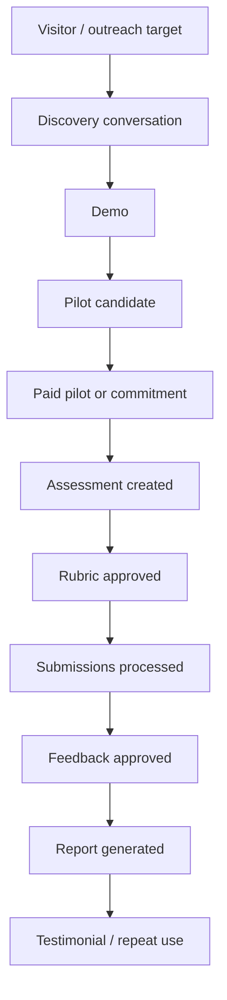

# 02 Product Consolidated

> Generated for NotebookLM from `02-product`. This is a full-content consolidation, not a summary.

## Source Files

- `02-product/README.md`
- `02-product/metrics.md`
- `02-product/mvp-scope.md`
- `02-product/personas.md`
- `02-product/user-stories.md`
- `02-product/workflows.md`

## Consolidated Content


---

## Source: `02-product/README.md`

# 02 Product

This folder defines what the MVP must do for users.

It answers:

> What does the product experience need to include to prove the business and support a credible demo?

## Essence

`02-product` turns the project and business strategy into product behavior:

- MVP scope;
- personas;
- user stories;
- workflows;
- product metrics.

The folder is intentionally product-focused. It describes user experience, states, flows, priorities, and acceptance criteria without becoming backend architecture.

## How To Use This Folder

Use these files to drive product planning and implementation:

1. `mvp-scope.md` — what is in scope, out of scope, and required for the demo.
2. `personas.md` — users, buyers, operators, reviewers, and anti-personas.
3. `user-stories.md` — backlog by epic, priority, and acceptance criteria.
4. `workflows.md` — end-to-end workflows, approval states, failure flows, and evidence flow.
5. `metrics.md` — product, business, AI-native operations, trust, and hackathon evidence metrics.

## What Belongs Here

- User needs.
- Product flows.
- Acceptance criteria.
- MVP boundaries.
- Product lifecycle states.
- Product and activation metrics.
- Mermaid diagrams for product workflows.

## What Does Not Belong Here

- Detailed API endpoints.
- Prompt templates.
- Infrastructure choices.
- Sales scripts.
- Financial ledgers.
- Raw technical exploration.

## Diagram Rule

Product diagrams must use Mermaid by default. Use PlantUML only when Mermaid cannot express the diagram clearly. Use ASCII only as a last fallback.


---

## Source: `02-product/metrics.md`

# Metrics

GradeOps AI metrics must prove product value, business viability, AI-native operations, and hackathon evidence.

Metrics are not only analytics. They are part of the product and submission strategy.

## North Star Metric

> Approved feedback outputs generated for real programming submissions.

Why:

- it reflects assessment volume;
- it requires AI operation;
- it requires teacher approval;
- it creates student value;
- it connects directly to workload reduction;
- it can support pricing by graded submissions.

## Metric Groups

| Group | Purpose |
| --- | --- |
| Product usage | Prove teachers use the workflow |
| Workflow completion | Prove the product can run end to end |
| Teacher trust | Prove teachers accept or correct AI outputs |
| Student value | Prove feedback and recovery outputs are generated |
| AI-native operations | Prove agents execute meaningful work |
| Unit economics | Prove cost and pricing discipline |
| Business validation | Prove real demand and revenue |
| Hackathon evidence | Prove submission readiness |

## Product Usage Metrics

| Metric | Definition | Target For Hackathon |
| --- | --- | ---: |
| Teachers registered | Accounts created by educators | 30+ stretch / 10+ minimum |
| Active teachers | Teachers who create or process an assessment | 5+ |
| Assessments created | Assessment records created | 10+ |
| Assessments processed | Assessments with submissions analyzed | 5+ |
| Submissions received | Student submissions stored | 100+ |
| Submissions analyzed | Submissions processed by Grading Agent | 100+ |
| Feedback drafts generated | Feedback outputs created | 300+ stretch / 100+ minimum |
| Reports generated | Teacher reports produced | 5+ |

## Workflow Completion Metrics

| Metric | Definition | Why It Matters |
| --- | --- | --- |
| Assessment creation completion rate | Created assessments that reach rubric generation | Shows intake clarity |
| Rubric approval rate | Rubrics approved by teachers | Shows trust and usability |
| Submission processing completion rate | Submissions that reach analysis result | Shows operational reliability |
| Teacher review completion rate | Suggestions reviewed by teacher | Shows human-in-the-loop works |
| Report generation rate | Assessments that produce final report | Shows full workflow completion |
| Time to first assessment | Time from account creation to first assessment draft | Activation metric |
| Time to first approved feedback | Time from assessment creation to first approved feedback | Value realization metric |

## Teacher Trust Metrics

| Metric | Definition | Interpretation |
| --- | --- | --- |
| AI grading approval rate | Suggestions accepted without score edits | High may indicate trust, but must be checked for blind approval |
| AI grading edit rate | Suggestions edited by teacher | Healthy signal if edits improve quality |
| AI grading rejection rate | Suggestions rejected | High means quality/rubric mismatch |
| Feedback approval rate | Feedback drafts approved | Indicates usefulness |
| Feedback edit rate | Drafts edited before approval | Helps improve prompts/product |
| Uncertainty flag rate | Outputs flagged as uncertain | Shows responsible operation |
| Teacher override count | Number of edits/rejections | Evidence of human authority |

Do not optimize for 100% blind approval. The product should encourage meaningful teacher review.

## AI-Native Operations Metrics

| Metric | Definition | Target |
| --- | --- | ---: |
| Agent runs logged | Every agent execution event | 500+ |
| Agent run success rate | Successful runs / total runs | 90%+ for demo |
| Retry rate | Retried runs / total runs | Track and reduce |
| Failed run rate | Failed runs / total runs | Low and visible |
| Model usage by agent | Which model each agent used | Required for cost/evidence |
| Token usage by agent | Input/output tokens or estimates | Required for unit economics |
| Cost per agent run | Estimated cost per run | Required |
| Cost per assessment | AI/cloud cost per assessment | Required |
| Cost per graded submission | Cost per submission analyzed | Required |
| Premium fallback rate | Premium model runs / total runs | Keep low and explicit |

## Student Value Metrics

| Metric | Definition |
| --- | --- |
| Feedback outputs approved | Teacher-approved feedback items |
| Average feedback turnaround time | Time from submission to approved feedback |
| Learning gaps detected | Unique gap groups identified |
| Recovery activities generated | Activities suggested for gaps |
| Recovery activities approved | Teacher-approved recovery actions |
| Students affected by gap | Count of submissions tied to each gap |

For MVP, student accounts are not required. Student value can be measured from teacher-approved outputs.

## Business Metrics

| Metric | Definition | Target |
| --- | --- | ---: |
| Discovery interviews | Completed educator interviews | 10+ |
| Demo calls | Product demos with target users | 5+ |
| Pilot candidates | Strong candidates with upcoming assessment | 5+ |
| Paid pilots | Paid Pilot Packs | 1-3 minimum / 3+ target |
| Payment commitments | Signed or explicit commitments | 3+ |
| Arms-length revenue | Revenue from unrelated customers | Track separately |
| Related-party revenue | Revenue from known/related contacts | Track separately |
| Revenue by month | Revenue grouped by month | Required |
| Marketing spend | Paid acquisition costs | Report even if zero |
| Customer acquisition cost | Spend / customers | Can be zero for founder-led |
| Testimonials collected | Approved quotes or feedback | 1+ |

## Unit Economics Metrics

| Metric | Definition |
| --- | --- |
| AI runtime cost | Gemini/Vertex model usage cost |
| Cloud runtime cost | Cloud Run/DB/storage/logging estimate |
| Payment fees | Stripe/processor fees |
| Support time | Manual onboarding/review time |
| Cost per customer | Product cost attributed to customer |
| Revenue per customer | Revenue by account |
| Gross margin per offer | Revenue minus attributable cost |
| Free-tier/credits used | Cost covered by credits |
| Cash cost paid | Actual cash spend |
| Allocated tooling cost | Development tooling if reported separately |

## Hackathon Evidence Metrics

| Evidence Metric | Required Artifact |
| --- | --- |
| Users | Customer/pilot list |
| Revenue | Payment evidence or commitments |
| Revenue by month | Revenue ledger |
| Related-party revenue | Related-party flag |
| Costs | Cost ledger/billing evidence |
| Marketing spend | Marketing ledger or US$0 declaration |
| Agent logs | Product dashboard/export |
| API usage | Google/Gemini dashboard screenshots/export |
| Product demo | 3-minute video |
| Customer proof | Testimonials/interview notes |
| Impact | Time saved, feedback speed, gaps detected |

## Activation Funnel



## Product Funnel Metrics

| Stage | Metric |
| --- | --- |
| Assessment started | Assessment draft created |
| Assessment ready | Rubric approved |
| Assessment active | First submission received |
| AI operation | First grading suggestion generated |
| Human control | First teacher approval/edit/rejection |
| Student value | First feedback approved |
| Reporting | Teacher report generated |
| Business evidence | Time saved/cost/revenue linked |

## Quality Thresholds

| Area | Minimum Threshold |
| --- | --- |
| Agent log coverage | 100% of agent runs logged |
| Teacher approval coverage | 100% of student-facing outputs approved or marked pending |
| Cost tracking coverage | 90%+ of agent runs have model/cost estimate |
| Submission processing | 90%+ of valid submissions processed successfully |
| Report generation | 80%+ of processed assessments generate report |
| Evidence completeness | 100% of paid pilots have revenue/customer evidence record |

## Time-Saved Estimation

Time saved should be estimated transparently.

Suggested simple formula:

```text
Estimated time saved =
teacher baseline estimate
- actual teacher review/edit time
- onboarding/setup time if included
```

If baseline is unknown, collect teacher estimate:

- time usually spent creating assessment;
- time usually spent grading;
- time usually spent writing feedback;
- time usually spent preparing report.

Label all values as estimates unless directly measured.

## Event Instrumentation

Minimum events:

| Event | Trigger |
| --- | --- |
| `teacher_signed_in` | Teacher logs in |
| `assessment_created` | Assessment brief saved |
| `agent_run_started` | Agent begins |
| `agent_run_completed` | Agent succeeds |
| `agent_run_failed` | Agent fails |
| `rubric_generated` | Rubric draft created |
| `rubric_approved` | Teacher approves rubric |
| `submission_received` | Submission stored |
| `submission_analyzed` | Grading suggestion created |
| `grading_suggestion_approved` | Teacher approves score |
| `grading_suggestion_edited` | Teacher edits score |
| `grading_suggestion_rejected` | Teacher rejects score |
| `feedback_generated` | Feedback draft created |
| `feedback_approved` | Teacher approves feedback |
| `learning_gap_generated` | Gap summary created |
| `recovery_activity_generated` | Recovery suggestion created |
| `teacher_report_generated` | Report created |
| `evidence_dashboard_viewed` | Operator/teacher views evidence |
| `payment_recorded` | Revenue event added |
| `testimonial_recorded` | Customer quote/evidence added |

## Dashboard Views

### Teacher Dashboard

- assessments;
- pending approvals;
- submissions processed;
- feedback ready;
- report ready;
- common gaps.

### Operator/Hackathon Dashboard

- users;
- customers/pilots;
- assessments processed;
- submissions processed;
- agent runs;
- model usage;
- estimated costs;
- revenue evidence;
- related-party revenue;
- testimonials;
- time saved.

## Metrics Anti-Patterns

Avoid:

- vanity user counts without real assessment runs;
- counting AI drafts as student value before teacher approval;
- hiding failed agent runs;
- mixing related-party and arms-length revenue;
- reporting credits as if costs do not exist;
- claiming time saved without baseline;
- optimizing for AI approval rate without quality review.

## Metrics Conclusion

GradeOps AI should measure what it claims to be:

> a real AI-operated assessment workflow for programming educators with teacher control, evidence, cost awareness, and business validation.


---

## Source: `02-product/mvp-scope.md`

# MVP Scope

GradeOps AI MVP is a focused product workflow for programming educators.

It must prove one thing clearly:

> A teacher can run a practical programming assessment with AI agents, keep final control, generate useful feedback/reporting, and produce auditable evidence of usage, cost, and AI-native operations.

The MVP is not a full LMS, not a generic quiz generator, not a student chatbot, and not an OCR-first grading platform.

## Alignment With Canonical Strategy

| Canonical Decision | Product Scope Implication |
| --- | --- |
| Initial wedge: programming assessments | Build only for practical programming tasks first |
| Core promise: run the next assessment with AI agents | Prioritize end-to-end assessment workflow over feature breadth |
| Teacher authority | Every high-impact output requires teacher review/approval |
| AI-native operations | Agent executions must be visible, logged, and structured |
| Pricing by assessments/submissions | Product must track assessment count and graded-submission count |
| Hackathon evidence | Usage, cost, revenue, customer, and agent evidence must be captured from day one |

## Teacher-Led, Student-Submission-Centered MVP

The MVP user interface is teacher-led, but the product is not limited to assessment generation.

The central workflow includes student answers:

```text
Teacher creates assessment
  -> teacher approves rubric
  -> student submissions are loaded
  -> agents analyze each student submission
  -> agents draft grading suggestions and feedback
  -> teacher approves or edits outputs
  -> report summarizes the assessment run
```

For MVP, students do **not** need accounts or a portal. A student can be represented by a minimal `student_identifier` inside a `StudentSubmission`.

The commercial usage limit in plans refers to **graded student submissions**, not registered students.

## MVP Product Objective

Enable a programming educator to:

1. create an assessment from a learning goal;
2. generate a rubric and expected evidence;
3. receive student submissions or answers;
4. generate grading suggestions against the rubric;
5. draft personalized feedback;
6. detect cohort-level learning gaps;
7. approve or edit AI outputs;
8. generate a teacher report;
9. see the agent logs, model usage, cost estimates, and evidence dashboard.

## Target User For MVP

Primary MVP user:

> A programming instructor, tutor, or bootcamp teacher who runs recurring practical assessments and wants to reduce grading/feedback workload without losing pedagogical control.

Secondary user:

> A small academy or bootcamp operator who needs visibility into cohort outcomes and assessment consistency.

## MVP Experience

The first usable product should feel like an assessment operations console, not a general admin system.

A teacher should be able to complete this loop:

```text
Learning goal
  -> assessment draft
  -> rubric draft
  -> teacher approval
  -> submissions
  -> grading suggestions
  -> feedback drafts
  -> learning gaps
  -> teacher approval
  -> report
  -> evidence dashboard
```

## MVP Scope Matrix

| Area | Must Build | Should Build | Could Build Later | Do Not Build Now |
| --- | --- | --- | --- | --- |
| Authentication | Simple teacher login | Account profile | Organization admin | Complex SSO |
| Assessment creation | Learning-goal intake and constraints | Templates for intro programming | Rich curriculum mapping | Full LMS authoring |
| Rubrics | AI-generated rubric draft | Rubric validation notes | Rubric library | Institutional rubric governance |
| Student submissions | Text/code paste and simple file upload for student answers | CSV/bulk import | GitHub Classroom integration | OCR/photo-first intake |
| Grading assistance | Rubric-based score suggestion | Uncertainty flags | Code execution sandbox | Fully autonomous grading |
| Feedback | Individual feedback draft | Tone/style controls | Feedback templates | Student chatbot |
| Learning gaps | Cohort summary | Gap-to-recovery mapping | Longitudinal analytics | Predictive student profiling |
| Recovery | Suggested remedial activity | Short exercise draft | Personalized recovery plan | Full adaptive learning system |
| Teacher review | Approve/edit/reject states | Bulk approve with warnings | Review delegation | Silent AI delivery |
| Reports | Teacher report | Export PDF/CSV | Cohort comparison | BI suite |
| Evidence | Agent logs, usage, cost estimate | Business dashboard | Public evidence export | Hidden logs |
| Payments | Manual/Stripe evidence outside product acceptable | Basic plan flag | Self-serve billing | Complex metering marketplace |

## In Scope

### 1. Teacher Workspace

The teacher can see:

- assessments;
- current status;
- submission count;
- pending approvals;
- report availability;
- evidence dashboard link.

### 2. Assessment Intake

Teacher inputs:

- learning goal;
- programming topic;
- target level;
- language or pseudocode;
- expected duration;
- number of students;
- constraints;
- optional existing instructions.

Example:

> Evaluate conditionals, loops, and functions in Java for first-semester students. Duration: 90 minutes. Difficulty: basic.

### 3. Assessment Draft Generation

Assessment Agent produces:

- title;
- context;
- instructions;
- learning objectives;
- expected deliverables;
- allowed resources;
- evaluation criteria summary;
- student-facing statement.

### 4. Rubric Generation And Validation

Rubric Agent produces:

- criteria;
- weights;
- performance levels;
- scoring notes;
- common mistakes;
- validation warnings;
- ambiguity flags.

### 5. Teacher Approval For Assessment And Rubric

Teacher can:

- approve;
- edit;
- reject/regenerate;
- add notes;
- lock rubric for grading.

No grading should start until the rubric is approved or explicitly marked as draft/demo.

### 6. Student Submission Intake

Supported MVP input types:

- pasted student code/text;
- uploaded `.txt`, `.java`, `.py`, `.js`, `.ts`, `.html`, `.css`, `.md`;
- manual `student_identifier`;
- optional `student_display_name` if the teacher needs it;
- bulk paste/import if simple.

Each loaded answer becomes a `StudentSubmission`. A graded submission is consumed only when that `StudentSubmission` is analyzed for grading/feedback.

Student accounts are not required for MVP if that slows delivery. Teacher-managed submission intake is acceptable.

### 7. Grading Assistance

Grading Agent produces:

- suggested score;
- score per rubric criterion;
- evidence found in submission;
- missing requirements;
- uncertainty flags;
- teacher review recommendation.

The product must communicate clearly:

> Suggested score is not final until teacher approval.

### 8. Feedback Drafts

Feedback Agent produces:

- concise feedback;
- strengths;
- improvement areas;
- next step;
- rubric criterion references;
- tone suitable for students.

### 9. Learning Gap Summary

Learning Gap Agent produces:

- repeated errors;
- affected students count;
- affected rubric criteria;
- severity;
- suggested class-level reinforcement.

### 10. Recovery Activity

Recovery Agent produces:

- short remedial exercise;
- focus topic;
- instructions;
- expected output;
- optional hints;
- relationship to detected gaps.

### 11. Teacher Report

Teacher Report Agent produces:

- assessment summary;
- distribution of suggested/approved results;
- common errors;
- learning gaps;
- suggested next class action;
- time-saved estimate;
- evidence summary.

### 12. Agent Log And Evidence Capture

Each agent execution must record:

- timestamp;
- teacher/account;
- assessment;
- submission if applicable;
- agent name;
- action type;
- model used;
- input summary;
- output summary;
- status;
- token estimate;
- cost estimate;
- uncertainty flags;
- approval state;
- final action taken.

## Out Of Scope

Do not build in the MVP:

- full LMS;
- student social features;
- chat tutor;
- institution-wide administration;
- complex roles/permissions;
- SSO;
- mobile app;
- OCR-heavy workflow;
- plagiarism detection as a core claim;
- code execution sandbox unless trivial and safe;
- advanced curriculum mapping;
- marketplace of assessments;
- broad multi-subject support;
- fully autonomous grading.

## MVP User Roles

| Role | MVP Permissions |
| --- | --- |
| Teacher | Create assessment, approve rubric, upload submissions, review grading, approve feedback, view report/logs |
| Operator/Admin | View evidence dashboard, cost/revenue summary, customer/pilot status |
| Student | Not required as login for MVP; represented through `StudentSubmission` records loaded by the teacher |

## Required Product States

### Assessment States

| State | Meaning |
| --- | --- |
| `draft` | Created but not yet approved |
| `rubric_pending_review` | Rubric generated and waiting for teacher |
| `ready_for_submissions` | Teacher approved assessment/rubric |
| `submissions_received` | At least one submission is present |
| `grading_in_progress` | Agent grading is running |
| `pending_teacher_review` | Suggestions are ready for review |
| `approved` | Teacher approved student-facing outputs |
| `reported` | Teacher report was generated |
| `archived` | Workflow closed |

### Submission States

| State | Meaning |
| --- | --- |
| `received` | Submission stored |
| `analysis_pending` | Waiting for agent processing |
| `analyzed` | Grading suggestion exists |
| `needs_review` | Teacher must inspect |
| `approved` | Teacher approved result/feedback |
| `edited_by_teacher` | Teacher changed AI output |
| `rejected` | Teacher rejected AI output |
| `excluded` | Submission removed from final report |

### Agent Run States

| State | Meaning |
| --- | --- |
| `queued` | Waiting to run |
| `running` | Agent processing |
| `succeeded` | Output generated |
| `failed` | Agent failed |
| `retried` | Re-run after failure |
| `requires_human_review` | Output has risk/uncertainty |
| `approved` | Output accepted |
| `edited` | Output changed |
| `rejected` | Output rejected |

## Non-Functional MVP Requirements

| Requirement | MVP Expectation |
| --- | --- |
| Traceability | Every agent output must map to an assessment/submission and model used |
| Cost visibility | Every agent run should have an estimated cost |
| Human control | High-impact outputs require teacher approval |
| Reliability | Failure states must not lose submissions or teacher edits |
| Privacy | Store minimal student data and avoid unnecessary sensitive information |
| Demo readiness | Core flow must be demonstrable in under 3 minutes |
| Exportability | Reports/evidence should be exportable or screenshot-ready |
| English readiness | Public/demo content should be available in English for submission |

## MVP Acceptance Criteria

The MVP is acceptable when:

1. a teacher can create one programming assessment from a learning goal;
2. AI generates an assessment and rubric as structured data;
3. the teacher can approve or edit the rubric;
4. at least 30 student submissions can be ingested in a controlled demo/pilot;
5. grading suggestions are generated against the rubric;
6. feedback drafts are produced per submission;
7. learning gaps and recovery suggestions are produced;
8. the teacher can approve/edit/reject outputs;
9. a report is generated;
10. agent logs and cost estimates are visible;
11. the workflow can be shown in a 3-minute demo;
12. the same flow can support at least one real or semi-real pilot.

## MVP Cut Line

When time is short, protect these features first:

1. assessment creation;
2. rubric generation;
3. submission intake;
4. grading suggestions;
5. teacher approval;
6. feedback drafts;
7. report;
8. agent logs/evidence.

Everything else is secondary.

## Product Conclusion

The MVP should be narrow enough to build quickly and strong enough to prove the business.

The winning product story is not:

> We built many education features.

It is:

> We ran real programming assessments with AI agents, teachers stayed in control, students got feedback faster, and the business captured usage, cost, revenue, and operational evidence.


---

## Source: `02-product/personas.md`

# Personas

GradeOps AI personas describe product users, buyers, evaluators, and anti-personas for the MVP.

The product is focused on programming assessment operations, so every persona must connect to a real assessment workflow.

## Persona Summary

| Persona | Role In Product | Role In Business | Priority |
| --- | --- | --- | --- |
| Lead Programming Instructor | Main daily user | Buyer or strong influencer | P0 |
| Independent Tutor | Daily user and buyer | Direct buyer | P0 |
| Bootcamp Instructor | Daily user | Influencer or buyer | P0 |
| Academy Operator | Dashboard/report consumer | Buyer | P1 |
| Program Manager | Evidence/report consumer | Buyer or approver | P1 |
| Student | Feedback recipient | Impact beneficiary | P2 for MVP |
| Reviewer/Assistant | Supports teacher review | Internal/secondary user | P2 |
| Institution Admin | Procurement/security | Later buyer | Out of MVP |

## P0 Persona: Lead Programming Instructor

### Profile

A teacher who runs recurring programming assessments for a class, cohort, or section.

They may teach:

- introductory programming;
- algorithms;
- Java;
- Python;
- JavaScript;
- web development;
- mobile development;
- backend basics;
- software engineering foundations.

### Goals

- Create assessments faster.
- Grade practical submissions consistently.
- Give students useful feedback.
- Detect repeated mistakes before the next class.
- Keep pedagogical control.
- Avoid being buried in repetitive correction work.

### Pain Points

- Rewrites similar assessments every term.
- Grading takes too long.
- Feedback quality decreases when workload is high.
- Rubrics are hard to apply consistently.
- Reports require manual consolidation.
- Students repeat mistakes because gaps are detected late.

### Trust Requirements

- Must approve rubrics before grading.
- Must approve final scores/feedback.
- Needs to see why AI suggested a score.
- Needs uncertainty flags.
- Needs edit/reject options.
- Needs audit trail for sensitive decisions.

### Success Moment

> I reviewed a full batch of programming submissions faster than usual, edited the AI where needed, and got a useful summary for my next class.

### Product Messaging

> Run your next programming assessment with AI agents while keeping final control.

## P0 Persona: Independent Tutor

### Profile

A tutor who teaches programming to individuals or small groups and wants to look professional while scaling their feedback.

### Goals

- Give high-quality individual feedback.
- Save preparation and correction time.
- Show students clear progress.
- Package tutoring as a more professional service.
- Reuse assessment workflows across students.

### Pain Points

- Custom feedback takes time.
- Student progress tracking is informal.
- Rubrics are often implicit.
- Hard to justify premium tutoring prices without evidence.
- Admin work steals time from teaching.

### Trust Requirements

- Wants editable feedback tone.
- Wants simple workflow and low setup.
- Does not want institutional complexity.
- Needs affordable pricing.
- Needs to avoid exposing private student data.

### Success Moment

> I gave each student clear feedback and a recovery exercise without spending my whole evening writing it manually.

### Product Messaging

> Give better feedback to every programming student without turning tutoring into admin work.

## P0 Persona: Bootcamp Instructor

### Profile

An instructor responsible for a cohort of students moving quickly through modules and practical assignments.

### Goals

- Process many submissions quickly.
- Identify students at risk.
- Keep feedback turnaround fast.
- Maintain grading consistency.
- Prepare cohort-level insights for the next session.

### Pain Points

- High volume of assignments.
- Fast teaching cycle leaves little correction time.
- Feedback delays reduce student momentum.
- Hard to identify common misconceptions early.
- Multiple reviewers may apply criteria inconsistently.

### Trust Requirements

- Needs rubric-based grading.
- Needs batch processing.
- Needs learning-gap summary.
- Needs evidence for instructor/manager discussion.
- Needs clear teacher approval workflow.

### Success Moment

> I saw the cohort’s common mistakes before the next module and had feedback drafts ready for review.

### Product Messaging

> Keep feedback cycles fast in high-volume programming cohorts.

## P1 Persona: Academy Operator

### Profile

A founder, coordinator, or operations lead running a small academy, training program, or bootcamp.

### Goals

- Improve throughput without hiring more academic operations staff.
- Standardize assessment quality.
- Produce reports for students, clients, or internal decisions.
- Increase perceived quality of the academy.
- Reduce bottlenecks around instructor workload.

### Pain Points

- Instructor capacity limits growth.
- Grading quality varies by instructor.
- Reporting is manual.
- Student risk appears too late.
- Scaling feedback requires more staff.

### Trust Requirements

- Needs evidence dashboards.
- Needs cost visibility.
- Needs privacy and data boundaries.
- Needs confidence that teachers retain final authority.
- Needs repeatable workflow, not one-off AI prompts.

### Success Moment

> My instructors can process assessments more consistently and I can see cohort outcomes without adding another coordinator.

### Product Messaging

> Give your small academy the assessment operations capacity of a larger academic team.

## P1 Persona: Program Manager

### Profile

A manager responsible for learning quality, cohort outcomes, or technical training delivery.

### Goals

- See learning gaps across cohorts.
- Ensure assessment consistency.
- Support instructors with operational tools.
- Demonstrate learner progress.
- Make decisions from evidence.

### Pain Points

- Outcomes are hard to compare.
- Assessment evidence is scattered.
- Feedback quality varies.
- Reporting arrives late.
- Instructor workload affects delivery quality.

### Trust Requirements

- Needs reports and exports.
- Needs consistent rubric structure.
- Needs evidence of teacher review.
- Needs data that can be summarized safely.
- Needs visibility into usage and outcomes.

### Success Moment

> I can see which skills are weak across the cohort and what instructors are doing next.

### Product Messaging

> Turn assessment activity into evidence for better program decisions.

## P2 Persona: Student

### Profile

A learner receiving feedback from a programming assessment.

Students are not the primary MVP user, but their experience matters.

### Goals

- Receive feedback quickly.
- Understand what they did wrong.
- Know what to practice next.
- Trust that evaluation is fair.
- See clear criteria.

### Pain Points

- Feedback arrives too late.
- Feedback is too generic.
- Mistakes are not connected to criteria.
- Students do not know what to fix next.

### Trust Requirements

- Should know teacher has final authority.
- Should receive understandable feedback.
- Should not receive raw AI uncertainty or internal logs.
- Should not have personal data exposed unnecessarily.

### Success Moment

> I know what I missed, why it matters, and what to practice next.

### Product Messaging

Student-facing messaging is not primary for MVP. If needed:

> Faster, clearer feedback reviewed by your teacher.

## P2 Persona: Reviewer Or Assistant

### Profile

A teaching assistant, reviewer, or collaborator who helps review submissions.

### Goals

- Apply rubric consistently.
- Reduce repetitive review effort.
- Escalate uncertain submissions.
- Coordinate with lead instructor.

### Pain Points

- Manual review is repetitive.
- Rubric interpretation varies.
- Lead instructor still needs final confidence.
- Multiple reviewers create inconsistency.

### Trust Requirements

- Needs role boundaries.
- Needs comments/notes.
- Needs escalation to teacher.
- Needs audit trail.

### MVP Note

This persona is not required for MVP unless a pilot explicitly involves multiple reviewers. Do not build complex role management yet.

## Anti-Personas

### Enterprise Institution Buyer

Large institutions have procurement, compliance, SSO, legal, and integration needs. They may be valuable later, but they are too slow for the hackathon MVP.

### Teacher Looking For A Full LMS

GradeOps AI is not designed to manage all course content, attendance, forums, calendars, and institutional records.

### Student Seeking AI Tutoring

The MVP is not a student chatbot or tutor. Student support appears through teacher-approved feedback and recovery activities.

### Fully Autonomous Grading Buyer

A buyer who wants AI to grade and deliver final results without human oversight is not aligned with the trust model.

### Broad Non-Programming Educator

Other subjects may be future expansion, but they dilute MVP clarity.

## Persona Priority For Build Decisions

When a product decision is unclear, optimize in this order:

1. Lead Programming Instructor;
2. Independent Tutor / Bootcamp Instructor;
3. Academy Operator;
4. Program Manager;
5. Student recipient experience;
6. Reviewer/assistant;
7. future institution admin.

## Persona-Based Acceptance Tests

| Persona | Product Must Enable |
| --- | --- |
| Lead Instructor | Create assessment, approve rubric, review grading suggestions, approve feedback, see report |
| Independent Tutor | Run small assessment quickly and produce polished feedback |
| Bootcamp Instructor | Process batch submissions and detect cohort gaps |
| Academy Operator | See evidence of usage, time saved, and outcome reporting |
| Program Manager | Understand learning gaps and assessment consistency |
| Student | Receive clear teacher-approved feedback |
| Reviewer | Support review without replacing teacher authority |

## Persona Conclusion

GradeOps AI should not try to satisfy every education stakeholder in the MVP.

The first product must delight the educator who feels the pain directly:

> The person who has to turn 30 programming submissions into fair scores, useful feedback, and a clear next teaching action.


---

## Source: `02-product/user-stories.md`

# User Stories

This document defines product user stories for the GradeOps AI MVP.

The stories are organized by epic and priority.

Priority definitions:

| Priority | Meaning |
| --- | --- |
| P0 | Required for MVP and hackathon demo |
| P1 | Important for pilot quality |
| P2 | Useful later, not required for first MVP |
| Out | Explicitly outside MVP |

## Epic 1: Teacher Onboarding And Workspace

### US-001: Teacher Login

**Priority:** P0

As a programming educator, I want to access my teacher workspace so I can manage my assessments securely.

Acceptance criteria:

- Teacher can sign in.
- Teacher can see their assessments.
- Teacher can create a new assessment.
- Teacher cannot see another teacher's private assessment data.

### US-002: Assessment Dashboard

**Priority:** P0

As a teacher, I want a dashboard of assessments and statuses so I can know what needs action.

Acceptance criteria:

- Dashboard lists assessments.
- Each assessment shows status.
- Each assessment shows submission count.
- Each assessment shows pending approvals.
- Each assessment links to report/logs if available.

### US-003: Pilot Account Flag

**Priority:** P1

As an operator, I want to mark an account as a pilot customer so business evidence can be tracked.

Acceptance criteria:

- Account can be flagged as pilot/free/paid.
- Related-party flag can be stored.
- Offer/plan can be associated.
- Evidence can be linked.

## Epic 2: Assessment Creation

### US-010: Assessment Brief Intake

**Priority:** P0

As a programming instructor, I want to describe the learning goal, topic, level, and constraints so AI can generate an assessment draft.

Acceptance criteria:

- Teacher can enter learning goal.
- Teacher can select or type programming topic.
- Teacher can set level/difficulty.
- Teacher can set expected duration.
- Teacher can specify programming language or pseudocode.
- Input is saved before agent execution.

### US-011: Assessment Draft Generation

**Priority:** P0

As a teacher, I want an assessment draft generated from my brief so I can start faster.

Acceptance criteria:

- Assessment Agent generates structured output.
- Output includes title, context, instructions, objectives, expected deliverables, and constraints.
- Output is editable.
- Agent execution is logged.
- Model and cost estimate are stored.

### US-012: Assessment Draft Regeneration

**Priority:** P1

As a teacher, I want to regenerate the draft with additional instructions so I can improve quality without starting over.

Acceptance criteria:

- Teacher can request regeneration.
- Teacher can provide adjustment notes.
- Previous version remains traceable.
- New agent run is logged.

## Epic 3: Rubric Generation And Approval

### US-020: Rubric Draft Generation

**Priority:** P0

As a teacher, I want a rubric draft from the assessment so I can evaluate submissions consistently.

Acceptance criteria:

- Rubric Agent generates criteria.
- Each criterion has weight.
- Each criterion has performance levels.
- Total weight is visible.
- Rubric is structured and editable.
- Agent execution is logged.

### US-021: Rubric Validation

**Priority:** P0

As a teacher, I want the rubric checked for ambiguity, missing criteria, and inconsistent weights so I can trust it before grading.

Acceptance criteria:

- Rubric Agent or validator identifies issues.
- Validation notes are visible.
- Teacher can edit before approval.
- Ambiguity/warning flags are stored.

### US-022: Rubric Approval

**Priority:** P0

As a teacher, I want to approve the rubric before grading starts so AI suggestions are based on my final criteria.

Acceptance criteria:

- Teacher can approve rubric.
- Approved rubric is locked for grading.
- Changes after approval create a new version or explicit update event.
- Approval state is logged.

### US-023: Rubric Version History

**Priority:** P1

As a teacher, I want rubric version history so I can understand what changed before grading.

Acceptance criteria:

- Each major rubric change has a version.
- Versions show timestamp and author/agent.
- Approved version is clearly marked.

## Epic 4: Student Submission Intake

### US-030: Manual Student Submission Creation

**Priority:** P0

As a teacher, I want to add a student answer/submission manually so I can process real assessment responses.

Acceptance criteria:

- Teacher can create submission record.
- StudentSubmission has a `student_identifier`.
- Teacher can paste code/text.
- StudentSubmission is associated with an assessment.

### US-031: File Upload Student Submission

**Priority:** P0

As a teacher, I want to upload simple code/text files as student submissions so I can process student work without retyping.

Acceptance criteria:

- Teacher can upload supported file types.
- File content is stored or extracted.
- File is linked to submission.
- Unsupported files show a clear error.

### US-032: Bulk Submission Intake

**Priority:** P1

As a teacher, I want to import several submissions at once so I can process a cohort faster.

Acceptance criteria:

- Teacher can upload or paste a batch.
- System creates multiple submission records.
- Import errors are shown.
- Submissions can be reviewed before processing.

### US-033: Submission Status

**Priority:** P0

As a teacher, I want to see submission processing status so I know what is pending.

Acceptance criteria:

- Submission state is visible.
- States include received, pending, analyzed, needs review, approved, rejected/excluded.
- Errors are visible and recoverable.

### US-034: Graded Submission Usage Count

**Priority:** P0

As an operator, I want every analyzed student submission to count against plan usage so pricing and cost controls reflect real AI workload.

Acceptance criteria:

- A `StudentSubmission` is created when the teacher loads a student answer.
- Usage is consumed when grading/feedback analysis is executed, not when a student account is created.
- One analyzed attempt counts as one graded submission.
- Re-analysis can be tracked separately if it creates additional AI cost.
- Usage totals are visible by assessment and organization.

## Epic 5: Grading Assistance

### US-040: Rubric-Based Grading Suggestion

**Priority:** P0

As a teacher, I want grading suggestions tied to rubric criteria so I can review rather than score from scratch.

Acceptance criteria:

- Grading Agent analyzes submission against approved rubric.
- Suggested score is produced per criterion.
- Evidence snippets or summaries are linked to each criterion.
- Overall suggested score is visible.
- Output is marked as suggestion, not final.
- Agent run is logged.

### US-041: Uncertainty Flags

**Priority:** P0

As a teacher, I want uncertainty flags so I know where to review carefully.

Acceptance criteria:

- Agent can flag uncertain, incomplete, ambiguous, or risky outputs.
- Flag is visible in teacher review.
- Flag appears in agent log.
- High-uncertainty outputs cannot be bulk-approved silently.

### US-042: Teacher Edit Of Score

**Priority:** P0

As a teacher, I want to edit AI-suggested scores so final grading reflects my judgment.

Acceptance criteria:

- Teacher can modify score per criterion.
- Teacher can add note explaining edit.
- Original suggestion remains traceable.
- Final approved score is clearly separated from AI suggestion.

### US-043: Reject AI Suggestion

**Priority:** P0

As a teacher, I want to reject an AI grading suggestion so poor outputs do not affect students.

Acceptance criteria:

- Teacher can reject suggestion.
- Rejection reason can be recorded.
- Submission status changes accordingly.
- Rejection is logged as evidence.

## Epic 6: Feedback Generation And Approval

### US-050: Individual Feedback Draft

**Priority:** P0

As a teacher, I want feedback drafts for each learner so I can personalize them quickly.

Acceptance criteria:

- Feedback Agent generates feedback based on rubric and grading suggestion.
- Feedback includes strengths, improvement areas, and next step.
- Feedback is student-readable.
- Feedback is editable.
- Agent execution is logged.

### US-051: Feedback Approval

**Priority:** P0

As a teacher, I want to approve feedback before delivery so students only receive reviewed outputs.

Acceptance criteria:

- Feedback has pending/approved/edited/rejected states.
- Teacher can approve edited feedback.
- Approved feedback is marked final.
- Approval event is logged.

### US-052: Tone Adjustment

**Priority:** P1

As a teacher, I want to adjust feedback tone so it matches my teaching style.

Acceptance criteria:

- Teacher can select concise/supportive/direct tone.
- Tone instruction affects generated draft.
- Final feedback remains editable.

## Epic 7: Learning Gaps And Recovery

### US-060: Learning Gap Summary

**Priority:** P0

As a teacher, I want a cohort learning-gap summary so I can decide what to reinforce next.

Acceptance criteria:

- Learning Gap Agent summarizes common mistakes.
- Summary links gaps to rubric criteria.
- Summary shows affected submission count.
- Severity or priority is indicated.
- Agent execution is logged.

### US-061: Recovery Activity Suggestion

**Priority:** P0

As a teacher, I want recovery activity suggestions so students can close specific gaps.

Acceptance criteria:

- Recovery Agent suggests at least one activity.
- Activity is linked to detected gaps.
- Activity includes instructions and expected output.
- Teacher can edit or reject activity.

### US-062: Student-Specific Recovery Notes

**Priority:** P1

As a teacher, I want optional student-specific next steps so feedback can be more actionable.

Acceptance criteria:

- Next step can be generated per student.
- Teacher can approve/edit.
- Output is not delivered automatically.

## Epic 8: Teacher Report

### US-070: Assessment Report

**Priority:** P0

As a teacher, I want a report for each assessment so I can understand outcomes and communicate next steps.

Acceptance criteria:

- Report includes assessment summary.
- Report includes submission count.
- Report includes score distribution or simple stats.
- Report includes learning gaps.
- Report includes recommended next teaching action.
- Report includes time-saved estimate.
- Report is generated by Teacher Report Agent and logged.

### US-071: Export Report

**Priority:** P1

As a teacher, I want to export the report so I can share or archive it.

Acceptance criteria:

- Report can be copied or downloaded.
- Export does not expose internal agent prompts unnecessarily.
- Export includes teacher-approved outputs.

## Epic 9: Evidence And Metrics

### US-080: Agent Execution Log

**Priority:** P0

As an operator, I want every agent execution logged so we can prove AI-native operations and debug the workflow.

Acceptance criteria:

- Every agent run has timestamp, agent, model, input summary, output summary, status, cost estimate, and approval state.
- Logs are associated with assessment/customer.
- Logs are visible in internal dashboard.
- Failed/retried runs are captured.

### US-081: Cost Estimate Per Run

**Priority:** P0

As an operator, I want token and cost estimates per agent run so unit economics can be tracked.

Acceptance criteria:

- Agent log stores model used.
- Input/output token estimate is stored if available.
- Cost estimate is calculated or stored.
- Cost can be aggregated by assessment/customer.

### US-082: Business Evidence Dashboard

**Priority:** P0

As an operator, I want a dashboard of usage, cost, revenue evidence, and agent activity so the hackathon submission is credible.

Acceptance criteria:

- Dashboard shows assessments processed.
- Dashboard shows submissions processed.
- Dashboard shows feedback outputs.
- Dashboard shows agent runs.
- Dashboard shows estimated AI cost.
- Dashboard shows pilot/customer status or links to business ledger.

### US-083: Time Saved Estimate

**Priority:** P1

As a teacher/operator, I want a time-saved estimate so value can be communicated.

Acceptance criteria:

- Teacher can enter baseline time or use default estimate.
- Product estimates time saved per assessment.
- Estimate appears in report/evidence dashboard.
- Estimate is clearly labeled as estimated.

## Epic 10: Billing And Plan Limits

### US-090: Usage Limits

**Priority:** P0

As an operator, I want to track assessment and submission usage so plans remain bounded.

Acceptance criteria:

- Account tracks number of assessments.
- Account tracks graded submissions.
- Usage can be compared to plan limit.
- Overuse can be reported even if not billed automatically.

### US-091: Payment Evidence Link

**Priority:** P1

As an operator, I want to link payment or commitment evidence to a customer so business validation is auditable.

Acceptance criteria:

- Customer/pilot record can store evidence link.
- Revenue event can be marked paid/commitment/manual.
- Related-party flag can be set.

## Explicitly Out Of MVP

### US-OUT-001: Student Chatbot

**Priority:** Out

Student-facing chatbot is not part of MVP.

### US-OUT-002: Fully Autonomous Grading

**Priority:** Out

AI must not finalize grading without teacher approval.

### US-OUT-003: Full LMS

**Priority:** Out

Course content, forums, attendance, calendars, and institutional administration are not part of MVP.

### US-OUT-004: OCR-First Grading

**Priority:** Out

Photo/OCR workflows are deferred.

### US-OUT-005: Enterprise SSO

**Priority:** Out

SSO and institutional integration are deferred.

## MVP Story Cut

The minimum viable story set is:

- US-001
- US-002
- US-010
- US-011
- US-020
- US-021
- US-022
- US-030 / US-031 / US-034
- US-033
- US-040
- US-041
- US-042
- US-050
- US-051
- US-060
- US-061
- US-070
- US-080
- US-081
- US-082
- US-090

If those stories work end to end, GradeOps AI can demo the core business.


---

## Source: `02-product/workflows.md`

# Workflows

This document defines the main product workflows for GradeOps AI MVP.

The workflow principle is:

> AI agents operate repetitive assessment steps; teachers retain judgment, standards, and final approval.

## Student Submission Principle

The product is teacher-led, but not teacher-only.

Student answers are represented as `StudentSubmission` records loaded by the teacher. The MVP does not require student login, but it must process real student responses because graded submissions are the economic and technical usage unit.

```text
1 student answer analyzed = 1 graded submission
```

## Workflow Map

| Workflow | Primary User | MVP Priority |
| --- | --- | --- |
| Teacher onboarding | Teacher | P0 |
| Assessment creation | Teacher + Assessment Agent | P0 |
| Rubric generation and approval | Teacher + Rubric Agent | P0 |
| Submission intake | Teacher | P0 |
| Grading assistance | Teacher + Grading Agent | P0 |
| Feedback approval | Teacher + Feedback Agent | P0 |
| Learning gap and recovery | Teacher + Learning Gap/Recovery Agents | P0 |
| Teacher report | Teacher + Teacher Report Agent | P0 |
| Evidence dashboard | Operator / demo | P0 |
| Pilot/business evidence | Operator | P1 |

## Core End-To-End Workflow

```text
Teacher logs in
  -> creates assessment brief
  -> Assessment Agent drafts assessment
  -> Rubric Agent drafts and validates rubric
  -> teacher edits/approves assessment and rubric
  -> teacher uploads or pastes submissions
  -> Grading Agent generates rubric-based suggestions
  -> Feedback Agent drafts student feedback
  -> Learning Gap Agent summarizes cohort gaps
  -> Recovery Agent suggests reinforcement activity
  -> teacher reviews/edits/approves outputs
  -> Teacher Report Agent generates report
  -> Ops Evidence Agent records logs, cost, usage, and evidence
```

## Workflow 1: Teacher Onboarding

### Goal

Teacher reaches the workspace and can start a first assessment.

### Steps

1. Teacher signs in.
2. Teacher sees workspace.
3. Teacher sees CTA: `Create assessment`.
4. Product explains control principle:
   - AI drafts;
   - teacher approves;
   - agent actions are logged.
5. Teacher starts first assessment.

### Required Data

- teacher account;
- email;
- organization or individual label;
- pilot/customer status;
- plan/usage limits if available.

### Success Criteria

- Teacher can reach `Create assessment` without confusion.
- Teacher understands AI will not finalize grading alone.

## Workflow 2: Assessment Creation

### Goal

Generate a practical programming assessment from a teacher-defined learning goal.

### Steps

1. Teacher enters:
   - learning goal;
   - topic;
   - level;
   - language/pseudocode;
   - duration;
   - student count;
   - constraints;
   - optional context.
2. Teacher clicks `Generate assessment`.
3. Assessment Agent runs.
4. Product stores agent run log.
5. Teacher reviews draft.
6. Teacher edits or regenerates.
7. Teacher accepts draft for rubric generation.

### Agent Output

Assessment Agent should return structured data:

```json
{
  "title": "Basic Java Control Flow Assessment",
  "context": "Students must solve...",
  "learning_objectives": [],
  "instructions": [],
  "deliverables": [],
  "constraints": [],
  "estimated_duration_minutes": 90,
  "difficulty": "basic"
}
```

### Failure Handling

| Failure | Handling |
| --- | --- |
| Agent timeout | Show retry option and log failure |
| Output invalid | Show validation error and allow regeneration |
| Teacher dislikes draft | Allow edit or regenerate with notes |
| Missing input | Require minimum fields before running agent |

## Workflow 3: Rubric Generation And Approval

### Goal

Create a structured rubric that can drive grading suggestions.

### Steps

1. Teacher requests rubric.
2. Rubric Agent generates criteria and weights.
3. Rubric Agent validates consistency.
4. Product displays:
   - criteria;
   - weights;
   - levels;
   - validation notes;
   - ambiguity warnings.
5. Teacher edits rubric.
6. Teacher approves rubric.
7. Approved rubric becomes grading baseline.

### Approval Rule

Grading cannot proceed unless:

- rubric is approved; or
- workflow is explicitly marked as demo/draft with visible warning.

### Rubric Output Structure

```json
{
  "criteria": [
    {
      "id": "C1",
      "name": "Correct use of conditionals",
      "weight": 25,
      "levels": [
        {
          "label": "Excellent",
          "score": 25,
          "description": "Uses conditionals correctly..."
        }
      ],
      "common_mistakes": []
    }
  ],
  "validation_notes": [],
  "total_weight": 100
}
```

## Workflow 4: Student Submission Intake

### Goal

Collect student answers/submissions in a simple MVP-compatible way without requiring student accounts.

### Supported Intake

- paste code/text;
- upload simple files;
- simple bulk import/paste if available.

### Steps

1. Teacher opens assessment.
2. Teacher adds student submissions.
3. For each student submission:
   - `student_identifier` is added;
   - optional display name can be added;
   - code/text/file is stored;
   - status becomes `received`.
4. Teacher reviews submission list.
5. Teacher starts analysis.

### Submission Data

- student submission ID;
- assessment ID;
- student identifier;
- submitted content or file reference;
- created timestamp;
- processing status;
- error state if any.

### Failure Handling

| Failure | Handling |
| --- | --- |
| Unsupported file | Reject with clear message |
| Empty submission | Mark invalid |
| Duplicate student identifier | Warn teacher |
| Large submission | Warn and estimate higher cost or require confirmation |

## Workflow 5: Grading Assistance

### Goal

Generate rubric-based scoring suggestions while preserving teacher authority.

### Steps

1. Teacher clicks `Analyze submissions` for selected `StudentSubmission` records.
2. Grading Agent processes each student submission.
3. Agent returns score suggestion per rubric criterion.
4. Agent flags uncertainty.
5. Product displays review queue.
6. Teacher reviews each suggestion.
7. Teacher approves, edits, rejects, or marks needs review.

### Grading Output

```json
{
  "submission_id": "SUB-001",
  "suggested_total_score": 82,
  "criteria_results": [
    {
      "criterion_id": "C1",
      "suggested_score": 20,
      "evidence_summary": "Uses if/else correctly...",
      "issues": [],
      "uncertainty": "low"
    }
  ],
  "overall_feedback_basis": [],
  "uncertainty_flags": []
}
```

### Teacher Review Actions

| Action | Meaning |
| --- | --- |
| Approve | Teacher accepts suggestion |
| Edit | Teacher changes score or notes |
| Reject | Teacher rejects AI output |
| Needs review | Teacher defers decision |
| Exclude | Submission excluded from report |

### Control Principle

AI output must be labeled as suggestion until teacher approval.

## Workflow 6: Feedback Draft And Approval

### Goal

Generate useful student-facing feedback based on rubric and teacher-reviewed grading.

### Steps

1. Feedback Agent uses grading suggestion or teacher-approved score.
2. Agent drafts feedback.
3. Teacher reviews feedback.
4. Teacher edits tone/content if needed.
5. Teacher approves final feedback.
6. Feedback becomes available for export/delivery.

### Feedback Output

```json
{
  "student_identifier": "student-01",
  "summary": "Good progress...",
  "strengths": [],
  "improvement_areas": [],
  "next_steps": [],
  "rubric_references": []
}
```

### Delivery

MVP delivery can be:

- copy/export;
- downloaded report;
- manual sending by teacher.

Automatic student delivery is not required for MVP.

## Workflow 7: Learning Gap And Recovery

### Goal

Summarize repeated cohort issues and suggest recovery actions.

### Steps

1. Learning Gap Agent reads rubric results and feedback basis.
2. Agent groups common mistakes.
3. Agent identifies affected criteria and severity.
4. Recovery Agent suggests reinforcement activity.
5. Teacher reviews suggestions.
6. Approved recovery action appears in report.

### Learning Gap Output

```json
{
  "gaps": [
    {
      "topic": "Loop termination condition",
      "criterion_ids": ["C2"],
      "affected_submissions": 12,
      "severity": "high",
      "evidence_summary": "Students often used..."
    }
  ]
}
```

### Recovery Output

```json
{
  "activity_title": "Fixing loop termination errors",
  "target_gap": "Loop termination condition",
  "instructions": [],
  "expected_output": "",
  "teacher_notes": ""
}
```

## Workflow 8: Teacher Report

### Goal

Generate a teacher-facing summary of the assessment run.

### Steps

1. Teacher requests report.
2. Teacher Report Agent gathers:
   - assessment;
   - rubric;
   - submission results;
   - feedback status;
   - learning gaps;
   - recovery suggestions;
   - usage/cost evidence.
3. Report is generated.
4. Teacher can edit summary.
5. Report can be exported or screenshotted.

### Report Sections

- assessment overview;
- submission count;
- grading summary;
- common mistakes;
- learning gaps;
- recommended next teaching action;
- recovery activity;
- time-saved estimate;
- agent/evidence summary.

## Workflow 9: Agent Logs And Evidence Dashboard

### Goal

Prove AI-native operations, cost awareness, and business evidence.

### Steps

1. Every agent run creates an event.
2. Events are stored.
3. Dashboard aggregates:
   - assessments;
   - submissions;
   - agent runs;
   - feedback outputs;
   - model usage;
   - cost estimates;
   - approval states;
   - failures/retries.
4. Operator uses dashboard for demo and submission evidence.

### Dashboard Minimum

| Metric | Purpose |
| --- | --- |
| Assessments processed | Product usage |
| Submissions reviewed | Operational volume |
| Feedback outputs | Value output |
| Agent runs | AI-native proof |
| Teacher approval rate | Trust and quality |
| Estimated AI cost | Unit economics |
| Time saved estimate | Business value |
| Failed/retried runs | Reliability evidence |

## Workflow 10: Pilot Business Evidence

### Goal

Connect product usage to business validation.

### Steps

1. Operator creates customer/pilot record.
2. Customer is associated with assessment runs.
3. Payment/commitment evidence is stored externally or linked.
4. Product logs usage.
5. Operator records testimonial/feedback.
6. Evidence is summarized for hackathon.

### Evidence Fields

- customer ID;
- segment;
- related-party flag;
- offer/plan;
- payment/commitment status;
- assessments processed;
- submissions processed;
- agent runs;
- estimated cost;
- time saved;
- testimonial status.

## Workflow States

### Assessment Lifecycle

```text
draft
  -> rubric_pending_review
  -> ready_for_submissions
  -> submissions_received
  -> grading_in_progress
  -> pending_teacher_review
  -> approved
  -> reported
  -> archived
```

### Submission Lifecycle

```text
received
  -> analysis_pending
  -> analyzed
  -> needs_review
  -> approved | edited_by_teacher | rejected | excluded
```

### Agent Run Lifecycle

```text
queued
  -> running
  -> succeeded | failed | retried
  -> requires_human_review
  -> approved | edited | rejected
```

## Critical Failure Workflows

### Agent Failure

1. Agent fails.
2. Status becomes `failed`.
3. Failure is logged.
4. Teacher sees retry option.
5. Product prevents silent loss of work.

### Low Confidence Output

1. Agent marks uncertainty.
2. Submission becomes `requires_human_review`.
3. Bulk approval is blocked or warned.
4. Teacher must inspect manually.

### Teacher Rejects Output

1. Teacher rejects score/feedback.
2. Rejection reason can be captured.
3. Final report notes teacher override count.
4. Agent output remains in audit trail.

### Cost Spike Warning

1. Submission is unusually long or model fallback is required.
2. Product warns operator/teacher if needed.
3. Cost is logged.
4. Premium fallback is not default.

## Workflow Conclusion

The product workflow should feel controlled, transparent, and operational.

The best demo is not a tour of screens. It is a proof that:

> A real assessment moved from learning goal to rubric, submissions, grading suggestions, feedback, report, teacher approval, and auditable AI-agent evidence.

