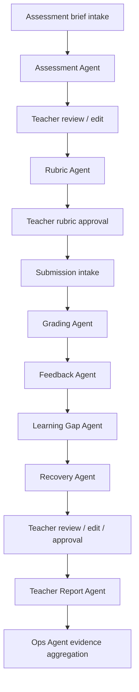

# 03 AI Agents Consolidated

> Generated for NotebookLM from `03-ai-agents`. This is a full-content consolidation, not a summary.

## Source Files

- `03-ai-agents/README.md`
- `03-ai-agents/agents-overview.md`
- `03-ai-agents/assessment-agent.md`
- `03-ai-agents/feedback-agent.md`
- `03-ai-agents/grading-agent.md`
- `03-ai-agents/learning-gap-agent.md`
- `03-ai-agents/ops-agent.md`
- `03-ai-agents/recovery-agent.md`
- `03-ai-agents/rubric-agent.md`
- `03-ai-agents/teacher-report-agent.md`

## Consolidated Content


---

## Source: `03-ai-agents/README.md`

# 03 AI Agents

This folder defines the operational contracts for GradeOps AI agents.

It answers:

> What does each agent do, what does it receive, what does it return, what must it never do, and how is it audited?

## Essence

`03-ai-agents` prevents the system from becoming a collection of loose prompts.

Each agent should be treated as an operational component with:

- a clear responsibility;
- structured input;
- structured output;
- uncertainty flags;
- handoff rules;
- human review checkpoints;
- logging requirements;
- acceptance criteria.

## How To Use This Folder

Start with:

1. `agents-overview.md` — overall agent architecture, common envelope, logs, model routing, and control principles.

Then use the individual contracts:

- `assessment-agent.md`;
- `rubric-agent.md`;
- `grading-agent.md`;
- `feedback-agent.md`;
- `learning-gap-agent.md`;
- `recovery-agent.md`;
- `teacher-report-agent.md`;
- `ops-agent.md`.

## What Belongs Here

- Agent responsibilities.
- Input/output contracts.
- JSON-compatible output structures.
- Agent-specific limits.
- Quality checks.
- Handoff rules.
- Logging and uncertainty rules.
- Human approval boundaries.

## What Does Not Belong Here

- Full backend architecture.
- Frontend UX copy.
- Pricing.
- Customer discovery.
- Legal policy beyond agent-relevant constraints.

## Control Principle

Agents operate the repetitive workflow. Teachers retain judgment, standards, and final approval.

No agent should silently create final grades, final feedback, or student-facing outputs without teacher review.


---

## Source: `03-ai-agents/agents-overview.md`

# Agents Overview

GradeOps AI uses specialized agents to operate the assessment workflow for programming educators. The agent layer is not a generic chatbot: each agent owns a bounded responsibility, returns structured output, creates audit evidence, and hands control back to the teacher when the output affects grading, feedback, reports, trust, or student-facing communication.

## Canonical Alignment

| Decision | Agent implication |
| --- | --- |
| Initial wedge: programming assessments | Agents specialize in practical programming assessment operations. |
| Teacher authority | Agents suggest; teachers approve high-impact outputs. |
| AI-native operation | Agent runs must be visible, logged, and demo-ready. |
| Business evidence | Logs support usage, cost, revenue, customer proof, and hackathon submission. |
| Pricing by assessments/submissions | Agents must track assessment and submission-level cost/usage. |

## Agent Set

| Agent | Responsibility | Primary output |
| --- | --- | --- |
| Assessment Agent | Draft assessment from learning goal and constraints. | Assessment brief. |
| Rubric Agent | Create and validate scoring rubric. | Rubric and validation notes. |
| Grading Agent | Analyze submissions against approved rubric. | Grading suggestions. |
| Feedback Agent | Draft student-facing feedback. | Feedback drafts. |
| Learning Gap Agent | Detect repeated cohort/student gaps. | Gap summary. |
| Recovery Agent | Suggest remedial activities. | Recovery activity. |
| Teacher Report Agent | Summarize the assessment cycle. | Teacher report. |
| Ops Agent | Capture usage, cost, and business evidence. | Logs and evidence summaries. |

## End-To-End Agent Flow



## Design Principles

1. One clear responsibility per agent.
2. Structured JSON-compatible output by default.
3. Teacher approval at every high-impact checkpoint.
4. Logs for every meaningful agent run.
5. Model, token estimate, retry count, and estimated cost captured when possible.
6. Explicit uncertainty flags instead of false confidence.
7. No silent final decisions.
8. Explicit handoffs between agents.
9. Domain-bound behavior focused on programming education.
10. Recoverable failure states.

## Required Control Checkpoints

| Checkpoint | Human control |
| --- | --- |
| Assessment draft | Teacher approves before student use. |
| Rubric | Teacher approves before grading starts. |
| Grading suggestion | Teacher confirms, edits, or rejects. |
| Feedback draft | Teacher approves before delivery/export. |
| Learning gap summary | Teacher confirms instructional relevance. |
| Recovery activity | Teacher approves before assigning. |
| Teacher report | Teacher validates before sharing. |
| Evidence dashboard | Operator validates before public/demo use. |

## Common Agent Input Envelope

```json
{
  "request_id": "REQ-001",
  "tenant_id": "TENANT-001",
  "teacher_id": "TEACHER-001",
  "customer_id": "CUSTOMER-001",
  "assessment_id": "ASSESSMENT-001",
  "submission_id": null,
  "workflow_stage": "rubric_generation",
  "domain": "programming_education",
  "language": "en",
  "safety_policy": {
    "student_facing_requires_teacher_approval": true,
    "final_grading_requires_teacher_approval": true,
    "avoid_sensitive_personal_data": true
  },
  "cost_policy": {
    "track_model": true,
    "track_tokens": true,
    "track_estimated_cost": true,
    "premium_fallback_allowed": false
  }
}
```

## Common Agent Log Schema

```json
{
  "agent_run_id": "ARUN-001",
  "request_id": "REQ-001",
  "agent_name": "Rubric Agent",
  "agent_version": "0.1.0",
  "assessment_id": "ASSESSMENT-001",
  "submission_id": null,
  "teacher_id": "TEACHER-001",
  "customer_id": "CUSTOMER-001",
  "started_at": "2026-06-08T00:00:00Z",
  "completed_at": "2026-06-08T00:00:10Z",
  "status": "succeeded",
  "model_policy": "flash-class",
  "input_token_estimate": 10000,
  "output_token_estimate": 2000,
  "estimated_cost_usd": 0.012,
  "input_summary": "Assessment brief for Java control flow evaluation.",
  "output_summary": "Rubric with 5 criteria and validation notes.",
  "uncertainty_flags": [],
  "requires_teacher_approval": true,
  "teacher_approval_state": "pending",
  "error_code": null,
  "retry_count": 0
}
```

## Shared Uncertainty Flags

| Flag | Meaning |
| --- | --- |
| `missing_context` | Required input is incomplete. |
| `ambiguous_instruction` | Teacher brief or rubric is unclear. |
| `rubric_mismatch` | Submission cannot be judged cleanly against the rubric. |
| `possible_academic_integrity_issue` | Suspicious pattern; not a final accusation. |
| `low_confidence_score` | Suggested score needs careful review. |
| `long_submission` | Submission may increase cost or reduce quality. |
| `unsafe_student_facing_language` | Feedback needs tone/safety review. |
| `requires_domain_review` | Output requires teacher/domain judgment. |

## Model Routing Policy

| Agent | Default policy | Notes |
| --- | --- | --- |
| Assessment Agent | Flash-class | Quality and structure matter. |
| Rubric Agent | Flash-class | Needs consistency and calibration. |
| Grading Agent | Flash-Lite-class for bulk; Flash fallback | Highest-volume step. |
| Feedback Agent | Flash-Lite-class by default; Flash fallback | Student-facing quality matters. |
| Learning Gap Agent | Flash-class or Flash-Lite depending volume | Aggregation and interpretation. |
| Recovery Agent | Flash-class | Pedagogical usefulness matters. |
| Teacher Report Agent | Flash-class | Summary quality matters. |
| Ops Agent | Deterministic code first; LLM only for summaries | Avoid unnecessary model spend. |

## Quality Rules

Agents must separate evidence from interpretation, reference rubric criteria when grading or producing feedback, avoid unsupported claims, and fail safely when context is insufficient. Agents must not finalize grades, send feedback to students, override teacher edits, silently change approved rubrics, expose internal prompts to students, or claim certainty where evidence is weak.

## MVP Cut Line

Protect these capabilities first: Assessment Agent, Rubric Agent, Grading Agent, Feedback Agent, Teacher Report Agent, and Ops Agent logs. Learning Gap and Recovery Agents may be lighter in the first build, but should still exist in the demo narrative and data model.


---

## Source: `03-ai-agents/assessment-agent.md`

# Assessment Agent

The Assessment Agent creates a practical programming assessment draft from a teacher's learning goal, constraints, and teaching context.

## Role

Generate a structured assessment draft that a programming educator can review, edit, and approve before it becomes student-facing material.

The agent moves the teacher from a simple intent such as:

> Evaluate conditionals, loops, and functions in Java for first-semester students.

to a usable assessment brief with objectives, instructions, deliverables, constraints, and expected evidence.

## Non-Goals

The Assessment Agent must not publish the assessment directly, create the final rubric, decide grading criteria, create broad non-programming assessments for MVP, assume institutional policies, or produce tasks outside the requested level.

## Inputs

| Input | Required | Description |
| --- | --- | --- |
| `learning_goal` | Yes | What the teacher wants to evaluate. |
| `topic` | Yes | Programming topic or skill area. |
| `target_level` | Yes | Beginner, intermediate, advanced, or equivalent. |
| `estimated_duration_minutes` | Yes | Expected assessment duration. |
| `programming_language` | Yes | Java, Python, JavaScript, pseudocode, etc. |
| `assessment_type` | Yes | Exercise, lab, short project, practical task. |
| `teacher_constraints` | Yes | Rules, resources, submission expectations. |
| `course_context` | No | Course, module, cohort, or lesson context. |
| `excluded_topics` | No | Topics or techniques not yet covered. |
| `reference_examples` | No | Prior tasks to imitate or avoid. |

## Output Contract

```json
{
  "schema_version": "1.0",
  "assessment": {
    "title": "Basic Java Control Flow Assessment",
    "summary": "Students solve a small console problem using conditionals, loops, and functions.",
    "context": "You are building...",
    "learning_objectives": [
      "Use conditional structures correctly",
      "Apply loops to repeat controlled operations",
      "Decompose logic into functions"
    ],
    "student_instructions": [
      "Read the problem statement carefully.",
      "Implement the requested console program.",
      "Submit your source file and a short explanation."
    ],
    "deliverables": ["Source code file", "Short explanation"],
    "constraints": ["Use only console input/output"],
    "allowed_resources": ["Class notes"],
    "estimated_duration_minutes": 90,
    "difficulty": "basic",
    "programming_language": "Java",
    "expected_evidence": [
      "Correct conditional branching",
      "Loop with proper termination",
      "At least two functions with clear responsibilities"
    ]
  },
  "rubric_seed": {
    "suggested_criteria": ["Correctness", "Conditionals", "Loops", "Functions", "Readability"],
    "notes_for_rubric_agent": ["Prioritize basic control flow over advanced patterns."]
  },
  "warnings": [],
  "uncertainty_flags": [],
  "requires_teacher_approval": true,
  "next_action": "teacher_review"
}
```

## Behavior Rules

The agent should generate practical programming tasks aligned with the requested level, keep student instructions clear, avoid advanced language features unless requested, make expected evidence explicit, and prepare useful seed information for the Rubric Agent.

## Quality Checks

| Check | Requirement |
| --- | --- |
| Level fit | Task matches target level. |
| Topic fit | Task evaluates requested skills. |
| Duration fit | Scope is realistic for time limit. |
| Evidence fit | Deliverables allow grading. |
| Rubric readiness | Rubric Agent has enough structure. |
| Student clarity | Instructions are understandable. |
| MVP fit | Task does not require unsupported product features. |

## Uncertainty Flags

| Flag | Trigger |
| --- | --- |
| `missing_learning_goal` | Learning goal is absent or vague. |
| `ambiguous_level` | Target level is unclear. |
| `duration_mismatch` | Requested task seems too large or too small. |
| `unsupported_format` | Teacher asks for unsupported assessment format. |
| `non_programming_scope` | Request is outside initial wedge. |
| `requires_teacher_policy` | Institutional or classroom rule is needed. |

## Human Control

The teacher must be able to approve, edit, regenerate with notes, or reject the draft. No assessment is final until teacher approval.

## Handoff To Rubric Agent

Pass the teacher-approved assessment title, learning objectives, expected evidence, deliverables, constraints, suggested criteria, warnings, and teacher edits.

## Logging Requirements

Log teacher/account, assessment ID, input summary, output summary, model policy, estimated tokens/cost, warnings, uncertainty flags, and teacher approval state.

## Acceptance Criteria

The Assessment Agent is MVP-ready when it generates a complete structured assessment draft, includes objectives and expected evidence, prepares rubric seed data, flags ambiguity, requires teacher approval, and creates a valid agent log.


---

## Source: `03-ai-agents/feedback-agent.md`

# Feedback Agent

The Feedback Agent drafts student-readable feedback from rubric results, submission evidence, and teacher preferences.

It supports faster feedback while preserving teacher review and tone control.

## Role

Generate concise, constructive, actionable feedback for each learner based on grading outcomes and rubric criteria.

## Non-Goals

The Feedback Agent must not send feedback directly, expose internal logs/prompts, invent personal student context, use discouraging language, change scores, contradict teacher edits, or claim finality before approval.

## Inputs

| Input | Required | Description |
| --- | --- | --- |
| `submission_id` | Yes | Submission being addressed. |
| `assessment` | Yes | Assessment summary. |
| `rubric_results` | Yes | Suggested or teacher-approved criterion results. |
| `evidence_summary` | Yes | Evidence and issues from grading. |
| `teacher_approval_state` | Yes | Whether grading is approved, edited, or pending. |
| `teacher_tone_preference` | No | supportive, direct, concise, detailed. |
| `feedback_language` | No | English, Spanish, etc. |
| `teacher_notes` | No | Extra constraints or comments. |

## Output Contract

```json
{
  "schema_version": "1.0",
  "submission_id": "SUB-001",
  "feedback": {
    "summary": "You solved the main control-flow requirement and showed good function separation.",
    "strengths": ["Uses conditionals clearly for the main decision paths."],
    "improvement_areas": ["Add validation for invalid menu options."],
    "next_steps": ["Practice one exercise focused on input validation and loop exits."],
    "rubric_references": [
      {"criterion_id": "C1", "message": "Conditionals are mostly correct, with one missing validation branch."}
    ]
  },
  "tone": "supportive",
  "student_facing_ready": false,
  "requires_teacher_approval": true,
  "warnings": [],
  "uncertainty_flags": [],
  "next_action": "teacher_review"
}
```

## Quality Rules

Feedback should be specific, connected to rubric criteria, understandable, concise, constructive, actionable, aligned with teacher-approved grading, and free of internal details. Avoid generic praise, excessive length, final-grade claims before approval, and unsupported claims about effort or intent.

## Tone Modes

| Tone | Behavior |
| --- | --- |
| `concise` | Short, direct, minimal explanation. |
| `supportive` | Encouraging but still specific. |
| `direct` | Clear and no-nonsense. |
| `detailed` | More explanation and next steps. |
| `spanish_latam` | Spanish phrasing appropriate for LatAm context. |

## Uncertainty Flags

| Flag | Trigger |
| --- | --- |
| `grading_not_approved` | Feedback is based on unapproved grading. |
| `low_confidence_score` | Grading Agent flagged uncertainty. |
| `unsafe_student_facing_language` | Draft may need tone review. |
| `missing_evidence` | Not enough evidence to justify a comment. |
| `teacher_review_required` | Always true for MVP student-facing output. |

## Human Control

Teacher can approve, edit, reject, regenerate with tone notes, or export approved feedback. Feedback remains pending until teacher approval.

## Handoff To Learning Gap Agent

Pass repeated improvement areas, criterion-level issues, feedback tags, student-level next-step themes, and uncertainty flags for cohort aggregation.

## Logging Requirements

Log assessment ID, submission ID, source grading result, tone preference, output summary, model/cost estimate, uncertainty flags, and teacher approval/edit/rejection state.

## Acceptance Criteria

The Feedback Agent is MVP-ready when it generates feedback tied to rubric evidence, avoids final delivery language before approval, supports tone preferences, returns structured output, flags unsafe/uncertain drafts, and logs execution/cost metadata.


---

## Source: `03-ai-agents/grading-agent.md`

# Grading Agent

The Grading Agent analyzes student submissions against the teacher-approved rubric and produces structured grading suggestions.

It must never finalize grades by itself.

## Role

Generate evidence-based scoring suggestions per rubric criterion for practical programming submissions.

The agent helps teachers review rather than score from scratch.

## Non-Goals

The Grading Agent must not finalize grades, send results to students, override teacher edits, grade against an unapproved rubric, accuse plagiarism as fact, execute unsafe code, infer personal student context, or reward unsupported assumptions.

## Inputs

| Input | Required | Description |
| --- | --- | --- |
| `submission` | Yes | Student code/text/file content. |
| `approved_rubric` | Yes | Teacher-approved rubric version. |
| `assessment` | Yes | Assessment brief and instructions. |
| `programming_language` | Yes | Submission language/context. |
| `student_identifier` | Yes | Minimal identifier for tracking. |
| `grading_policy` | No | Partial credit, scale, or teacher rules. |
| `reference_solution` | No | Optional teacher-provided expected solution. |
| `teacher_notes` | No | Extra evaluator guidance. |

## Output Contract

```json
{
  "schema_version": "1.0",
  "submission_id": "SUB-001",
  "rubric_version": "RUBRIC-001-V1",
  "suggested_total_score": 82,
  "max_score": 100,
  "criteria_results": [
    {
      "criterion_id": "C1",
      "criterion_name": "Correct use of conditionals",
      "suggested_score": 18,
      "max_score": 20,
      "evidence_summary": "The solution uses if/else branches for the main decision cases.",
      "issues": ["Missing explicit handling for invalid menu option."],
      "uncertainty": "low",
      "teacher_review_recommended": false
    }
  ],
  "overall_evidence_summary": "The submission meets the core requirements but misses one validation branch.",
  "uncertainty_flags": [],
  "integrity_flags": [],
  "requires_teacher_approval": true,
  "next_action": "teacher_review"
}
```

## Quality Rules

The agent should grade only against rubric criteria, separate evidence from judgment, cite submission behavior in summaries, preserve partial-credit reasoning, mark uncertainty, avoid final-grade language, and keep output structured.

## Uncertainty Flags

| Flag | Trigger |
| --- | --- |
| `low_confidence_score` | Evidence is insufficient or ambiguous. |
| `rubric_mismatch` | Rubric does not map cleanly to submission. |
| `incomplete_submission` | Submission lacks required parts. |
| `possible_non_compilation` | Code appears syntactically invalid, not executed. |
| `unsupported_language_feature` | Submission uses unexpected technology. |
| `long_submission` | Submission is too long for standard review. |
| `possible_academic_integrity_issue` | Suspicious pattern; not a final accusation. |
| `requires_manual_execution` | Correctness depends on running code. |

## Academic Integrity Handling

The agent may flag suspicious patterns only as a review signal. It must not state that a student plagiarized. It may say that teacher review is recommended because the submission shows unusual similarity, unexplained complexity, or another review-worthy pattern.

## Human Control

Teacher can approve, edit score per criterion, add notes, reject, mark as needs review, or exclude the submission from the report. The original AI suggestion must remain traceable after teacher edits.

## Handoff To Feedback Agent

Pass suggested or teacher-approved criterion results, evidence summaries, issues, uncertainty flags, teacher edits, and final teacher-approved status when available.

## Logging Requirements

Log assessment ID, submission ID, rubric version, model policy, token/cost estimate, suggested score, uncertainty flags, status, teacher approval/edit/rejection state, and retry/failure state.

## Acceptance Criteria

The Grading Agent is MVP-ready when it accepts an approved rubric and submission, returns score suggestions per criterion, provides evidence notes, flags uncertainty, marks outputs as suggestions, supports teacher edit/reject workflows, and logs execution/cost metadata.


---

## Source: `03-ai-agents/learning-gap-agent.md`

# Learning Gap Agent

The Learning Gap Agent identifies repeated conceptual or skill gaps across submissions, rubric results, and feedback patterns.

It helps teachers decide what to reinforce next.

## Role

Aggregate assessment results into cohort-level and optional student-level learning gap summaries.

## Non-Goals

The Learning Gap Agent must not make high-stakes predictions, label students permanently, create psychological or personal profiles, override teacher interpretation, diagnose causes beyond evidence, or expose private student details unnecessarily.

## Inputs

| Input | Required | Description |
| --- | --- | --- |
| `assessment` | Yes | Assessment summary. |
| `approved_rubric` | Yes | Rubric criteria. |
| `grading_results` | Yes | Suggested or teacher-approved criterion results. |
| `feedback_summaries` | Yes | Generated/approved feedback themes. |
| `submission_count` | Yes | Cohort size processed. |
| `teacher_notes` | No | Teacher interpretation or known context. |
| `target_objectives` | No | Objectives to map gaps against. |

## Output Contract

```json
{
  "schema_version": "1.0",
  "assessment_id": "ASSESSMENT-001",
  "cohort_gap_summary": {
    "total_submissions_analyzed": 30,
    "gaps": [
      {
        "gap_id": "GAP-001",
        "topic": "Loop termination condition",
        "description": "Several submissions used loops without a reliable exit condition.",
        "related_criteria": ["C2"],
        "affected_submission_count": 12,
        "severity": "high",
        "evidence_summary": "Repeated issues with while loop conditions and missing updates.",
        "recommended_teacher_action": "Review loop invariants and termination examples."
      }
    ]
  },
  "student_gap_references": [
    {"submission_id": "SUB-001", "gap_ids": ["GAP-001"]}
  ],
  "warnings": [],
  "uncertainty_flags": [],
  "requires_teacher_confirmation": true,
  "next_action": "teacher_review"
}
```

## Gap Severity

| Severity | Meaning |
| --- | --- |
| `low` | Isolated or minor issue. |
| `medium` | Repeated issue affecting a meaningful minority. |
| `high` | Common issue that should influence next instruction. |
| `critical` | Blocks expected objective for many students. |

## Quality Rules

The agent should aggregate evidence from rubric results, connect gaps to criteria/objectives, quantify affected submissions, avoid overinterpreting causes, separate cohort patterns from individual notes, and provide teacher-actionable summaries.

## Uncertainty Flags

| Flag | Trigger |
| --- | --- |
| `small_sample_size` | Too few submissions for strong pattern. |
| `unapproved_grading_data` | Results have not been teacher-approved. |
| `weak_pattern_evidence` | Gap pattern is tentative. |
| `conflicting_evidence` | Results show inconsistent signals. |
| `requires_teacher_context` | Instructional context is needed. |

## Human Control

Teacher can confirm, edit, merge/split, or reject detected gaps. Gap summaries are not final instructional truth until teacher confirmation.

## Handoff To Recovery Agent

Pass confirmed or draft gap list, severity, related criteria/objectives, affected count, evidence summary, and recommended teacher action.

## Logging Requirements

Log assessment ID, submission count, source status, gaps found, severity distribution, uncertainty flags, model/cost estimate, and teacher confirmation state.

## Acceptance Criteria

The Learning Gap Agent is MVP-ready when it groups repeated issues, links gaps to rubric criteria, gives affected counts, avoids unsupported student profiling, requires teacher confirmation, and produces structured logs.


---

## Source: `03-ai-agents/ops-agent.md`

# Ops Agent

The Ops Agent supports traceability, evidence capture, usage tracking, and business proof.

It is the operational layer that helps GradeOps AI demonstrate AI-native operations and business viability.

## Role

Capture, summarize, and monitor workflow evidence across agents, assessments, submissions, customers, costs, approvals, and pilot outcomes.

The Ops Agent is not only a technical logger. It produces evidence for product quality, hackathon submission, unit economics, customer validation, operational debugging, and business dashboards.

## Non-Goals

The Ops Agent must not change grades, edit student feedback, approve teacher-facing outputs, hide failures, mix related-party and arms-length revenue, treat credits/free tiers as zero cost without reporting, expose private student details in public evidence, or fabricate business traction.

## Inputs

| Input | Required | Description |
| --- | --- | --- |
| `agent_events` | Yes | Logs from all agent runs. |
| `workflow_events` | Yes | Assessment/submission/approval status changes. |
| `usage_events` | Yes | Assessments, submissions, feedback, reports. |
| `cost_events` | Yes | Model, token, cloud, payment, support cost data. |
| `customer_events` | Yes | Pilot/customer status. |
| `revenue_events` | Yes | Payment or commitment evidence. |
| `approval_events` | Yes | Teacher approvals, edits, rejections. |
| `testimonial_events` | No | Customer quotes/permission. |
| `external_evidence_links` | No | Stripe, bank, Google Cloud, screenshots, invoices. |

## Output Contract

```json
{
  "schema_version": "1.0",
  "ops_summary": {
    "assessment_id": "ASSESSMENT-001",
    "customer_id": "CUSTOMER-001",
    "agent_runs": 95,
    "agent_success_rate": 0.97,
    "submissions_processed": 30,
    "feedback_outputs_generated": 30,
    "teacher_approval_summary": {"approved": 26, "edited": 4, "rejected": 0},
    "estimated_cost_usd": 0.84,
    "estimated_time_saved_minutes": 180,
    "evidence_links": []
  },
  "business_summary": {
    "offer": "Pilot Pack",
    "revenue_status": "paid",
    "amount_usd": 99,
    "related_party": false,
    "marketing_spend_usd": 0
  },
  "warnings": [],
  "missing_evidence": [],
  "next_action": "review_evidence_dashboard"
}
```

## Core Responsibilities

### 1. Agent Run Logging

Ensure every agent run is logged with agent name/version, workflow stage, assessment/submission/customer linkage, model policy, token estimate, cost estimate, status, retry/failure, uncertainty flags, and teacher approval state.

### 2. Workflow Evidence

Track assessment created, rubric generated, rubric approved, submissions received, grading suggestions generated, feedback generated, feedback approved, learning gaps generated, recovery activity generated, and teacher report generated.

### 3. Business Evidence

Track customer segment, pilot status, plan/offer, payment/commitment status, revenue by month, related-party flag, marketing spend, testimonial status, and evidence links.

### 4. Cost Evidence

Track model cost estimate, cloud runtime estimate if available, storage/logging estimate if available, payment processing fees, credits/free-tier coverage, cash cost, and allocated tooling if reported.

## Evidence Dashboard Metrics

| Metric | Source |
| --- | --- |
| Assessments processed | Workflow events. |
| Submissions reviewed | Submission events. |
| Feedback outputs generated | Feedback Agent logs. |
| Agent runs | Agent logs. |
| Agent success/failure/retry rate | Agent logs. |
| Model usage | Agent logs. |
| Estimated AI cost | Agent/cost logs. |
| Teacher approval/edit/rejection rate | Approval events. |
| Revenue | Revenue ledger. |
| Related-party revenue | Revenue ledger. |
| Marketing spend | Marketing ledger. |
| Testimonials | Customer evidence. |

## Missing Evidence Detection

| Missing evidence | Trigger |
| --- | --- |
| `missing_revenue_evidence` | Paid/committed customer without proof link. |
| `missing_related_party_flag` | Revenue event lacks relationship status. |
| `missing_cost_estimate` | Agent run lacks model/cost data. |
| `missing_teacher_approval` | Student-facing output lacks approval. |
| `missing_customer_consent` | Testimonial exists without permission. |
| `missing_api_usage_evidence` | No external API/billing proof attached. |
| `missing_marketing_spend_record` | No spend record or zero declaration. |

## Human Control

Operators can review the dashboard, correct metadata, attach evidence links, mark related-party status, export evidence, exclude private data from public views, and prepare hackathon summaries. Ops Agent must not publish evidence externally by itself.

## Privacy Rules

Ops evidence must separate internal private data, judge-verifiable private evidence, public demo evidence, anonymized customer proof, and student-safe summaries. Student-level data should be minimized in business-facing evidence.

## Logging Requirements

The Ops Agent itself logs evidence summaries generated, dashboard exports, missing evidence warnings, manual operator corrections, public/private evidence classification, and submission readiness.

## Acceptance Criteria

The Ops Agent is MVP-ready when every agent run can be traced, every assessment has usage metrics, cost/model metadata is present or flagged as missing, approval states are visible, customer/pilot evidence can be linked, revenue and related-party flags can be tracked, dashboard data supports the demo, and no private student data is required for public evidence.


---

## Source: `03-ai-agents/recovery-agent.md`

# Recovery Agent

The Recovery Agent suggests remedial activities aligned to confirmed or draft learning gaps.

It turns gap analysis into teacher-actionable reinforcement work.

## Role

Generate short, focused recovery activities for programming skills that students struggled with in an assessment.

## Non-Goals

The Recovery Agent must not assign activities directly to students, create a full adaptive learning system, replace teacher lesson planning, generate broad curriculum plans in MVP, assume personal causes, or ignore teacher constraints.

## Inputs

| Input | Required | Description |
| --- | --- | --- |
| `learning_gaps` | Yes | Gap list from Learning Gap Agent. |
| `assessment` | Yes | Original assessment context. |
| `rubric_criteria` | Yes | Related rubric criteria. |
| `target_level` | Yes | Student skill level. |
| `programming_language` | Yes | Language or pseudocode context. |
| `allowed_activity_formats` | Yes | Exercise, mini-lab, checklist, etc. |
| `teacher_notes` | No | Preferred reinforcement style. |
| `time_available_minutes` | No | Time for recovery activity. |
| `excluded_topics` | No | Concepts not yet covered. |

## Output Contract

```json
{
  "schema_version": "1.0",
  "assessment_id": "ASSESSMENT-001",
  "recovery_activities": [
    {
      "activity_id": "REC-001",
      "target_gap_id": "GAP-001",
      "title": "Fixing Loop Termination Errors",
      "objective": "Practice designing loops with clear exit conditions.",
      "estimated_duration_minutes": 20,
      "instructions": [
        "Read three loop examples.",
        "Identify the variable that controls termination.",
        "Fix the loop that can become infinite."
      ],
      "expected_output": "A corrected code snippet and a short explanation.",
      "teacher_notes": ["Use this before the next practical exercise."],
      "success_criteria": ["Student can explain how the loop stops."]
    }
  ],
  "warnings": [],
  "uncertainty_flags": [],
  "requires_teacher_approval": true,
  "next_action": "teacher_review"
}
```

## Quality Rules

Activities should be short, focused, aligned to the assessment/rubric, appropriate for the target level, practical, easy to edit, and connected to observable success criteria.

Avoid unrelated advanced topics, full new assessments, unsupported tooling, generic advice, or blame-oriented language.

## Activity Formats

| Format | Use when |
| --- | --- |
| Mini exercise | Students need practice on a specific construct. |
| Debugging task | Students made repeated code mistakes. |
| Reflection prompt | Students need to explain reasoning. |
| Checklist | Students missed procedural steps. |
| Re-teaching outline | Teacher needs class-level reinforcement. |
| Pair activity | Cohort needs collaborative review. |

## Uncertainty Flags

| Flag | Trigger |
| --- | --- |
| `gap_not_confirmed` | Teacher has not confirmed the gap. |
| `activity_too_large` | Suggested activity exceeds time limit. |
| `requires_uncovered_topic` | Activity needs a topic not yet taught. |
| `weak_gap_mapping` | Gap-to-activity relationship is indirect. |
| `requires_teacher_context` | Needs more class context. |

## Human Control

Teacher can approve, edit, reject, select which gaps to address, and decide whether to assign to all students or selected students. No recovery activity is sent automatically in MVP.

## Handoff To Teacher Report Agent

Pass approved/draft recovery activities, target gap IDs, estimated time, success criteria, and approval state.

## Logging Requirements

Log assessment ID, gap IDs used, activity count, estimated duration, uncertainty flags, model/cost estimate, and teacher approval/edit/rejection state.

## Acceptance Criteria

The Recovery Agent is MVP-ready when it generates at least one focused activity for a selected gap, ties it to rubric/gap evidence, respects target level and duration, requires teacher approval, returns structured output, and logs execution/cost metadata.


---

## Source: `03-ai-agents/rubric-agent.md`

# Rubric Agent

The Rubric Agent creates and validates a structured scoring rubric aligned to the teacher-approved assessment.

## Role

Generate rubric criteria, weights, levels, scoring guidance, and validation notes for a practical programming assessment.

The Rubric Agent is the quality-control bridge between assessment design and grading assistance.

## Non-Goals

The Rubric Agent must not start grading, approve its own rubric, silently change an approved assessment, create vague criteria, introduce unrelated topics, or create final grading rules without teacher review.

## Inputs

| Input | Required | Description |
| --- | --- | --- |
| `assessment` | Yes | Teacher-approved or draft assessment brief. |
| `learning_objectives` | Yes | Objectives generated or supplied by teacher. |
| `expected_evidence` | Yes | What submissions should demonstrate. |
| `programming_language` | Yes | Language or pseudocode context. |
| `target_level` | Yes | Skill level. |
| `preferred_scoring_scale` | Yes | 100 points, 1-7, percentage, rubric levels, etc. |
| `teacher_guidance` | No | Manual rubric preferences. |
| `prior_rubric` | No | Existing rubric to adapt. |
| `common_mistakes` | No | Known student error patterns. |

## Output Contract

```json
{
  "schema_version": "1.0",
  "rubric": {
    "assessment_id": "ASSESSMENT-001",
    "scoring_scale": "100_points",
    "total_weight": 100,
    "criteria": [
      {
        "criterion_id": "C1",
        "name": "Correct use of conditionals",
        "description": "Evaluates whether the solution applies conditional logic correctly.",
        "weight": 20,
        "levels": [
          {"level": "excellent", "score_range": "18-20", "description": "Handles all required branches."},
          {"level": "partial", "score_range": "10-17", "description": "Uses conditionals but misses cases."},
          {"level": "insufficient", "score_range": "0-9", "description": "Conditionals are absent or incorrect."}
        ],
        "evidence_to_look_for": ["if/else branches", "correct boolean expressions"],
        "common_mistakes": ["missing else branch", "incorrect logical operator"]
      }
    ]
  },
  "validation": {
    "status": "valid_with_notes",
    "total_weight_valid": true,
    "alignment_notes": [],
    "ambiguity_warnings": [],
    "coverage_warnings": []
  },
  "requires_teacher_approval": true,
  "next_action": "teacher_review"
}
```

## Quality Rules

The rubric must align with learning objectives, define observable evidence, support partial credit, match the target level, and be usable by the Grading Agent.

## Validation Checks

| Check | Requirement |
| --- | --- |
| Weight sum | Criteria should sum to expected total. |
| Objective coverage | Each objective maps to at least one criterion. |
| Evidence clarity | Criteria define what to look for. |
| Level clarity | Performance levels are distinguishable. |
| Difficulty fit | Criteria match target level. |
| Assessment fit | No unrelated criteria are added. |

## Uncertainty Flags

| Flag | Trigger |
| --- | --- |
| `criteria_weight_mismatch` | Weights do not sum correctly. |
| `objective_not_covered` | A learning objective lacks coverage. |
| `criterion_too_vague` | Criterion cannot guide grading. |
| `level_too_ambiguous` | Performance levels overlap. |
| `assessment_mismatch` | Criterion is not supported by assessment. |
| `requires_teacher_policy` | Teacher grading policy is needed. |

## Human Control

Teacher can edit criteria, weights, levels, notes, and approve/reject/regenerate. Grading must use only the approved rubric version.

## Handoff To Grading Agent

Pass approved rubric, criterion IDs, weights, levels, evidence guidance, common mistakes, teacher notes, and rubric version.

## Logging Requirements

Log assessment ID, rubric version, criteria count, validation status, warnings, uncertainty flags, model/cost estimate, and teacher approval state.

## Acceptance Criteria

The Rubric Agent is MVP-ready when it produces a structured rubric, validates weight and objective coverage, provides evidence guidance, flags ambiguity, requires teacher approval, and creates an auditable log.


---

## Source: `03-ai-agents/teacher-report-agent.md`

# Teacher Report Agent

The Teacher Report Agent generates a concise assessment report for the teacher or small education operator after an assessment run.

It translates assessment activity into decision-ready evidence.

## Role

Summarize the completed assessment workflow: assessment context, submissions, scoring outcomes, feedback status, learning gaps, recovery actions, time saved, and operational evidence.

## Non-Goals

The Teacher Report Agent must not publish reports without teacher validation, expose internal prompts, expose unnecessary sensitive student data, claim perfect measurement, hide uncertainty or teacher overrides, invent business metrics, or replace teacher interpretation.

## Inputs

| Input | Required | Description |
| --- | --- | --- |
| `assessment` | Yes | Assessment brief and metadata. |
| `rubric` | Yes | Approved rubric. |
| `submission_results` | Yes | Grading suggestions and teacher-approved results. |
| `feedback_status` | Yes | Feedback generated/approved/edited/rejected. |
| `learning_gap_summary` | Yes | Gaps generated/confirmed. |
| `recovery_activities` | Yes | Draft or approved recovery suggestions. |
| `agent_logs_summary` | Yes | Agent runs and cost summary. |
| `teacher_notes` | No | Teacher comments to include. |
| `audience` | No | teacher_internal, operator_summary, student_safe_summary, hackathon_evidence. |

## Output Contract

```json
{
  "schema_version": "1.0",
  "assessment_id": "ASSESSMENT-001",
  "report": {
    "title": "Assessment Report: Java Control Flow",
    "executive_summary": "Most students handled conditionals correctly, while loop termination remains the main gap.",
    "assessment_overview": {
      "topic": "Conditionals, loops, and functions",
      "level": "basic",
      "submissions_processed": 30
    },
    "performance_summary": {
      "average_score": 78,
      "score_distribution": [
        {"range": "90-100", "count": 5},
        {"range": "70-89", "count": 16},
        {"range": "0-69", "count": 9}
      ]
    },
    "common_strengths": [],
    "common_errors": [],
    "learning_gaps": [],
    "recommended_next_actions": [],
    "recovery_activities": [],
    "feedback_status": {"generated": 30, "approved": 26, "edited": 4, "rejected": 0},
    "evidence_summary": {
      "agent_runs": 95,
      "estimated_ai_cost_usd": 0.84,
      "teacher_overrides": 4,
      "time_saved_estimate_minutes": 180
    }
  },
  "warnings": [],
  "uncertainty_flags": [],
  "requires_teacher_validation": true,
  "next_action": "teacher_review"
}
```

## Report Sections

Minimum report sections:

- assessment overview;
- submission count;
- rubric summary;
- score/achievement summary;
- common strengths;
- common mistakes;
- learning gaps;
- recovery recommendation;
- feedback completion status;
- teacher approval summary;
- evidence/cost summary.

## Audience Modes

| Mode | Description |
| --- | --- |
| `teacher_internal` | Full teacher-facing report. |
| `operator_summary` | Cohort and business outcome focus. |
| `student_safe_summary` | Shareable summary without private/internal evidence. |
| `hackathon_evidence` | Usage, agent, cost, and value proof focus. |

## Quality Rules

The report should be concise, separate facts from interpretation, use teacher-approved data when available, mark unapproved data clearly, avoid unnecessary student-level details, support next teaching decisions, and support business/demo evidence.

## Uncertainty Flags

| Flag | Trigger |
| --- | --- |
| `unapproved_grading_data` | Some scores are not teacher-approved. |
| `incomplete_feedback_review` | Feedback remains pending. |
| `small_sample_size` | Cohort size is too small. |
| `missing_cost_data` | Agent/cost summary incomplete. |
| `teacher_validation_required` | Always true before sharing. |

## Human Control

Teacher can validate, edit summary, hide sections, approve export, or reject/regenerate. The report is not final until teacher validation.

## Handoff To Ops Agent

Pass report generated event, report status, summary metrics, time-saved estimate, approved/exported status, and business evidence tags if relevant.

## Logging Requirements

Log assessment ID, submissions included, approval status of source data, report mode, model/cost estimate, uncertainty flags, and teacher validation state.

## Acceptance Criteria

The Teacher Report Agent is MVP-ready when it generates a concise report from assessment data, includes learning gaps and next actions, includes evidence/cost summary, respects approval states, requires teacher validation, and returns structured logs.

