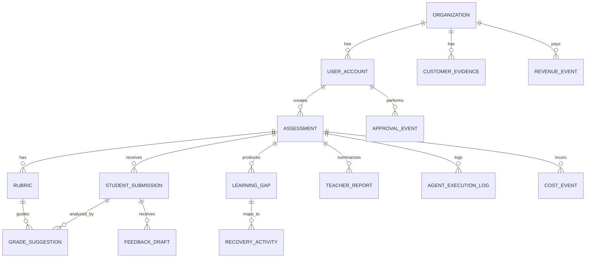
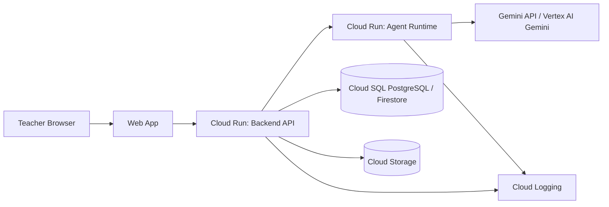
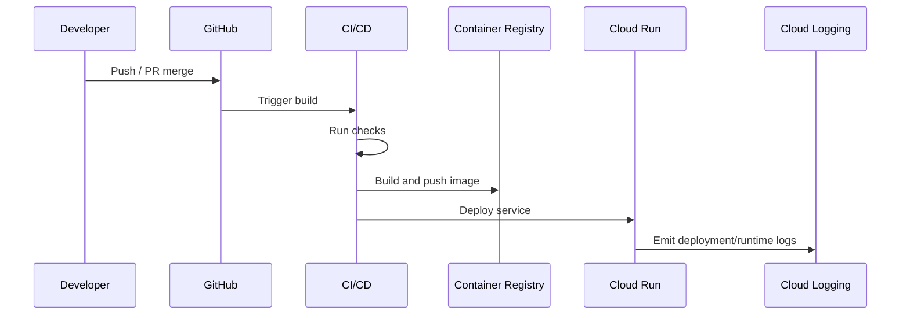
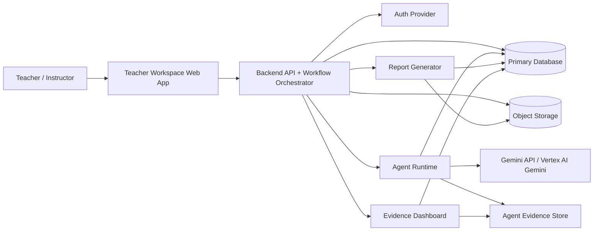
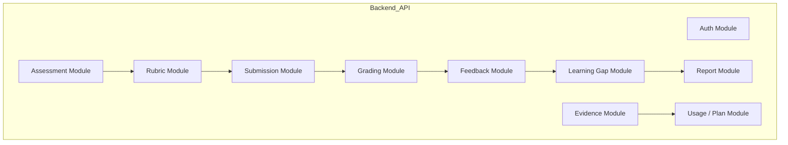
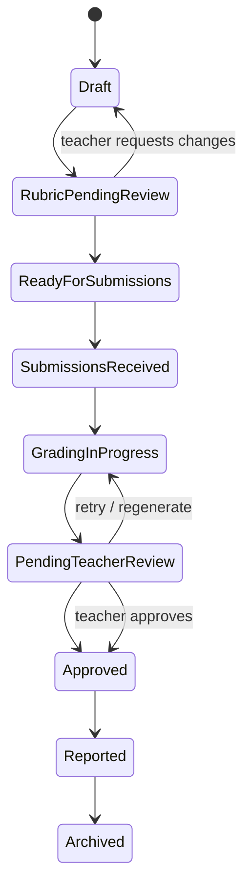
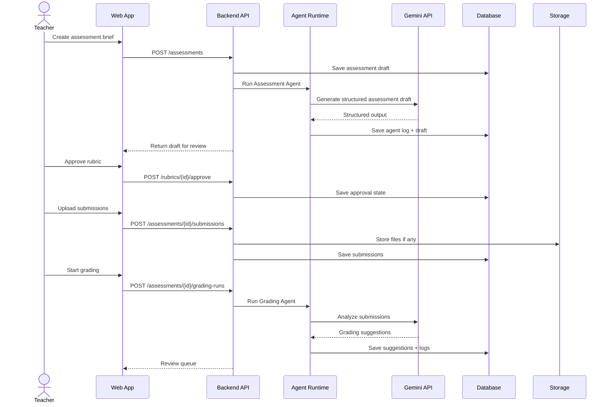
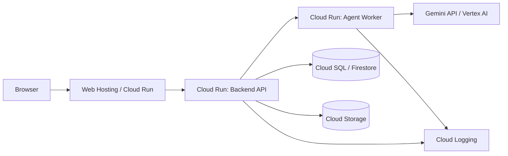

# 04 Architecture Consolidated

> Generated for NotebookLM from `04-architecture`. This is a full-content consolidation, not a summary.

## Source Files

- `04-architecture/README.md`
- `04-architecture/api-design.md`
- `04-architecture/data-model.md`
- `04-architecture/deployment.md`
- `04-architecture/security.md`
- `04-architecture/system-architecture.md`

## Consolidated Content


---

## Source: `04-architecture/README.md`

# 04 Architecture

This folder defines the technical architecture for GradeOps AI MVP.

It translates the strategic, business, product, and agent documentation into a buildable system design.

## Architecture Goal

Support one focused product outcome:

> A programming educator can run a practical assessment workflow with AI agents, teacher approval, structured persistence, cost tracking, and auditable evidence.

The architecture must prove:

- the product works end to end;
- AI operations are real and traceable;
- teachers remain in control;
- Google Cloud / Gemini requirements can be demonstrated;
- usage, cost, and evidence can be extracted for hackathon submission.

## Canonical Inputs

| Folder | Architecture Implication |
| --- | --- |
| `00-project/` | Defines strategic scope, hackathon requirements, cost policy, and non-negotiables. |
| `01-business/` | Defines paid pilots, pricing units, revenue/cost evidence, and GTM needs. |
| `02-product/` | Defines MVP scope, workflows, personas, stories, states, and metrics. |
| `03-ai-agents/` | Defines agent roles, contracts, logs, control points, and handoffs. |

## Architecture Principles

1. **Build the narrow workflow first.** Avoid full LMS, broad academic management, and enterprise complexity.
2. **Keep teacher approval explicit.** AI suggestions are not final until reviewed.
3. **Persist structured evidence.** Agent runs, model usage, cost estimates, approval states, and final actions are first-class records.
4. **Use bounded operational complexity.** Prefer a modular monolith plus agent worker over premature microservices.
5. **Separate product runtime from development tooling.** Production AI calls must use traceable API/cloud billing.
6. **Optimize for demo and pilot reliability.** The 3-minute demo must show product flow, agent logs, and business evidence.
7. **Use cloud services only where they reduce risk.** Do not over-engineer infrastructure before product validation.

## Recommended MVP Architecture

```text
Web App
  -> Backend API / Workflow Orchestrator
    -> Agent Runtime / Agent Worker
      -> Gemini API
    -> Database
    -> Object Storage
    -> Evidence / Logs
```

Recommended implementation stance:

| Layer | Recommended MVP Choice | Reason |
| --- | --- | --- |
| Web | Angular or Next.js | Fast teacher workspace and dashboard. |
| API | Spring Boot modular monolith | Strong fit for workflow, security, audit, and persistence. |
| Agents | Separate agent worker/service or internal module | Keeps LLM orchestration observable and replaceable. |
| AI | Gemini API / Vertex AI Gemini | Hackathon requirement and traceable runtime. |
| DB | Cloud SQL PostgreSQL or Firestore | Structured workflow and evidence storage. |
| Files | Cloud Storage | Student files, report exports, evidence artifacts. |
| Runtime | Cloud Run | Simple container deployment and Google Cloud evidence. |
| Auth | Firebase Auth or backend JWT | Fast MVP authentication. |
| Observability | Cloud Logging + application evidence tables | Technical and business-grade logs. |

## Files In This Folder

| File | Purpose |
| --- | --- |
| `system-architecture.md` | System components, runtime topology, module boundaries, and diagrams. |
| `data-model.md` | Core entities, relationships, states, audit/evidence records, and modeling rules. |
| `api-design.md` | REST API resources, commands, endpoints, DTO expectations, and error behavior. |
| `security.md` | Authentication, authorization, privacy, data handling, audit, and AI safety posture. |
| `deployment.md` | Environments, Google Cloud deployment, CI/CD, config, observability, and release strategy. |

## What Belongs Here

- logical architecture;
- component boundaries;
- data model;
- API design;
- deployment topology;
- security posture;
- observability design;
- evidence architecture;
- cloud service assumptions;
- technical constraints for MVP.

## What Does Not Belong Here

- sales scripts;
- pricing copy;
- customer interview notes;
- product backlog details beyond architecture implications;
- implementation code;
- full infrastructure-as-code definitions;
- vendor-specific tuning that belongs in implementation repos.

## Mermaid Rule

Architecture diagrams must use Mermaid by default.

Use PlantUML only if Mermaid cannot express the relationship clearly. Use ASCII only as a last fallback.

## Architecture Cut Line

Protect these architecture capabilities first:

1. authenticated teacher workspace;
2. assessment/rubric/submission persistence;
3. agent execution with Gemini;
4. teacher approval state;
5. agent log and cost evidence;
6. report generation;
7. basic deployment on Google Cloud;
8. demo-ready observability.

Everything else is secondary until the first real pilot works end to end.


---

## Source: `04-architecture/api-design.md`

# API Design

GradeOps AI API should be simple, auditable, and workflow-oriented.

The API must support the MVP assessment lifecycle, agent orchestration, teacher review, evidence extraction, and plan/usage tracking.

## API Design Principles

1. Prefer workflow commands over broad automation endpoints.
2. Keep teacher approval explicit.
3. Return structured IDs for every generated artifact.
4. Make agent operations observable.
5. Keep student-facing outputs pending until approved.
6. Separate internal evidence APIs from teacher-facing APIs.
7. Make every mutation auditable.
8. Support demo and pilot use before enterprise completeness.

## API Style

Recommended MVP style:

- REST API;
- JSON request/response;
- authenticated teacher/operator access;
- server-side Gemini calls only;
- idempotency support for long-running commands where possible;
- pagination for list endpoints;
- consistent error response.

Base path:

```text
/api/v1
```

## Student Submission API Meaning

In this API, `/submissions` means **student submissions**: answers, code, files, attempts, or delivered work loaded by the teacher for a specific assessment.

It does not imply student accounts or a student portal.

A submission becomes a **graded submission** for pricing/usage when it is analyzed by the grading/feedback workflow.

## Resource Overview

| Resource | Purpose |
| --- | --- |
| `/auth/me` | Current authenticated user. |
| `/organizations` | Customer/account boundary. |
| `/assessments` | Assessment lifecycle. |
| `/rubrics` | Rubric versions and approval. |
| `/submissions` | Student submissions. |
| `/grading-suggestions` | AI grading suggestions. |
| `/feedback-drafts` | Student feedback drafts. |
| `/learning-gaps` | Cohort gap summaries. |
| `/recovery-activities` | Remedial suggestions. |
| `/teacher-reports` | Assessment reports. |
| `/agent-runs` | Agent execution logs. |
| `/evidence` | Business/demo evidence. |
| `/usage` | Plan and usage metrics. |

## Common Response Envelope

```json
{
  "data": {},
  "meta": {
    "requestId": "req_123",
    "timestamp": "2026-06-08T12:00:00Z"
  }
}
```

## Common Error Envelope

```json
{
  "error": {
    "code": "VALIDATION_ERROR",
    "message": "Rubric must be approved before grading starts.",
    "details": []
  },
  "meta": {
    "requestId": "req_123",
    "timestamp": "2026-06-08T12:00:00Z"
  }
}
```

## Error Codes

| Code | Meaning |
| --- | --- |
| `VALIDATION_ERROR` | Invalid request or missing field. |
| `UNAUTHORIZED` | Not authenticated. |
| `FORBIDDEN` | Authenticated but not allowed. |
| `NOT_FOUND` | Resource not found in tenant scope. |
| `INVALID_STATE_TRANSITION` | Workflow command not allowed in current state. |
| `AGENT_RUN_FAILED` | Agent execution failed. |
| `OUTPUT_VALIDATION_FAILED` | Model output did not match schema. |
| `USAGE_LIMIT_EXCEEDED` | Plan/usage limit reached. |
| `FILE_UNSUPPORTED` | Unsupported upload. |
| `CONFLICT` | Version or state conflict. |

## Authentication

### `GET /auth/me`

Returns current user and organization.

```json
{
  "data": {
    "userId": "usr_123",
    "organizationId": "org_123",
    "email": "teacher@example.com",
    "role": "teacher",
    "plan": "pilot_pack"
  }
}
```

## Assessments API

### `POST /assessments`

Creates assessment brief.

```json
{
  "learningGoal": "Evaluate conditionals, loops, and functions",
  "topic": "Java basics",
  "language": "Java",
  "level": "basic",
  "durationMinutes": 90,
  "studentCountEstimate": 30,
  "constraints": ["No arrays", "Console input/output"],
  "teacherNotes": "First-semester students"
}
```

### `POST /assessments/{assessmentId}/generate-draft`

Runs Assessment Agent and returns a reviewable draft plus `agentRunId`.

### `GET /assessments/{assessmentId}`

Returns assessment detail, current state, and summary counts.

### `PATCH /assessments/{assessmentId}`

Updates teacher-editable assessment fields.

### `POST /assessments/{assessmentId}/approve`

Approves assessment draft.

## Rubrics API

### `POST /assessments/{assessmentId}/rubrics/generate`

Runs Rubric Agent.

Precondition: assessment exists and assessment draft is available.

### `PATCH /rubrics/{rubricId}`

Teacher edits rubric.

### `POST /rubrics/{rubricId}/approve`

Teacher approves rubric. This stores approval event and moves assessment to `ready_for_submissions`.

## Student Submissions API

### `POST /assessments/{assessmentId}/submissions`

Creates a student submission by text/code.

```json
{
  "studentIdentifier": "A001",
  "contentText": "public class Main { ... }",
  "language": "Java"
}
```

### `POST /assessments/{assessmentId}/submissions/upload`

Uploads one student answer file. MVP may implement multipart upload or pre-signed upload flow.

### `GET /assessments/{assessmentId}/submissions`

Lists submissions with `status`, `page`, and `size` filters.

### `GET /submissions/{submissionId}`

Returns one student submission with current processing state.

## Grading API

### `POST /assessments/{assessmentId}/grading-runs`

Starts grading for selected or all student submissions.

Preconditions:

- rubric approved;
- student submissions exist.

```json
{
  "submissionIds": ["sub_001", "sub_002"],
  "mode": "standard"
}
```

### `GET /assessments/{assessmentId}/grading-suggestions`

Returns teacher review queue.

### `POST /grading-suggestions/{suggestionId}/approve`

Teacher approves AI suggestion.

### `PATCH /grading-suggestions/{suggestionId}`

Teacher edits score/notes.

### `POST /grading-suggestions/{suggestionId}/reject`

Teacher rejects AI suggestion.

## Feedback API

### `POST /assessments/{assessmentId}/feedback-drafts/generate`

Runs Feedback Agent for selected submissions.

```json
{
  "submissionIds": ["sub_001"],
  "tone": "supportive",
  "useTeacherApprovedScoresOnly": true
}
```

### `GET /assessments/{assessmentId}/feedback-drafts`

Lists feedback drafts.

### `POST /feedback-drafts/{feedbackId}/approve`

Approves feedback.

### `PATCH /feedback-drafts/{feedbackId}`

Teacher edits feedback.

### `POST /feedback-drafts/{feedbackId}/reject`

Rejects feedback draft.

## Learning Gap API

### `POST /assessments/{assessmentId}/learning-gaps/generate`

Runs Learning Gap Agent.

### `GET /assessments/{assessmentId}/learning-gaps`

Lists gap summaries.

### `POST /learning-gaps/{gapId}/approve`

Teacher confirms gap.

## Recovery Activities API

### `POST /assessments/{assessmentId}/recovery-activities/generate`

Runs Recovery Agent using learning gaps.

### `GET /assessments/{assessmentId}/recovery-activities`

Lists suggested recovery activities.

### `POST /recovery-activities/{activityId}/approve`

Approves recovery activity.

## Teacher Report API

### `POST /assessments/{assessmentId}/teacher-report/generate`

Runs Teacher Report Agent.

### `GET /assessments/{assessmentId}/teacher-report`

Returns report.

### `POST /teacher-reports/{reportId}/approve`

Approves report.

### `GET /teacher-reports/{reportId}/export`

Returns export or artifact link.

## Agent Runs API

### `GET /agent-runs`

Operator/teacher endpoint for traceability.

Query params: `assessmentId`, `submissionId`, `agentName`, `status`, `from`, `to`.

### `GET /agent-runs/{agentRunId}`

Returns agent execution detail with model, operation, status, estimated cost, and approval state.

## Evidence API

### `GET /evidence/dashboard`

Returns hackathon/demo metrics:

- assessments processed;
- submissions processed;
- feedback outputs;
- agent runs;
- estimated cost;
- revenue references;
- related-party revenue summary;
- testimonials count;
- time saved estimate.

### `POST /evidence/customer`

Creates or updates customer evidence metadata.

### `POST /evidence/revenue-events`

Stores revenue/commitment record or evidence link.

### `POST /evidence/cost-events`

Stores manual cost record if not derived automatically.

## Usage API

### `GET /usage/current`

Returns plan usage.

```json
{
  "data": {
    "plan": "teacher_pro",
    "assessmentsUsed": 4,
    "assessmentsLimit": 10,
    "submissionsUsed": 87,
    "submissionsLimit": 300
  }
}
```

## Long-Running Operations

For batch operations:

1. command endpoint returns run ID;
2. UI polls run status;
3. backend stores partial results;
4. failures are visible.

## API State Rules

| Command | Required State |
| --- | --- |
| Generate rubric | Assessment draft exists. |
| Approve rubric | Rubric pending review. |
| Add submissions | Assessment `ready_for_submissions` or later. |
| Start grading | Approved rubric + submissions. |
| Generate feedback | Grading suggestions exist. |
| Approve feedback | Feedback draft exists. |
| Generate report | Grading/feedback/gap data exists. |
| Export report | Report exists. |

## API Acceptance Criteria

The API is sufficient when it supports end-to-end assessment creation, rubric generation and approval, submission intake, grading agent execution, teacher review, feedback approval, learning gap/recovery generation, teacher report generation, agent log retrieval, evidence dashboard retrieval, and usage limit tracking.


---

## Source: `04-architecture/data-model.md`

# Data Model

The GradeOps AI data model must support assessment workflows, teacher approval, agent traceability, cost tracking, and hackathon evidence.

The model should be designed around auditability.

## Modeling Principles

1. Every AI output must link to its inputs.
2. Every student-facing output must have approval state.
3. Every agent execution must be logged.
4. Every cost/revenue event must be attributable when possible.
5. Student data should be minimized.
6. Files/artifacts should be referenced, not stored as large DB blobs.
7. Approved records should be versioned or immutable enough for audit.
8. Related-party business evidence must be distinguishable.

## Entity Overview



## Core Entities

### `Organization`

Represents a teacher, tutor, small academy, or bootcamp account.

| Field | Type | Notes |
| --- | --- | --- |
| `id` | UUID | Primary key. |
| `name` | string | Individual or organization name. |
| `segment` | enum | See `OrganizationSegment`. |
| `plan` | enum | See `PlanCode`. |
| `pilot_status` | enum | See `PilotStatus`. |
| `related_party` | boolean | Important for hackathon revenue reporting. |
| `created_at` | timestamp | Audit. |
| `updated_at` | timestamp | Audit. |

### `UserAccount`

| Field | Type | Notes |
| --- | --- | --- |
| `id` | UUID | Primary key. |
| `organization_id` | UUID | Tenant boundary. |
| `email` | string | Login identity. |
| `display_name` | string | UI. |
| `role` | enum | See `UserRole`. |
| `status` | enum | See `UserStatus`. |
| `created_at` | timestamp | Audit. |

### `Assessment`

| Field | Type | Notes |
| --- | --- | --- |
| `id` | UUID | Primary key. |
| `organization_id` | UUID | Tenant boundary. |
| `created_by` | UUID | User. |
| `title` | string | Generated or teacher-edited. |
| `learning_goal` | text | Teacher input. |
| `topic` | string | Programming topic. |
| `level` | enum | See `AssessmentLevel`. |
| `language` | enum/string | Prefer `ProgrammingLanguage`; allow controlled custom value if needed. |
| `duration_minutes` | integer | Expected duration. |
| `status` | enum | See `AssessmentStatus`. |
| `student_count_estimate` | integer | For cost/usage planning. |
| `assessment_draft_json` | json | Structured agent output. |
| `teacher_notes` | text | Teacher context. |
| `created_at` | timestamp | Audit. |
| `updated_at` | timestamp | Audit. |

### `Rubric`

| Field | Type | Notes |
| --- | --- | --- |
| `id` | UUID | Primary key. |
| `assessment_id` | UUID | Parent. |
| `version` | integer | Version number. |
| `status` | enum | See `RubricStatus`. |
| `criteria_json` | json | Criteria, levels, weights. |
| `total_weight` | numeric | Usually 100. |
| `validation_notes_json` | json | Ambiguity/consistency notes. |
| `approved_by` | UUID | Nullable. |
| `approved_at` | timestamp | Nullable. |
| `created_at` | timestamp | Audit. |

### `StudentSubmission`

Represents a student's submitted work for one assessment. It is not a login account.

| Field | Type | Notes |
| --- | --- | --- |
| `id` | UUID | Primary key. |
| `assessment_id` | UUID | Parent. |
| `student_identifier` | string | Minimal identifier, not necessarily full PII. Use pseudonym, roster code, or teacher-provided alias when possible. |
| `student_display_label` | string | Optional label for teacher UI; avoid full name unless required by pilot. |
| `external_student_ref` | string | Optional reference to teacher's roster/LMS/export. Not a GradeOps login ID. |
| `content_text` | text | Pasted code/text if small. |
| `file_artifact_id` | UUID | Optional file reference. |
| `status` | enum | See `StudentSubmissionStatus`. |
| `language_detected` | string | Optional. |
| `submitted_at` | timestamp | Optional original submission time. |
| `created_at` | timestamp | Audit. |

Student-level modeling rule:

> The MVP stores student submissions, not student accounts. Student identity should be minimal, teacher-controlled, and scoped to the assessment/pilot.

### `Artifact`

| Field | Type | Notes |
| --- | --- | --- |
| `id` | UUID | Primary key. |
| `organization_id` | UUID | Tenant. |
| `assessment_id` | UUID | Optional. |
| `student_submission_id` | UUID | Optional. |
| `type` | enum | See `ArtifactType`. |
| `storage_uri` | string | Cloud Storage path. |
| `filename` | string | Original/display. |
| `mime_type` | string | Content type. |
| `size_bytes` | integer | Validation/cost. |
| `created_at` | timestamp | Audit. |

### `GradeSuggestion`

AI-generated grading suggestion. Not final until teacher approval.

| Field | Type | Notes |
| --- | --- | --- |
| `id` | UUID | Primary key. |
| `assessment_id` | UUID | Parent. |
| `student_submission_id` | UUID | Parent. |
| `rubric_id` | UUID | Approved rubric used. |
| `agent_execution_id` | UUID | Traceability. |
| `suggested_total_score` | numeric | AI suggestion. |
| `criteria_results_json` | json | Score/evidence per criterion. |
| `uncertainty_flags_json` | json | Risk/uncertainty flags. |
| `status` | enum | See `ReviewableOutputStatus`. |
| `teacher_final_score` | numeric | Nullable until approved/edited. |
| `teacher_notes` | text | Optional. |
| `approved_by` | UUID | Nullable. |
| `approved_at` | timestamp | Nullable. |
| `created_at` | timestamp | Audit. |

### `FeedbackDraft`

| Field | Type | Notes |
| --- | --- | --- |
| `id` | UUID | Primary key. |
| `student_submission_id` | UUID | Parent. |
| `grade_suggestion_id` | UUID | Source. |
| `agent_execution_id` | UUID | Traceability. |
| `feedback_json` | json | Summary, strengths, improvements, next steps. |
| `status` | enum | See `ReviewableDraftStatus`. |
| `teacher_final_text` | text | Nullable. |
| `approved_by` | UUID | Nullable. |
| `approved_at` | timestamp | Nullable. |
| `created_at` | timestamp | Audit. |

### `LearningGap`

| Field | Type | Notes |
| --- | --- | --- |
| `id` | UUID | Primary key. |
| `assessment_id` | UUID | Parent. |
| `agent_execution_id` | UUID | Traceability. |
| `topic` | string | Gap name. |
| `criterion_ids_json` | json | Related rubric criteria. |
| `affected_student_submission_count` | integer | Aggregate only. |
| `severity` | enum | See `Severity`. |
| `evidence_summary` | text | No unnecessary PII. |
| `status` | enum | See `ReviewableOutputStatus`; `edited` is optional for MVP. |
| `created_at` | timestamp | Audit. |

### `RecoveryActivity`

| Field | Type | Notes |
| --- | --- | --- |
| `id` | UUID | Primary key. |
| `assessment_id` | UUID | Parent. |
| `learning_gap_id` | UUID | Source gap. |
| `agent_execution_id` | UUID | Traceability. |
| `title` | string | Activity name. |
| `instructions_json` | json | Steps/prompts. |
| `expected_output` | text | Expected response. |
| `status` | enum | See `ReviewableOutputStatus`. |
| `teacher_final_json` | json | Nullable. |
| `created_at` | timestamp | Audit. |

### `TeacherReport`

| Field | Type | Notes |
| --- | --- | --- |
| `id` | UUID | Primary key. |
| `assessment_id` | UUID | Parent. |
| `agent_execution_id` | UUID | Traceability. |
| `report_json` | json | Structured report. |
| `status` | enum | See `ReportStatus`. |
| `export_artifact_id` | UUID | Optional. |
| `approved_by` | UUID | Nullable. |
| `approved_at` | timestamp | Nullable. |
| `created_at` | timestamp | Audit. |

## Student Accounts Are Out Of MVP

The MVP does not require a `StudentAccount`.

GradeOps AI stores student responses through `StudentSubmission` records controlled by the teacher. This keeps the first product focused on assessment operations and avoids turning the MVP into a full LMS or student portal.

Future versions may introduce:

- `StudentAccount`;
- `AssessmentAttempt`;
- `FeedbackDelivery`;
- student portal;
- learner history;
- cross-assessment learner analytics.

Those are intentionally deferred.

## Evidence And Audit Entities

### `AgentExecutionLog`

This is mandatory.

| Field | Type | Notes |
| --- | --- | --- |
| `id` | UUID | Primary key. |
| `organization_id` | UUID | Tenant. |
| `assessment_id` | UUID | Optional but preferred. |
| `student_submission_id` | UUID | Optional. |
| `agent_name` | enum | See `AgentName`. |
| `operation` | enum | See `AgentOperation`. |
| `model` | string | Gemini model used. |
| `status` | enum | See `AgentRunStatus`. |
| `input_summary` | text | Redacted/minimized. |
| `output_summary` | text | Redacted/minimized. |
| `input_tokens` | integer | If available/estimated. |
| `output_tokens` | integer | If available/estimated. |
| `estimated_cost_usd` | numeric | Required for unit economics. |
| `latency_ms` | integer | Optional. |
| `uncertainty_flags_json` | json | Optional. |
| `error_message` | text | Redacted. |
| `approval_state` | enum | See `AgentApprovalState`. |
| `created_at` | timestamp | Audit. |

### `ApprovalEvent`

Records human control.

| Field | Type | Notes |
| --- | --- | --- |
| `id` | UUID | Primary key. |
| `organization_id` | UUID | Tenant. |
| `assessment_id` | UUID | Parent. |
| `entity_type` | enum | See `ApprovalEntityType`. |
| `entity_id` | UUID | Approved/edited/rejected item. |
| `action` | enum | See `ApprovalAction`. |
| `actor_user_id` | UUID | Teacher. |
| `notes` | text | Optional. |
| `created_at` | timestamp | Audit. |

### `UsageEvent`

Tracks product and plan usage.

| Field | Type | Notes |
| --- | --- | --- |
| `id` | UUID | Primary key. |
| `organization_id` | UUID | Tenant. |
| `assessment_id` | UUID | Optional. |
| `event_type` | enum | See `UsageEventType`. |
| `quantity` | integer | Usually 1. |
| `created_at` | timestamp | Audit. |

### `RevenueEvent`

Can be internal or linked to an external ledger.

| Field | Type | Notes |
| --- | --- | --- |
| `id` | UUID | Primary key. |
| `organization_id` | UUID | Customer. |
| `date` | date | Required. |
| `month` | enum/string | Use `YYYY-MM`; hackathon reporting months include `2026-05`, `2026-06`, `2026-07`, `2026-08`. |
| `amount_usd` | numeric | USD equivalent. |
| `amount_original` | numeric | Original. |
| `currency` | enum | ISO 4217; MVP allowed values in `CurrencyCode`. |
| `source` | enum | See `RevenueSource`. |
| `offer` | enum | See `OfferCode`. |
| `related_party` | boolean | Required. |
| `evidence_artifact_id` | UUID | Optional. |
| `created_at` | timestamp | Audit. |

### `CostEvent`

Can be stored in a ledger or derived from agent logs.

| Field | Type | Notes |
| --- | --- | --- |
| `id` | UUID | Primary key. |
| `organization_id` | UUID | Optional. |
| `assessment_id` | UUID | Optional. |
| `date` | date | Required. |
| `category` | enum | See `CostCategory`. |
| `amount_usd` | numeric | Cost. |
| `cash_cost` | boolean | Whether cash was paid. |
| `covered_by_credit` | boolean | Free tier/credits. |
| `evidence_artifact_id` | UUID | Optional. |
| `created_at` | timestamp | Audit. |

## Allowed Values Reference

Use `snake_case` for persisted enum values. UI labels can be translated or prettified, but stored values should stay stable.

### Account And Business Enums

| Enum | Allowed Values | Notes |
| --- | --- | --- |
| `OrganizationSegment` | `independent_teacher`, `tutor`, `bootcamp`, `academy`, `program`, `training_team`, `other` | Use `other` only with a free-text note. |
| `PlanCode` | `free`, `teacher_lite`, `teacher_pro`, `cohort_pro`, `pilot_pack`, `custom_pilot` | Must map to usage limits. |
| `PilotStatus` | `none`, `candidate`, `active`, `completed`, `paused`, `lost` | `lost` means no pilot conversion after qualification. |
| `UserRole` | `teacher`, `reviewer`, `operator`, `admin` | `reviewer` is optional for MVP. |
| `UserStatus` | `invited`, `active`, `disabled`, `deleted` | Prefer soft-delete for audit. |
| `OfferCode` | `free`, `teacher_lite`, `teacher_pro`, `cohort_pro`, `pilot_pack`, `custom_pilot`, `manual_commitment` | Used in revenue and customer evidence. |
| `RevenueSource` | `stripe`, `paypal`, `mercadopago`, `flow`, `transbank`, `bank_transfer`, `manual_invoice`, `cash`, `commitment`, `other` | `commitment` is not cash revenue; flag clearly in reporting. |
| `CurrencyCode` | `USD`, `CLP`, `EUR`, `BRL`, `MXN`, `COP`, `PEN`, `ARS` | Store `amount_usd` alongside original currency. |

### Assessment And Product State Enums

| Enum | Allowed Values | Notes |
| --- | --- | --- |
| `AssessmentStatus` | `draft`, `rubric_pending_review`, `ready_for_submissions`, `submissions_received`, `grading_in_progress`, `pending_teacher_review`, `approved`, `reported`, `archived`, `cancelled` | `cancelled` preserves abandoned work without deletion. |
| `AssessmentLevel` | `introductory`, `basic`, `intermediate`, `advanced`, `mixed` | MVP should default to `basic`. |
| `ProgrammingLanguage` | `pseudocode`, `pseint`, `python`, `javascript`, `typescript`, `java`, `csharp`, `go`, `sql`, `html_css`, `other` | If `other`, store `language_custom`. |
| `RubricStatus` | `draft`, `pending_review`, `approved`, `retired`, `replaced` | Only one approved active rubric should drive grading. |
| `StudentSubmissionStatus` | `received`, `analysis_pending`, `analyzed`, `needs_review`, `approved`, `edited_by_teacher`, `rejected`, `excluded`, `invalid` | `invalid` is for unsupported/empty submissions. |
| `ReviewableOutputStatus` | `suggested`, `needs_review`, `approved`, `edited`, `rejected`, `blocked_uncertain` | Use for grade suggestions, recovery activities, and learning gaps. |
| `ReviewableDraftStatus` | `draft`, `needs_review`, `approved`, `edited`, `rejected`, `blocked_uncertain` | Use for feedback drafts and similar draft outputs. |
| `ReportStatus` | `draft`, `needs_review`, `approved`, `exported`, `archived` | Export does not imply student delivery. |
| `Severity` | `low`, `medium`, `high`, `critical` | `critical` should require explicit teacher review. |

### Agent And Audit Enums

| Enum | Allowed Values | Notes |
| --- | --- | --- |
| `AgentName` | `assessment`, `rubric`, `grading`, `feedback`, `learning_gap`, `recovery`, `teacher_report`, `ops_evidence` | Keep stable for dashboards and NotebookLM evidence. |
| `AgentRunStatus` | `queued`, `running`, `succeeded`, `failed`, `retried`, `requires_human_review`, `cancelled` | Approval is tracked separately in `approval_state`. |
| `AgentApprovalState` | `not_required`, `pending`, `approved`, `edited`, `rejected`, `requested_changes` | Required for outputs that affect grading, feedback, recovery, or reporting. |
| `ApprovalEntityType` | `assessment`, `rubric`, `grade_suggestion`, `feedback_draft`, `learning_gap`, `recovery_activity`, `teacher_report` | Must match the target table/entity. |
| `ApprovalAction` | `approved`, `edited`, `rejected`, `requested_changes`, `excluded` | `excluded` applies mainly to submissions or generated outputs removed from reports. |
| `ArtifactType` | `submission_file`, `report_export`, `evidence_screenshot`, `invoice`, `receipt`, `api_usage_export`, `billing_export`, `testimonial`, `other` | Do not store secrets or private student data in public artifacts. |

### Agent Operations

| `AgentName` | Allowed `AgentOperation` Values |
| --- | --- |
| `assessment` | `generate_assessment`, `revise_assessment`, `validate_assessment_brief` |
| `rubric` | `generate_rubric`, `validate_rubric`, `revise_rubric` |
| `grading` | `grade_submission`, `batch_grade_submissions`, `flag_uncertainty` |
| `feedback` | `generate_feedback`, `revise_feedback`, `generate_feedback_batch` |
| `learning_gap` | `detect_learning_gaps`, `summarize_gap_evidence` |
| `recovery` | `generate_recovery_activity`, `revise_recovery_activity` |
| `teacher_report` | `generate_teacher_report`, `revise_teacher_report`, `export_report_summary` |
| `ops_evidence` | `record_agent_execution`, `summarize_usage`, `summarize_costs`, `summarize_business_evidence`, `detect_missing_evidence` |

### Usage And Cost Enums

| Enum | Allowed Values | Notes |
| --- | --- | --- |
| `UsageEventType` | `assessment_created`, `assessment_approved`, `rubric_generated`, `rubric_approved`, `submission_received`, `submission_analyzed`, `grade_suggestion_generated`, `grade_suggestion_approved`, `feedback_generated`, `feedback_approved`, `learning_gap_generated`, `recovery_generated`, `report_generated`, `report_exported`, `agent_run_created`, `pilot_created`, `payment_recorded`, `testimonial_recorded` | Add new values only when they are useful for metrics or evidence. |
| `CostCategory` | `gemini_api`, `vertex_ai`, `cloud_run`, `cloud_sql`, `firestore`, `cloud_storage`, `cloud_logging`, `artifact_registry`, `cloud_build`, `email`, `payment_processing`, `domain`, `ai_development_tooling`, `marketing`, `contractor`, `other` | Marketing can be reported separately but still represented in ledger if useful. |

## Field Validation Rules

| Field / Group | Validation |
| --- | --- |
| UUID fields | Must be globally unique and immutable after creation. |
| `email` | Lowercase normalized; unique per auth provider or tenant policy. |
| `amount_usd`, costs, scores | Must be non-negative decimals. |
| `suggested_total_score`, `teacher_final_score` | Must be between `0` and rubric `total_weight`, usually `100`. |
| `weight`, `total_weight` | Rubric criteria weights should sum to `100` unless using a declared alternate scale. |
| `duration_minutes` | Positive integer; recommended MVP range `10-240`. |
| `student_count_estimate` | Non-negative integer; used for cost planning, not authoritative billing. |
| `input_tokens`, `output_tokens`, `latency_ms` | Non-negative integers; nullable only when unavailable. |
| `estimated_cost_usd` | Non-negative decimal; store `null` if unknown, `0` only when there is genuinely no measurable runtime cost. Credits affect cash cost, not estimated runtime cost. |
| `storage_uri` | Must point to private bucket/object path, not public URL. |
| `related_party` | Required for `RevenueEvent` and customer evidence. |
| `created_at`, `updated_at`, `approved_at` | Store in UTC; display in local timezone when needed. |
| JSON fields | Must be schema-valid and versioned when the structure can evolve. |

## Minimal JSON Shape Expectations

### `criteria_json`

```json
{
  "criteria": [
    {
      "id": "C1",
      "name": "Correct use of conditionals",
      "weight": 25,
      "levels": [
        {
          "label": "Excellent",
          "score": 25,
          "description": "Uses conditionals correctly in all required branches."
        }
      ],
      "common_mistakes": ["Missing else branch"]
    }
  ],
  "scale": 100
}
```

### `criteria_results_json`

```json
{
  "criteria_results": [
    {
      "criterion_id": "C1",
      "suggested_score": 20,
      "evidence_summary": "Uses if/else correctly but misses one edge case.",
      "issues": ["No validation for negative input"],
      "uncertainty": "low"
    }
  ]
}
```

### `feedback_json`

```json
{
  "summary": "Good progress on control flow.",
  "strengths": ["Uses conditionals clearly"],
  "improvement_areas": ["Add validation for edge cases"],
  "next_steps": ["Practice boundary-value tests"],
  "rubric_references": ["C1", "C3"]
}
```

### `uncertainty_flags_json`

```json
{
  "flags": [
    {
      "code": "ambiguous_submission",
      "severity": "medium",
      "message": "The submitted answer is incomplete and may require teacher interpretation."
    }
  ]
}
```

Allowed uncertainty flag codes:

| Code | Meaning |
| --- | --- |
| `ambiguous_submission` | Submission cannot be interpreted confidently. |
| `missing_required_output` | Expected output or deliverable is absent. |
| `possible_academic_integrity_issue` | Similarity or anomaly should be reviewed by teacher; not an accusation. |
| `long_submission` | Submission may increase cost or reduce model reliability. |
| `rubric_mismatch` | Submission does not map cleanly to rubric criteria. |
| `low_confidence_score` | Score suggestion should not be bulk approved. |
| `policy_sensitive_feedback` | Feedback wording needs teacher review. |

## Relational vs Document Storage

Use **PostgreSQL** if implementation speed is acceptable because the workflow has strong relationships and audit requirements.

Use **Firestore** if speed of development and Google-native simplicity matter more than relational querying.

A practical hybrid is DB for structured records, Cloud Storage for files/artifacts, Cloud Logging for technical logs, and DB `AgentExecutionLog` for business/audit logs.

## Data Privacy Rules

- Store minimal student identifiers.
- Avoid unnecessary full names if anonymized identifiers work.
- Do not store secrets in prompts or logs.
- Redact sensitive content from `input_summary` and `output_summary`.
- Store raw student submissions only when needed for workflow.
- Make deletion/export possible for pilot data.
- Do not publish student data in evidence screenshots.

## Model Acceptance Criteria

The data model is sufficient when it can answer:

1. Which agent produced this output?
2. Which model was used?
3. What did it cost approximately?
4. Which teacher approved or edited it?
5. Which rubric version was used?
6. Which student submissions were processed?
7. Which feedback was approved?
8. What evidence supports a pilot/customer claim?
9. Which revenue is related-party?
10. What usage volume maps to the customer plan?


---

## Source: `04-architecture/deployment.md`

# Deployment

GradeOps AI deployment should be simple, Google Cloud compliant, observable, and reliable enough for real pilots.

The deployment goal is not enterprise scale. The goal is a credible production-like MVP that can run real assessment workflows and produce hackathon evidence.

## Deployment Objectives

1. Deploy a working product, not only a local demo.
2. Use at least one Google Cloud product.
3. Run Gemini calls from deployed backend/agent runtime.
4. Persist data, artifacts, logs, and evidence.
5. Support demo and pilot environments.
6. Capture API/model usage and cost evidence.
7. Keep operational footprint small.

## Recommended MVP Deployment



## Environment Strategy

| Environment | Purpose | Required |
| --- | --- | --- |
| `local` | Development | Yes. |
| `demo` | Stable hackathon/demo environment | Yes. |
| `pilot` | Real pilot/customer use | Recommended. |
| `prod` | Post-hackathon production | Later. |

For speed, `demo` and `pilot` can share infrastructure early, but data should be clearly labeled.

## Recommended Google Cloud Services

| Need | Service Candidate | Notes |
| --- | --- | --- |
| Container runtime | Cloud Run | API and agent worker. |
| File storage | Cloud Storage | Submissions, exports, evidence. |
| Database | Cloud SQL PostgreSQL or Firestore | Choose based on implementation speed. |
| Logs | Cloud Logging | Technical logs. |
| Secrets | Secret Manager / Cloud Run secrets | API keys, DB credentials. |
| Build/deploy | Cloud Build or GitHub Actions | Keep deployment repeatable. |
| Auth | Firebase Auth or backend auth | Fast MVP authentication. |
| AI | Gemini API / Vertex AI Gemini | Traceable AI runtime. |

## Service Topology Options

### Option A: Single Backend Service

```text
Web App -> Backend API (workflow + agents) -> Gemini / DB / Storage
```

Best when team is small, speed matters, agent workload is light, and fewer deployables reduce risk.

Tradeoff: long-running agent jobs may block API if not designed carefully.

### Option B: Backend + Agent Worker

```text
Web App -> Backend API -> Agent Worker -> Gemini
```

Best when batch grading needs isolation, retries/failures should not impact API, agent logs need clean boundaries, and future scaling matters.

Recommended target for MVP if delivery time permits.

## CI/CD Baseline

Minimum CI:

- lint/build web;
- test/build backend;
- validate docs/markdown if useful;
- build container image;
- deploy to demo manually or through protected workflow.

Recommended branch flow:

- `main` or `master`: stable;
- feature branches for changes;
- PR review for key changes;
- tagged demo release before recording video.

## Configuration

Use environment-specific configuration.

Required environment variables:

| Variable | Purpose |
| --- | --- |
| `APP_ENV` | local/demo/pilot/prod. |
| `DATABASE_URL` | DB connection. |
| `GEMINI_API_KEY` or Vertex config | AI runtime. |
| `GCP_PROJECT_ID` | Google Cloud project. |
| `STORAGE_BUCKET` | Cloud Storage bucket. |
| `JWT_SECRET` or auth config | Authentication. |
| `ALLOWED_ORIGINS` | CORS. |
| `MAX_SUBMISSION_SIZE_BYTES` | Upload/cost control. |
| `DEFAULT_MODEL_ASSESSMENT` | Model routing. |
| `DEFAULT_MODEL_GRADING` | Model routing. |
| `ENABLE_PREMIUM_FALLBACK` | Cost control. |

Do not commit real values.

## Deployment Pipeline



## Database Migration Strategy

For PostgreSQL:

- use explicit migration scripts;
- keep schema changes versioned;
- do not manually patch production schema without recording;
- seed demo data through scripts;
- keep fake/demo data clearly marked.

For Firestore:

- document collections and required indexes;
- create seed scripts;
- validate security rules if applicable;
- export relevant data for evidence.

## Storage Strategy

| Bucket/Prefix | Purpose |
| --- | --- |
| `submissions/` | Uploaded student files. |
| `reports/` | Exported teacher reports. |
| `evidence/` | Screenshots, receipts, artifacts if stored. |
| `exports/` | CSV/PDF/demo exports. |

Rules:

- private by default;
- no public bucket;
- signed access only if needed;
- size limits;
- file type allowlist;
- lifecycle cleanup for temporary files.

## Observability

### Technical Observability

Track API latency, API errors, agent failures, model call failures, upload errors, database errors, and authentication errors.

### Business Observability

Track assessments created, rubrics approved, submissions processed, feedback approved, reports generated, agent runs, cost estimates, revenue events, and customer/pilot evidence.

Technical logs alone are not enough. Business evidence must be stored in structured application records.

## Deployment Readiness Checklist

| Item | Required |
| --- | --- |
| Web reachable from public URL | Yes |
| API reachable from web | Yes |
| HTTPS enabled | Yes |
| Auth enabled | Yes |
| Gemini call works from deployed backend | Yes |
| Google Cloud service usage visible | Yes |
| Database persists assessment workflow | Yes |
| Storage persists file/report artifacts | If used |
| Agent logs visible in dashboard | Yes |
| Cost estimates visible | Yes |
| Teacher approval workflow works | Yes |
| Demo seed data available | Yes |
| Pilot data separated/labeled | Recommended |
| Secrets not exposed | Yes |
| Error logs visible | Yes |
| Backup/export strategy exists | Recommended |

## Release Strategy For Hackathon

### Demo Release

A demo release should include stable assessment flow, seeded teacher account, seeded or fast-created assessment, sample submissions, visible agent logs, visible cost/evidence dashboard, no broken navigation, and English labels for demo-critical screens if possible.

### Pilot Release

A pilot release should include real teacher account, data privacy handling, upload limits, reliable persistence, manual fallback plan, support/contact path, and exportable report.

## Rollback Strategy

MVP rollback can be simple:

- keep previous container image;
- redeploy previous revision in Cloud Run;
- avoid destructive DB migrations before demo;
- backup/export pilot data before risky changes;
- feature flag unstable agent changes.

## Cost Controls In Deployment

Set or track:

- Google Cloud budget alerts;
- max request size;
- max submissions per assessment by plan;
- model routing defaults;
- premium fallback disabled by default;
- rate limits on agent commands;
- retry limits;
- logging volume limits.

## Deployment Risks

| Risk | Impact | Mitigation |
| --- | --- | --- |
| Demo only works locally | Weak submission | Deploy early. |
| Gemini credentials fail in cloud | Broken AI requirement | Test deployed API call early. |
| Agent jobs time out | Bad pilot experience | Add async processing or smaller batches. |
| DB schema changes break demo | Lost time | Use migrations and backups. |
| Costs spike | Budget risk | Rate limits and budgets. |
| Secrets leak | Security incident | Secret manager/env only. |
| Public student data | Privacy issue | Private buckets and anonymized demo data. |

## Deployment Acceptance Criteria

The deployment is sufficient when a public/demo URL exists, teacher can authenticate, assessment workflow persists, deployed backend calls Gemini, at least one Google Cloud service is used and visible, files/reports can be stored if required, agent logs and costs are visible, failures are logged, demo can be recorded from the deployed environment, and pilot data can be distinguished from seed/demo data.


---

## Source: `04-architecture/security.md`

# Security

GradeOps AI handles student submissions, grading suggestions, feedback drafts, reports, and business evidence.

The MVP security posture must be simple but serious.

## Security Objectives

1. Protect student submissions and assessment data.
2. Restrict access by organization and role.
3. Preserve teacher approval over sensitive outputs.
4. Keep agent operations auditable.
5. Avoid leaking secrets or personal data into prompts/logs.
6. Make hackathon evidence credible without exposing private student data.
7. Use production-grade cloud configuration even for small pilots.

## Security Principles

- Minimum necessary data.
- Teacher control over grading/feedback.
- Tenant isolation.
- Server-side model calls only.
- No API keys in frontend.
- Redacted logs.
- Explicit approval states.
- Evidence screenshots should not expose private student content.
- Related-party/revenue evidence should be honest and traceable.

## Data Classification

| Data Type | Sensitivity | Examples | Handling |
| --- | --- | --- | --- |
| Public marketing data | Low | Landing copy, public pitch | Can be public. |
| Account data | Medium | Teacher email, organization | Auth required. |
| Assessment content | Medium | Instructions, rubric | Tenant-restricted. |
| Student submissions | High | Code, answers, identifiers | Minimize, restrict, secure storage. |
| Grading/feedback | High | Scores, feedback, gaps | Teacher approval + restricted access. |
| Agent logs | Medium/High | Model, summaries, cost, errors | Redact and restrict. |
| Billing/revenue evidence | High | Receipts, invoices, customers | Operator/admin only. |
| Secrets | Critical | API keys, tokens | Secret manager/env only. |

## Authentication

MVP options:

| Option | Fit |
| --- | --- |
| Firebase Auth | Fastest for Google-aligned MVP. |
| Backend JWT/session | Good if Spring Boot owns auth. |
| Google OAuth | Useful for teacher convenience. |
| SSO | Out of MVP. |

Minimum requirement: every teacher/operator must authenticate, API must validate authenticated identity, and the frontend must never store Gemini/API secrets.

## Authorization

Recommended MVP roles:

| Role | Access |
| --- | --- |
| `teacher` | Own organization assessments, submissions, grading suggestions, feedback, reports. |
| `operator` | Evidence dashboards, pilot/customer records, logs, usage metrics. |
| `admin` | Organization/account administration. |

Tenant rule:

> A user can only access records belonging to their organization unless explicitly assigned an operator/admin role.

## Teacher Approval Security

Teacher approval is a security and trust control.

High-impact outputs requiring approval:

- rubric;
- grading suggestions;
- feedback drafts;
- learning gap interpretation if used in report;
- recovery activities;
- teacher report if exported/shared.

The system must not auto-finalize grades, auto-send feedback, silently change approved rubrics, hide AI uncertainty flags, or overwrite teacher edits.

## AI Prompt/Data Safety

Allowed prompt context:

- assessment instructions;
- approved rubric;
- submission content required for grading;
- anonymized student identifier;
- teacher preferences;
- prior structured outputs needed for workflow.

Avoid prompt context:

- teacher personal data not needed;
- full student names if anonymized IDs work;
- emails/phone numbers;
- payment records;
- secrets;
- unrelated customer evidence;
- internal API keys;
- raw logs not needed by the model.

## Agent Output Safety

Agent outputs should be validated before storage/use:

- JSON schema validation;
- score bounds validation;
- rubric criteria references must exist;
- total score must be within allowed scale;
- feedback must be student-appropriate;
- uncertainty flags must be preserved;
- invalid output becomes `OUTPUT_VALIDATION_FAILED`.

## Audit And Logging

Technical logs should cover request IDs, errors, latency, service health, failed agent calls, deployment incidents, and authentication errors.

Business/audit logs should cover agent execution logs, approval events, usage events, cost estimates, teacher edits/rejections, and evidence records.

Do not rely only on Cloud Logging for business evidence. Store structured evidence in the application database.

## Log Redaction

| Field | Store |
| --- | --- |
| `input_summary` | Redacted summary. |
| `output_summary` | Redacted summary. |
| `model` | Full model identifier. |
| `tokens/cost` | Full estimate. |
| `submission_content` | Reference to submission, not full copy. |
| `error_message` | Redacted, no secrets. |
| `approval_state` | Full state. |

## File Security

For uploaded submissions and exports:

- store in Cloud Storage or equivalent;
- use private buckets;
- avoid public object URLs;
- use signed URLs only when needed;
- set content-type validation;
- limit file size;
- restrict extensions;
- scan or sanitize if execution is ever introduced;
- do not execute student code in MVP unless sandboxed.

## Academic Integrity Boundaries

GradeOps AI may identify suspicious patterns only as a cautious flag.

Allowed:

- “This submission requires teacher review.”
- “This answer pattern appears unusually similar to another submission.”
- “The evidence is insufficient to score confidently.”

Avoid plagiarism/cheating accusations or automated punitive actions in the MVP.

## Privacy Baseline

For pilot use:

- use minimal student identifiers;
- allow pseudonyms/student codes;
- avoid unnecessary personal data;
- collect consent if real student data is used beyond teacher workflow;
- avoid public screenshots containing student submissions or grades;
- separate private evidence from public evidence.

## Secret Management

Secrets must never be committed to the repo.

Secrets include Gemini API keys, Google Cloud credentials, database passwords, JWT signing secrets, OAuth client secrets, and payment provider secrets.

Recommended handling:

- environment variables for local development;
- Google Secret Manager or Cloud Run secrets for production;
- `.env.example` only with placeholder names;
- rotate exposed secrets immediately.

## Network And Deployment Security

MVP baseline:

- HTTPS only;
- authenticated API;
- CORS restricted to known frontend domains;
- rate limits for expensive endpoints;
- upload size limits;
- server-side agent calls;
- separate demo/pilot environments if possible;
- no public database.

## Cost Abuse Controls

Because AI calls cost money:

- enforce plan limits;
- limit submissions per assessment;
- cap file size;
- warn on unusually long submissions;
- avoid premium fallback by default;
- rate-limit agent endpoints;
- log every run;
- require operator override for high-volume tests.

## Security Acceptance Criteria

The MVP security baseline is sufficient when teacher access requires authentication, tenant boundaries are enforced, Gemini/API secrets are server-side only, student submissions are private, agent logs are structured and redacted, teacher approval events are stored, high-impact outputs remain pending until approval, uploaded files are private and size/type-limited, cost abuse controls exist, and public demo evidence can be shown without exposing private student data.


---

## Source: `04-architecture/system-architecture.md`

# System Architecture

GradeOps AI MVP should be built as a focused, evidence-first assessment operations system.

The architecture must support teacher-reviewed assessment workflows, specialized AI agents, structured persistence, file/artifact storage, cost and usage tracking, business evidence, and small pilot deployment on Google Cloud.

## Architectural Stance

Use a **modular monolith plus agent runtime** for the MVP.

Do not start with a distributed microservice architecture unless a real deployment constraint forces it.

Recommended structure:

```text
grade-ops-ai-web
grade-ops-ai-api
grade-ops-ai-agents
grade-ops-ai-infra
```

Possible MVP simplification:

```text
grade-ops-ai-web
grade-ops-ai-api
```

Where `api` contains the workflow and agent orchestration modules internally.

## Logical Architecture



## Runtime Components

| Component | Responsibility | MVP Recommendation |
| --- | --- | --- |
| Web App | Teacher workspace, review UI, dashboards | Angular or Next.js. |
| Backend API | Auth integration, workflow state, business rules, REST API | Spring Boot modular monolith. |
| Workflow Orchestrator | Coordinates assessment lifecycle and agent handoffs | Backend module. |
| Agent Runtime | Executes agent calls, validates structured outputs, logs execution | Separate module/service. |
| Gemini Integration | Calls Gemini models through API/Vertex | Server-side only. |
| Primary DB | Stores users, assessments, rubrics, submissions, feedback, reports, logs | Cloud SQL PostgreSQL or Firestore. |
| Object Storage | Stores uploaded files, exports, report artifacts | Cloud Storage. |
| Evidence Dashboard | Shows agent runs, costs, usage, approvals, business evidence | Backend + Web. |
| Observability | Technical logs, errors, latency, failures | Cloud Logging + app logs. |

## Module Architecture



## Workflow Orchestration



## Agent Execution Pattern

Every agent call should follow the same execution wrapper:

1. Validate command.
2. Load required domain data.
3. Build agent input envelope.
4. Call Gemini/model.
5. Validate structured output.
6. Store agent execution log.
7. Store domain output.
8. Update workflow state.
9. Return reviewable result to teacher.

## Agent Runtime Boundary

The agent runtime can generate assessment drafts, rubrics, grading suggestions, feedback drafts, gap summaries, recovery activities, teacher reports, and evidence records.

It must not finalize scores, send feedback to students, silently change approved rubrics, hide failed or uncertain outputs, store secrets in prompts, or bypass workflow state rules.

## Data Flow



## Deployment Topology



## Repository Boundary Recommendation

| Repository | Contents |
| --- | --- |
| `grade-ops-ai-docs` | Documentation and decision records. |
| `grade-ops-ai-web` | Teacher workspace, landing, dashboard. |
| `grade-ops-ai-api` | API, workflow orchestration, security, persistence. |
| `grade-ops-ai-agents` | Agent definitions, prompts, schemas, model adapters if separated. |
| `grade-ops-ai-infra` | Deployment scripts, Terraform later, Cloud Run config. |

For the hackathon MVP, it is acceptable to merge `api` and `agents` into one backend repo if it reduces delivery risk, as long as module boundaries are explicit.

## Synchronous vs Asynchronous Processing

Use synchronous processing for assessment draft, rubric draft, small demo runs, and teacher report draft.

Use asynchronous processing for batch grading, bulk feedback generation, report generation after many submissions, retries, and expensive fallback models.

MVP can start with synchronous calls for speed, but batch grading should be designed so it can move to a background job/queue.

## Evidence Architecture

Evidence is not a side-effect. It is part of the core architecture.

| Operation | Evidence |
| --- | --- |
| Agent call | `AgentExecutionLog`. |
| Teacher approval | `ApprovalEvent`. |
| Cost estimate | `CostEvent` or cost fields in agent log. |
| Submission processed | `UsageEvent`. |
| Payment/commitment | `RevenueEvent` or external evidence link. |
| Report generated | `ReportArtifact`. |
| Customer testimonial | `CustomerEvidence`. |

## Key Architecture Decisions

| Decision | Rationale |
| --- | --- |
| Modular monolith first | Faster delivery, easier debugging, lower operational overhead. |
| Agent wrapper pattern | Consistent logs, validation, cost, retries. |
| Structured JSON outputs | Required for reliable persistence and reporting. |
| Teacher approval states | Trust, safety, and product positioning. |
| Cloud Run deployment | Simple Google Cloud production footprint. |
| Cloud Storage for artifacts | Clean separation of DB records and uploaded/exported files. |
| Evidence dashboard | Supports product management, business validation, and hackathon demo. |
| No student login in MVP | Reduces scope and security complexity. |

## MVP Architecture Acceptance Criteria

The architecture is sufficient when the system can create and persist an assessment, call Gemini from the deployed backend/agent runtime, store structured agent output, store submissions, generate grading suggestions linked to rubric criteria, persist teacher approvals, generate reports, expose agent logs with model/status/cost/approval state, support evidence dashboard, and use at least one Google Cloud product.

