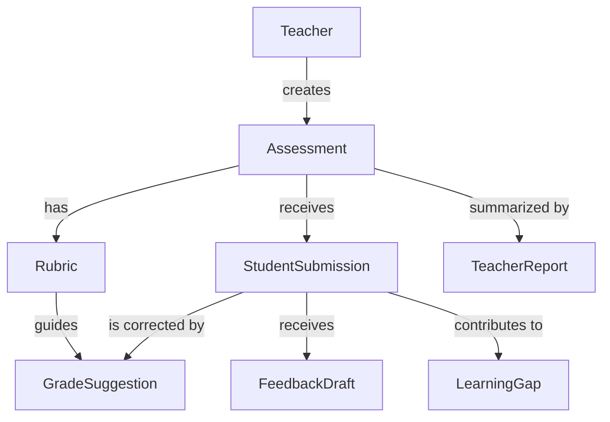

# Corrección Conceptual: Respuestas De Alumnos En El Modelo

> Nota raw formateada desde la conversación sobre el alcance del modelo de datos y la entidad de respuestas de estudiantes.

## Prompt Original

> Consulta: ¿el alcance del modelo está solo considerando al profesor? Es decir, ¿la generación de evaluaciones? Como los planes permiten 30 respuestas de alumnos, no veo en los modelos las respuestas de los alumnos.

## Respuesta Corta

No. El alcance no debe considerar solo al profesor.

El usuario principal del MVP sí es el profesor, pero el objeto central del negocio incluye obligatoriamente las respuestas/entregas de los alumnos.

## Distinción Correcta

| Concepto | En MVP |
| --- | --- |
| Usuario principal | Profesor / tutor / instructor |
| Usuario secundario | Operador interno / demo / evidencia |
| Alumno como usuario con login | No obligatorio en MVP |
| Respuesta del alumno | Sí, obligatoria |
| Corrección de respuesta | Sí, obligatoria |
| Feedback al alumno | Sí, pero aprobado por profesor |
| Portal del alumno | Fuera del MVP inicial |

Los planes que dicen "30 submissions" o "30 respuestas" no significan 30 alumnos registrados.

Significan:

> 30 entregas/respuestas de estudiantes procesadas por el flujo de corrección asistida.

## Ejemplo De Unidad Operativa

```text
1 evaluación creada por el profesor
+ 1 rúbrica aprobada
+ 30 respuestas de alumnos cargadas
+ 30 sugerencias de corrección
+ 30 feedbacks individuales
+ 1 reporte docente
```

## Observación Correcta

La observación era válida:

> Si en el modelo no se ve fuerte la respuesta del alumno, hay que corregirlo.

En la versión inicial del repo, `data-model.md` sí nombraba `Submission`, pero de forma demasiado general.

Debe quedar mucho más explícito que:

> `Submission` = respuesta / entrega del alumno.

## Corrección Conceptual Del Modelo

El flujo correcto:



Interpretación:

- `Teacher` crea `Assessment`.
- `Assessment` tiene `Rubric`.
- `Assessment` recibe `StudentSubmissions`.
- `StudentSubmission` representa la respuesta del alumno.
- `StudentSubmission` puede ser texto, código pegado o archivo.
- `GradeSuggestion` corrige una `StudentSubmission` contra una `Rubric`.
- `FeedbackDraft` genera feedback para esa `StudentSubmission`.
- `LearningGap` agrupa patrones detectados desde varias `StudentSubmissions`.
- `TeacherReport` resume evaluación, submissions, resultados y brechas.

## Entidad Que Debe Reforzarse

Entidad recomendada:

> `StudentSubmission`

Es mejor que solo `Submission`, porque evita la duda detectada.

## Campos Mínimos

### `StudentSubmission`

Representa una respuesta o entrega de un alumno dentro de una evaluación.

| Campo | Descripción |
| --- | --- |
| `id` | Identificador único. |
| `assessment_id` | Evaluación asociada. |
| `student_identifier` | Código, nombre corto o identificador del alumno. |
| `content_text` | Respuesta pegada, código o texto. |
| `file_artifact_id` | Archivo subido, si aplica. |
| `language` | Java, Python, JS, pseudocódigo, etc. |
| `attempt_number` | Número de intento, por defecto 1. |
| `status` | `received`, `analyzed`, `needs_review`, `approved`, `rejected`. |
| `submitted_at` | Fecha/hora de entrega. |
| `created_at` | Fecha de registro. |

## ¿Necesitamos Entidad `Student`?

Para el MVP:

> No como cuenta/login, pero sí como identificador operacional.

No construir todavía:

- `StudentAccount` con login;
- password;
- dashboard;
- historial;
- portal de alumno.

Sí permitir:

```text
student_identifier = "A001"
student_display_name = "Carlos M." // opcional
```

En MVP, el profesor puede cargar las respuestas así:

| Alumno | Respuesta |
| --- | --- |
| A001 | Código Java pegado. |
| A002 | Archivo `.java`. |
| A003 | Respuesta textual. |

## Futuro Fuera Del MVP

Más adelante, si existe portal de alumnos, podrían aparecer:

- `LearnerAccount`;
- `AssessmentAttempt`;
- `Submission`;
- `FeedbackDelivery`;
- student portal;
- learner history.

Para la hackathon, eso sería sobrealcance.

## Interpretación Del Límite Del Plan

El plan no debería decir "30 alumnos" de forma ambigua.

Debe decir:

> 30 graded submissions.

En español:

> 30 respuestas/entregas procesadas por IA para corrección y feedback.

## Regla Práctica De Consumo

| Caso | Consumo |
| --- | ---: |
| 1 alumno entrega 1 respuesta | 1 graded submission |
| 1 alumno entrega 2 intentos corregidos | 2 graded submissions |
| 30 alumnos x 1 respuesta | 30 graded submissions |
| 10 alumnos x 3 ejercicios corregidos | 30 graded submissions |

Esto es importante para costos:

> Lo que consume tokens no es "el alumno" como entidad, sino la respuesta que se analiza.

## Modificaciones Recomendadas Por Documento

| Documento | Ajuste necesario |
| --- | --- |
| `02-product/mvp-scope.md` | Aclarar que el alumno no necesita login, pero sus respuestas son núcleo del MVP. |
| `02-product/user-stories.md` | Agregar historias de carga, análisis y revisión de respuestas de alumnos. |
| `02-product/workflows.md` | Reforzar el flujo `student submissions intake`. |
| `04-architecture/data-model.md` | Renombrar o detallar `StudentSubmission`. |
| `04-architecture/api-design.md` | Aclarar endpoints `/submissions` como respuestas de alumnos. |
| `01-business/pricing.md` | Aclarar que `submission` = respuesta corregida, no alumno registrado. |

## Conclusión Directa

La lectura era correcta:

> Si el modelo parece centrado solo en generación para el profesor, está incompleto.

El producto no es solo:

> Profesor genera evaluación.

Es:

> Profesor genera evaluación → alumnos entregan respuestas → agentes corrigen esas respuestas contra rúbrica → agentes generan feedback individual → profesor aprueba → sistema genera reporte y evidencia.

El profesor es el usuario principal, pero la unidad económica y técnica real es:

> `StudentSubmission`
