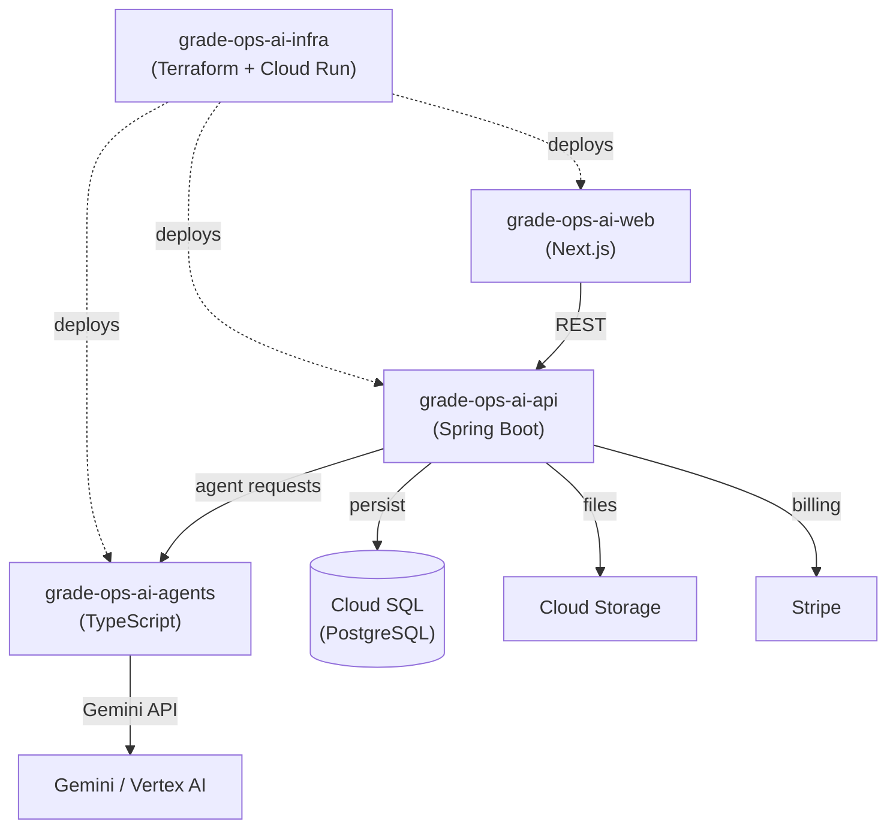

# Repository Strategy

> Repos suficientes para implementar, vender y demostrar el producto, sin caer en sobrearquitectura. Se separa lo obligatorio para el MVP de lo que conviene dejar para después.

## Decisión

Partir con **5 repositorios**. Más fragmenta demasiado; menos mezcla responsabilidades críticas. El foco del MVP es crear, recibir, corregir, generar feedback, reportar y registrar trazabilidad de agentes. OCR, mobile app, LMS completo y banco de preguntas gigante quedan fuera en esta etapa.

| Repositorio | Estado | Propósito |
| --- | --- | --- |
| `grade-ops-ai-docs` | Ya existe | Documentación estratégica, producto, arquitectura, decisiones, pitch, roadmap, requisitos, UX, evidencia depurada. |
| `grade-ops-ai-web` | Crear | Frontend público y privado: landing, onboarding, dashboard docente, vista estudiante, revisión de correcciones, reportes. |
| `grade-ops-ai-api` | Crear | Backend principal: usuarios, cursos, evaluaciones, rúbricas, submissions, revisión docente, reportes, pagos, auditoría. |
| `grade-ops-ai-agents` | Crear | Runtime de agentes IA: prompts, schemas JSON, Gemini, evaluación, feedback, detección de brechas, logs de ejecución. |
| `grade-ops-ai-infra` | Crear | Infraestructura y despliegue: Cloud Run, Cloud SQL/Firestore, Cloud Storage, Secret Manager, Cloud Logging, CI/CD. |

---

## Detalle por repositorio

### 1. `grade-ops-ai-docs`

Centro de verdad del proyecto. No solo documentación técnica: también narrativa de negocio, decisiones, criterios de hackathon, roadmap, pricing, pitch, arquitectura, UX y evidencia sanitizada.

La hackathon premia negocio real operado por IA — con clientes, ingresos, uso real, logs, dashboards y evidencia verificable. Por eso este repo no es accesorio: es parte del producto competitivo.

```text
grade-ops-ai-docs/
├── 00-project/
├── 01-product/
├── 02-business/
├── 03-architecture/
├── 04-ux/
├── 05-agents/
├── 06-hackathon/
│   ├── pitch.md
│   ├── demo-script.md
│   ├── evidence-checklist.md
│   ├── revenue-evidence.md
│   ├── agent-logs-evidence.md
│   ├── customer-interviews.md
│   └── submission-narrative.md
├── 07-roadmap/
└── README.md
```

---

### 2. `grade-ops-ai-web`

La experiencia visible del producto. Landing, app docente, vista estudiante y reportes en una sola aplicación web — no separar landing y app durante el MVP.

**Stack recomendado:** Next.js + TypeScript + Tailwind + React Hook Form + Zod.

```text
grade-ops-ai-web/
├── /                   ← landing pública
├── /pricing            ← planes y checkout
├── /login              ← registro / autenticación
├── /app/teacher        ← dashboard docente: evaluaciones, rúbricas, correcciones
├── /app/student        ← vista estudiante: respuesta, feedback, resultados
├── /app/reports        ← reporte de actividad por evaluación
└── /app/agent-logs     ← panel de ejecución de agentes (visible en demo)
```

El MVP debe mostrar el flujo completo: docente crea evaluación → estudiante responde → agentes corrigen → docente aprueba → dashboard muestra resultados.

---

### 3. `grade-ops-ai-api`

Backend de negocio. Orquesta el dominio, persiste datos y delega trabajo al runtime de agentes. No debe contener prompts complejos ni lógica pesada de agentes.

**Stack recomendado:** Spring Boot 3 + Java 21 + PostgreSQL.

```text
grade-ops-ai-api/
src/main/java/.../gradeops/
├── identity/           ← auth, usuarios, sesiones
├── tenant/             ← organizaciones, tenants
├── assessment/         ← evaluaciones
├── rubric/             ← rúbricas
├── submission/         ← respuestas de estudiantes
├── grading/            ← resultados y correcciones
├── feedback/           ← feedback individual
├── report/             ← reportes docentes
├── billing/            ← planes, Stripe webhooks
├── audit/              ← trazabilidad y logs
├── agentclient/        ← integración con grade-ops-ai-agents
└── shared/             ← utilidades transversales
```

---

### 4. `grade-ops-ai-agents`

El repo más importante para diferenciar GradeOps AI como operación real de agentes — no como "una app que llama a Gemini".

**Agentes del MVP:** Assessment Agent, Rubric Agent, Grading Agent, Feedback Agent, Learning Gap Agent, Recovery Agent, Teacher Report Agent, Ops Agent.

```text
grade-ops-ai-agents/
├── src/
│   ├── agents/
│   │   ├── assessment-designer/
│   │   ├── rubric-validator/
│   │   ├── grading/
│   │   ├── feedback/
│   │   ├── learning-gap/
│   │   ├── recovery/
│   │   ├── teacher-report/
│   │   └── ops/
│   ├── schemas/        ← contratos de entrada/salida por agente
│   ├── prompts/        ← prompts versionados
│   ├── evals/          ← evaluaciones de calidad de agentes
│   ├── providers/
│   │   └── gemini/     ← Gemini API / Vertex AI Gemini
│   └── logging/        ← registro de ejecuciones
├── tests/
└── README.md
```

**Cada ejecución de agente debe registrar:**

| Campo | Descripción |
| --- | --- |
| `timestamp` | Fecha y hora de ejecución |
| `user` | Usuario / docente que disparó el agente |
| `assessment_id` | Evaluación asociada |
| `agent_name` | Nombre del agente ejecutado |
| `input_summary` | Resumen del input recibido |
| `decision` | Decisión tomada por el agente |
| `output` | Output estructurado (JSON) |
| `model` | Modelo usado (ej. `gemini-1.5-pro`) |
| `tokens_cost` | Tokens consumidos / costo aproximado |
| `status` | `suggested` / `approved` / `corrected` / `rejected` |
| `time_saved_min` | Minutos estimados ahorrados al docente |

**Stack para agents:**

| Opción | Stack | Ventaja |
| --- | --- | --- |
| A (recomendada) | Node.js / TypeScript | Calza bien con schemas JSON, validación, prompts y contratos rápidos |
| B | Python / FastAPI | Ecosistema ML maduro; más opciones de librerías de agentes |
| C | Java / Spring Boot | Mantiene stack unificado con el API si se prefiere coherencia |

---

### 5. `grade-ops-ai-infra`

Evita que el despliegue quede como "cosas manuales que solo funcionan en una máquina". Centraliza configuración, variables de entorno, CI/CD y recursos cloud.

```text
grade-ops-ai-infra/
├── terraform/          ← o opentofu/
├── cloud-run/          ← definiciones de servicios Cloud Run
├── github-actions/     ← pipelines CI/CD
├── scripts/            ← scripts de despliegue y bootstrapping
├── environments/
│   ├── dev/
│   ├── staging/
│   └── prod/
└── README.md
```

**Servicios gestionados:** Cloud Run (web, api, agents), Cloud SQL / Firestore, Cloud Storage, Secret Manager, Cloud Logging, variables de entorno por ambiente.

---

## Arquitectura del sistema



---

## Repositorios que no se crean todavía

Los siguientes repos meten en arquitectura institucional antes de validar el negocio. El foco definido deja fuera mobile, OCR complejo, LMS completo, múltiples roles avanzados y banco de preguntas gigante.

| Repositorio | Motivo para posponer |
| --- | --- |
| `grade-ops-ai-mobile` | Requiere validar primero el flujo web completo |
| `grade-ops-ai-ocr` | OCR/OMR es P1; no necesario para el MVP |
| `grade-ops-ai-lms` | Fuera de scope; GradeOps AI no es un LMS |
| `grade-ops-ai-question-bank` | El banco vive dentro del API en el MVP |
| `grade-ops-ai-admin` | Panel de administración institucional es post-MVP |
| `grade-ops-ai-shared` | Librería compartida prematura antes de que los repos existan |
| `grade-ops-ai-sdk` | SDK público es post-producto, no pre-producto |
| `grade-ops-ai-notifications` | Las notificaciones pueden ir en el API inicialmente |

---

## Repositorios opcionales para más adelante

| Repositorio | Cuándo crearlo | Justificación |
| --- | --- | --- |
| `grade-ops-ai-evidence` | Solo si se necesita separar evidencia sensible | Screenshots de pagos, entrevistas, testimonios, métricas, gastos. Privado. |
| `grade-ops-ai-code-runner` | Cuando se ejecute código real de estudiantes | Sandbox seguro para Python / JS / Java con límites de tiempo y memoria. |
| `grade-ops-ai-mobile` | Después del MVP web validado | Captura móvil, OCR, revisión rápida, notificaciones. |
| `grade-ops-ai-public-site` | Solo si la landing crece mucho | Marketing separado de la app. Por ahora no. |

---

## Veredicto

5 repos es el número correcto para partir. Da separación profesional sin caer en microservicios prematuros.

Crear ahora: `grade-ops-ai-web`, `grade-ops-ai-api`, `grade-ops-ai-agents`, `grade-ops-ai-infra`.

Mantener: `grade-ops-ai-docs`.
