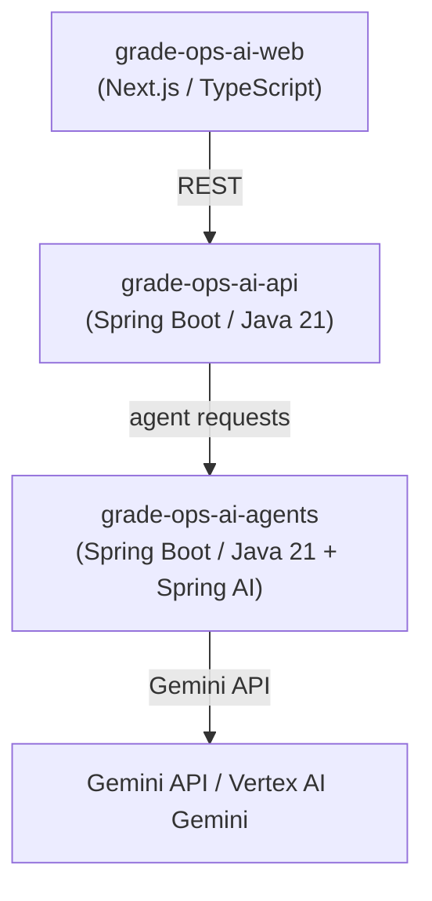

# Stack Decision: Spring AI para el Runtime de Agentes

> Evaluación de Spring AI como alternativa a TypeScript para `grade-ops-ai-agents`, y decisión sobre si mantener los agentes en un repo separado o dentro del API.

## Stack recomendado

| Repositorio | Stack |
| --- | --- |
| `grade-ops-ai-web` | Next.js / TypeScript |
| `grade-ops-ai-api` | Spring Boot / Java 21 |
| `grade-ops-ai-agents` | Spring Boot / Java 21 + Spring AI |
| `grade-ops-ai-infra` | Google Cloud / Cloud Run |
| `grade-ops-ai-docs` | Markdown |

TypeScript fue la primera opción para `agents` porque optimiza para iteración rápida de prompts, schemas JSON livianos, Gemini SDK directo y experimentos rápidos. Sin embargo, con un perfil backend fuerte en Java/Spring Boot, Spring AI reduce la dispersión de stack sin sacrificar capacidad.

---

## Qué ofrece Spring AI

Spring AI no es solo una librería para llamar a modelos. Su objetivo es conectar datos y APIs empresariales con modelos de IA. Ofrece abstracciones para:

- Chat models
- Embeddings
- Structured output (JSON / clases Java)
- Tool / function calling
- Observabilidad y métricas
- RAG (Retrieval-Augmented Generation)
- Evaluación de calidad de respuestas
- Autoconfiguración Spring Boot

Para GradeOps AI eso cubre exactamente lo necesario:

| Necesidad | Soporte en Spring AI |
| --- | --- |
| Llamar a Gemini | Sí — integración nativa con Google GenAI y Vertex AI |
| Salidas estructuradas | Sí — `Structured Output` a JSON o POJO |
| Validación de respuestas IA | Parcial — buena práctica validar igualmente; el modelo no garantiza estructura siempre |
| Orquestación de herramientas | Sí — `Tool Calling` con control de ejecución en la aplicación |
| Logs y costos | Sí — observabilidad integrada |
| RAG (futuro) | Sí — soporte de vector stores |
| Evaluación de agentes (futuro) | Sí — evaluadores de calidad |

### Integración con Gemini / Vertex AI

Spring AI soporta dos modos de conexión con Gemini:

- **API key** — vía Gemini Developer API; recomendado para prototipado.
- **Vertex AI** — con credenciales de Google Cloud; recomendado para producción con características enterprise.

Starter Maven para Vertex AI Gemini:

```xml
<dependency>
    <groupId>org.springframework.ai</groupId>
    <artifactId>spring-ai-starter-model-vertex-ai-gemini</artifactId>
</dependency>
```

Configuración mediante `spring.ai.vertex.ai.gemini.project-id`, `location`, credenciales y modelo.

### Tool Calling: seguridad de ejecución

En el modelo de Tool Calling de Spring AI, Gemini puede *solicitar* ejecutar una herramienta, pero la aplicación cliente mantiene el control real de la ejecución. Gemini no toca directamente la base de datos ni las APIs — la aplicación decide qué herramienta ejecutar y con qué datos. Este modelo es correcto para GradeOps AI, donde el agente sugiere pero el sistema valida antes de actuar.

---

## Decisión: ¿repo separado o módulo dentro del API?

### Opción A — Módulo interno (más simple para el MVP)

```text
grade-ops-ai-api/
└── src/main/java/.../gradeops/
    └── agents/   ← módulo Spring AI dentro del mismo backend
```

| Ventajas | Desventajas |
| --- | --- |
| Menos repos, despliegues y CI/CD | Mezcla lógica transaccional con ejecución IA |
| Menos networking entre servicios | Más difícil escalar agentes de forma independiente |
| Menor fricción para comenzar rápido | Logs y costos de IA menos aislados |

### Opción B — Repo separado (más limpia para arquitectura)

```text
grade-ops-ai-api      ← negocio, persistencia, billing
grade-ops-ai-agents   ← runtime IA, prompts, Gemini, logs
```

| Ventajas | Desventajas |
| --- | --- |
| Separación clara de responsabilidades | Más infraestructura y contratos entre servicios |
| Agentes escalables por separado | Más despliegues |
| Logs y costos de IA aislados | Mayor fricción inicial |
| Mejor narrativa de arquitectura AI-native | |
| Más fácil demostrar "agent runtime" en la demo | |

### Decisión

**Mantener `grade-ops-ai-agents` como repo separado, implementado con Spring Boot + Spring AI.**

La separación refuerza la narrativa AI-native del producto y facilita mostrar operaciones de agentes de forma independiente en la demo del hackathon.

---

## Responsabilidades por repo (decisión final)

**`grade-ops-ai-api`**

- Usuarios, tenants y permisos
- Cursos y docentes
- Evaluaciones y rúbricas
- Submissions
- Resultados y feedback
- Billing y auditoría
- Persistencia (PostgreSQL)

**`grade-ops-ai-agents`**

- Assessment Agent, Rubric Agent, Grading Agent
- Feedback Agent, Learning Gap Agent, Recovery Agent
- Teacher Report Agent, Ops Agent
- Integración Gemini / Vertex AI
- Prompts versionados
- Structured outputs
- Tool calling
- Cálculo de costo / tokens
- Logs de ejecución IA

---

## Arquitectura actualizada



---

## Cuándo elegir cada opción

| Criterio | Spring AI | TypeScript |
| --- | --- | --- |
| Stack principal es Java | Sí — reduce dispersión | No — agrega un lenguaje más |
| Iteración ultra rápida de prompts | Aceptable | Muy cómodo |
| Arquitectura enterprise-friendly | Sí | No es su foco |
| SDKs JS de terceros necesarios | No aplica | Ventaja directa |
| Runtime muy liviano sin Spring | No | Sí |
| Unificar frontend y agentes | No aplica | Posible |

**Para un perfil Java/Spring Boot con objetivo de producto serio y hackathon competitivo: Spring AI.**

`grade-ops-ai-agents = Spring Boot + Spring AI`. No invalida la recomendación anterior de TypeScript; la mejora para este contexto específico.
