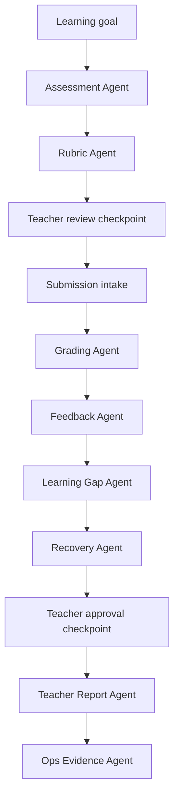

# Solution

GradeOps AI is an AI-operated assessment workflow for programming education.

It helps educators move from a learning goal to reviewed feedback and teacher reports through a controlled agent workflow.

## Core Approach

- One workflow from assessment setup to reporting.
- Specialized agents for repetitive assessment operations.
- Teacher approval on important outputs.
- Structured evidence capture from day one.
- Auditable logs for AI actions, cost, usage, and decisions.
- A narrow MVP focused on practical programming assessments.

## MVP Workflow

1. Teacher defines what they want to evaluate.
2. Assessment Agent generates the activity.
3. Rubric Agent creates and validates criteria.
4. Students submit answers or code.
5. Grading Agent analyzes submissions against the rubric.
6. Feedback Agent drafts personalized feedback.
7. Learning Gap Agent identifies recurring issues.
8. Recovery Agent suggests reinforcement activities.
9. Teacher reviews and approves.
10. Teacher Report Agent prepares the final report.
11. Ops Evidence Agent records usage, costs, outcomes, and agent logs.

## MVP Scope Matrix

| Area | Must Build For MVP | Demo Support | Later | Do Not Build Now |
| --- | --- | --- | --- | --- |
| Assessment creation | Learning goal input, generated activity | Example templates | Question bank versioning | Full curriculum design |
| Rubric | Structured rubric with weights | Rubric validation notes | Rubric library | Institutional rubric governance |
| Submissions | Text/code paste and file upload | Seed sample submissions | Git repo integration | OCR-first workflow |
| Grading assistance | Suggested score and evidence per criterion | Uncertainty flags | Automated tests/sandboxes | Fully autonomous final grades |
| Feedback | Individual feedback draft | Teacher edit/approve | Student portal history | Chat tutor |
| Learning gaps | Cohort summary | Common mistake clustering | Longitudinal analytics | Predictive student profiling |
| Recovery | Suggested activity | Exportable recommendation | Recovery plan library | Adaptive course engine |
| Reporting | Teacher report | Dashboard screenshots | Multi-cohort analytics | Executive BI suite |
| Evidence | Agent logs, API usage, cost estimate | Hackathon dashboard | Audit export | Complex compliance workflows |
| Payments | Manual or Stripe evidence | Pilot Pack checkout | Full billing portal | Marketplace |

## Agent Responsibilities

| Agent | Responsibility | Output |
| --- | --- | --- |
| Assessment Agent | Generate assessment activities from a learning goal. | Activity brief, instructions, expected evidence. |
| Rubric Agent | Create and validate grading criteria. | Rubric, criteria weights, consistency notes. |
| Grading Agent | Analyze submissions against the rubric. | Suggested score, rubric evidence, uncertainty flags. |
| Feedback Agent | Draft student-facing feedback. | Personalized feedback and improvement advice. |
| Learning Gap Agent | Detect repeated misconceptions. | Gap summary and affected students/cohorts. |
| Recovery Agent | Suggest reinforcement work. | Recovery activities tied to specific gaps. |
| Teacher Report Agent | Summarize the assessment run. | Teacher-facing report and next-step recommendations. |
| Ops Evidence Agent | Capture operational proof. | Logs, cost estimates, usage events, time-saved evidence. |

## Agent Choreography

The product should show this choreography visually in the demo. The judges should understand that AI is operating the workflow, not only answering prompts.

## Human Control Model

The product must be explicit about authority:

- agents suggest;
- teachers review;
- teachers approve;
- approved outputs can be delivered to students;
- rejected or edited outputs remain part of the audit trail;
- uncertain agent outputs are flagged instead of hidden;
- final grades and final feedback are attributed to teacher approval, not autonomous AI authority.

This avoids the most dangerous misinterpretation: that GradeOps AI replaces teacher judgment.

## Approval States

| State | Meaning |
| --- | --- |
| `drafted_by_agent` | Agent generated an output but no teacher has reviewed it yet. |
| `needs_review` | Output is ready for teacher validation. |
| `approved` | Teacher accepted the output. |
| `edited_by_teacher` | Teacher changed the output before approval. |
| `rejected` | Teacher rejected the output. |
| `blocked_uncertain` | Output is too uncertain or incomplete to recommend. |
| `published` | Approved output has been delivered or exported. |

## Evidence Model

Each agent execution should record:

- timestamp;
- teacher or account;
- assessment;
- submission when applicable;
- agent name;
- model used;
- input token estimate;
- output token estimate;
- input summary;
- structured output summary;
- status;
- uncertainty score or flags;
- teacher approval state;
- estimated cost;
- estimated time saved;
- final action taken;
- whether the output was edited, approved, rejected, or published.

This evidence is not only observability. It is part of the business narrative for the hackathon.

## Minimal Data Model

| Entity | Purpose |
| --- | --- |
| `TeacherAccount` | Owner of assessments and billing/customer evidence. |
| `Customer` | Person or organization paying or piloting. |
| `Assessment` | Learning goal, generated activity, state, due date, and metadata. |
| `Rubric` | Criteria, weights, levels, validation notes, and version. |
| `Submission` | Student answer/code/file reference and processing state. |
| `GradingSuggestion` | Suggested score, criterion evidence, uncertainty, and rationale. |
| `FeedbackDraft` | Student-facing feedback with approval state. |
| `LearningGapReport` | Cohort-level gaps and affected submissions. |
| `RecoveryActivity` | Suggested reinforcement activity tied to gaps. |
| `TeacherReport` | Summary report for teacher/customer. |
| `AgentExecutionLog` | Operational evidence for agent decisions, tokens, costs, and status. |
| `RevenueEvent` | Payment, commitment, related-party flag, customer source. |
| `CostEvent` | AI/API/cloud/payment/marketing cost event. |

## Cost Evidence Model

Each assessment run should calculate:

- input tokens by agent;
- output tokens by agent;
- model used by agent;
- estimated cost per agent execution;
- retries and failed calls;
- cost per assessment;
- cost per graded submission;
- cost per active teacher;
- revenue attached to the customer or pilot;
- whether the revenue is arms-length or related-party.

This prevents a weak interpretation of the product as a demo. GradeOps AI should prove it understands its unit economics.

## Technical Direction

The MVP should use a simple, defensible architecture:

- frontend for teacher workflow and dashboard;
- backend API for orchestration and persistence;
- Gemini API for at least one deployed LLM call;
- at least one Google Cloud product in production;
- structured storage for assessments, submissions, rubrics, feedback, and logs;
- operational dashboard for usage, agent runs, cost, and evidence.

Valid implementation candidates:

| Layer | Preferred Direction | Notes |
| --- | --- | --- |
| Frontend | Next.js or Angular | Choose speed and confidence over novelty. |
| Backend | Spring Boot or Node/NestJS | Spring Boot fits existing strength; Node may speed agent orchestration. |
| Runtime | Cloud Run | Clean fit for containerized backend/agent workers. |
| AI | Gemini API / Vertex AI Gemini | Required for deployed LLM usage. |
| Data | Firestore or Cloud SQL PostgreSQL | Firestore for speed, PostgreSQL for relational consistency. |
| Storage | Cloud Storage | Student files, exports, report artifacts. |
| Logs | Cloud Logging plus DB business logs | Technical logs and business evidence should not be mixed only in stdout. |
| Auth | Firebase Auth or simple controlled auth | Avoid overbuilding identity. |
| Payments | Stripe or manual payment evidence | Stripe ideal, manual evidence acceptable for pilot validation. |

Personal AI subscriptions can be used for development acceleration, but not as the production grading runtime. The deployed product must use traceable API/cloud billing and save agent execution evidence.

## Model Routing Direction

Use model routing to control cost:

| Workload | Model Policy |
| --- | --- |
| Assessment generation | Flash-class model. |
| Rubric generation and validation | Flash-class model. |
| Bulk grading | Flash-Lite-class model by default. |
| Individual feedback | Flash-Lite by default, Flash fallback for difficult cases. |
| Teacher reports | Flash-class model. |
| Premium review | Stronger fallback model only when needed. |

Model names and pricing change. The cost model must be verified against official pricing before deployment and before final submission.

## Security, Privacy, And Trust

Minimum MVP rules:

- Do not require unnecessary student personal data.
- Use pseudonymous student identifiers when possible.
- Store uploaded files only when needed for the assessment run.
- Do not expose one teacher's submissions or reports to another teacher.
- Log agent inputs and outputs carefully; avoid storing secrets or sensitive unrelated data.
- Make teacher approval visible in the UI.
- Preserve a clear audit trail of AI suggestions and human edits.
- Be transparent that AI output is assistive and must be reviewed.

## Non-Functional Requirements

| Requirement | MVP Target |
| --- | --- |
| Traceability | 100% of agent runs have logs. |
| Cost tracking | Every assessment estimates AI cost and graded-submission cost. |
| Reliability | Failed agent calls are retried or marked as failed with reason. |
| Latency | Teacher-facing operations should show progress states instead of blocking silently. |
| Auditability | Teacher approval and edits are retained. |
| Exportability | Teacher report can be exported or shared as evidence. |
| Demo readiness | Product can demonstrate one full workflow in under three minutes. |

## Value Proposition

### For Teachers

- Reduce grading and feedback workload.
- Improve feedback consistency.
- Detect learning gaps earlier.
- Keep control over evaluation decisions.
- Prepare reports faster.

### For Students

- Receive faster feedback.
- Understand mistakes more clearly.
- Get targeted recovery activities.
- Benefit from more consistent assessment criteria.

### For Small Education Providers

- Operate like a larger academic team without hiring more staff.
- Standardize assessment quality across cohorts.
- Produce clearer evidence of learning outcomes.
- Reduce operational bottlenecks.
- Create a repeatable assessment workflow.

## Strategic Differentiator

GradeOps AI is not a generic quiz generator.

It is an AI-native assessment operations platform where agents run meaningful workflow steps and teachers retain final pedagogical authority.

## Hackathon Relevance

GradeOps AI is designed to produce the evidence needed for a credible AI venture:

- real users;
- real assessment runs;
- usage events;
- agent logs;
- teacher approvals;
- time saved;
- customer feedback;
- payment evidence;
- cost tracking;
- demo-ready operational dashboard.

## Core Principle

> AI operates the repetitive workflow. Teachers retain judgment, standards, and final approval.

<!-- nav -->

---

← [Problem](problem.md) | [↑ inicio](#solution) | [README](README.md) | [Cost Model →](cost-model.md)
