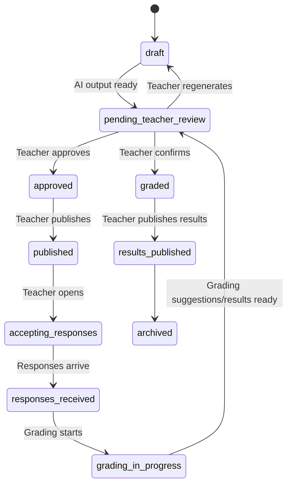
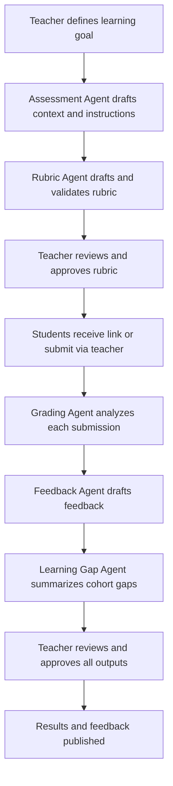
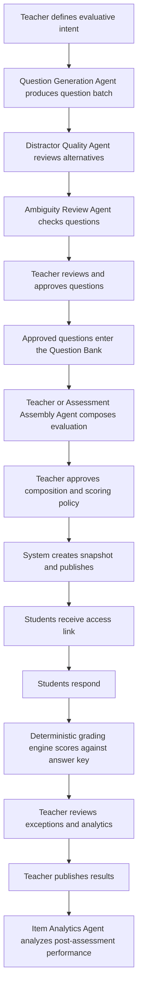
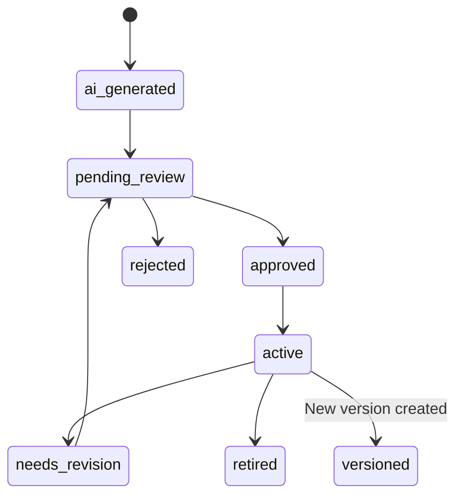

# Assessment Modes

GradeOps AI supports two assessment modes that share the same operational infrastructure but differ in question type, grading mechanism, and AI role.

The choice of mode is made by the teacher when creating an assessment. Both modes produce a `GradeResult` associated with a student, an assessment, and a subject.

## Modes

| Dimension | Open Assessment | Closed Assessment |
| --- | --- | --- |
| Response type | Code, text, development, file, extended answer | Selection of alternatives (TF, single choice, multiple choice) |
| Assessment generation | AI generates context, case, instructions, deliverables, and rubric | AI generates questions, alternatives, answer key, difficulty, and learning outcomes |
| Grading mechanism | AI suggests score against approved rubric; teacher approves | Deterministic engine compares against frozen answer key; teacher reviews exceptions |
| AI role in grading | Interpretive, uncertain, subject to approval | Structural: generate and validate; deterministic at scoring time |
| Main control checkpoint | Rubric approval + grading suggestion approval | Question curation approval + answer key approval |
| Primary risk | Subjectivity, rubric ambiguity, inconsistency | Bad answer key, ambiguous distractors, mismatch between question and snapshot |
| Best use | Practical programming tasks, code review, open-ended problems | Conceptual checks, quick knowledge verification, theory assessment |
| Teacher workload | High: review grading suggestion per student | Low: review exceptions only; review analytics after |

## Common Assessment Lifecycle

Both modes share this base lifecycle:



## Open Assessment Specifics



### AI Role in Open Assessments

The AI generates, interprets, and suggests. The teacher validates every output that reaches a student.

| Step | AI Action | Teacher Action |
| --- | --- | --- |
| Assessment creation | Generates draft | Approves or edits |
| Rubric | Generates criteria and weights | Approves before grading |
| Grading | Suggests score per criterion with evidence | Approves, edits, or rejects |
| Feedback | Drafts student-facing text | Approves before delivery |
| Learning gaps | Summarizes cohort patterns | Confirms instructional relevance |
| Recovery | Suggests reinforcement activity | Approves before use |

## Closed Assessment Specifics



### AI Role in Closed Assessments

The AI generates and validates structure. Grading is deterministic. The teacher curates, not just approves.

| Step | AI Action | Teacher Action |
| --- | --- | --- |
| Question generation | Generates questions, alternatives, key, difficulty, outcomes | Approves/edits/rejects each question |
| Distractor quality | Flags weak distractors, bias, imbalance | Reviews flags; may accept or request regeneration |
| Ambiguity check | Flags multiple valid interpretations, missing context | Resolves before approving |
| Assessment composition | Proposes question selection, balance, punchcard, scoring | Approves final composition |
| Grading | No AI involvement; deterministic engine | Reviews exceptions (duplicates, blanks, ambiguous marks) |
| Results narrative | Item Analytics Agent interprets difficulty and gaps | Reviews before sharing |
| Recovery suggestion | Suggests reinforcement based on item analytics | Approves before use |

### Deterministic Grading Rule

For closed assessments, grading must follow this formula and never involve probabilistic AI judgment:

```text
GradeResult =
  student answer(s)
  + snapshot of frozen answer key
  + scoring policy (full credit / partial credit / penalty)
  + grade scale
  = calculated score
```

This is immutable once the assessment snapshot is published.

## Question Bank

The closed assessment mode requires a question bank. The bank is AI-native: questions are generated by agents, curated by the teacher, and versioned by the system.



| State | Meaning | Usable in assessment |
| --- | --- | --- |
| `ai_generated` | Created by AI, not yet reviewed | No |
| `pending_review` | Awaiting teacher curation | No |
| `approved` | Teacher validated content, alternatives, and key | Yes |
| `active` | In bank and available | Yes |
| `needs_revision` | Has warnings or was flagged as ambiguous | No (unless confirmed) |
| `retired` | Blocked from future use; historical only | No |
| `rejected` | Discarded | No |
| `versioned` | Has a newer version; this version is historical | No as current |

## Snapshot Rule

When a closed assessment is published, the system must freeze:

- all questions;
- all alternatives with their order and labels;
- the answer key;
- the scoring policy;
- the grade scale.

This snapshot cannot be changed after the assessment starts. Changes require a new assessment version and a new assessment run. Any recalculation after the fact must be audited and logged.

## Mode Selection

When a teacher creates an assessment, they select the mode:

```text
Create assessment
  -> Open (practical / code)
  -> Closed (objectives / alternatives)
```

The selection determines:
- which agents run;
- which intake flow is used;
- how grading works;
- which reports are generated.

Mixed mode (open + closed in one assessment) is deferred to a future version.

## Result Model

Both modes produce the same result structure for the student:

| Field | Type | Notes |
| --- | --- | --- |
| `assessment_id` | UUID | Parent assessment |
| `learner_ref_id` | UUID | Student reference |
| `raw_score` | numeric | Points obtained |
| `weighted_score` | numeric | Applied to subject weighting |
| `final_grade` | numeric | Converted using grade scale |
| `grading_status` | enum | `calculated`, `teacher_approved`, `published_to_student` |
| `teacher_approved_by` | UUID | Nullable |
| `published_at` | timestamp | When student can see result |
