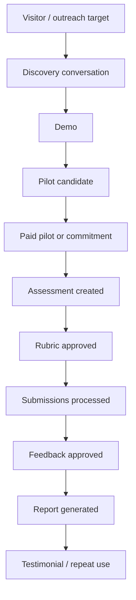

# Metrics

GradeOps AI metrics must prove product value, business viability, AI-native operations, and hackathon evidence.

Metrics are not only analytics. They are part of the product and submission strategy.

## North Star Metric

> Approved feedback outputs generated for real programming submissions.

Why:

- it reflects assessment volume;
- it requires AI operation;
- it requires teacher approval;
- it creates student value;
- it connects directly to workload reduction;
- it can support pricing by graded submissions.

## Metric Groups

| Group | Purpose |
| --- | --- |
| Product usage | Prove teachers use the workflow |
| Workflow completion | Prove the product can run end to end |
| Teacher trust | Prove teachers accept or correct AI outputs |
| Student value | Prove feedback and recovery outputs are generated |
| AI-native operations | Prove agents execute meaningful work |
| Unit economics | Prove cost and pricing discipline |
| Business validation | Prove real demand and revenue |
| Hackathon evidence | Prove submission readiness |

## Product Usage Metrics

| Metric | Definition | Target For Hackathon |
| --- | --- | ---: |
| Teachers registered | Accounts created by educators | 30+ stretch / 10+ minimum |
| Active teachers | Teachers who create or process an assessment | 5+ |
| Assessments created | Assessment records created | 10+ |
| Assessments processed | Assessments with submissions analyzed | 5+ |
| Submissions received | Student submissions stored | 100+ |
| Submissions analyzed | Submissions processed by Grading Agent | 100+ |
| Feedback drafts generated | Feedback outputs created | 300+ stretch / 100+ minimum |
| Reports generated | Teacher reports produced | 5+ |

## Workflow Completion Metrics

| Metric | Definition | Why It Matters |
| --- | --- | --- |
| Assessment creation completion rate | Created assessments that reach rubric generation | Shows intake clarity |
| Rubric approval rate | Rubrics approved by teachers | Shows trust and usability |
| Submission processing completion rate | Submissions that reach analysis result | Shows operational reliability |
| Teacher review completion rate | Suggestions reviewed by teacher | Shows human-in-the-loop works |
| Report generation rate | Assessments that produce final report | Shows full workflow completion |
| Time to first assessment | Time from account creation to first assessment draft | Activation metric |
| Time to first approved feedback | Time from assessment creation to first approved feedback | Value realization metric |

## Teacher Trust Metrics

| Metric | Definition | Interpretation |
| --- | --- | --- |
| AI grading approval rate | Suggestions accepted without score edits | High may indicate trust, but must be checked for blind approval |
| AI grading edit rate | Suggestions edited by teacher | Healthy signal if edits improve quality |
| AI grading rejection rate | Suggestions rejected | High means quality/rubric mismatch |
| Feedback approval rate | Feedback drafts approved | Indicates usefulness |
| Feedback edit rate | Drafts edited before approval | Helps improve prompts/product |
| Uncertainty flag rate | Outputs flagged as uncertain | Shows responsible operation |
| Teacher override count | Number of edits/rejections | Evidence of human authority |

Do not optimize for 100% blind approval. The product should encourage meaningful teacher review.

## AI-Native Operations Metrics

| Metric | Definition | Target |
| --- | --- | ---: |
| Agent runs logged | Every agent execution event | 500+ |
| Agent run success rate | Successful runs / total runs | 90%+ for demo |
| Retry rate | Retried runs / total runs | Track and reduce |
| Failed run rate | Failed runs / total runs | Low and visible |
| Model usage by agent | Which model each agent used | Required for cost/evidence |
| Token usage by agent | Input/output tokens or estimates | Required for unit economics |
| Cost per agent run | Estimated cost per run | Required |
| Cost per assessment | AI/cloud cost per assessment | Required |
| Cost per graded submission | Cost per submission analyzed | Required |
| Premium fallback rate | Premium model runs / total runs | Keep low and explicit |

## Student Value Metrics

| Metric | Definition |
| --- | --- |
| Feedback outputs approved | Teacher-approved feedback items |
| Average feedback turnaround time | Time from submission to approved feedback |
| Learning gaps detected | Unique gap groups identified |
| Recovery activities generated | Activities suggested for gaps |
| Recovery activities approved | Teacher-approved recovery actions |
| Students affected by gap | Count of submissions tied to each gap |

For MVP, student accounts are not required. Student value can be measured from teacher-approved outputs.

## Business Metrics

| Metric | Definition | Target |
| --- | --- | ---: |
| Discovery interviews | Completed educator interviews | 10+ |
| Demo calls | Product demos with target users | 5+ |
| Pilot candidates | Strong candidates with upcoming assessment | 5+ |
| Paid pilots | Paid Pilot Packs | 1-3 minimum / 3+ target |
| Payment commitments | Signed or explicit commitments | 3+ |
| Arms-length revenue | Revenue from unrelated customers | Track separately |
| Related-party revenue | Revenue from known/related contacts | Track separately |
| Revenue by month | Revenue grouped by month | Required |
| Marketing spend | Paid acquisition costs | Report even if zero |
| Customer acquisition cost | Spend / customers | Can be zero for founder-led |
| Testimonials collected | Approved quotes or feedback | 1+ |

## Unit Economics Metrics

| Metric | Definition |
| --- | --- |
| AI runtime cost | Gemini/Vertex model usage cost |
| Cloud runtime cost | Cloud Run/DB/storage/logging estimate |
| Payment fees | Stripe/processor fees |
| Support time | Manual onboarding/review time |
| Cost per customer | Product cost attributed to customer |
| Revenue per customer | Revenue by account |
| Gross margin per offer | Revenue minus attributable cost |
| Free-tier/credits used | Cost covered by credits |
| Cash cost paid | Actual cash spend |
| Allocated tooling cost | Development tooling if reported separately |

## Hackathon Evidence Metrics

| Evidence Metric | Required Artifact |
| --- | --- |
| Users | Customer/pilot list |
| Revenue | Payment evidence or commitments |
| Revenue by month | Revenue ledger |
| Related-party revenue | Related-party flag |
| Costs | Cost ledger/billing evidence |
| Marketing spend | Marketing ledger or US$0 declaration |
| Agent logs | Product dashboard/export |
| API usage | Google/Gemini dashboard screenshots/export |
| Product demo | 3-minute video |
| Customer proof | Testimonials/interview notes |
| Impact | Time saved, feedback speed, gaps detected |

## Activation Funnel



## Product Funnel Metrics

| Stage | Metric |
| --- | --- |
| Assessment started | Assessment draft created |
| Assessment ready | Rubric approved |
| Assessment active | First submission received |
| AI operation | First grading suggestion generated |
| Human control | First teacher approval/edit/rejection |
| Student value | First feedback approved |
| Reporting | Teacher report generated |
| Business evidence | Time saved/cost/revenue linked |

## Quality Thresholds

| Area | Minimum Threshold |
| --- | --- |
| Agent log coverage | 100% of agent runs logged |
| Teacher approval coverage | 100% of student-facing outputs approved or marked pending |
| Cost tracking coverage | 90%+ of agent runs have model/cost estimate |
| Submission processing | 90%+ of valid submissions processed successfully |
| Report generation | 80%+ of processed assessments generate report |
| Evidence completeness | 100% of paid pilots have revenue/customer evidence record |

## Time-Saved Estimation

Time saved should be estimated transparently.

Suggested simple formula:

```text
Estimated time saved =
teacher baseline estimate
- actual teacher review/edit time
- onboarding/setup time if included
```

If baseline is unknown, collect teacher estimate:

- time usually spent creating assessment;
- time usually spent grading;
- time usually spent writing feedback;
- time usually spent preparing report.

Label all values as estimates unless directly measured.

## Event Instrumentation

Minimum events:

| Event | Trigger |
| --- | --- |
| `teacher_signed_in` | Teacher logs in |
| `assessment_created` | Assessment brief saved |
| `agent_run_started` | Agent begins |
| `agent_run_completed` | Agent succeeds |
| `agent_run_failed` | Agent fails |
| `rubric_generated` | Rubric draft created |
| `rubric_approved` | Teacher approves rubric |
| `submission_received` | Submission stored |
| `submission_analyzed` | Grading suggestion created |
| `grading_suggestion_approved` | Teacher approves score |
| `grading_suggestion_edited` | Teacher edits score |
| `grading_suggestion_rejected` | Teacher rejects score |
| `feedback_generated` | Feedback draft created |
| `feedback_approved` | Teacher approves feedback |
| `learning_gap_generated` | Gap summary created |
| `recovery_activity_generated` | Recovery suggestion created |
| `teacher_report_generated` | Report created |
| `evidence_dashboard_viewed` | Operator/teacher views evidence |
| `payment_recorded` | Revenue event added |
| `testimonial_recorded` | Customer quote/evidence added |

## Dashboard Views

### Teacher Dashboard

- assessments;
- pending approvals;
- submissions processed;
- feedback ready;
- report ready;
- common gaps.

### Operator/Hackathon Dashboard

- users;
- customers/pilots;
- assessments processed;
- submissions processed;
- agent runs;
- model usage;
- estimated costs;
- revenue evidence;
- related-party revenue;
- testimonials;
- time saved.

## Metrics Anti-Patterns

Avoid:

- vanity user counts without real assessment runs;
- counting AI drafts as student value before teacher approval;
- hiding failed agent runs;
- mixing related-party and arms-length revenue;
- reporting credits as if costs do not exist;
- claiming time saved without baseline;
- optimizing for AI approval rate without quality review.

## Metrics Conclusion

GradeOps AI should measure what it claims to be:

> a real AI-operated assessment workflow for programming educators with teacher control, evidence, cost awareness, and business validation.
