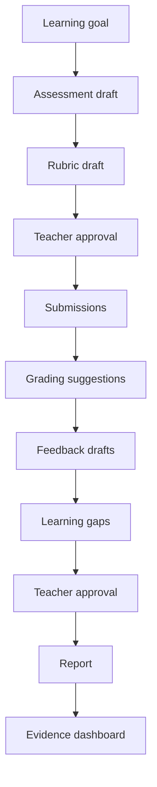

# MVP Scope

GradeOps AI MVP is a focused product workflow for programming educators.

It must prove one thing clearly:

> A teacher can run a practical programming assessment with AI agents, keep final control, generate useful feedback/reporting, and produce auditable evidence of usage, cost, and AI-native operations.

The MVP is not a full LMS, not a generic quiz generator, not a student chatbot, and not an OCR-first grading platform.

## Alignment With Canonical Strategy

| Canonical Decision | Product Scope Implication |
| --- | --- |
| Initial wedge: programming assessments | Build only for practical programming tasks first |
| Core promise: run the next assessment with AI agents | Prioritize end-to-end assessment workflow over feature breadth |
| Teacher authority | Every high-impact output requires teacher review/approval |
| AI-native operations | Agent executions must be visible, logged, and structured |
| Pricing by assessments/submissions | Product must track assessment count and graded-submission count |
| Hackathon evidence | Usage, cost, revenue, customer, and agent evidence must be captured from day one |

## MVP Product Objective

Enable a programming educator to:

1. create an assessment from a learning goal;
2. generate a rubric and expected evidence;
3. receive student submissions;
4. generate grading suggestions against the rubric;
5. draft personalized feedback;
6. detect cohort-level learning gaps;
7. approve or edit AI outputs;
8. generate a teacher report;
9. see the agent logs, model usage, cost estimates, and evidence dashboard.

## Target User For MVP

Primary MVP user:

> A programming instructor, tutor, or bootcamp teacher who runs recurring practical assessments and wants to reduce grading/feedback workload without losing pedagogical control.

Secondary user:

> A small academy or bootcamp operator who needs visibility into cohort outcomes and assessment consistency.

## MVP Experience

The first usable product should feel like an assessment operations console, not a general admin system.

A teacher should be able to complete this loop:

## MVP Scope Matrix

| Area | Must Build | Should Build | Could Build Later | Do Not Build Now |
| --- | --- | --- | --- | --- |
| Authentication | Simple teacher login | Account profile | Organization admin | Complex SSO |
| Assessment creation | Learning-goal intake and constraints | Templates for intro programming | Rich curriculum mapping | Full LMS authoring |
| Rubrics | AI-generated rubric draft | Rubric validation notes | Rubric library | Institutional rubric governance |
| Submissions | Text/code paste and simple file upload | CSV/bulk import | GitHub Classroom integration | OCR/photo-first intake |
| Grading assistance | Rubric-based score suggestion | Uncertainty flags | Code execution sandbox | Fully autonomous grading |
| Feedback | Individual feedback draft | Tone/style controls | Feedback templates | Student chatbot |
| Learning gaps | Cohort summary | Gap-to-recovery mapping | Longitudinal analytics | Predictive student profiling |
| Recovery | Suggested remedial activity | Short exercise draft | Personalized recovery plan | Full adaptive learning system |
| Teacher review | Approve/edit/reject states | Bulk approve with warnings | Review delegation | Silent AI delivery |
| Reports | Teacher report | Export PDF/CSV | Cohort comparison | BI suite |
| Evidence | Agent logs, usage, cost estimate | Business dashboard | Public evidence export | Hidden logs |
| Payments | Manual/Stripe evidence outside product acceptable | Basic plan flag | Self-serve billing | Complex metering marketplace |

## In Scope

### 1. Teacher Workspace

The teacher can see:

- assessments;
- current status;
- submission count;
- pending approvals;
- report availability;
- evidence dashboard link.

### 2. Assessment Intake

Teacher inputs:

- learning goal;
- programming topic;
- target level;
- language or pseudocode;
- expected duration;
- number of students;
- constraints;
- optional existing instructions.

Example:

> Evaluate conditionals, loops, and functions in Java for first-semester students. Duration: 90 minutes. Difficulty: basic.

### 3. Assessment Draft Generation

Assessment Agent produces:

- title;
- context;
- instructions;
- learning objectives;
- expected deliverables;
- allowed resources;
- evaluation criteria summary;
- student-facing statement.

### 4. Rubric Generation And Validation

Rubric Agent produces:

- criteria;
- weights;
- performance levels;
- scoring notes;
- common mistakes;
- validation warnings;
- ambiguity flags.

### 5. Teacher Approval For Assessment And Rubric

Teacher can:

- approve;
- edit;
- reject/regenerate;
- add notes;
- lock rubric for grading.

No grading should start until the rubric is approved or explicitly marked as draft/demo.

### 6. Submission Intake

Supported MVP input types:

- pasted code/text;
- uploaded `.txt`, `.java`, `.py`, `.js`, `.ts`, `.html`, `.css`, `.md`;
- manual student identifier;
- bulk paste/import if simple.

Student accounts are not required for MVP if that slows delivery. Teacher-managed submission intake is acceptable.

### 7. Grading Assistance

Grading Agent produces:

- suggested score;
- score per rubric criterion;
- evidence found in submission;
- missing requirements;
- uncertainty flags;
- teacher review recommendation.

The product must communicate clearly:

> Suggested score is not final until teacher approval.

### 8. Feedback Drafts

Feedback Agent produces:

- concise feedback;
- strengths;
- improvement areas;
- next step;
- rubric criterion references;
- tone suitable for students.

### 9. Learning Gap Summary

Learning Gap Agent produces:

- repeated errors;
- affected students count;
- affected rubric criteria;
- severity;
- suggested class-level reinforcement.

### 10. Recovery Activity

Recovery Agent produces:

- short remedial exercise;
- focus topic;
- instructions;
- expected output;
- optional hints;
- relationship to detected gaps.

### 11. Teacher Report

Teacher Report Agent produces:

- assessment summary;
- distribution of suggested/approved results;
- common errors;
- learning gaps;
- suggested next class action;
- time-saved estimate;
- evidence summary.

### 12. Agent Log And Evidence Capture

Each agent execution must record:

- timestamp;
- teacher/account;
- assessment;
- submission if applicable;
- agent name;
- action type;
- model used;
- input summary;
- output summary;
- status;
- token estimate;
- cost estimate;
- uncertainty flags;
- approval state;
- final action taken.

## Out Of Scope

Do not build in the MVP:

- full LMS;
- student social features;
- chat tutor;
- institution-wide administration;
- complex roles/permissions;
- SSO;
- mobile app;
- OCR-heavy workflow;
- plagiarism detection as a core claim;
- code execution sandbox unless trivial and safe;
- advanced curriculum mapping;
- marketplace of assessments;
- broad multi-subject support;
- fully autonomous grading.

## MVP User Roles

| Role | MVP Permissions |
| --- | --- |
| Teacher | Create assessment, approve rubric, upload submissions, review grading, approve feedback, view report/logs |
| Operator/Admin | View evidence dashboard, cost/revenue summary, customer/pilot status |
| Student | Not required as login for MVP; can be represented as submission record |

## Required Product States

### Assessment States

| State | Meaning |
| --- | --- |
| `draft` | Created but not yet approved |
| `rubric_pending_review` | Rubric generated and waiting for teacher |
| `ready_for_submissions` | Teacher approved assessment/rubric |
| `submissions_received` | At least one submission is present |
| `grading_in_progress` | Agent grading is running |
| `pending_teacher_review` | Suggestions are ready for review |
| `approved` | Teacher approved student-facing outputs |
| `reported` | Teacher report was generated |
| `archived` | Workflow closed |

### Submission States

| State | Meaning |
| --- | --- |
| `received` | Submission stored |
| `analysis_pending` | Waiting for agent processing |
| `analyzed` | Grading suggestion exists |
| `needs_review` | Teacher must inspect |
| `approved` | Teacher approved result/feedback |
| `edited_by_teacher` | Teacher changed AI output |
| `rejected` | Teacher rejected AI output |
| `excluded` | Submission removed from final report |

### Agent Run States

| State | Meaning |
| --- | --- |
| `queued` | Waiting to run |
| `running` | Agent processing |
| `succeeded` | Output generated |
| `failed` | Agent failed |
| `retried` | Re-run after failure |
| `requires_human_review` | Output has risk/uncertainty |
| `approved` | Output accepted |
| `edited` | Output changed |
| `rejected` | Output rejected |

## Non-Functional MVP Requirements

| Requirement | MVP Expectation |
| --- | --- |
| Traceability | Every agent output must map to an assessment/submission and model used |
| Cost visibility | Every agent run should have an estimated cost |
| Human control | High-impact outputs require teacher approval |
| Reliability | Failure states must not lose submissions or teacher edits |
| Privacy | Store minimal student data and avoid unnecessary sensitive information |
| Demo readiness | Core flow must be demonstrable in under 3 minutes |
| Exportability | Reports/evidence should be exportable or screenshot-ready |
| English readiness | Public/demo content should be available in English for submission |

## MVP Acceptance Criteria

The MVP is acceptable when:

1. a teacher can create one programming assessment from a learning goal;
2. AI generates an assessment and rubric as structured data;
3. the teacher can approve or edit the rubric;
4. at least 30 submissions can be ingested in a controlled demo/pilot;
5. grading suggestions are generated against the rubric;
6. feedback drafts are produced per submission;
7. learning gaps and recovery suggestions are produced;
8. the teacher can approve/edit/reject outputs;
9. a report is generated;
10. agent logs and cost estimates are visible;
11. the workflow can be shown in a 3-minute demo;
12. the same flow can support at least one real or semi-real pilot.

## MVP Cut Line

When time is short, protect these features first:

1. assessment creation;
2. rubric generation;
3. submission intake;
4. grading suggestions;
5. teacher approval;
6. feedback drafts;
7. report;
8. agent logs/evidence.

Everything else is secondary.

## Product Conclusion

The MVP should be narrow enough to build quickly and strong enough to prove the business.

The winning product story is not:

> We built many education features.

It is:

> We ran real programming assessments with AI agents, teachers stayed in control, students got feedback faster, and the business captured usage, cost, revenue, and operational evidence.
