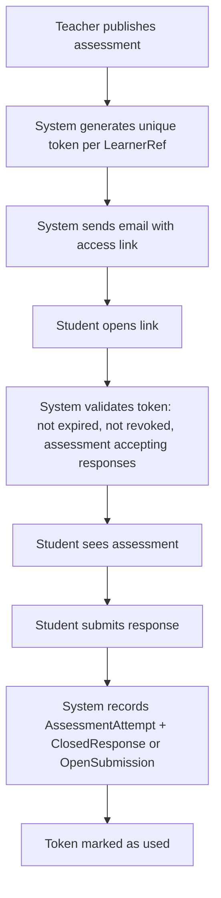
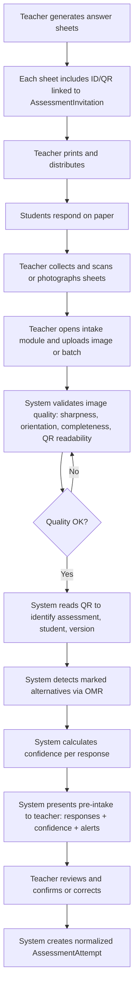
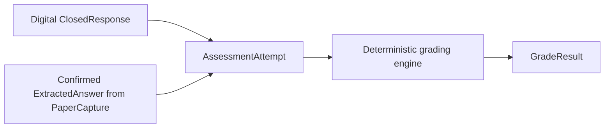
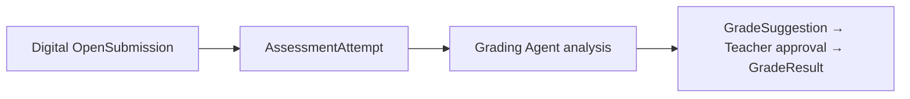

# Response Intake

GradeOps AI accepts student responses through two channels. Both channels produce a normalized `AssessmentAttempt`, which feeds the same grading and results pipeline.

## Intake Principle

```text
Every response, regardless of intake channel, must produce a normalized AssessmentAttempt.
```

The intake channel determines how the response enters the system. Once the response is normalized, grading, exception review, and result publication are identical regardless of channel.

## Channels

| Channel | Assessment type | Priority | Mechanism |
| --- | --- | --- | --- |
| Digital — secure link | Open + Closed | P0 | Student responds via web portal using a signed access token |
| Physical — scanned answer sheet | Closed only | P1 | Teacher scans or photographs paper answer sheets; system extracts responses via OMR/QR |

Mixed-channel intake (same student responds both digitally and physically) is an exception case covered in the conflict resolution section.

## Digital Intake (P0)

Students receive an email with a unique, signed `assessment_access_link`. They open the link, respond, and submit without creating an account. See [Student Access](./student-access.md) for the full student experience and token security rules.

### Digital Flow



### Applies To

- Closed assessments: student selects alternatives in web interface.
- Open assessments: student submits text, code, or file attachment.

## Physical Intake (P1)

Physical intake is designed for closed assessments applied with printed answer sheets. It is the recommended intake path when students do not have access to devices or when the evaluation context requires paper-based delivery.

### OCR vs OMR

| Technique | Best use in GradeOps AI |
| --- | --- |
| OMR (Optical Mark Recognition) | Detecting selected alternatives in bubble or checkbox format on structured answer sheets |
| OCR (Optical Character Recognition) | Reading identifiers, names, or codes written on the sheet; open-ended text if added as P2 |
| QR / unique code | Linking a physical sheet to a specific `AssessmentInvitation`, evaluation, and student without manual association |
| Computer Vision | Detecting sheet orientation, crop boundaries, shadows, and zone alignment before OMR |

For closed assessments, the primary technique is **OMR + QR**. OCR is used only for reading printed or handwritten identifiers when QR is unavailable.

### Physical Flow



### Physical Answer Sheet Requirements

Every printed answer sheet must include:

- Unique ID or QR linked to `AssessmentInvitation` (student + assessment + version).
- Student display name or identifier (for visual confirmation).
- Assessment title and version label.
- Alignment marks for orientation detection.
- Clear, separated response zones per question.
- Instructions for marking.
- Space for teacher validation if manual association is needed.

### Capture States

| State | Meaning |
| --- | --- |
| `uploaded` | Image received by system |
| `quality_check` | System evaluating image quality |
| `accepted_for_processing` | Image passes quality check |
| `rejected_quality` | Image rejected; teacher must recapture |
| `processing` | OMR and QR extraction running |
| `extraction_completed` | Responses detected; ready for teacher review |
| `needs_human_review` | Low confidence or ambiguity requires teacher action |
| `confirmed` | Teacher confirmed extracted responses |
| `failed` | Processing failed; logged for retry |

### Response Confidence States

| State | Meaning |
| --- | --- |
| `high_confidence` | Mark is clear and unambiguous |
| `low_confidence` | Detection is uncertain; teacher should review |
| `ambiguous` | Multiple marks detected or mark position is unclear |
| `blank` | No mark detected for this question |
| `manually_corrected` | Teacher overrode the detected value |

## Intake Edge Cases

### Physical Intake Exceptions

| Case | Recommended handling |
| --- | --- |
| QR code unreadable | Teacher selects student and assessment manually; action is audited |
| Sheet has no QR but has printed student identifier | System prompts OCR check; teacher confirms association manually |
| Two alternatives marked in single-choice question | Flag as ambiguous; teacher resolves before grading |
| Weak or erased mark | Show low confidence; teacher confirms |
| Sheet image blurry or incomplete | Reject and request recapture |
| Duplicate sheet for same student | Alert teacher; teacher decides which to use; both preserved in log |
| Sheet belongs to a different assessment or version | Block intake; prevent cross-assessment contamination |

### Digital Intake Exceptions

See [Student Access — MVP Pending Decisions](./student-access.md) and [Workflows — Workflow 4d](./workflows.md) for token validation edge cases (expired links, already-submitted attempts, etc.).

## Conflict Resolution: Dual-Channel Attempts

A student should not have two valid normalized attempts for the same assessment unless explicitly allowed by the teacher.

| Scenario | Default behavior |
| --- | --- |
| Student submitted digitally; teacher also uploads paper sheet for same student | Block paper intake; teacher must decide which attempt to keep |
| Paper sheet processed twice for same student | Detect duplicate; alert teacher |
| Digital link used after paper sheet was already confirmed | Block if confirmed paper attempt exists; prompt teacher |
| Teacher allows multiple attempts (configured) | Register attempt N; policy determines which counts for grading |
| Student was absent; no response received | Teacher marks as `excluded`; no `GradeResult` is generated |

## Normalization to AssessmentAttempt

After intake, the system creates a normalized attempt regardless of channel.



For open assessments:


## Relationship to Data Model

The intake channel is recorded on `AssessmentAttempt.channel`:

| Value | Meaning |
| --- | --- |
| `online` | Student responded via digital link |
| `paper_scan` | Teacher uploaded scanned/photographed sheet; confirmed by teacher |

Physical intake entities (`PaperAnswerSheet`, `PaperCapture`, `ExtractedAnswer`) are defined as P1 entities in the [data model](../04-architecture/data-model.md).

## Scope

### P0

- Digital link delivery and web response portal for closed assessments.
- Digital file or text submission for open assessments.
- Normalized `AssessmentAttempt` creation for all digital responses.
- Duplicate detection and conflict resolution for digital channel.

### P1

- Printable answer sheet generation with QR per student.
- Image upload and quality validation.
- OMR-based alternative detection.
- Confidence scoring and teacher review queue for physical captures.
- Conflict resolution for dual-channel attempts.
- Batch upload of multiple physical sheets.

### P2

- OCR for open answer text on paper.
- Automatic perspective and rotation correction.
- Mobile app for in-classroom capture.
- Offline recognition.
- Mixed open + closed answer sheets.

<!-- nav -->

---

← [Student Access](student-access.md) | [↑ inicio](#response-intake) | [README](README.md) | [Curriculum Structure →](curriculum-structure.md)
