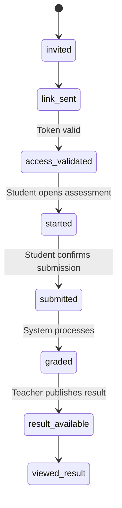
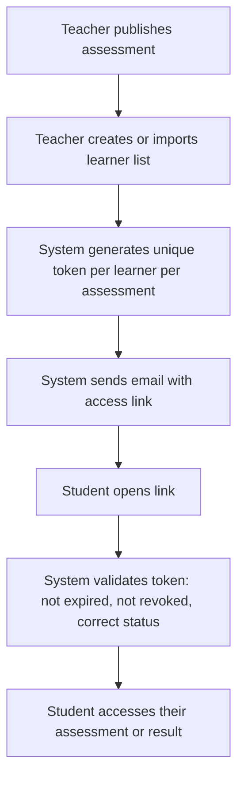

# Student Access

GradeOps AI gives students a minimal, secure access surface for responding to assessments and reviewing published results. Students do not need a registered account.

Access is granted through **unique, signed tokens delivered to the student's email by the teacher**.

## Core Principle

```text
Students access their evaluation using a secure link sent to their email.
They can respond to an assessment and see published results.
They cannot list other students' assessments, see internal logs, or access any other account data.
```

This avoids building a student LMS portal while still enabling the operation to include real student responses and result delivery.

## Actor Definition

The student in GradeOps AI is a `LearnerRef`: a lightweight reference record created by the teacher for one course section or assessment run.

| Field | Type | Notes |
| --- | --- | --- |
| `id` | UUID | Primary key |
| `organization_id` | UUID | Tenant boundary |
| `email` | string | Used for link delivery |
| `display_name` | string | Optional; teacher-provided |
| `external_identifier` | string | Optional roster code, LMS ID, or alias |

A `LearnerRef` is not a login account. It exists only to enable link delivery and result association.

## Link Types

| Link | Purpose | Expiry |
| --- | --- | --- |
| `assessment_access_link` | Lets the student respond to or submit an open assessment | Configurable; default: after submission |
| `result_access_link` | Lets the student view published results and feedback | Configurable; default: until archived |
| `magic_reauth_link` | Regenerates access when original link expired or lost | One-time use |

Links are sent by the teacher or system when the assessment is published. The teacher can revoke any link.

## Student Lifecycle



## Invitation Flow



## What Students Can See

| Information | Open Assessment | Closed Assessment |
| --- | --- | --- |
| Assessment instructions and context | Yes | Yes |
| Their submitted answer | Yes | Yes |
| Their final grade | Yes, after publication | Yes, after publication |
| Their total score | Yes | Yes |
| Teacher-approved feedback | Yes | Configurable |
| Rubric or criteria | Configurable by teacher | Not applicable / summary only |
| Correct answers | No, unless teacher enables it | Configurable by teacher |
| Questions they answered incorrectly | Not applicable | Configurable |
| Recovery suggestions | Yes, if teacher publishes | Yes, if teacher publishes |
| Internal agent logs | No | No |
| AI confidence scores or model info | No | No |
| Cost estimates or internal metadata | No | No |
| Other students' data | Never | Never |

## Result Portal

The student result portal is a stateless, link-authenticated view. It is not a dashboard or an account.

Access flow:

```text
Student opens result_access_link from email
  -> System validates token
  -> Student sees: assessment name, their grade, feedback if published
  -> Student can download or copy feedback if teacher enabled it
  -> Student cannot navigate to other assessments without a new link
```

If the student does not have the result link, they can request a resend:

```text
Student enters email in "resend my link" form
  -> System sends new magic link if a result is published and learner exists
  -> System does not confirm or deny whether the email exists (rate-limited)
```

## Security Rules

| Rule | Rationale |
| --- | --- |
| Token stored as hash, never as plain text | Prevents link theft from database breach |
| Token is high-entropy random value | Resistant to brute force |
| Token is scoped to one `learner_ref_id` + one `assessment_id` | No cross-student access possible |
| Expiry is configurable | Teacher controls access window |
| Revocation is immediate | Teacher can close access anytime |
| System validates assessment status before token use | Cannot access a result not yet published |
| Rate limiting on all student-facing endpoints | Prevents enumeration and abuse |
| Student email not confirmed or denied in public API | No exposure of roster |
| Access events logged | Full audit trail per student per assessment |
| No shared links | Each student gets their own token |

## MVP Pending Decisions

| Decision | Recommendation |
| --- | --- |
| Can the student reopen the assessment before submitting? | Yes; allow reopen until first submission |
| Can the student save progress before submitting? | P1; in MVP, single submission with pre-submit review |
| Can the student see correct answers for closed assessments? | Configurable by teacher |
| Can the student appeal or request review? | P2; MVP shows result only |
| Can the student submit late? | Flag as late; teacher decides |
| Can the student have multiple attempts? | Configurable; P0 default is one attempt |
| Is the grade scale shown to the student? | Yes, after teacher publishes result |

## Student Privacy Rules

- Store minimal student data: email, display name, external identifier.
- Do not expose full names in URLs or public surfaces.
- Do not include student submission content in public screenshots.
- Token hashes must not appear in logs; log only `learner_ref_id` and event type.
- Delete or anonymize student data at the end of a pilot if requested.
- Do not cross-share student data across organizations.
