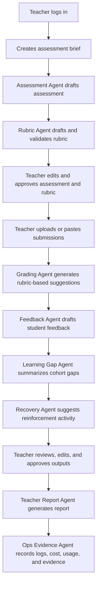
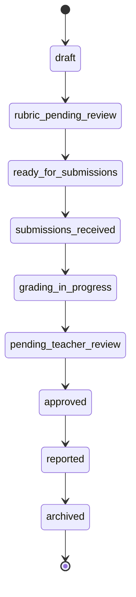
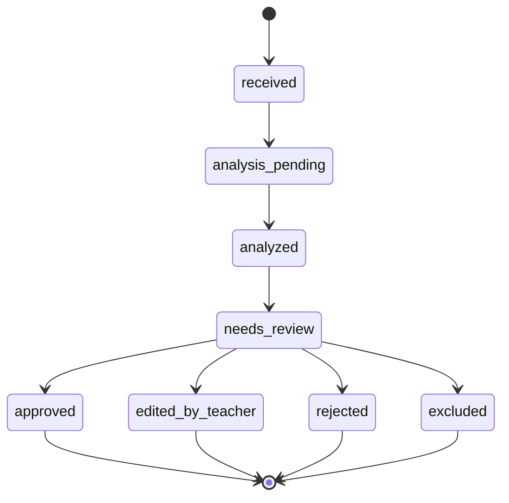
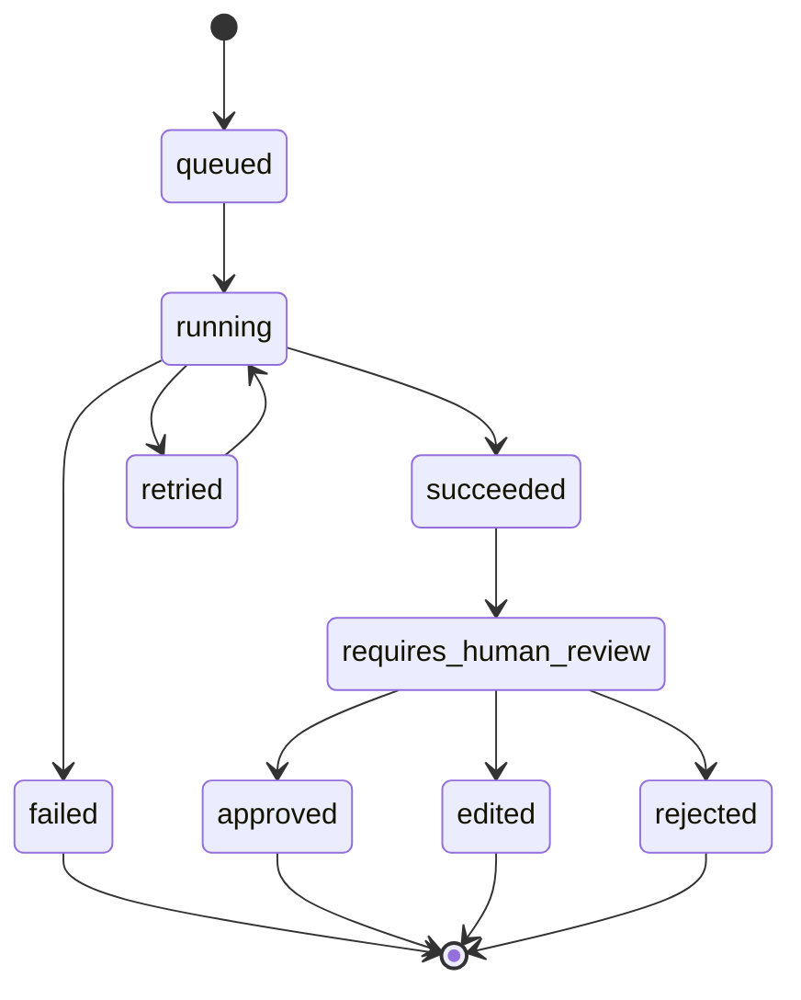

# Workflows

This document defines the main product workflows for GradeOps AI MVP.

The workflow principle is:

> AI agents operate repetitive assessment steps; teachers retain judgment, standards, and final approval.

## Workflow Map

| Workflow | Primary User | MVP Priority |
| --- | --- | --- |
| Teacher onboarding | Teacher | P0 |
| Assessment creation | Teacher + Assessment Agent | P0 |
| Rubric generation and approval | Teacher + Rubric Agent | P0 |
| Submission intake | Teacher | P0 |
| Grading assistance | Teacher + Grading Agent | P0 |
| Feedback approval | Teacher + Feedback Agent | P0 |
| Learning gap and recovery | Teacher + Learning Gap/Recovery Agents | P0 |
| Teacher report | Teacher + Teacher Report Agent | P0 |
| Evidence dashboard | Operator / demo | P0 |
| Pilot/business evidence | Operator | P1 |

## Core End-To-End Workflow



## Workflow 1: Teacher Onboarding

### Goal

Teacher reaches the workspace and can start a first assessment.

### Steps

1. Teacher signs in.
2. Teacher sees workspace.
3. Teacher sees CTA: `Create assessment`.
4. Product explains control principle:
   - AI drafts;
   - teacher approves;
   - agent actions are logged.
5. Teacher starts first assessment.

### Required Data

- teacher account;
- email;
- organization or individual label;
- pilot/customer status;
- plan/usage limits if available.

### Success Criteria

- Teacher can reach `Create assessment` without confusion.
- Teacher understands AI will not finalize grading alone.

## Workflow 2: Assessment Creation

### Goal

Generate a practical programming assessment from a teacher-defined learning goal.

### Steps

1. Teacher enters:
   - learning goal;
   - topic;
   - level;
   - language/pseudocode;
   - duration;
   - student count;
   - constraints;
   - optional context.
2. Teacher clicks `Generate assessment`.
3. Assessment Agent runs.
4. Product stores agent run log.
5. Teacher reviews draft.
6. Teacher edits or regenerates.
7. Teacher accepts draft for rubric generation.

### Agent Output

Assessment Agent should return structured data:

```json
{
  "title": "Basic Java Control Flow Assessment",
  "context": "Students must solve...",
  "learning_objectives": [],
  "instructions": [],
  "deliverables": [],
  "constraints": [],
  "estimated_duration_minutes": 90,
  "difficulty": "basic"
}
```

### Failure Handling

| Failure | Handling |
| --- | --- |
| Agent timeout | Show retry option and log failure |
| Output invalid | Show validation error and allow regeneration |
| Teacher dislikes draft | Allow edit or regenerate with notes |
| Missing input | Require minimum fields before running agent |

## Workflow 3: Rubric Generation And Approval

### Goal

Create a structured rubric that can drive grading suggestions.

### Steps

1. Teacher requests rubric.
2. Rubric Agent generates criteria and weights.
3. Rubric Agent validates consistency.
4. Product displays:
   - criteria;
   - weights;
   - levels;
   - validation notes;
   - ambiguity warnings.
5. Teacher edits rubric.
6. Teacher approves rubric.
7. Approved rubric becomes grading baseline.

### Approval Rule

Grading cannot proceed unless:

- rubric is approved; or
- workflow is explicitly marked as demo/draft with visible warning.

### Rubric Output Structure

```json
{
  "criteria": [
    {
      "id": "C1",
      "name": "Correct use of conditionals",
      "weight": 25,
      "levels": [
        {
          "label": "Excellent",
          "score": 25,
          "description": "Uses conditionals correctly..."
        }
      ],
      "common_mistakes": []
    }
  ],
  "validation_notes": [],
  "total_weight": 100
}
```

## Workflow 4: Submission Intake

### Goal

Collect student submissions in a simple MVP-compatible way.

### Supported Intake

- paste code/text;
- upload simple files;
- simple bulk import/paste if available.

### Steps

1. Teacher opens assessment.
2. Teacher adds submissions.
3. For each submission:
   - student identifier is added;
   - code/text/file is stored;
   - status becomes `received`.
4. Teacher reviews submission list.
5. Teacher starts analysis.

### Submission Data

- submission ID;
- assessment ID;
- student identifier;
- submitted content or file reference;
- created timestamp;
- processing status;
- error state if any.

### Failure Handling

| Failure | Handling |
| --- | --- |
| Unsupported file | Reject with clear message |
| Empty submission | Mark invalid |
| Duplicate student identifier | Warn teacher |
| Large submission | Warn and estimate higher cost or require confirmation |

## Workflow 5: Grading Assistance

### Goal

Generate rubric-based scoring suggestions while preserving teacher authority.

### Steps

1. Teacher clicks `Analyze submissions`.
2. Grading Agent processes each submission.
3. Agent returns score suggestion per rubric criterion.
4. Agent flags uncertainty.
5. Product displays review queue.
6. Teacher reviews each suggestion.
7. Teacher approves, edits, rejects, or marks needs review.

### Grading Output

```json
{
  "submission_id": "SUB-001",
  "suggested_total_score": 82,
  "criteria_results": [
    {
      "criterion_id": "C1",
      "suggested_score": 20,
      "evidence_summary": "Uses if/else correctly...",
      "issues": [],
      "uncertainty": "low"
    }
  ],
  "overall_feedback_basis": [],
  "uncertainty_flags": []
}
```

### Teacher Review Actions

| Action | Meaning |
| --- | --- |
| Approve | Teacher accepts suggestion |
| Edit | Teacher changes score or notes |
| Reject | Teacher rejects AI output |
| Needs review | Teacher defers decision |
| Exclude | Submission excluded from report |

### Control Principle

AI output must be labeled as suggestion until teacher approval.

## Workflow 6: Feedback Draft And Approval

### Goal

Generate useful student-facing feedback based on rubric and teacher-reviewed grading.

### Steps

1. Feedback Agent uses grading suggestion or teacher-approved score.
2. Agent drafts feedback.
3. Teacher reviews feedback.
4. Teacher edits tone/content if needed.
5. Teacher approves final feedback.
6. Feedback becomes available for export/delivery.

### Feedback Output

```json
{
  "student_identifier": "student-01",
  "summary": "Good progress...",
  "strengths": [],
  "improvement_areas": [],
  "next_steps": [],
  "rubric_references": []
}
```

### Delivery

MVP delivery can be:

- copy/export;
- downloaded report;
- manual sending by teacher.

Automatic student delivery is not required for MVP.

## Workflow 7: Learning Gap And Recovery

### Goal

Summarize repeated cohort issues and suggest recovery actions.

### Steps

1. Learning Gap Agent reads rubric results and feedback basis.
2. Agent groups common mistakes.
3. Agent identifies affected criteria and severity.
4. Recovery Agent suggests reinforcement activity.
5. Teacher reviews suggestions.
6. Approved recovery action appears in report.

### Learning Gap Output

```json
{
  "gaps": [
    {
      "topic": "Loop termination condition",
      "criterion_ids": ["C2"],
      "affected_submissions": 12,
      "severity": "high",
      "evidence_summary": "Students often used..."
    }
  ]
}
```

### Recovery Output

```json
{
  "activity_title": "Fixing loop termination errors",
  "target_gap": "Loop termination condition",
  "instructions": [],
  "expected_output": "",
  "teacher_notes": ""
}
```

## Workflow 8: Teacher Report

### Goal

Generate a teacher-facing summary of the assessment run.

### Steps

1. Teacher requests report.
2. Teacher Report Agent gathers:
   - assessment;
   - rubric;
   - submission results;
   - feedback status;
   - learning gaps;
   - recovery suggestions;
   - usage/cost evidence.
3. Report is generated.
4. Teacher can edit summary.
5. Report can be exported or screenshotted.

### Report Sections

- assessment overview;
- submission count;
- grading summary;
- common mistakes;
- learning gaps;
- recommended next teaching action;
- recovery activity;
- time-saved estimate;
- agent/evidence summary.

## Workflow 9: Agent Logs And Evidence Dashboard

### Goal

Prove AI-native operations, cost awareness, and business evidence.

### Steps

1. Every agent run creates an event.
2. Events are stored.
3. Dashboard aggregates:
   - assessments;
   - submissions;
   - agent runs;
   - feedback outputs;
   - model usage;
   - cost estimates;
   - approval states;
   - failures/retries.
4. Operator uses dashboard for demo and submission evidence.

### Dashboard Minimum

| Metric | Purpose |
| --- | --- |
| Assessments processed | Product usage |
| Submissions reviewed | Operational volume |
| Feedback outputs | Value output |
| Agent runs | AI-native proof |
| Teacher approval rate | Trust and quality |
| Estimated AI cost | Unit economics |
| Time saved estimate | Business value |
| Failed/retried runs | Reliability evidence |

## Workflow 10: Pilot Business Evidence

### Goal

Connect product usage to business validation.

### Steps

1. Operator creates customer/pilot record.
2. Customer is associated with assessment runs.
3. Payment/commitment evidence is stored externally or linked.
4. Product logs usage.
5. Operator records testimonial/feedback.
6. Evidence is summarized for hackathon.

### Evidence Fields

- customer ID;
- segment;
- related-party flag;
- offer/plan;
- payment/commitment status;
- assessments processed;
- submissions processed;
- agent runs;
- estimated cost;
- time saved;
- testimonial status.

## Workflow States

### Assessment Lifecycle



### Submission Lifecycle



### Agent Run Lifecycle



## Critical Failure Workflows

### Agent Failure

1. Agent fails.
2. Status becomes `failed`.
3. Failure is logged.
4. Teacher sees retry option.
5. Product prevents silent loss of work.

### Low Confidence Output

1. Agent marks uncertainty.
2. Submission becomes `requires_human_review`.
3. Bulk approval is blocked or warned.
4. Teacher must inspect manually.

### Teacher Rejects Output

1. Teacher rejects score/feedback.
2. Rejection reason can be captured.
3. Final report notes teacher override count.
4. Agent output remains in audit trail.

### Cost Spike Warning

1. Submission is unusually long or model fallback is required.
2. Product warns operator/teacher if needed.
3. Cost is logged.
4. Premium fallback is not default.

## Workflow Conclusion

The product workflow should feel controlled, transparent, and operational.

The best demo is not a tour of screens. It is a proof that:

> A real assessment moved from learning goal to rubric, submissions, grading suggestions, feedback, report, teacher approval, and auditable AI-agent evidence.
