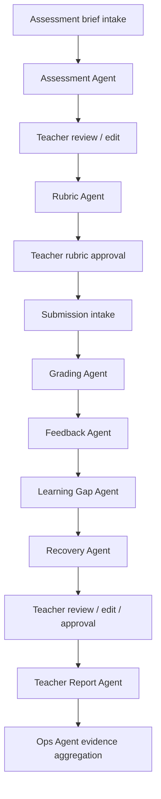

# Agents Overview

GradeOps AI uses specialized agents to operate the assessment workflow for programming educators. The agent layer is not a generic chatbot: each agent owns a bounded responsibility, returns structured output, creates audit evidence, and hands control back to the teacher when the output affects grading, feedback, reports, trust, or student-facing communication.

## Canonical Alignment

| Decision | Agent implication |
| --- | --- |
| Initial wedge: programming assessments | Agents specialize in practical programming assessment operations. |
| Teacher authority | Agents suggest; teachers approve high-impact outputs. |
| AI-native operation | Agent runs must be visible, logged, and demo-ready. |
| Business evidence | Logs support usage, cost, revenue, customer proof, and hackathon submission. |
| Pricing by assessments/submissions | Agents must track assessment and submission-level cost/usage. |

## Agent Set

| Agent | Responsibility | Primary output |
| --- | --- | --- |
| Assessment Agent | Draft assessment from learning goal and constraints. | Assessment brief. |
| Rubric Agent | Create and validate scoring rubric. | Rubric and validation notes. |
| Grading Agent | Analyze submissions against approved rubric. | Grading suggestions. |
| Feedback Agent | Draft student-facing feedback. | Feedback drafts. |
| Learning Gap Agent | Detect repeated cohort/student gaps. | Gap summary. |
| Recovery Agent | Suggest remedial activities. | Recovery activity. |
| Teacher Report Agent | Summarize the assessment cycle. | Teacher report. |
| Ops Agent | Capture usage, cost, and business evidence. | Logs and evidence summaries. |

## End-To-End Agent Flow



## Design Principles

1. One clear responsibility per agent.
2. Structured JSON-compatible output by default.
3. Teacher approval at every high-impact checkpoint.
4. Logs for every meaningful agent run.
5. Model, token estimate, retry count, and estimated cost captured when possible.
6. Explicit uncertainty flags instead of false confidence.
7. No silent final decisions.
8. Explicit handoffs between agents.
9. Domain-bound behavior focused on programming education.
10. Recoverable failure states.

## Required Control Checkpoints

| Checkpoint | Human control |
| --- | --- |
| Assessment draft | Teacher approves before student use. |
| Rubric | Teacher approves before grading starts. |
| Grading suggestion | Teacher confirms, edits, or rejects. |
| Feedback draft | Teacher approves before delivery/export. |
| Learning gap summary | Teacher confirms instructional relevance. |
| Recovery activity | Teacher approves before assigning. |
| Teacher report | Teacher validates before sharing. |
| Evidence dashboard | Operator validates before public/demo use. |

## Common Agent Input Envelope

```json
{
  "request_id": "REQ-001",
  "tenant_id": "TENANT-001",
  "teacher_id": "TEACHER-001",
  "customer_id": "CUSTOMER-001",
  "assessment_id": "ASSESSMENT-001",
  "submission_id": null,
  "workflow_stage": "rubric_generation",
  "domain": "programming_education",
  "language": "en",
  "safety_policy": {
    "student_facing_requires_teacher_approval": true,
    "final_grading_requires_teacher_approval": true,
    "avoid_sensitive_personal_data": true
  },
  "cost_policy": {
    "track_model": true,
    "track_tokens": true,
    "track_estimated_cost": true,
    "premium_fallback_allowed": false
  }
}
```

## Common Agent Log Schema

```json
{
  "agent_run_id": "ARUN-001",
  "request_id": "REQ-001",
  "agent_name": "Rubric Agent",
  "agent_version": "0.1.0",
  "assessment_id": "ASSESSMENT-001",
  "submission_id": null,
  "teacher_id": "TEACHER-001",
  "customer_id": "CUSTOMER-001",
  "started_at": "2026-06-08T00:00:00Z",
  "completed_at": "2026-06-08T00:00:10Z",
  "status": "succeeded",
  "model_policy": "flash-class",
  "input_token_estimate": 10000,
  "output_token_estimate": 2000,
  "estimated_cost_usd": 0.012,
  "input_summary": "Assessment brief for Java control flow evaluation.",
  "output_summary": "Rubric with 5 criteria and validation notes.",
  "uncertainty_flags": [],
  "requires_teacher_approval": true,
  "teacher_approval_state": "pending",
  "error_code": null,
  "retry_count": 0
}
```

## Shared Uncertainty Flags

| Flag | Meaning |
| --- | --- |
| `missing_context` | Required input is incomplete. |
| `ambiguous_instruction` | Teacher brief or rubric is unclear. |
| `rubric_mismatch` | Submission cannot be judged cleanly against the rubric. |
| `possible_academic_integrity_issue` | Suspicious pattern; not a final accusation. |
| `low_confidence_score` | Suggested score needs careful review. |
| `long_submission` | Submission may increase cost or reduce quality. |
| `unsafe_student_facing_language` | Feedback needs tone/safety review. |
| `requires_domain_review` | Output requires teacher/domain judgment. |

## Model Routing Policy

| Agent | Default policy | Notes |
| --- | --- | --- |
| Assessment Agent | Flash-class | Quality and structure matter. |
| Rubric Agent | Flash-class | Needs consistency and calibration. |
| Grading Agent | Flash-Lite-class for bulk; Flash fallback | Highest-volume step. |
| Feedback Agent | Flash-Lite-class by default; Flash fallback | Student-facing quality matters. |
| Learning Gap Agent | Flash-class or Flash-Lite depending volume | Aggregation and interpretation. |
| Recovery Agent | Flash-class | Pedagogical usefulness matters. |
| Teacher Report Agent | Flash-class | Summary quality matters. |
| Ops Agent | Deterministic code first; LLM only for summaries | Avoid unnecessary model spend. |

## Quality Rules

Agents must separate evidence from interpretation, reference rubric criteria when grading or producing feedback, avoid unsupported claims, and fail safely when context is insufficient. Agents must not finalize grades, send feedback to students, override teacher edits, silently change approved rubrics, expose internal prompts to students, or claim certainty where evidence is weak.

## MVP Cut Line

Protect these capabilities first: Assessment Agent, Rubric Agent, Grading Agent, Feedback Agent, Teacher Report Agent, and Ops Agent logs. Learning Gap and Recovery Agents may be lighter in the first build, but should still exist in the demo narrative and data model.
