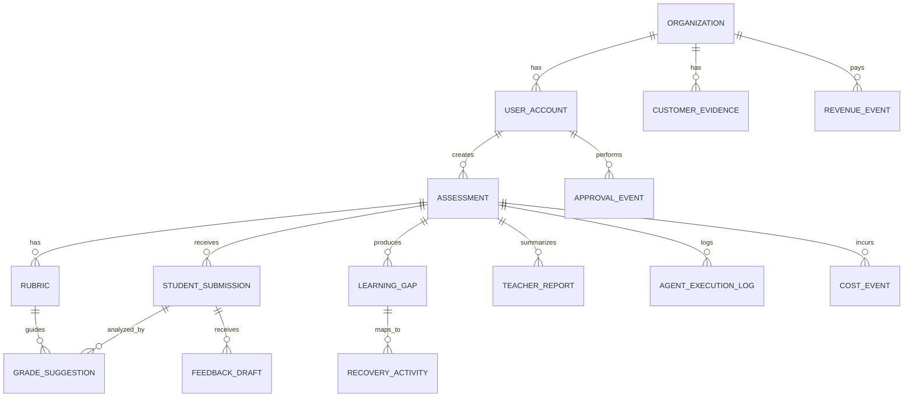

# Data Model

The GradeOps AI data model must support assessment workflows, teacher approval, agent traceability, cost tracking, and hackathon evidence.

The model should be designed around auditability.

## Modeling Principles

1. Every AI output must link to its inputs.
2. Every student-facing output must have approval state.
3. Every agent execution must be logged.
4. Every cost/revenue event must be attributable when possible.
5. Student data should be minimized.
6. Files/artifacts should be referenced, not stored as large DB blobs.
7. Approved records should be versioned or immutable enough for audit.
8. Related-party business evidence must be distinguishable.

## Entity Overview



## Core Entities

### `Organization`

Represents a teacher, tutor, small academy, or bootcamp account.

| Field | Type | Notes |
| --- | --- | --- |
| `id` | UUID | Primary key. |
| `name` | string | Individual or organization name. |
| `segment` | enum | See `OrganizationSegment`. |
| `plan` | enum | See `PlanCode`. |
| `pilot_status` | enum | See `PilotStatus`. |
| `related_party` | boolean | Important for hackathon revenue reporting. |
| `created_at` | timestamp | Audit. |
| `updated_at` | timestamp | Audit. |

### `UserAccount`

| Field | Type | Notes |
| --- | --- | --- |
| `id` | UUID | Primary key. |
| `organization_id` | UUID | Tenant boundary. |
| `email` | string | Login identity. |
| `display_name` | string | UI. |
| `role` | enum | See `UserRole`. |
| `status` | enum | See `UserStatus`. |
| `created_at` | timestamp | Audit. |

### `Assessment`

| Field | Type | Notes |
| --- | --- | --- |
| `id` | UUID | Primary key. |
| `organization_id` | UUID | Tenant boundary. |
| `created_by` | UUID | User. |
| `title` | string | Generated or teacher-edited. |
| `learning_goal` | text | Teacher input. |
| `topic` | string | Programming topic. |
| `level` | enum | See `AssessmentLevel`. |
| `language` | enum/string | Prefer `ProgrammingLanguage`; allow controlled custom value if needed. |
| `duration_minutes` | integer | Expected duration. |
| `status` | enum | See `AssessmentStatus`. |
| `student_count_estimate` | integer | For cost/usage planning. |
| `assessment_draft_json` | json | Structured agent output. |
| `teacher_notes` | text | Teacher context. |
| `created_at` | timestamp | Audit. |
| `updated_at` | timestamp | Audit. |

### `Rubric`

| Field | Type | Notes |
| --- | --- | --- |
| `id` | UUID | Primary key. |
| `assessment_id` | UUID | Parent. |
| `version` | integer | Version number. |
| `status` | enum | See `RubricStatus`. |
| `criteria_json` | json | Criteria, levels, weights. |
| `total_weight` | numeric | Usually 100. |
| `validation_notes_json` | json | Ambiguity/consistency notes. |
| `approved_by` | UUID | Nullable. |
| `approved_at` | timestamp | Nullable. |
| `created_at` | timestamp | Audit. |

### `StudentSubmission`

Represents a student's submitted work for one assessment. It is not a login account.

| Field | Type | Notes |
| --- | --- | --- |
| `id` | UUID | Primary key. |
| `assessment_id` | UUID | Parent. |
| `student_identifier` | string | Minimal identifier, not necessarily full PII. Use pseudonym, roster code, or teacher-provided alias when possible. |
| `student_display_label` | string | Optional label for teacher UI; avoid full name unless required by pilot. |
| `external_student_ref` | string | Optional reference to teacher's roster/LMS/export. Not a GradeOps login ID. |
| `content_text` | text | Pasted code/text if small. |
| `file_artifact_id` | UUID | Optional file reference. |
| `status` | enum | See `StudentSubmissionStatus`. |
| `language_detected` | string | Optional. |
| `submitted_at` | timestamp | Optional original submission time. |
| `created_at` | timestamp | Audit. |

Student-level modeling rule:

> The MVP stores student submissions, not student accounts. Student identity should be minimal, teacher-controlled, and scoped to the assessment/pilot.

### `Artifact`

| Field | Type | Notes |
| --- | --- | --- |
| `id` | UUID | Primary key. |
| `organization_id` | UUID | Tenant. |
| `assessment_id` | UUID | Optional. |
| `student_submission_id` | UUID | Optional. |
| `type` | enum | See `ArtifactType`. |
| `storage_uri` | string | Cloud Storage path. |
| `filename` | string | Original/display. |
| `mime_type` | string | Content type. |
| `size_bytes` | integer | Validation/cost. |
| `created_at` | timestamp | Audit. |

### `GradeSuggestion`

AI-generated grading suggestion. Not final until teacher approval.

| Field | Type | Notes |
| --- | --- | --- |
| `id` | UUID | Primary key. |
| `assessment_id` | UUID | Parent. |
| `student_submission_id` | UUID | Parent. |
| `rubric_id` | UUID | Approved rubric used. |
| `agent_execution_id` | UUID | Traceability. |
| `suggested_total_score` | numeric | AI suggestion. |
| `criteria_results_json` | json | Score/evidence per criterion. |
| `uncertainty_flags_json` | json | Risk/uncertainty flags. |
| `status` | enum | See `ReviewableOutputStatus`. |
| `teacher_final_score` | numeric | Nullable until approved/edited. |
| `teacher_notes` | text | Optional. |
| `approved_by` | UUID | Nullable. |
| `approved_at` | timestamp | Nullable. |
| `created_at` | timestamp | Audit. |

### `FeedbackDraft`

| Field | Type | Notes |
| --- | --- | --- |
| `id` | UUID | Primary key. |
| `student_submission_id` | UUID | Parent. |
| `grade_suggestion_id` | UUID | Source. |
| `agent_execution_id` | UUID | Traceability. |
| `feedback_json` | json | Summary, strengths, improvements, next steps. |
| `status` | enum | See `ReviewableDraftStatus`. |
| `teacher_final_text` | text | Nullable. |
| `approved_by` | UUID | Nullable. |
| `approved_at` | timestamp | Nullable. |
| `created_at` | timestamp | Audit. |

### `LearningGap`

| Field | Type | Notes |
| --- | --- | --- |
| `id` | UUID | Primary key. |
| `assessment_id` | UUID | Parent. |
| `agent_execution_id` | UUID | Traceability. |
| `topic` | string | Gap name. |
| `criterion_ids_json` | json | Related rubric criteria. |
| `affected_student_submission_count` | integer | Aggregate only. |
| `severity` | enum | See `Severity`. |
| `evidence_summary` | text | No unnecessary PII. |
| `status` | enum | See `ReviewableOutputStatus`; `edited` is optional for MVP. |
| `created_at` | timestamp | Audit. |

### `RecoveryActivity`

| Field | Type | Notes |
| --- | --- | --- |
| `id` | UUID | Primary key. |
| `assessment_id` | UUID | Parent. |
| `learning_gap_id` | UUID | Source gap. |
| `agent_execution_id` | UUID | Traceability. |
| `title` | string | Activity name. |
| `instructions_json` | json | Steps/prompts. |
| `expected_output` | text | Expected response. |
| `status` | enum | See `ReviewableOutputStatus`. |
| `teacher_final_json` | json | Nullable. |
| `created_at` | timestamp | Audit. |

### `TeacherReport`

| Field | Type | Notes |
| --- | --- | --- |
| `id` | UUID | Primary key. |
| `assessment_id` | UUID | Parent. |
| `agent_execution_id` | UUID | Traceability. |
| `report_json` | json | Structured report. |
| `status` | enum | See `ReportStatus`. |
| `export_artifact_id` | UUID | Optional. |
| `approved_by` | UUID | Nullable. |
| `approved_at` | timestamp | Nullable. |
| `created_at` | timestamp | Audit. |

## Student Accounts Are Out Of MVP

The MVP does not require a `StudentAccount`.

GradeOps AI stores student responses through `StudentSubmission` records controlled by the teacher. This keeps the first product focused on assessment operations and avoids turning the MVP into a full LMS or student portal.

Future versions may introduce:

- `StudentAccount`;
- `AssessmentAttempt`;
- `FeedbackDelivery`;
- student portal;
- learner history;
- cross-assessment learner analytics.

Those are intentionally deferred.

## Evidence And Audit Entities

### `AgentExecutionLog`

This is mandatory.

| Field | Type | Notes |
| --- | --- | --- |
| `id` | UUID | Primary key. |
| `organization_id` | UUID | Tenant. |
| `assessment_id` | UUID | Optional but preferred. |
| `student_submission_id` | UUID | Optional. |
| `agent_name` | enum | See `AgentName`. |
| `operation` | enum | See `AgentOperation`. |
| `model` | string | Gemini model used. |
| `status` | enum | See `AgentRunStatus`. |
| `input_summary` | text | Redacted/minimized. |
| `output_summary` | text | Redacted/minimized. |
| `input_tokens` | integer | If available/estimated. |
| `output_tokens` | integer | If available/estimated. |
| `estimated_cost_usd` | numeric | Required for unit economics. |
| `latency_ms` | integer | Optional. |
| `uncertainty_flags_json` | json | Optional. |
| `error_message` | text | Redacted. |
| `approval_state` | enum | See `AgentApprovalState`. |
| `created_at` | timestamp | Audit. |

### `ApprovalEvent`

Records human control.

| Field | Type | Notes |
| --- | --- | --- |
| `id` | UUID | Primary key. |
| `organization_id` | UUID | Tenant. |
| `assessment_id` | UUID | Parent. |
| `entity_type` | enum | See `ApprovalEntityType`. |
| `entity_id` | UUID | Approved/edited/rejected item. |
| `action` | enum | See `ApprovalAction`. |
| `actor_user_id` | UUID | Teacher. |
| `notes` | text | Optional. |
| `created_at` | timestamp | Audit. |

### `UsageEvent`

Tracks product and plan usage.

| Field | Type | Notes |
| --- | --- | --- |
| `id` | UUID | Primary key. |
| `organization_id` | UUID | Tenant. |
| `assessment_id` | UUID | Optional. |
| `event_type` | enum | See `UsageEventType`. |
| `quantity` | integer | Usually 1. |
| `created_at` | timestamp | Audit. |

### `RevenueEvent`

Can be internal or linked to an external ledger.

| Field | Type | Notes |
| --- | --- | --- |
| `id` | UUID | Primary key. |
| `organization_id` | UUID | Customer. |
| `date` | date | Required. |
| `month` | enum/string | Use `YYYY-MM`; hackathon reporting months include `2026-05`, `2026-06`, `2026-07`, `2026-08`. |
| `amount_usd` | numeric | USD equivalent. |
| `amount_original` | numeric | Original. |
| `currency` | enum | ISO 4217; MVP allowed values in `CurrencyCode`. |
| `source` | enum | See `RevenueSource`. |
| `offer` | enum | See `OfferCode`. |
| `related_party` | boolean | Required. |
| `evidence_artifact_id` | UUID | Optional. |
| `created_at` | timestamp | Audit. |

### `CostEvent`

Can be stored in a ledger or derived from agent logs.

| Field | Type | Notes |
| --- | --- | --- |
| `id` | UUID | Primary key. |
| `organization_id` | UUID | Optional. |
| `assessment_id` | UUID | Optional. |
| `date` | date | Required. |
| `category` | enum | See `CostCategory`. |
| `amount_usd` | numeric | Cost. |
| `cash_cost` | boolean | Whether cash was paid. |
| `covered_by_credit` | boolean | Free tier/credits. |
| `evidence_artifact_id` | UUID | Optional. |
| `created_at` | timestamp | Audit. |

## Allowed Values Reference

Use `snake_case` for persisted enum values. UI labels can be translated or prettified, but stored values should stay stable.

### Account And Business Enums

| Enum | Allowed Values | Notes |
| --- | --- | --- |
| `OrganizationSegment` | `independent_teacher`, `tutor`, `bootcamp`, `academy`, `program`, `training_team`, `other` | Use `other` only with a free-text note. |
| `PlanCode` | `free`, `teacher_lite`, `teacher_pro`, `cohort_pro`, `pilot_pack`, `custom_pilot` | Must map to usage limits. |
| `PilotStatus` | `none`, `candidate`, `active`, `completed`, `paused`, `lost` | `lost` means no pilot conversion after qualification. |
| `UserRole` | `teacher`, `reviewer`, `operator`, `admin` | `reviewer` is optional for MVP. |
| `UserStatus` | `invited`, `active`, `disabled`, `deleted` | Prefer soft-delete for audit. |
| `OfferCode` | `free`, `teacher_lite`, `teacher_pro`, `cohort_pro`, `pilot_pack`, `custom_pilot`, `manual_commitment` | Used in revenue and customer evidence. |
| `RevenueSource` | `stripe`, `paypal`, `mercadopago`, `flow`, `transbank`, `bank_transfer`, `manual_invoice`, `cash`, `commitment`, `other` | `commitment` is not cash revenue; flag clearly in reporting. |
| `CurrencyCode` | `USD`, `CLP`, `EUR`, `BRL`, `MXN`, `COP`, `PEN`, `ARS` | Store `amount_usd` alongside original currency. |

### Assessment And Product State Enums

| Enum | Allowed Values | Notes |
| --- | --- | --- |
| `AssessmentStatus` | `draft`, `rubric_pending_review`, `ready_for_submissions`, `submissions_received`, `grading_in_progress`, `pending_teacher_review`, `approved`, `reported`, `archived`, `cancelled` | `cancelled` preserves abandoned work without deletion. |
| `AssessmentLevel` | `introductory`, `basic`, `intermediate`, `advanced`, `mixed` | MVP should default to `basic`. |
| `ProgrammingLanguage` | `pseudocode`, `pseint`, `python`, `javascript`, `typescript`, `java`, `csharp`, `go`, `sql`, `html_css`, `other` | If `other`, store `language_custom`. |
| `RubricStatus` | `draft`, `pending_review`, `approved`, `retired`, `replaced` | Only one approved active rubric should drive grading. |
| `StudentSubmissionStatus` | `received`, `analysis_pending`, `analyzed`, `needs_review`, `approved`, `edited_by_teacher`, `rejected`, `excluded`, `invalid` | `invalid` is for unsupported/empty submissions. |
| `ReviewableOutputStatus` | `suggested`, `needs_review`, `approved`, `edited`, `rejected`, `blocked_uncertain` | Use for grade suggestions, recovery activities, and learning gaps. |
| `ReviewableDraftStatus` | `draft`, `needs_review`, `approved`, `edited`, `rejected`, `blocked_uncertain` | Use for feedback drafts and similar draft outputs. |
| `ReportStatus` | `draft`, `needs_review`, `approved`, `exported`, `archived` | Export does not imply student delivery. |
| `Severity` | `low`, `medium`, `high`, `critical` | `critical` should require explicit teacher review. |

### Agent And Audit Enums

| Enum | Allowed Values | Notes |
| --- | --- | --- |
| `AgentName` | `assessment`, `rubric`, `grading`, `feedback`, `learning_gap`, `recovery`, `teacher_report`, `ops_evidence` | Keep stable for dashboards and NotebookLM evidence. |
| `AgentRunStatus` | `queued`, `running`, `succeeded`, `failed`, `retried`, `requires_human_review`, `cancelled` | Approval is tracked separately in `approval_state`. |
| `AgentApprovalState` | `not_required`, `pending`, `approved`, `edited`, `rejected`, `requested_changes` | Required for outputs that affect grading, feedback, recovery, or reporting. |
| `ApprovalEntityType` | `assessment`, `rubric`, `grade_suggestion`, `feedback_draft`, `learning_gap`, `recovery_activity`, `teacher_report` | Must match the target table/entity. |
| `ApprovalAction` | `approved`, `edited`, `rejected`, `requested_changes`, `excluded` | `excluded` applies mainly to submissions or generated outputs removed from reports. |
| `ArtifactType` | `submission_file`, `report_export`, `evidence_screenshot`, `invoice`, `receipt`, `api_usage_export`, `billing_export`, `testimonial`, `other` | Do not store secrets or private student data in public artifacts. |

### Agent Operations

| `AgentName` | Allowed `AgentOperation` Values |
| --- | --- |
| `assessment` | `generate_assessment`, `revise_assessment`, `validate_assessment_brief` |
| `rubric` | `generate_rubric`, `validate_rubric`, `revise_rubric` |
| `grading` | `grade_submission`, `batch_grade_submissions`, `flag_uncertainty` |
| `feedback` | `generate_feedback`, `revise_feedback`, `generate_feedback_batch` |
| `learning_gap` | `detect_learning_gaps`, `summarize_gap_evidence` |
| `recovery` | `generate_recovery_activity`, `revise_recovery_activity` |
| `teacher_report` | `generate_teacher_report`, `revise_teacher_report`, `export_report_summary` |
| `ops_evidence` | `record_agent_execution`, `summarize_usage`, `summarize_costs`, `summarize_business_evidence`, `detect_missing_evidence` |

### Usage And Cost Enums

| Enum | Allowed Values | Notes |
| --- | --- | --- |
| `UsageEventType` | `assessment_created`, `assessment_approved`, `rubric_generated`, `rubric_approved`, `submission_received`, `submission_analyzed`, `grade_suggestion_generated`, `grade_suggestion_approved`, `feedback_generated`, `feedback_approved`, `learning_gap_generated`, `recovery_generated`, `report_generated`, `report_exported`, `agent_run_created`, `pilot_created`, `payment_recorded`, `testimonial_recorded` | Add new values only when they are useful for metrics or evidence. |
| `CostCategory` | `gemini_api`, `vertex_ai`, `cloud_run`, `cloud_sql`, `firestore`, `cloud_storage`, `cloud_logging`, `artifact_registry`, `cloud_build`, `email`, `payment_processing`, `domain`, `ai_development_tooling`, `marketing`, `contractor`, `other` | Marketing can be reported separately but still represented in ledger if useful. |

## Field Validation Rules

| Field / Group | Validation |
| --- | --- |
| UUID fields | Must be globally unique and immutable after creation. |
| `email` | Lowercase normalized; unique per auth provider or tenant policy. |
| `amount_usd`, costs, scores | Must be non-negative decimals. |
| `suggested_total_score`, `teacher_final_score` | Must be between `0` and rubric `total_weight`, usually `100`. |
| `weight`, `total_weight` | Rubric criteria weights should sum to `100` unless using a declared alternate scale. |
| `duration_minutes` | Positive integer; recommended MVP range `10-240`. |
| `student_count_estimate` | Non-negative integer; used for cost planning, not authoritative billing. |
| `input_tokens`, `output_tokens`, `latency_ms` | Non-negative integers; nullable only when unavailable. |
| `estimated_cost_usd` | Non-negative decimal; store `null` if unknown, `0` only when there is genuinely no measurable runtime cost. Credits affect cash cost, not estimated runtime cost. |
| `storage_uri` | Must point to private bucket/object path, not public URL. |
| `related_party` | Required for `RevenueEvent` and customer evidence. |
| `created_at`, `updated_at`, `approved_at` | Store in UTC; display in local timezone when needed. |
| JSON fields | Must be schema-valid and versioned when the structure can evolve. |

## Minimal JSON Shape Expectations

### `criteria_json`

```json
{
  "criteria": [
    {
      "id": "C1",
      "name": "Correct use of conditionals",
      "weight": 25,
      "levels": [
        {
          "label": "Excellent",
          "score": 25,
          "description": "Uses conditionals correctly in all required branches."
        }
      ],
      "common_mistakes": ["Missing else branch"]
    }
  ],
  "scale": 100
}
```

### `criteria_results_json`

```json
{
  "criteria_results": [
    {
      "criterion_id": "C1",
      "suggested_score": 20,
      "evidence_summary": "Uses if/else correctly but misses one edge case.",
      "issues": ["No validation for negative input"],
      "uncertainty": "low"
    }
  ]
}
```

### `feedback_json`

```json
{
  "summary": "Good progress on control flow.",
  "strengths": ["Uses conditionals clearly"],
  "improvement_areas": ["Add validation for edge cases"],
  "next_steps": ["Practice boundary-value tests"],
  "rubric_references": ["C1", "C3"]
}
```

### `uncertainty_flags_json`

```json
{
  "flags": [
    {
      "code": "ambiguous_submission",
      "severity": "medium",
      "message": "The submitted answer is incomplete and may require teacher interpretation."
    }
  ]
}
```

Allowed uncertainty flag codes:

| Code | Meaning |
| --- | --- |
| `ambiguous_submission` | Submission cannot be interpreted confidently. |
| `missing_required_output` | Expected output or deliverable is absent. |
| `possible_academic_integrity_issue` | Similarity or anomaly should be reviewed by teacher; not an accusation. |
| `long_submission` | Submission may increase cost or reduce model reliability. |
| `rubric_mismatch` | Submission does not map cleanly to rubric criteria. |
| `low_confidence_score` | Score suggestion should not be bulk approved. |
| `policy_sensitive_feedback` | Feedback wording needs teacher review. |

## Relational vs Document Storage

Use **PostgreSQL** if implementation speed is acceptable because the workflow has strong relationships and audit requirements.

Use **Firestore** if speed of development and Google-native simplicity matter more than relational querying.

A practical hybrid is DB for structured records, Cloud Storage for files/artifacts, Cloud Logging for technical logs, and DB `AgentExecutionLog` for business/audit logs.

## Data Privacy Rules

- Store minimal student identifiers.
- Avoid unnecessary full names if anonymized identifiers work.
- Do not store secrets in prompts or logs.
- Redact sensitive content from `input_summary` and `output_summary`.
- Store raw student submissions only when needed for workflow.
- Make deletion/export possible for pilot data.
- Do not publish student data in evidence screenshots.

## Model Acceptance Criteria

The data model is sufficient when it can answer:

1. Which agent produced this output?
2. Which model was used?
3. What did it cost approximately?
4. Which teacher approved or edited it?
5. Which rubric version was used?
6. Which student submissions were processed?
7. Which feedback was approved?
8. What evidence supports a pilot/customer claim?
9. Which revenue is related-party?
10. What usage volume maps to the customer plan?
