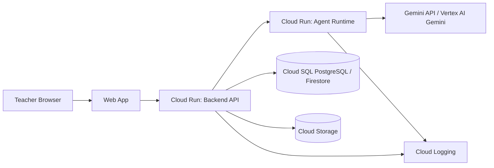
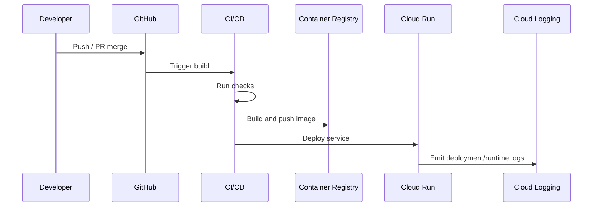

# Deployment

GradeOps AI deployment should be simple, Google Cloud compliant, observable, and reliable enough for real pilots.

The deployment goal is not enterprise scale. The goal is a credible production-like MVP that can run real assessment workflows and produce hackathon evidence.

## Deployment Objectives

1. Deploy a working product, not only a local demo.
2. Use at least one Google Cloud product.
3. Run Gemini calls from deployed backend/agent runtime.
4. Persist data, artifacts, logs, and evidence.
5. Support demo and pilot environments.
6. Capture API/model usage and cost evidence.
7. Keep operational footprint small.

## Recommended MVP Deployment



## Environment Strategy

| Environment | Purpose | Required |
| --- | --- | --- |
| `local` | Development | Yes. |
| `demo` | Stable hackathon/demo environment | Yes. |
| `pilot` | Real pilot/customer use | Recommended. |
| `prod` | Post-hackathon production | Later. |

For speed, `demo` and `pilot` can share infrastructure early, but data should be clearly labeled.

## Recommended Google Cloud Services

| Need | Service Candidate | Notes |
| --- | --- | --- |
| Container runtime | Cloud Run | API and agent worker. |
| File storage | Cloud Storage | Submissions, exports, evidence. |
| Database | Cloud SQL PostgreSQL or Firestore | Choose based on implementation speed. |
| Logs | Cloud Logging | Technical logs. |
| Secrets | Secret Manager / Cloud Run secrets | API keys, DB credentials. |
| Build/deploy | Cloud Build or GitHub Actions | Keep deployment repeatable. |
| Auth | Firebase Auth or backend auth | Fast MVP authentication. |
| AI | Gemini API / Vertex AI Gemini | Traceable AI runtime. |

## Service Topology Options

### Option A: Single Backend Service

```text
Web App -> Backend API (workflow + agents) -> Gemini / DB / Storage
```

Best when team is small, speed matters, agent workload is light, and fewer deployables reduce risk.

Tradeoff: long-running agent jobs may block API if not designed carefully.

### Option B: Backend + Agent Worker

```text
Web App -> Backend API -> Agent Worker -> Gemini
```

Best when batch grading needs isolation, retries/failures should not impact API, agent logs need clean boundaries, and future scaling matters.

Recommended target for MVP if delivery time permits.

## CI/CD Baseline

Minimum CI:

- lint/build web;
- test/build backend;
- validate docs/markdown if useful;
- build container image;
- deploy to demo manually or through protected workflow.

Recommended branch flow:

- `main` or `master`: stable;
- feature branches for changes;
- PR review for key changes;
- tagged demo release before recording video.

## Configuration

Use environment-specific configuration.

Required environment variables:

| Variable | Purpose |
| --- | --- |
| `APP_ENV` | local/demo/pilot/prod. |
| `DATABASE_URL` | DB connection. |
| `GEMINI_API_KEY` or Vertex config | AI runtime. |
| `GCP_PROJECT_ID` | Google Cloud project. |
| `STORAGE_BUCKET` | Cloud Storage bucket. |
| `JWT_SECRET` or auth config | Authentication. |
| `ALLOWED_ORIGINS` | CORS. |
| `MAX_SUBMISSION_SIZE_BYTES` | Upload/cost control. |
| `DEFAULT_MODEL_ASSESSMENT` | Model routing. |
| `DEFAULT_MODEL_GRADING` | Model routing. |
| `ENABLE_PREMIUM_FALLBACK` | Cost control. |

Do not commit real values.

## Deployment Pipeline



## Database Migration Strategy

For PostgreSQL:

- use explicit migration scripts;
- keep schema changes versioned;
- do not manually patch production schema without recording;
- seed demo data through scripts;
- keep fake/demo data clearly marked.

For Firestore:

- document collections and required indexes;
- create seed scripts;
- validate security rules if applicable;
- export relevant data for evidence.

## Storage Strategy

| Bucket/Prefix | Purpose |
| --- | --- |
| `submissions/` | Uploaded student files. |
| `reports/` | Exported teacher reports. |
| `evidence/` | Screenshots, receipts, artifacts if stored. |
| `exports/` | CSV/PDF/demo exports. |

Rules:

- private by default;
- no public bucket;
- signed access only if needed;
- size limits;
- file type allowlist;
- lifecycle cleanup for temporary files.

## Observability

### Technical Observability

Track API latency, API errors, agent failures, model call failures, upload errors, database errors, and authentication errors.

### Business Observability

Track assessments created, rubrics approved, submissions processed, feedback approved, reports generated, agent runs, cost estimates, revenue events, and customer/pilot evidence.

Technical logs alone are not enough. Business evidence must be stored in structured application records.

## Deployment Readiness Checklist

| Item | Required |
| --- | --- |
| Web reachable from public URL | Yes |
| API reachable from web | Yes |
| HTTPS enabled | Yes |
| Auth enabled | Yes |
| Gemini call works from deployed backend | Yes |
| Google Cloud service usage visible | Yes |
| Database persists assessment workflow | Yes |
| Storage persists file/report artifacts | If used |
| Agent logs visible in dashboard | Yes |
| Cost estimates visible | Yes |
| Teacher approval workflow works | Yes |
| Demo seed data available | Yes |
| Pilot data separated/labeled | Recommended |
| Secrets not exposed | Yes |
| Error logs visible | Yes |
| Backup/export strategy exists | Recommended |

## Release Strategy For Hackathon

### Demo Release

A demo release should include stable assessment flow, seeded teacher account, seeded or fast-created assessment, sample submissions, visible agent logs, visible cost/evidence dashboard, no broken navigation, and English labels for demo-critical screens if possible.

### Pilot Release

A pilot release should include real teacher account, data privacy handling, upload limits, reliable persistence, manual fallback plan, support/contact path, and exportable report.

## Rollback Strategy

MVP rollback can be simple:

- keep previous container image;
- redeploy previous revision in Cloud Run;
- avoid destructive DB migrations before demo;
- backup/export pilot data before risky changes;
- feature flag unstable agent changes.

## Cost Controls In Deployment

Set or track:

- Google Cloud budget alerts;
- max request size;
- max submissions per assessment by plan;
- model routing defaults;
- premium fallback disabled by default;
- rate limits on agent commands;
- retry limits;
- logging volume limits.

## Deployment Risks

| Risk | Impact | Mitigation |
| --- | --- | --- |
| Demo only works locally | Weak submission | Deploy early. |
| Gemini credentials fail in cloud | Broken AI requirement | Test deployed API call early. |
| Agent jobs time out | Bad pilot experience | Add async processing or smaller batches. |
| DB schema changes break demo | Lost time | Use migrations and backups. |
| Costs spike | Budget risk | Rate limits and budgets. |
| Secrets leak | Security incident | Secret manager/env only. |
| Public student data | Privacy issue | Private buckets and anonymized demo data. |

## Deployment Acceptance Criteria

The deployment is sufficient when a public/demo URL exists, teacher can authenticate, assessment workflow persists, deployed backend calls Gemini, at least one Google Cloud service is used and visible, files/reports can be stored if required, agent logs and costs are visible, failures are logged, demo can be recorded from the deployed environment, and pilot data can be distinguished from seed/demo data.
