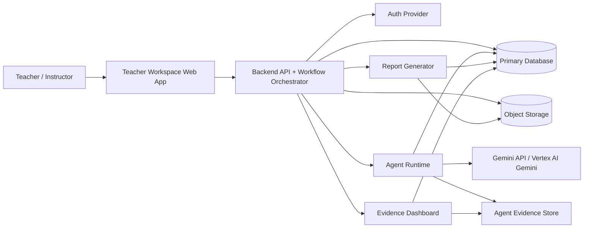
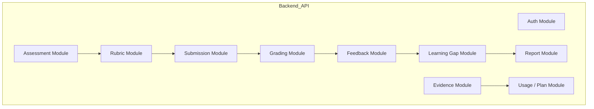
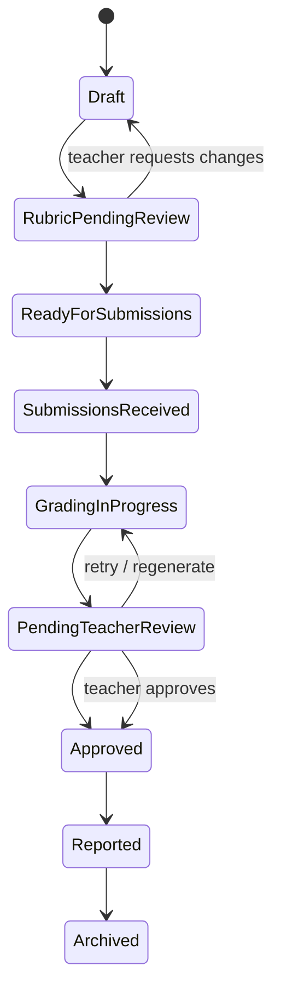
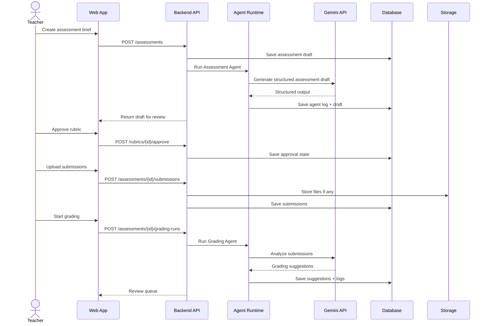
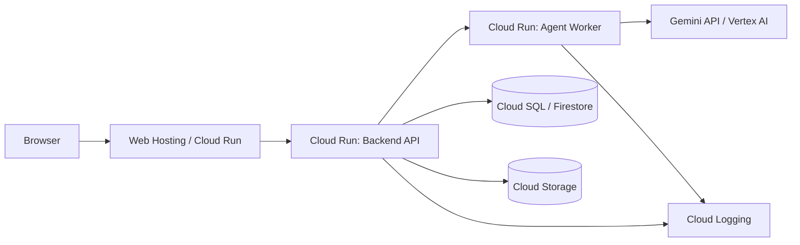

# System Architecture

GradeOps AI MVP should be built as a focused, evidence-first assessment operations system.

The architecture must support teacher-reviewed assessment workflows, specialized AI agents, structured persistence, file/artifact storage, cost and usage tracking, business evidence, and small pilot deployment on Google Cloud.

## Architectural Stance

Use a **modular monolith plus agent runtime** for the MVP.

Do not start with a distributed microservice architecture unless a real deployment constraint forces it.

Recommended structure:

```text
grade-ops-ai-web
grade-ops-ai-api
grade-ops-ai-agents
grade-ops-ai-infra
```

Possible MVP simplification:

```text
grade-ops-ai-web
grade-ops-ai-api
```

Where `api` contains the workflow and agent orchestration modules internally.

## Logical Architecture



## Runtime Components

| Component | Responsibility | MVP Recommendation |
| --- | --- | --- |
| Web App | Teacher workspace, review UI, dashboards | Angular or Next.js. |
| Backend API | Auth integration, workflow state, business rules, REST API | Spring Boot modular monolith. |
| Workflow Orchestrator | Coordinates assessment lifecycle and agent handoffs | Backend module. |
| Agent Runtime | Executes agent calls, validates structured outputs, logs execution | Separate module/service. |
| Gemini Integration | Calls Gemini models through API/Vertex | Server-side only. |
| Primary DB | Stores users, assessments, rubrics, submissions, feedback, reports, logs | Cloud SQL PostgreSQL or Firestore. |
| Object Storage | Stores uploaded files, exports, report artifacts | Cloud Storage. |
| Evidence Dashboard | Shows agent runs, costs, usage, approvals, business evidence | Backend + Web. |
| Observability | Technical logs, errors, latency, failures | Cloud Logging + app logs. |

## Module Architecture



## Workflow Orchestration



## Agent Execution Pattern

Every agent call should follow the same execution wrapper:

1. Validate command.
2. Load required domain data.
3. Build agent input envelope.
4. Call Gemini/model.
5. Validate structured output.
6. Store agent execution log.
7. Store domain output.
8. Update workflow state.
9. Return reviewable result to teacher.

## Agent Runtime Boundary

The agent runtime can generate assessment drafts, rubrics, grading suggestions, feedback drafts, gap summaries, recovery activities, teacher reports, and evidence records.

It must not finalize scores, send feedback to students, silently change approved rubrics, hide failed or uncertain outputs, store secrets in prompts, or bypass workflow state rules.

## Data Flow



## Deployment Topology



## Repository Boundary Recommendation

| Repository | Contents |
| --- | --- |
| `grade-ops-ai-docs` | Documentation and decision records. |
| `grade-ops-ai-web` | Teacher workspace, landing, dashboard. |
| `grade-ops-ai-api` | API, workflow orchestration, security, persistence. |
| `grade-ops-ai-agents` | Agent definitions, prompts, schemas, model adapters if separated. |
| `grade-ops-ai-infra` | Deployment scripts, Terraform later, Cloud Run config. |

For the hackathon MVP, it is acceptable to merge `api` and `agents` into one backend repo if it reduces delivery risk, as long as module boundaries are explicit.

## Synchronous vs Asynchronous Processing

Use synchronous processing for assessment draft, rubric draft, small demo runs, and teacher report draft.

Use asynchronous processing for batch grading, bulk feedback generation, report generation after many submissions, retries, and expensive fallback models.

MVP can start with synchronous calls for speed, but batch grading should be designed so it can move to a background job/queue.

## Evidence Architecture

Evidence is not a side-effect. It is part of the core architecture.

| Operation | Evidence |
| --- | --- |
| Agent call | `AgentExecutionLog`. |
| Teacher approval | `ApprovalEvent`. |
| Cost estimate | `CostEvent` or cost fields in agent log. |
| Submission processed | `UsageEvent`. |
| Payment/commitment | `RevenueEvent` or external evidence link. |
| Report generated | `ReportArtifact`. |
| Customer testimonial | `CustomerEvidence`. |

## Key Architecture Decisions

| Decision | Rationale |
| --- | --- |
| Modular monolith first | Faster delivery, easier debugging, lower operational overhead. |
| Agent wrapper pattern | Consistent logs, validation, cost, retries. |
| Structured JSON outputs | Required for reliable persistence and reporting. |
| Teacher approval states | Trust, safety, and product positioning. |
| Cloud Run deployment | Simple Google Cloud production footprint. |
| Cloud Storage for artifacts | Clean separation of DB records and uploaded/exported files. |
| Evidence dashboard | Supports product management, business validation, and hackathon demo. |
| No student login in MVP | Reduces scope and security complexity. |

## MVP Architecture Acceptance Criteria

The architecture is sufficient when the system can create and persist an assessment, call Gemini from the deployed backend/agent runtime, store structured agent output, store submissions, generate grading suggestions linked to rubric criteria, persist teacher approvals, generate reports, expose agent logs with model/status/cost/approval state, support evidence dashboard, and use at least one Google Cloud product.

<!-- nav -->

---

[↑ inicio](#system-architecture) | [README](README.md) | [Data Model →](data-model.md)
