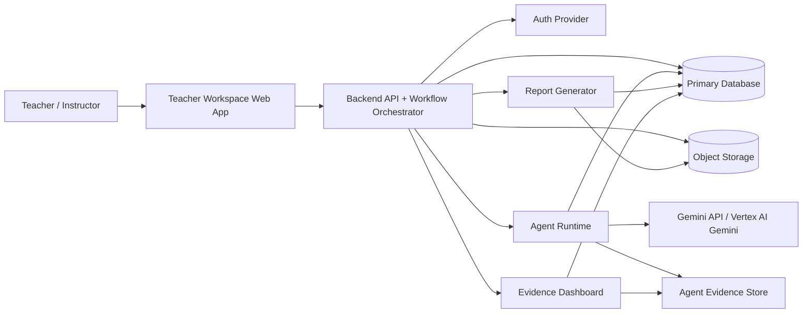
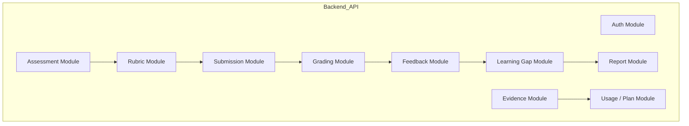
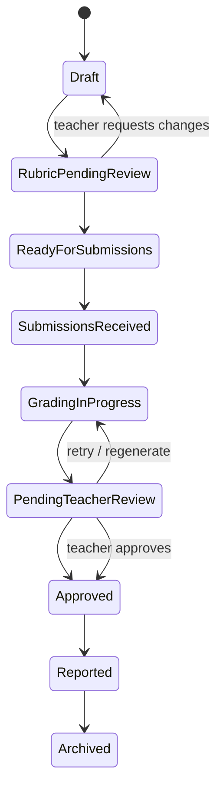
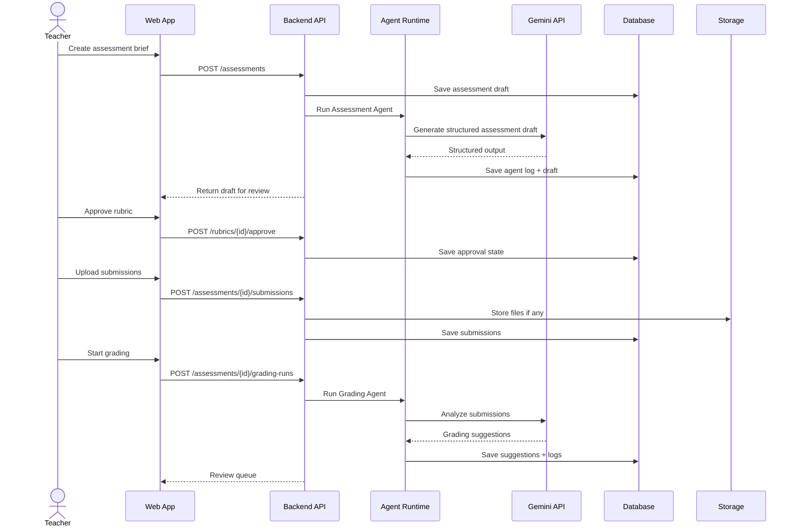
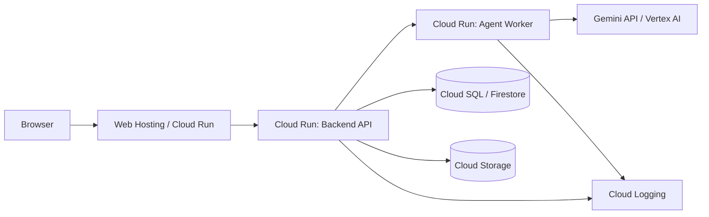

# System Architecture

GradeOps AI MVP should be built as a focused, evidence-first assessment operations system.

The architecture must support teacher-reviewed assessment workflows, specialized AI agents, structured persistence, file/artifact storage, cost and usage tracking, business evidence, and small pilot deployment on Google Cloud.

## Architectural Stance

Use a **modular monolith plus agent runtime** for the MVP.

Do not start with a distributed microservice architecture unless a real deployment constraint forces it.

Recommended structure:

```text
grade-ops-ai-web
grade-ops-ai-api
grade-ops-ai-agents
grade-ops-ai-infra
```

Possible MVP simplification:

```text
grade-ops-ai-web
grade-ops-ai-api
```

Where `api` contains the workflow and agent orchestration modules internally.

## Logical Architecture



## Runtime Components

| Component | Responsibility | Stack |
| --- | --- | --- |
| Web App | Teacher workspace, review UI, student access, dashboards | Next.js + TypeScript + Tailwind CSS (`grade-ops-ai-web`). |
| Backend API | Auth, workflow state, business rules, REST API, billing, audit | Spring Boot 4 + Java 21 + PostgreSQL (`grade-ops-ai-api`). |
| Workflow Orchestrator | Coordinates assessment lifecycle and agent handoffs | Module inside `grade-ops-ai-api`. |
| Agent Runtime | Executes agent calls, validates structured outputs, logs execution | Spring Boot 4 + Java 21 + Spring AI (`grade-ops-ai-agents`). |
| Gemini Integration | Calls Gemini via Vertex AI; API key for local dev | Spring AI Vertex AI Gemini starter; server-side only. |
| Primary DB | Stores users, assessments, rubrics, submissions, feedback, reports, logs | Cloud SQL PostgreSQL. |
| Object Storage | Stores uploaded files, exports, report artifacts | Cloud Storage. |
| Infrastructure | Cloud Run services, secrets, networking, CI/CD | Terraform + GitHub Actions (`grade-ops-ai-infra`). |
| Evidence Dashboard | Shows agent runs, costs, usage, approvals, business evidence | Backend + Web. |
| Observability | Technical logs, errors, latency, failures | Cloud Logging + application evidence tables. |

## Module Architecture



## Workflow Orchestration



## Agent Execution Pattern

Every agent call should follow the same execution wrapper:

1. Validate command.
2. Load required domain data.
3. Build agent input envelope.
4. Call Gemini/model.
5. Validate structured output.
6. Store agent execution log.
7. Store domain output.
8. Update workflow state.
9. Return reviewable result to teacher.

## Agent Runtime Boundary

The agent runtime can generate assessment drafts, rubrics, grading suggestions, feedback drafts, gap summaries, recovery activities, teacher reports, and evidence records.

It must not finalize scores, send feedback to students, silently change approved rubrics, hide failed or uncertain outputs, store secrets in prompts, or bypass workflow state rules.

## Data Flow



## Deployment Topology



## Repository Boundary Recommendation

| Repository | Stack | Responsibilities |
| --- | --- | --- |
| `grade-ops-ai-docs` | Markdown | Documentation, decisions, pitch, roadmap, evidence. |
| `grade-ops-ai-web` | Next.js + TypeScript + Tailwind | Landing, teacher workspace, student access, dashboards. |
| `grade-ops-ai-api` | Spring Boot 4 + Java 21 + PostgreSQL | Auth, workflow, rubrics, submissions, billing, audit, persistence. |
| `grade-ops-ai-agents` | Spring Boot 4 + Java 21 + Spring AI | All 13 agents, prompts, Gemini integration, structured outputs, agent logs. |
| `grade-ops-ai-infra` | Terraform + GitHub Actions | Cloud Run, Cloud SQL, Cloud Storage, Secret Manager, CI/CD. |

The agents service is a separate Cloud Run deployment. It communicates with the API via internal HTTP (Cloud Run service-to-service auth). Merging `api` and `agents` into a single repo is acceptable during MVP sprints under delivery pressure, provided module boundaries remain explicit and the split is restored before the demo.

For the internal folder and module structure of each repository, see [`repository-structure.md`](repository-structure.md).

**Deferred repositories** — not created for the MVP:

| Repository | Reason deferred |
| --- | --- |
| `grade-ops-ai-mobile` | Requires validated web MVP first. |
| `grade-ops-ai-ocr` | Physical paper intake is P1; not required for the hackathon. |
| `grade-ops-ai-lms` | Out of scope; GradeOps AI is not an LMS. |
| `grade-ops-ai-code-runner` | Needed only when executing real student code in a sandbox. |
| `grade-ops-ai-sdk` | Public SDK is a post-product concern, not pre-product. |
| `grade-ops-ai-admin` | Institutional admin panel is post-MVP. |

## Synchronous vs Asynchronous Processing

Use synchronous processing for assessment draft, rubric draft, small demo runs, and teacher report draft.

Use asynchronous processing for batch grading, bulk feedback generation, report generation after many submissions, retries, and expensive fallback models.

MVP can start with synchronous calls for speed, but batch grading should be designed so it can move to a background job/queue.

## Evidence Architecture

Evidence is not a side-effect. It is part of the core architecture.

| Operation | Evidence |
| --- | --- |
| Agent call | `AgentExecutionLog`. |
| Teacher approval | `ApprovalEvent`. |
| Cost estimate | `CostEvent` or cost fields in agent log. |
| Submission processed | `UsageEvent`. |
| Payment/commitment | `RevenueEvent` or external evidence link. |
| Report generated | `ReportArtifact`. |
| Customer testimonial | `CustomerEvidence`. |

## Key Architecture Decisions

| Decision | Rationale |
| --- | --- |
| Modular monolith first | Faster delivery, easier debugging, lower operational overhead. |
| Agent wrapper pattern | Consistent logs, validation, cost, retries. |
| Structured JSON outputs | Required for reliable persistence and reporting. |
| Teacher approval states | Trust, safety, and product positioning. |
| Cloud Run deployment | Simple Google Cloud production footprint. |
| Cloud Storage for artifacts | Clean separation of DB records and uploaded/exported files. |
| Evidence dashboard | Supports product management, business validation, and hackathon demo. |
| No student login in MVP | Reduces scope and security complexity. |

## MVP Architecture Acceptance Criteria

The architecture is sufficient when the system can create and persist an assessment, call Gemini from the deployed backend/agent runtime, store structured agent output, store submissions, generate grading suggestions linked to rubric criteria, persist teacher approvals, generate reports, expose agent logs with model/status/cost/approval state, support evidence dashboard, and use at least one Google Cloud product.

<!-- nav -->

---

[↑ inicio](#system-architecture) | [README](README.md) | [Data Model →](data-model.md)
